# Adding intelligence with AI Builder and GPT

This module will introduce the Create Text with GPT capability in AI Builder. It will touch on how to write instructions and how to use the model in Power Automate.

**Learning Objectives**

- Learn about what AI Builder is and how it can be used to add intelligence to your apps and automations
- Explore what the Create Text with GPT model in AI Builder is and how it can be used to generate text
- Learn how to use the Create Text with GPT model in Power Automate

**Prerequisites**

- You'll need a Power Apps Developer environment (based in the United States region) with a licensed user to complete these exercises
- Dataverse database installed on the environment
- An AI Builder add-on or trial

## Introduction To AI Builder

AI Builder is a Microsoft Power Platform capability that helps you improve your business performance by automating processes and predicting outcomes. By using AI Builder, you can quickly bring AI to your apps and flows that connect to your business data that is stored in the underlying data platform (Microsoft Dataverse) or in various cloud data sources, such as SharePoint, OneDrive, or Azure.

AI models that you create in AI Builder can help provide intelligence to enhance your business. AI Builder simplifies the AI creation experience by giving people with any level of technical skill the ability to add AI capabilities to their apps and flows without writing code. AI Builder also provides prebuilt AI models, where you don't need to gather data to build and train the model. You can start to use the intelligence right away.

## Introduction to the Create Text with GPT AI Builder Model

The Create Text with GPT model in AI Builder is a text generation model powered by Azure OpenAI Service, which is built on Generative Pre-trained Transformer (GPT) technology. GPT models are a type of natural language processing model. GPT models are trained on a large body of content to generate human-like text from a prompt. When you combine them with workflow automation, you can use AI models like GPT to automate a variety of tasks. For example, you can build workflows to automatically generate drafts of emails, customer service responses, and product descriptions. You can also use them to generate scripts that allow customer service agents to respond quickly to customer inquiries.

When creating prompts for the Create Text with GPT AI Builder model, you need to remember that a prompt has 2 parts; the _instruction_ and the _context_. The instruction tells the model what it should do. The context is the information the model needs to follow the instruction. In an automation task, the instruction is constant and the context is provided by dynamic content.

## Exercise – Generate Text with GPT In AI Builder and Power Automate

In this unit, you'll be building a Power Automate flow that uses the Create Text with GPT AI Builder model to extract information from an email sent by a customer requesting a real estate showing. The Create Text with GPT model will extract the customer's name, address of the property they want to view, date, and time of the showing from the email and then send a message to a Teams channel with the extracted information.

This extracted information can then be used to create a record in a Dataverse table. However, that is beyond the scope of this lab.

1. Sign into [Power Automate](https://make.powerautomate.com/).

2. On the left pane, select **Create** and then **Automated cloud flow**.

    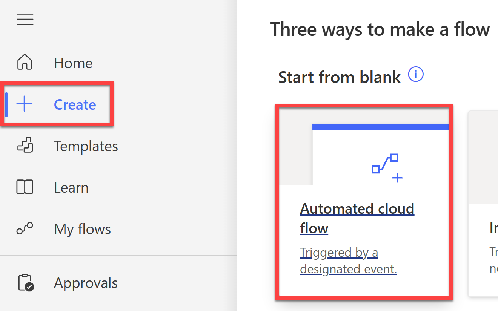

3. Give the flow the name: `Extract details for Real Estate Showing`.

4. In the **Search all triggers** box, type "when an email arrives" and select the **When an email arrives** trigger.

    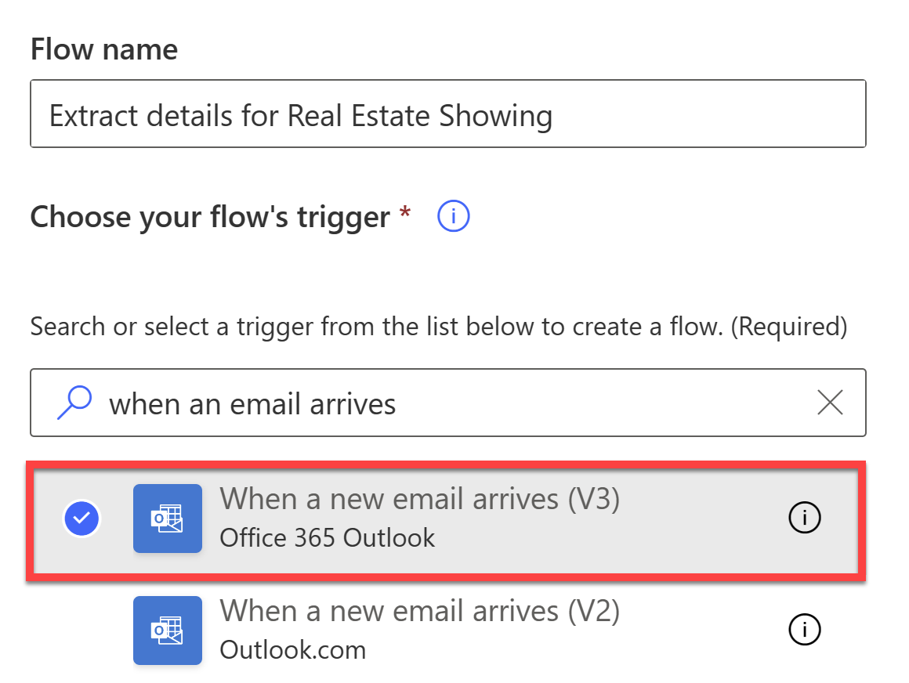

5. Select **Create**.

6. Select **Show advanced options** on the **When a new email arrives** trigger.

7. In the **Subject filter** box, type "[Query]".

    

    > [!NOTE]
    >
    > This will ensure that the flow only runs when the subject of the email contains the word "Query" (for the purpose of this lab).
    >
    > In a real scenario, you may have a separate email address that handles customer queries so there would be no need to filter by subject.

8. Select **New step** and then select **AI Builder**.

    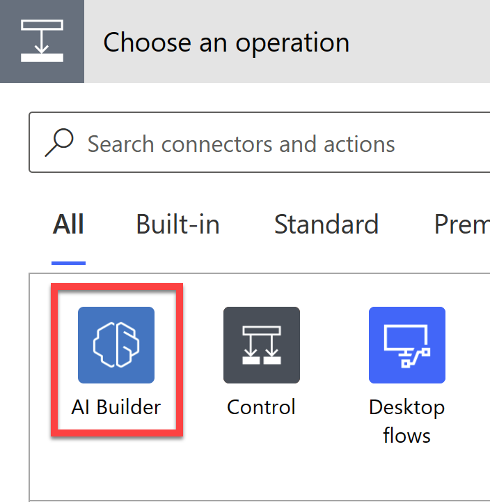

9. Then select **Create text with GPT** in the list of actions.

    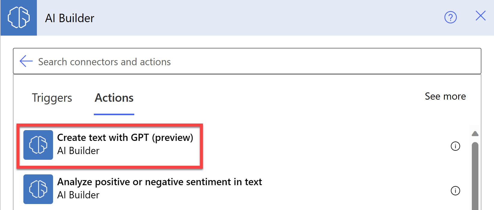

10. Select **Create prompt** and then select **Start from blank**.

    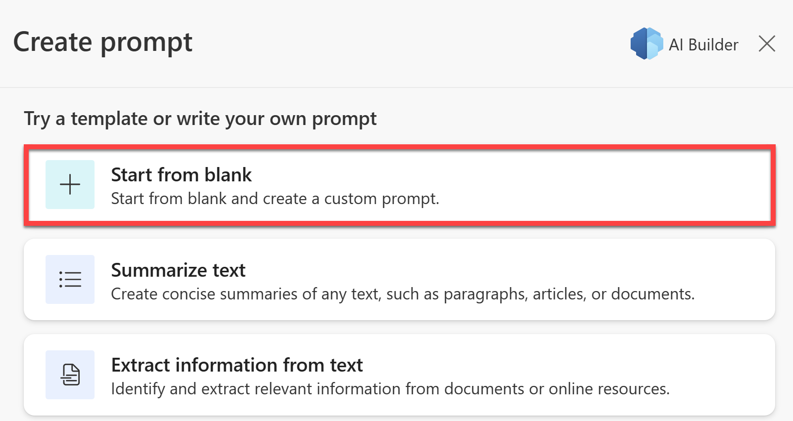

11. Paste the following text into the **Describe the text the model should create** box:

    ```
    Extract "Name", "Address", "Date", and "Time" from the text below.

    When the text below has less than a couple of words, answer that you can't extract information.

    [Start of text]
    Good day, 

    I hope this email finds you well. My name is <Your name>, and I am currently in the market for a new property. I came across your listing for the property located at 210 Pine Road, Portland, OR 97204, and am very interested in learning more about it.

    I would like to kindly request a viewing of this property on September 15th at 3:30 PM. I believe this time is within the normal hours for showings, but if there are any conflicts or alternate time suggestions, please let me know at your earliest convenience.
    [End of text]
    ```

    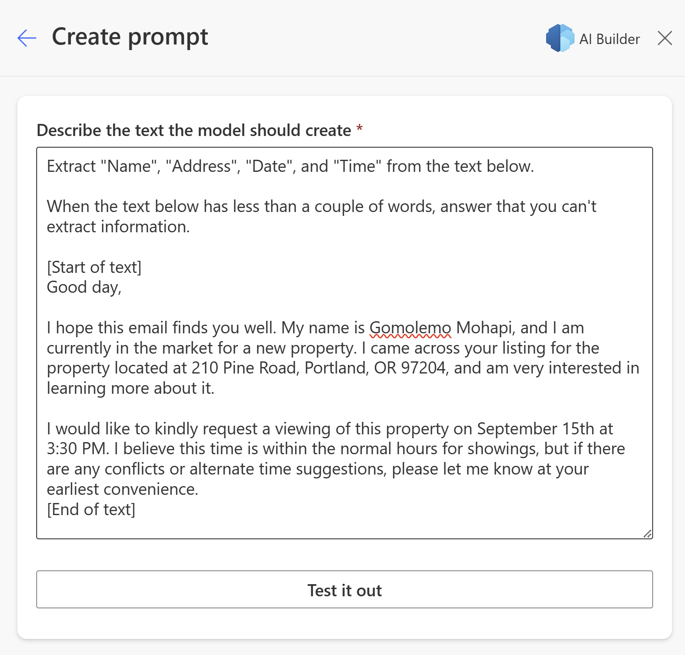

    In this prompt, we're used the basic formula for creating a GPT prompt. We have the **Instruction**:

    `Extract "Name", "Address", "Date", and "Time" from the text below. When the text below has less than a couple of words, answer that you can't extract information.`

    And then we have the **Context**:

    `[Start of text] context [End of text]`

    The instruction tells the model what it should do. The context is the information the model needs to follow the instruction. In an automation task, the instruction is constant and the context is provided by dynamic content - which we will update in the next step.

12. Select **Test it out** to see if GPT extracts the correct information from the text.

    After a few seconds of preparing a response, it should be able to extract the relevant information from the example prompt:

    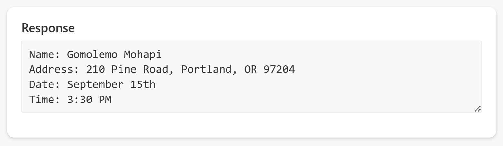

13. Now select **Use prompt in flow**.

14. Delete the example email from the **Prompt** and replace it with the **Body** dynamic content of the email from the trigger

    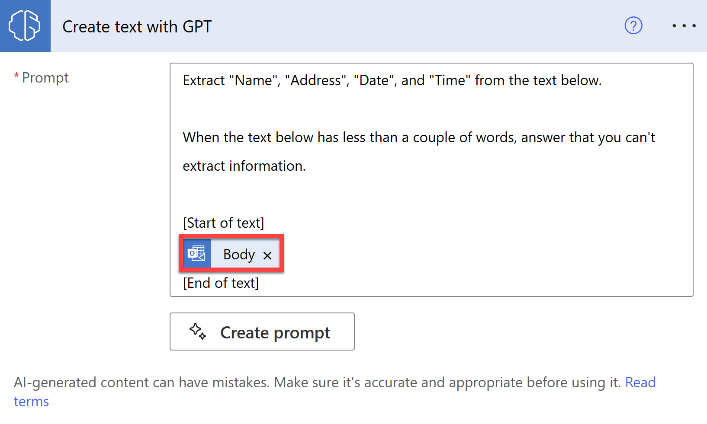

    Now whenever an email arrives, GPT will attempt to extract the relevant information from the email body.

    AI-generated content can be factually incorrect, inappropriate, or biased. We strongly recommend that you institute a practice of inserting [human oversight](https://learn.microsoft.com/en-us/ai-builder/azure-openai-textgen#human-oversight) in workflows that use AI-generated text before it's posted or used anywhere.

    Now you will be adding an approval step so a human can review the extracted information.

15. Select **New step** and then search for and select **Approvals**.

16. In the list of actions, select **Start and wait for an approval of text**.

17. In the **Title** box, type:

    `Review extracted information`

18. In the **Suggested text** box, add the **Text** dynamic content from the **Create text with GPT** action.

    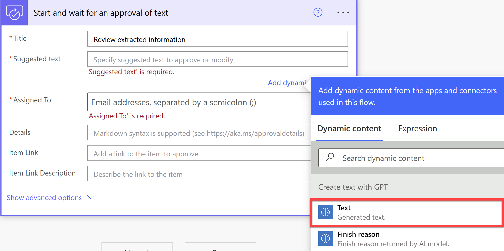

19. In the **Assigned to** box, type the email address you're using for this lab.

20. In the **Details** box, type:

    `Please review the extracted information and edit as necessary.`

    The action should look similar to the following:

    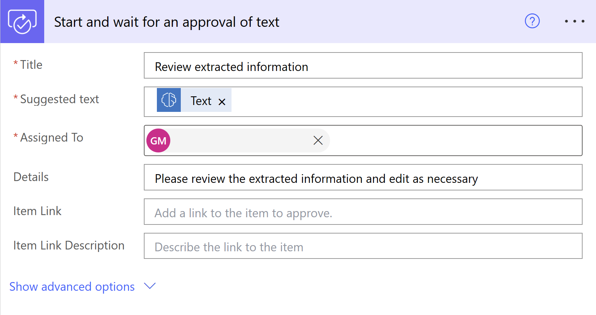

21. Now select **New step**, search for **Control**, and select **Condition**.

22. Select the **Choose a value** box and select **Outcome** from the Dynamic content pane.

23. Select **is equal to** for the condition and then type `Approve` for **Choose a value**.

    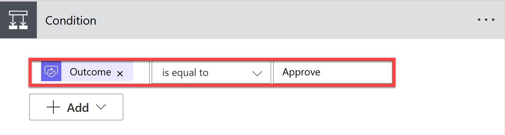

24. In the **If yes** box, select **Add an action** and then search for **Teams** and select **Post a message in a chat or channel**.

25. Select **Flow bot** from the **Post as** dropdown menu, and then select **Chat with Flow bot** from the **Post in** dropdown menu.

    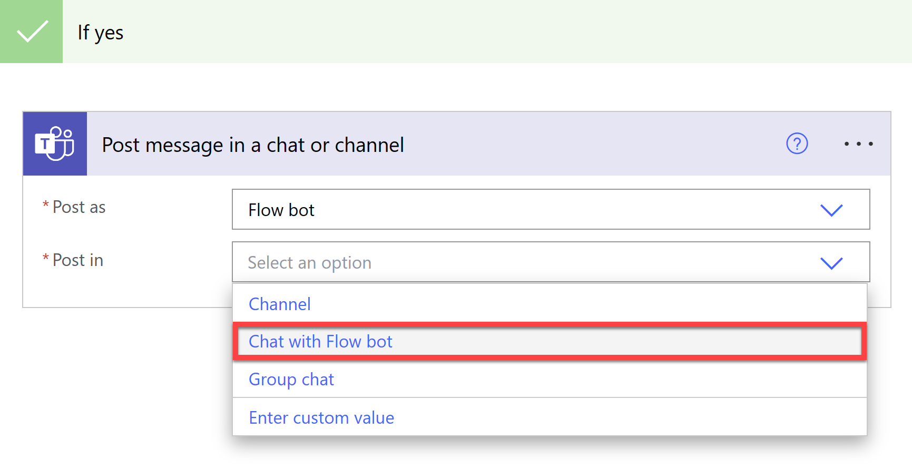

26. In the **Recipient** box, type the email address you're using for this lab.

27. For the **Message** box, type:

    ```
    Please add the following Real Estate Showing Request.

    Client Email: 
    ```

28. Select **Add dynamic content** and then select **From** from the **When a new email arrives** action.

    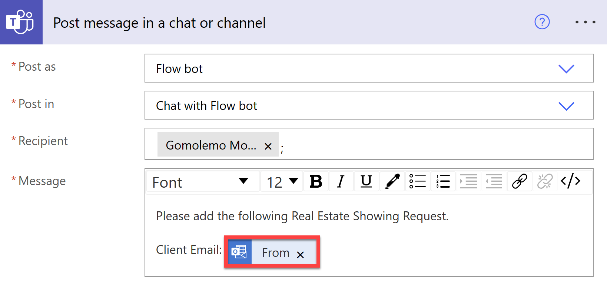

29. Beneath the Client Email line, select the **Accepted text** dynamic content from the **Start and wait for an approval of text** action.

    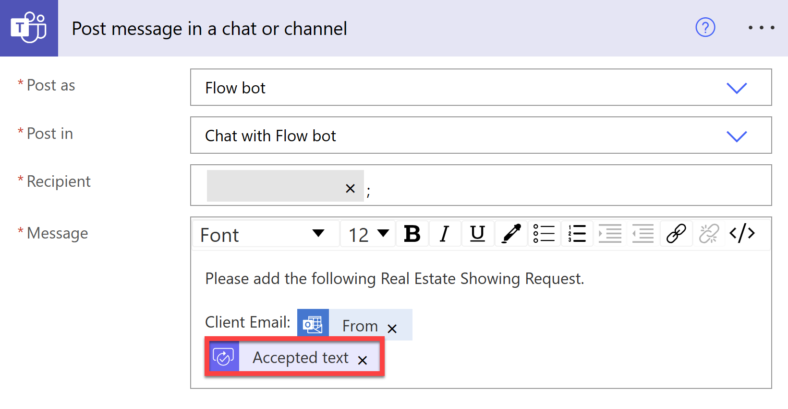

    This will send a direct Teams message to you with the Client Email and the Accepted text from the approval action reminding you to create a record in the Real Estate Showings Power App.

    Of course, you can automate the record creation by converting the extracted entities into a JSON object and then using that to create a record in the Real Estate Showings Power App and Dataverse table. However, that is beyond the scope of this lab.

    In the **If no** box, you can add a **Send an email** action to notify the sender that there wasn't enough information to book the showing. However, you can add that in your own time.

30. For now, let's save the flow and test it out. Select **Save** and then **Test**.

31. Select **Manually** and then select **Test**.

32. Then from any email address, send an email to the email address you're using for this lab with the subject: `[Query] - New Booking Request` and the following body:

    ```
    Hello,

    I trust you're doing well. I'm John Doe and I'm actively searching for a new home. Your listing for the property at 789 Maple Avenue, Lexington, KY 40502 has caught my attention, and I'm eager to find out more.

    Could I arrange to see the property on September 29th at 1:45 PM? I think this falls within your usual showing times, but if that doesn't work for you or if you have other time options, I'd appreciate it if you could inform me as soon as possible.
    ```

33. Open Outlook and you should see the email that you've sent to yourself followed by the **Approval** request with the extracted information:

    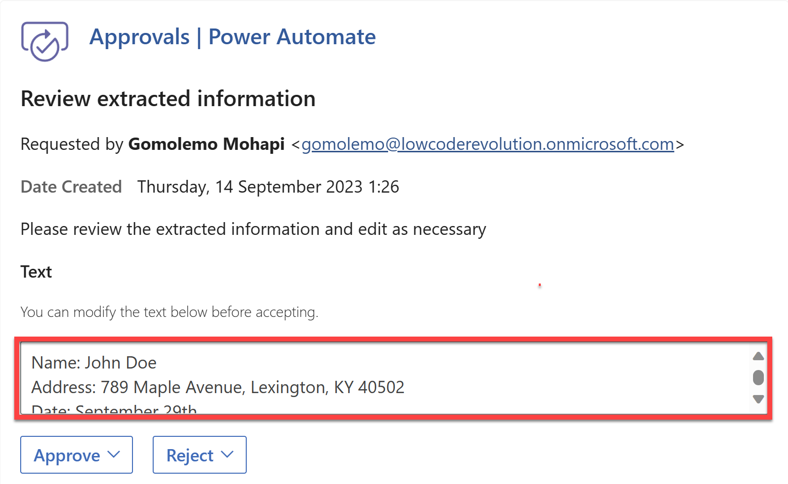

34. Select **Approve** and then open Teams. You should see a message from the Flow bot with the extracted information once arrpoved:

    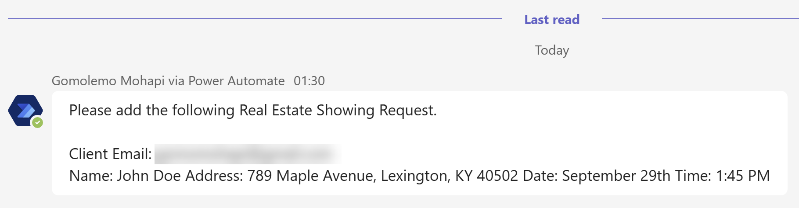

35. Going back to your Power Automate flow, you should see that flow ran successfully:

    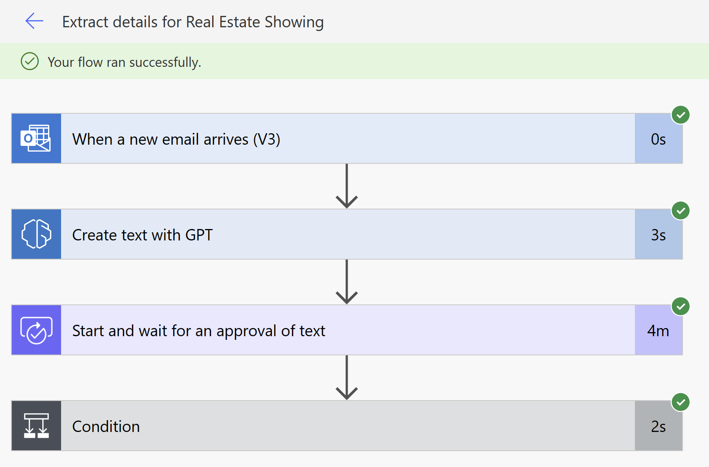

## Check your knowledge

Answer the following questions to see what you've learned.

1. What is text generation?

    - **A type of natural language processing task that involves generating text from a given input.**
    - A type of machine-learning algorithm that can classify text into different categories.
    - A type of data visualization technique that uses text to represent data.

2. What can you use the text generation capability for?

    - Chatbots
    - Language translation
    - Content creation
    - **All are correct**

3. What is an _instruction_ and _context_ in the Create Text with GPT model?

    - **The instruction tells the model what it should do. The context is the information the model needs to follow the instruction.**
    - The instruction is the information the model needs to follow. The context tells the model what it should do.
    - The instruction and context are the same thing.

## Summary

In this module, you learned about what AI Builder is and how it can be used to add intelligence to your apps and automations. You also explored what the Create Text with GPT model in AI Builder is and how it can be used to generate text. Finally, you learned how to use the Create Text with GPT model in Power Automate by building a flow that extracts information from an email sent by a customer requesting a real estate showing and then sends a message to a Teams channel with the extracted information.

An important thing to remember is that AI-generated content can be factually incorrect, inappropriate, or biased. We strongly recommend that you institute a practice of inserting [human oversight](https://learn.microsoft.com/en-us/ai-builder/azure-openai-textgen#human-oversight) in workflows that use AI-generated text before it's posted or used anywhere. This can be done by adding an approval step to your flow.