# Creating Bots with Power Virtual Agents Copilot

This module will cover creating bots with Power Virtual Agents Copilot. Power Virtual Agents Copilot is a new feature that allows you to create bots using natural language. It uses the power of GPT-3 to generate topics, trigger phrases, and responses for your bot. This module will also briefly cover how to use the Conversation Booster feature to improve your bot's responses.

**Learning Objectives**

In this module, you will:

- Learn about Power Virtual Agents Copilot and Conversation Booster features
- Build a bot using Power Virtual Agents Copilot to generate topics, trigger phrases, and responses

**Prerequisites**

- You'll need a Power Apps Developer environment (based in the United States region) with a licensed user to complete these exercises

## Introduction to Power Virtual Agents Copilot

When building a bot, you need to create topics, trigger phrases, and responses. This can be a time-consuming process. Now creating topics in Power Virtual Agents is more effortless than before. Now, you can create a topic in Power Virtual Agents by using natural language to describe what you want the topic to do. Then, you can select **Create** for the Copilot feature to automatically build that topic, reducing the manual steps of creating a topic.

## Introduction to Conversation Booster

Conversation Booster is a new feature that allows you to improve your bot's responses. Technically speaking, it allows your bot to find and present information from multiple sources (which may be internal or external) without requiring creation of topics. Generative answers can be used as primary information sources in your chatbot, or as fallback when authored topics are unable to address a user's query. As a result you can quickly create and deploy a functional bot, without having to manually author multiple topics that may not address your customer's questions.

You can learn more about Conversation Booster and Generative answers [here](https://learn.microsoft.com/en-gb/power-virtual-agents/nlu-boost-conversations).

## Exercise - Building a bot in Power Virtual Agents with the new AI Capabilities

In this unit, you will create a bot using Power Virtual Agents Copilot. You will also learn how you could use the Conversation Booster feature to improve your bot's responses.

1. Sign into [Power Virtual Agents](https://powerva.microsoft.com/).

    Make sure you're in the correct environment. One that was made in the U.S region.

2. Select **Home** from the left navigation menu and then select **+ Create a bot**.

    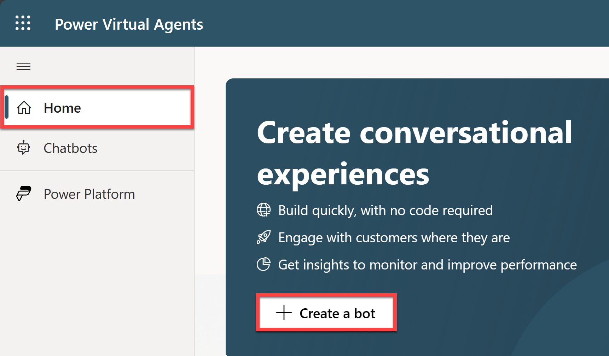

    The Create a bot wizard will open, This wizard allows you to set up your bot by naming it, selecting the language, and also optionally choosing if you want to boost your conversations with generative answers.

3. Name your bot: **Real Estate Booking Service** and then Select **English**.

    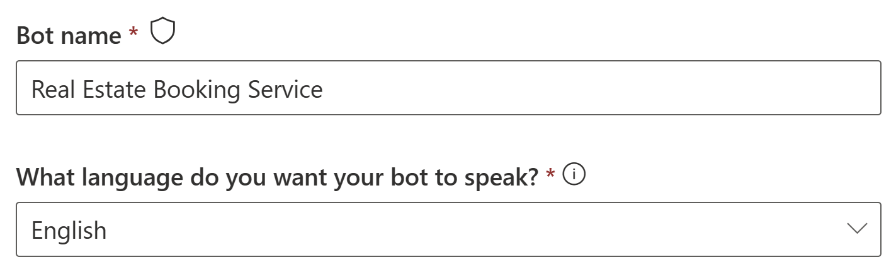

    > [!IMPORTANT]
    >
    > You should also be seeing the **Boost your conversations with generative answers** option:
    >
    > 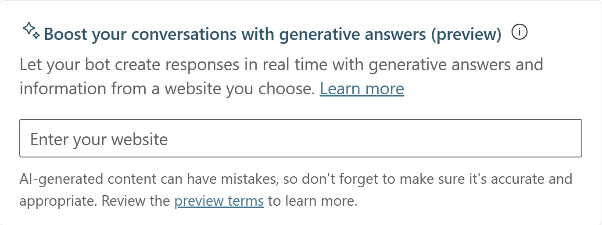
    >
    > Here you can fill in your favorite Real Estate Website and the idea is that once you create the bot, any question that the bot can't answer - it will search the website you provided for the answer. This is a great way to quickly create a bot that can answer a lot of questions without having to manually create topics.
    >
    > For example, if the https://powerplatform.microsoft.com/  website was provided:
    >
    > 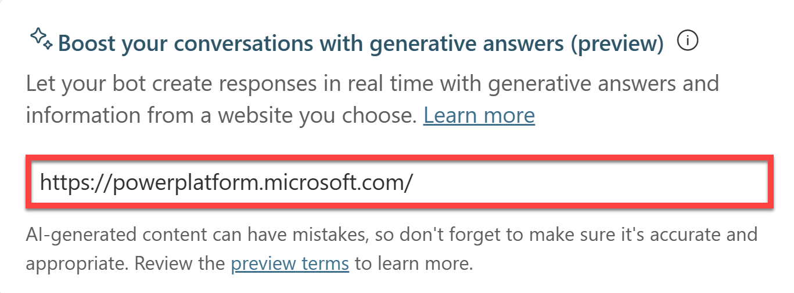
    >
    > and the user asked "What is Power Virtual Agents?" the bot would search the website for the answer and present it to the user:
    >
    > 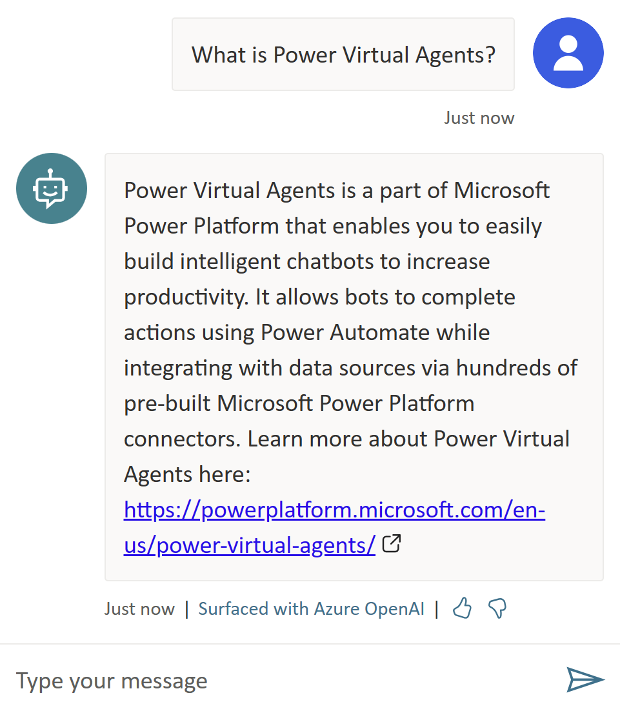
    >
    > Make sure to provide a website that's related to a Real Estate Service. If you don't want to use this feature, you can leave it blank furthermore, we will not be referencing this feature in the rest of the module.

4. With the bot name and language set, select **Create**.

    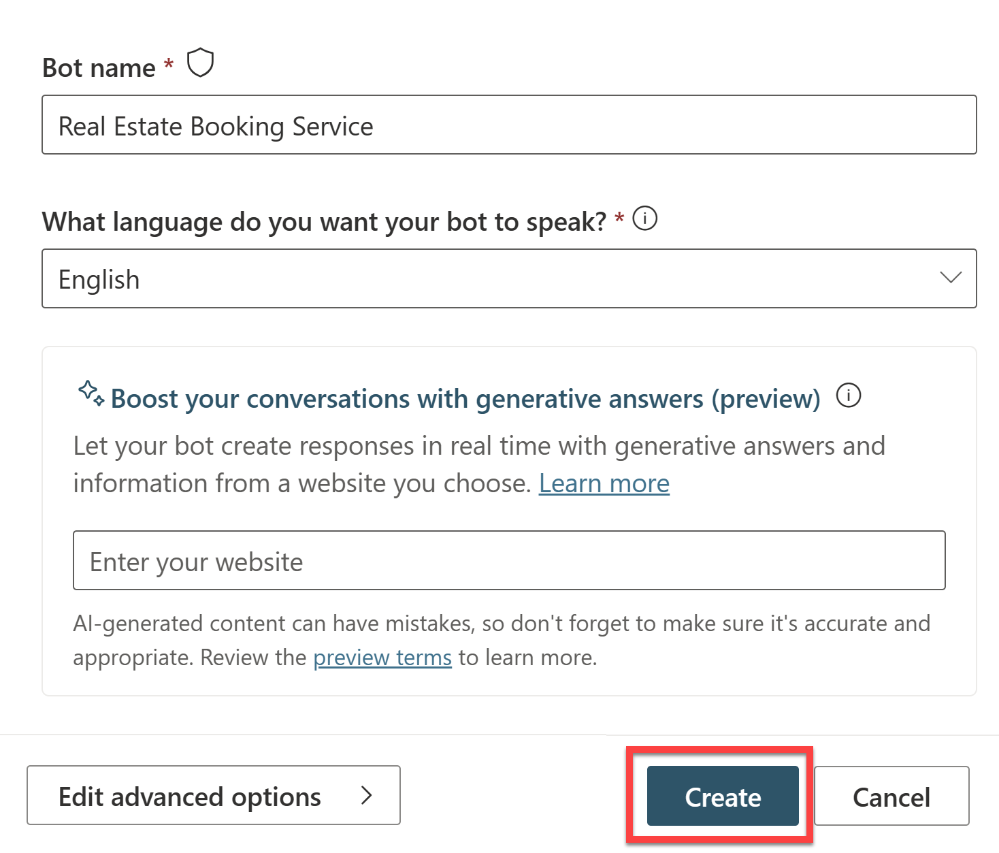

    > [!NOTE]
    >
    > After you've selected **Create**, the process of creating the first bot within a new environment can take up to 15 minutes. Subsequent bots will be created much faster.

5. With your bot created, select **Topics** from the left navigation menu and then select the **+ New topic** dropdown button. Then select **Create with Copilot**.

    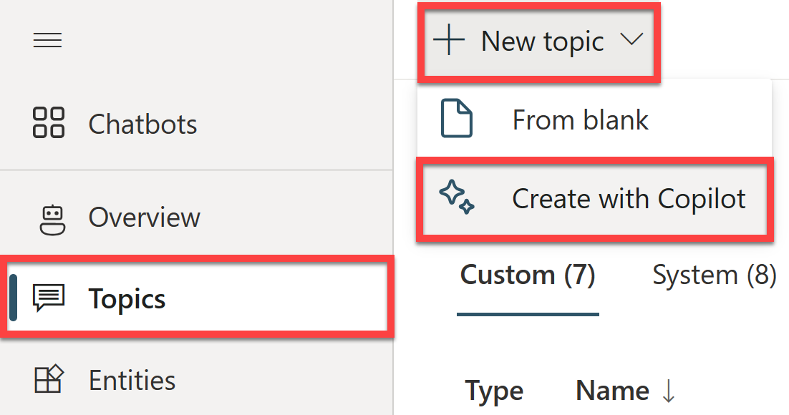

    > [!NOTE]
    >
    > If you don't see the **Create with Copilot** option, you may need to enable Intelligent authoring support:
    > 
    > 1. Select the **Settings** icon on the top menu and then **General settings**.
    > 2. Set the switch under **Intelligent authoring support with Copilot** to **On**.

6. A new window will appear asking you to **Name your topic** and provide a description in the **Create a topic to...** space.

7. In the **Name your topic** field, enter:

    `Book a Real Estate Showing`

8. In the **Create a topic to...** field, enter:

    `collect a user's full name, email, address of the property, and date and time of the showing`

    Then click **Create**.

    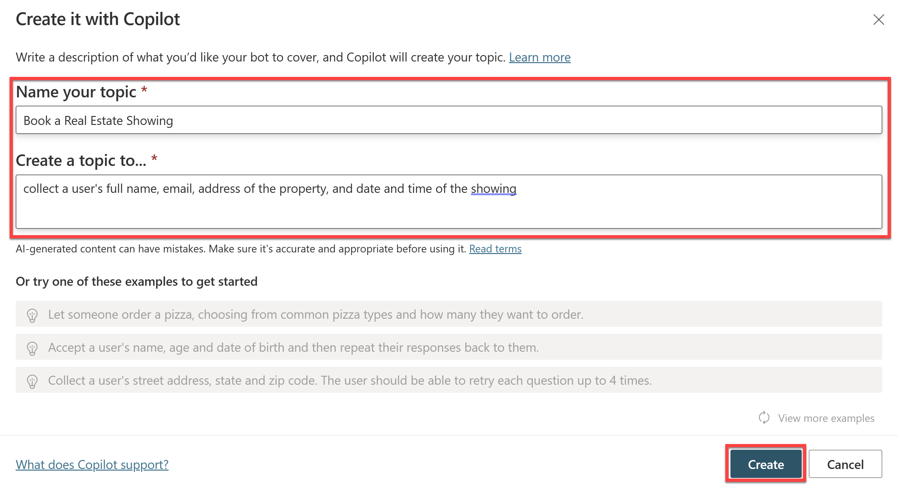

9. You should see a new topic with the generated trigger phrases:

    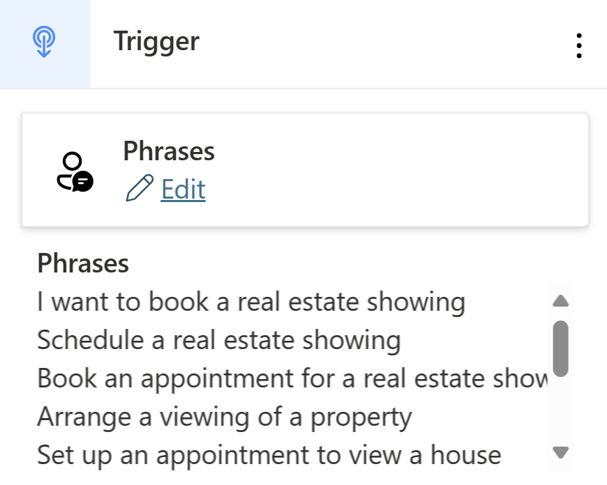

    > [!NOTE]
    >
    > Remember, your generated content may be different than what's shown here.

    Along with multiple question nodes, entity selection, and variable naming:

    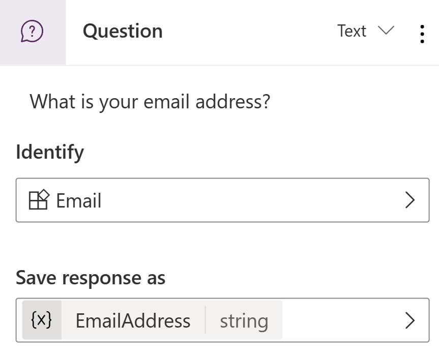

10. Look for the **What is your email address?** question node and select it.

    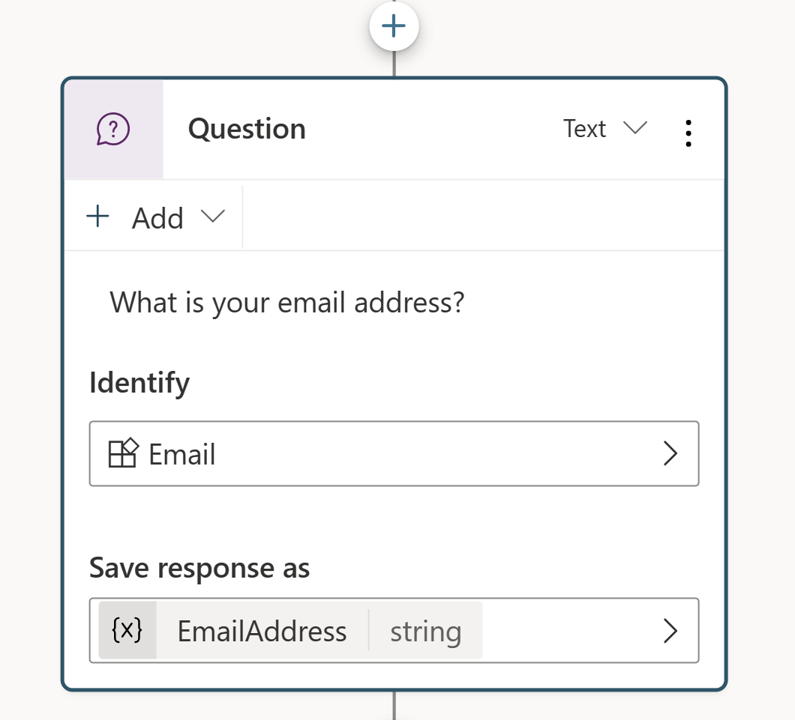

11. Then select the **Edit with Copilot** icon in the upper part of the authoring canvas.

    

12. Within the **Edit with Copilot** panel, in the field **What do you want to do?**, enter

    `update the message to say thank you to the Name variable from the previous node and then proceed to ask the question`

    Then click **Update**.

    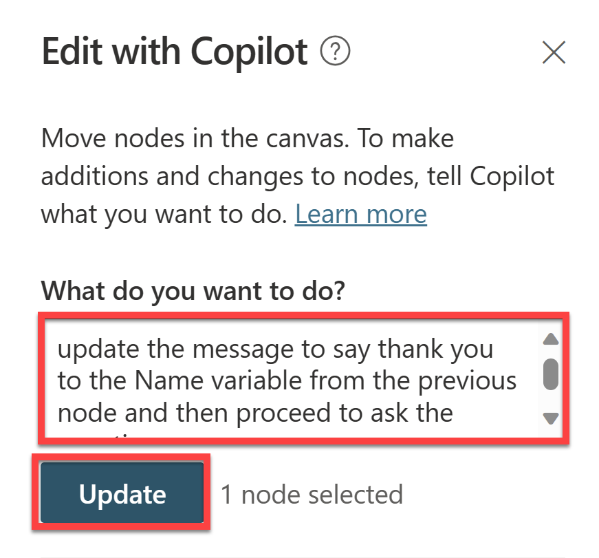

13. You should now see the message updated to include the _Name_ variable from the message node before it:

    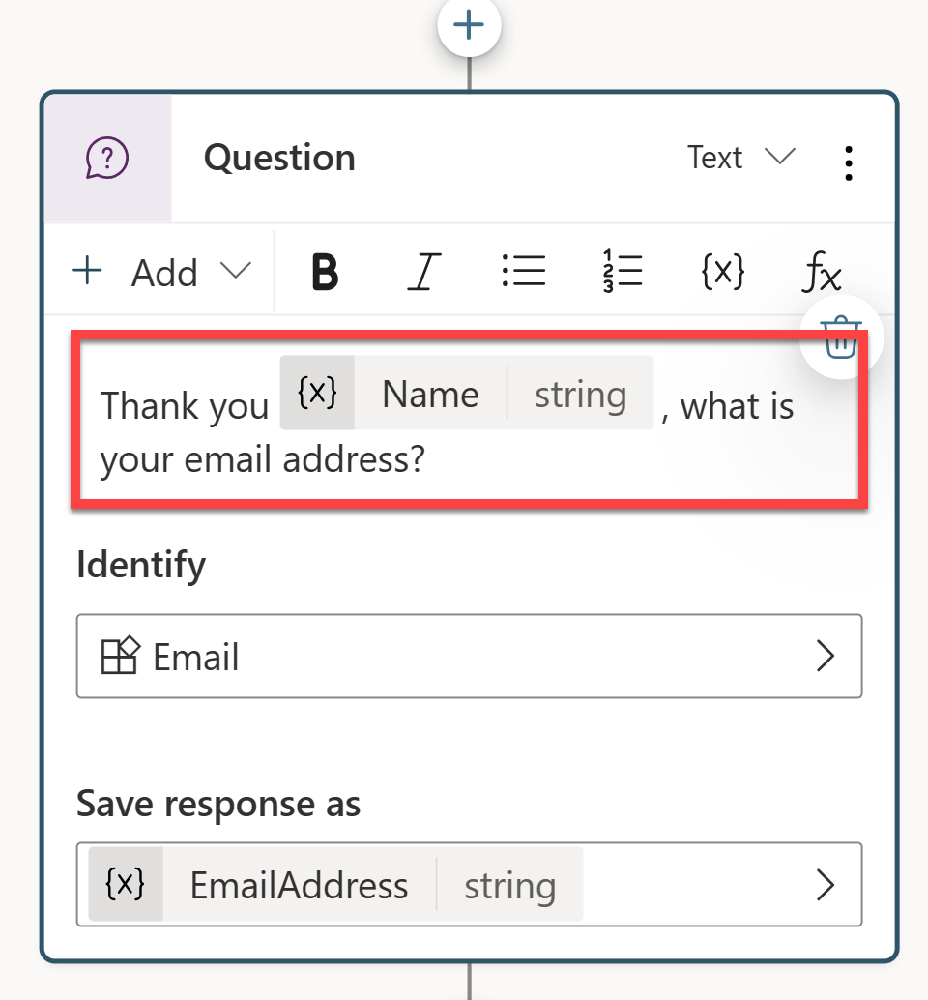

    So with Copilot, in addition to adding new nodes, you can also update existing ones.

14. Make sure no node is selected by clicking in the empty space around the nodes and then within the **Edit with Copilot** panel, in the field **What do you want to do?**, enter

    `summarize the information collected in an adaptive card`

    Then click **Update**.

15. You'll then see that a message node with an Adaptive Card has been added to the end of the topic:

    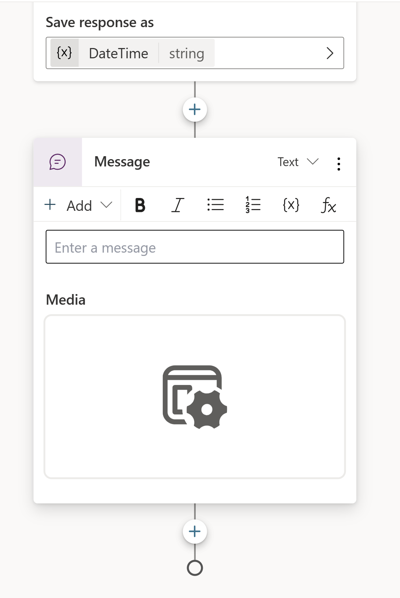

16. Click on the Adaptive Card and then the Adaptive Card properties will appear on the right side of the screen.

    

17. This will close the **Edit with Copilot** panel, so click the icon to reopen it. Then in the field **What do you want to do?**, enter

    `add a question to confirm if the user's information is correct with the option to select either "Yes" or "No"`

    Then click **Update**.

18. You'll then see that a new question node has been added to the end of the topic with options for the user to select:

    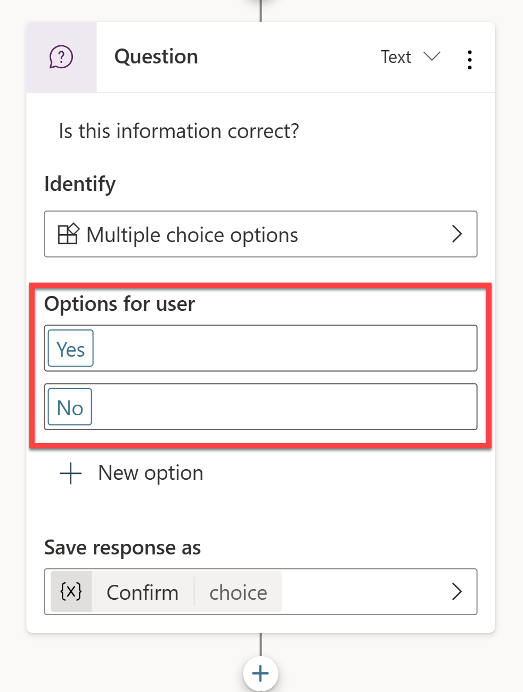

19. Rename the topic on the top left-hand side of the authoring canvas to **Book Real Estate Showing Topic**.

    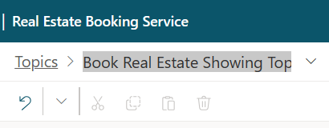

20. Then select **Save** to save your changes.

21. Select the **Test your bot** button in the lower left of the screen to open the testing panel.

22. The **Conversation Start** message will appear, and your bot will start a conversation. In response, enter a trigger phrase for the topic that you've just created:

    `I want to book a real estate showing`

    And then you'll see it respond with the "What is your full name" question:

    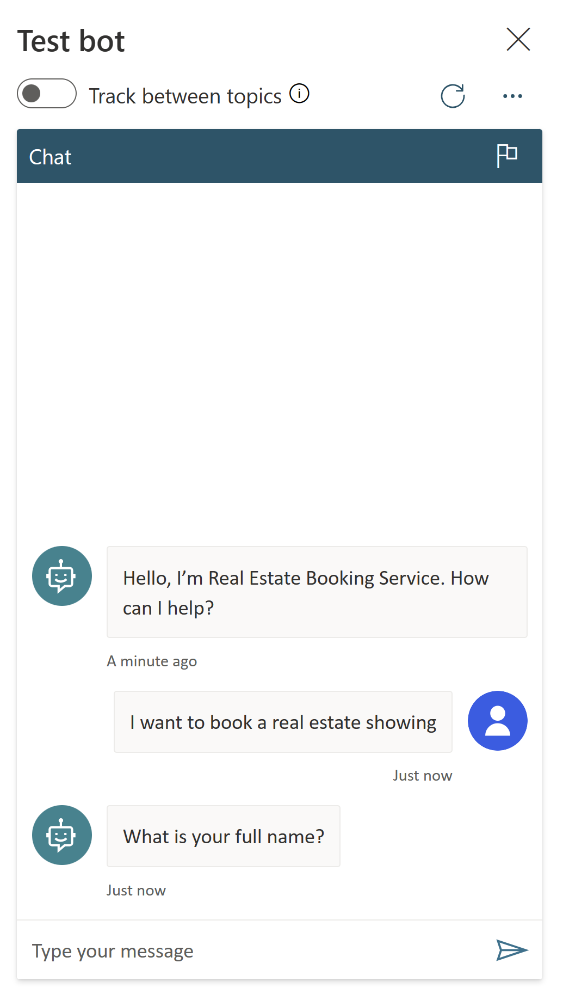

23. Enter the rest of the information:

    ```
    Full name: <Your name>
    Email address: <Your email address>
    Address: 555 Oak Lane, Denver, CO 80203
    Date and Time: 10/10/2023 10:00 AM
    ```

24. Once all the information has been entered, you'll see the Adaptive Card with the information you entered and a question asking if the information is correct with the options to select either "Yes" or "No":

    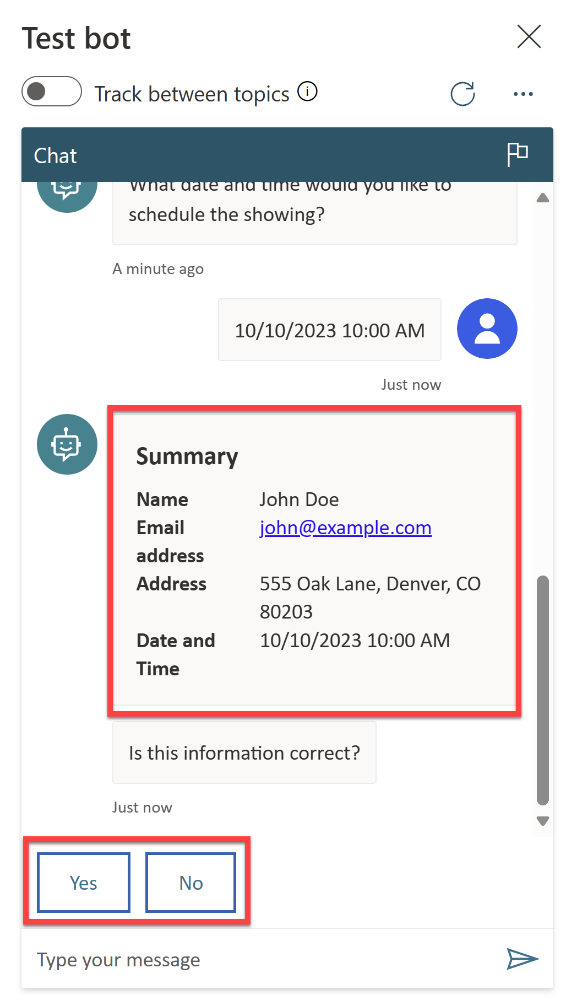

    After selecting one of the options, you can further develop the topic to either save the data in Dataverse via a Power Automate flow or send an email to the user with the information they entered. However this is outside the scope of this module.

## Check your knowledge

Answer the following questions to see what you've learned.

1. What is the primary purpose of Power Virtual Agents Copilot?

    - To automate website searches
    - To enhance chatbot appearance
    - **To assist in bot creation using natural language**
    - To deploy bots to multiple platforms

2. Which feature in Power Virtual Agents allows the bot to present information from multiple sources without creating topics?

    - **Conversation Booster**
    - Generative Responses
    - Copilot Builder
    - Azure AI Bot Service

3. How do you test your bot in Power Virtual Agents?

    - Deploy the bot to Azure
    - **Select the Test your bot button in the lower left corner of the screen**
    - By turning on the "Track between topics" toggle
    - By publishing the bot to a test site

## Summary

In this module, you learned about Power Virtual Agents Copilot and Conversation Booster features. You also built a bot using Power Virtual Agents Copilot to generate topics, trigger phrases, and responses furthermore you learned how to edit existing nodes and add additional ones.