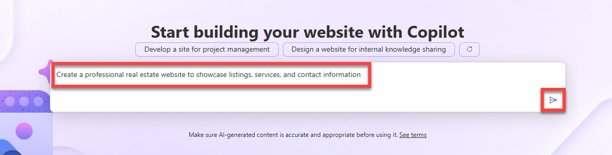
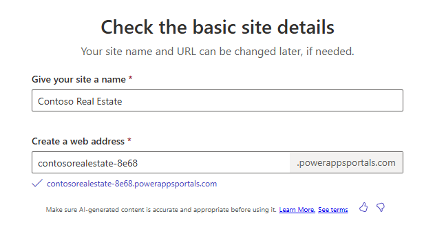
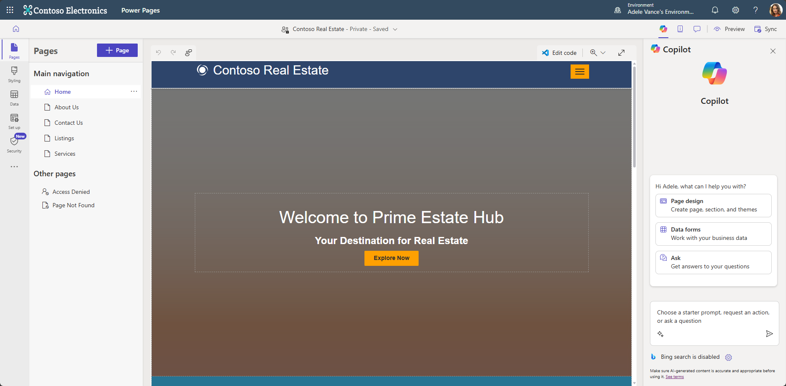

# Build a website for a real estate solution using Copilot in Power Pages

This module covers how to create websites by using Copilot in Power Pages. Learn how to use Copilot in Power Pages to quickly and easily use AI prompts to generate full sites, webpages, forms, text and more. With a user-friendly interface, it can get you started with a website faster and more efficiently than ever before.

**Learning Objectives**

This module explains the following concepts:

* How to create an AI-generated website using Copilot in Power Pages
* How to create an AI-generated webpage using Copilot in Power Pages
* How to add an AI-generated form using Copilot in Power Pages
* How to add AI-generated text using Copilot in Power Pages
* How to create an AI-generated color theme using Copilot in Power Pages

**Prerequisites**

* A Microsoft Power Platform environment with the [enhanced data model](https://learn.microsoft.com/en-us/power-pages/admin/enhanced-data-model) enabled
* A Power Pages license
* Complete the previous modules in this learning path

## Introduction to Power Pages Copilot

Power Pages is defined as a secure, enterprise-grade, low-code software as a service (SaaS) platform for creating, hosting, and administering modern external-facing business websites. This tool is designed to empower anyone, whether they are a low-code developer or a professional developer, to create websites quickly and easily. This includes the design, development, configuration, management, and publishing of these websites.

Now with the addition of Copilot, Power Pages has become even more powerful and is revolutionizing how you build and launch business websites. Copilot simplifies this process by generating entire webpages, forms, text, chatbots, and so much more. This is all made possible via a user-friendly, conversational interface that allows you to express what you want to build in plain language and then copilot will generate what you need.

## Exercise - Create a website using Copilot in Power Pages

In this exercise, you'll create a website that revolves around a real estate company and it's operations. **_[TODO: Add more details about the website]_**.

Follow these steps to create a website using Copilot.

1. Sign in to your [Power Pages](https://make.powerpages.microsoft.com/) environment.

1. In the center of the **Home** page within **Power Pages**, in the text field under **Start building your website with Copilot**, enter the following prompt:

    ```plaintext
    Create a professional real estate website to showcase listings, services, and contact information
    ```

    Select the **Submit** button.

    

1. From the prompt, Copilot generates a site name and web address. Change the site name to be `Contoso Real Estate`. Then change the web address to be `contosorealestate-xxxx`.

    > **Note:** The `xxxx` in the web address is a unique identifier that Copilot generates. You can change it but it's there to ensure that the web address is unique to you.

    

    Select **Next**.

1. Now you'll be asked to pick a site layout. You either select _Try Again_ to get a new generated layout or select _Next_ to continue with the current layout. Select **Next** to continue.

1. Copilot then generates more pages that could be used in the site based on the prompt. Select the following pages:

    * **About Us**
    * **Contact Us**
    * **Listings**
    * **Services**
    
    Then select **Done**. 
    
    Copilot will then set up and generate the full site. This may take a few minutes.

    Once  generated, you'll be redirected to the site opened in the design studio where you can further customize the site.

    

1. 


