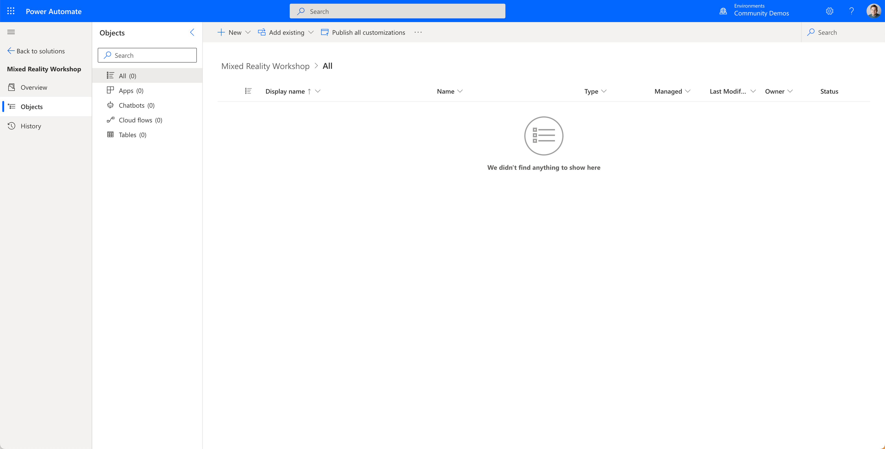
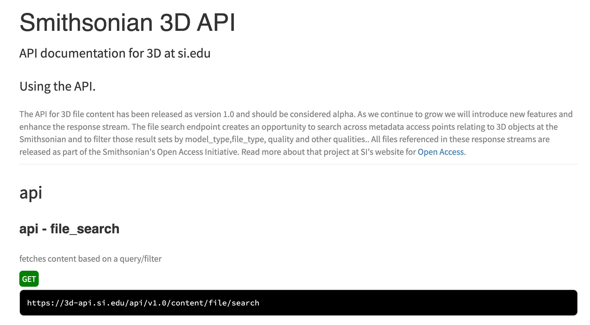

# Lab 01 - Create your first Custom Connector

When you're ready to create a Power Platform solution, like we're going to do today, you always want to start by going to the maker portal. In this case, we're going to the Power Automate maker portal.

[🤖 Power Automate Maker Portal](https://make.powerautomate.com)

> **Note:**
>
> It's very important to create a solution and not start from Data > Custom connectors. Solutions give you a lot more possibilities. For instance, you can more easily perform application lifecycle management (ALM) on it.

## Create a solution

Navigate to solutions in the left hand menu. In the solution view, click the '**+ New Solution**' button at the top. A side bar will open where you can add your solutions' display name, name (internal name), a publisher and a version. When creating a new publisher, only fill in the required fields.

> **Note:**
>
> Be aware that the new publisher will have a prefix value. That prefix value will be added to the internal name of every component you create in this solution. When you use 'msft' as a prefix, you will get 'msft\_' as a prefix before every component that gets created in the solution.

For this solution, we will use the following values:

- **Display Name**: `Mixed Reality Workshop`
- **Name**: `MixedRealityWorkshop`
- **Publisher**: `create a new one to your own liking and select that one when you are done creating it`
- **Version**: `1.0.0.0`

There is also a 'more options' option available, but we will not use that in this workshop.

When you have filled in all the values above, click on the **Create** button and your solution will be created. The solution you have created should appear in the solution list after you clicked on the create button.

Click on the display name of your solution to open the solution. This should lead you to the following screen:

## Create the custom connector

Click on the **+ New** button and take a look at all the options that are in this menu. These are all the solution components that you can create in a solution. In this case, we want to hover the **Automation** menu item, and then select **Custom Connector**.

This will open the custom connector creation wizard. In this wizard, we will create the custom connector for the [Smithsonian 3D API](https://3d.si.edu/). This API is very well documented. You can find the documentation [here](https://3d-api.si.edu/api-docs/). The only action available in this API is file search. This is the only action we need for this workshop, so don't worry!

Back in the Power Automate custom connector wizard, let's name the connector `Smithsonian 3D`.

In this screen, we can also add a connector icon, color, and a description. We will skip that for now, but we do fill in the host field. As you can see, the file search action in the API is a GET request to `https://3d-api.si.edu/api/v1.0/content/file/search`. This means that we can add **3d-api.si.edu** in the host field.

Navigate to the security part of the wizard by clicking on the tab `2. Security` or by clicking on the **Security →** button on the bottom right.

### Security

In our case, the security tab is not that interesting, but in various other cases, this will be the place where you define your authentication. For instance, when connecting to the Microsoft Graph API, you will have to use the `OAuth2.0` authentication type.

For now, we will leave this on the `No authentication` authentication type. Let's move on to the `3. Definition` tab.

### Definition
