# Lab 01 - Tenant setup

In this lab, you will go through the following tasks:

* [1.1 Create a new browser profile (Microsoft Edge)](#11-create-a-new-browser-profile-microsoft-edge)
* [1.2 Log on to your account and set up authentication in Microsoft Authenticator app](#12-log-on-to-your-account-and-set-up-authentication-in-microsoft-authenticator-app)
* [1.3 Create developer environment](#13-create-developer-environment)
* [1.4 Sign into Microsoft Copilot Studio and select developer environment](#14-sign-into-microsoft-copilot-studio-and-select-developer-environment)
* [1.5 Create new SharePoint site and upload file](#15-create-new-sharepoint-site-and-upload-pdf-file)
* [1.6 Copy SharePoint site URL](#16-copy-sharepoint-site-url)

## 1.1 Create a new browser profile (Microsoft Edge)

It's always good to have a separate browser profile for your work and for workshops like this. This way you can keep all of your credentials separate and not have to worry about logging out of your personal / work accounts.

1. Open Microsoft Edge.

1. Select the **profile icon** on the top left corner and select **+ Set up new personal profile**

    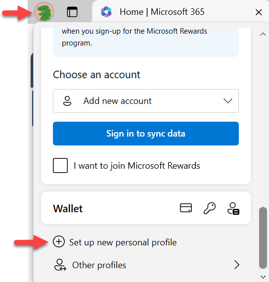

1. This will launch a new browser window on your taskbar with a new tab that displays "Welcome to Microsoft Edge." Select the **profile icon** on the top left corner again, and this time select the cog wheel icon to update the Edge profile settings.

    

1. A new browser tab will load. In the **Profiles** settings, select **Edit**.

      

1. Enter a name for your new Edge profile - Example: `Nestor Wilke - CS workshop`, and select **Update**.

    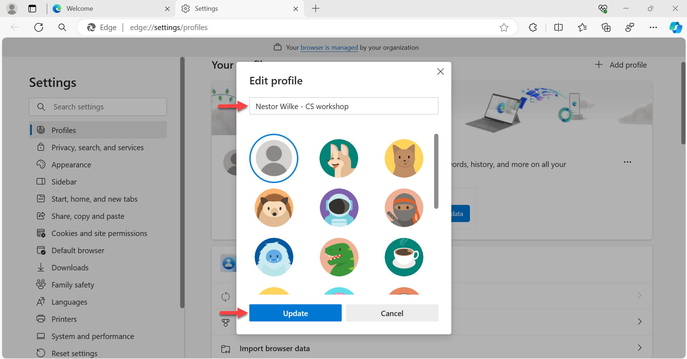

1. In the **Profiles** settings, select **Profile preferences**.

    

1. Disable the setting **Account based profile switching**.

    

1. The setting will now be disabled. Any apps you open from Microsoft 365 waffle menu will now load in the current Edge browser profile.

    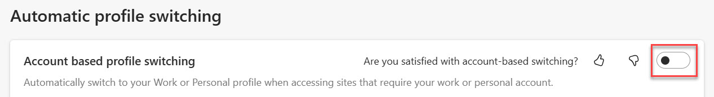

1. Close the tab and in the Edge Welcome tab, select **Start without your data**.

    

1. Next, select **Confirm and start browsing**.

    

1. Next, you can configure your new browser theme. Keep it as the system default and select **Finish**.

    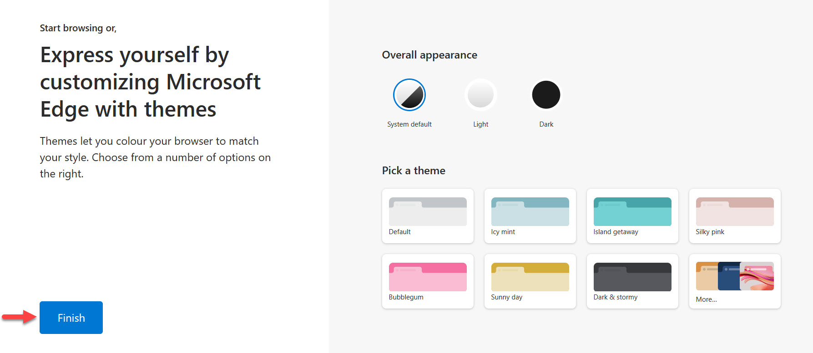

## 1.2 Log on to your account and set up authentication in Microsoft Authenticator app

With the credentials that were provided to you, log into the account you are going to use during the workshop.

1. Browse to [https://www.office.com](https://www.office.com) and select **Sign in**.

    

1. On the sign-in screen, enter the email address that was provided to you and then click **Next**.

    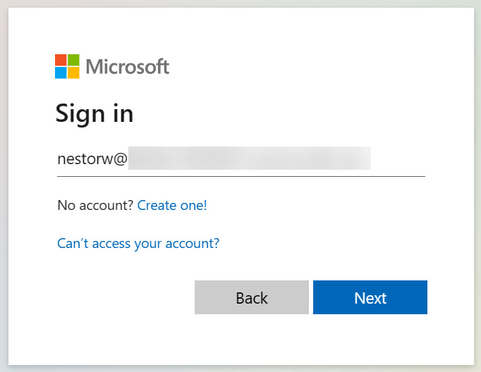

1. Enter the password and click **Sign in**.

    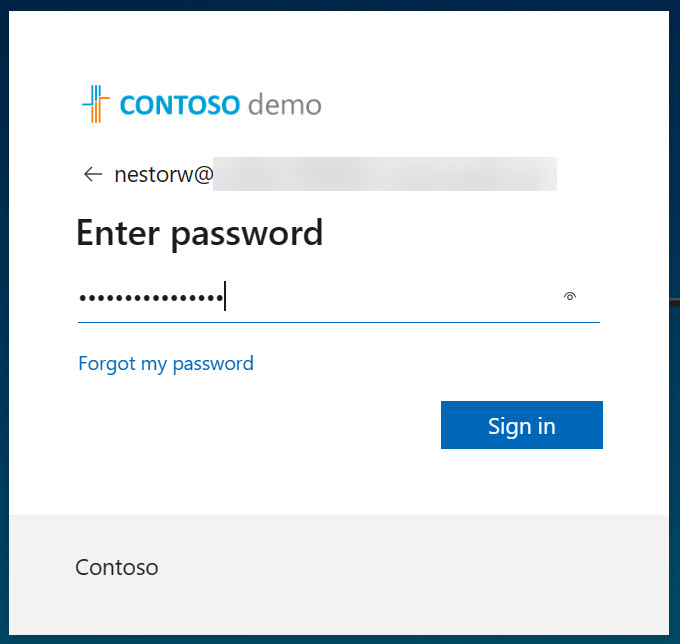

1. A dialog will appear and this is where you'll need to set up your account as an authenticated account in the Microsoft Authenticator app on your mobile device. This is required to authenticate yourself in order to sign-in. Select **Next**.

    

1. Install the Microsoft Authenticator app on your mobile if you don't already have through the **Apple App store** for iOS devices or **Google Play** store for Android you're prompted to stay signed in, click **Yes**.

    

1. Open the Microsoft Authenticator app on your **mobile phone**, select the **+ icon** and select **Work or school account**.

1. On your Edge browser, select Next.

    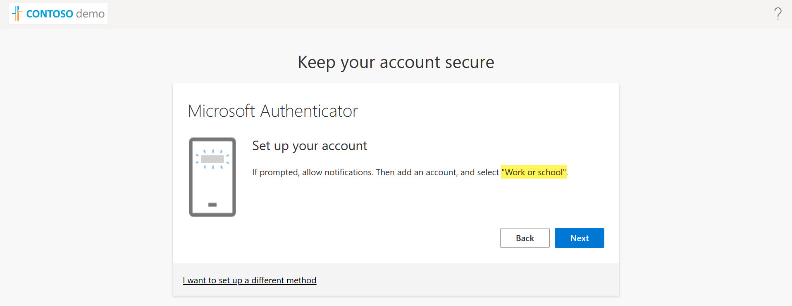

1. Scan the **QR code** on your Edge browser using the **Microsoft Authenticator app** on your mobile phone. 

    

1. A notification from the Microsoft Authenticator app will appear on you mobile phone, this is to approve the sign in request. Enter the number seen on your Edge browser.

    

1. Once approved, a dialog will appear asking you to remain signed in. **Tick** the checkbox and select **Yes**.

    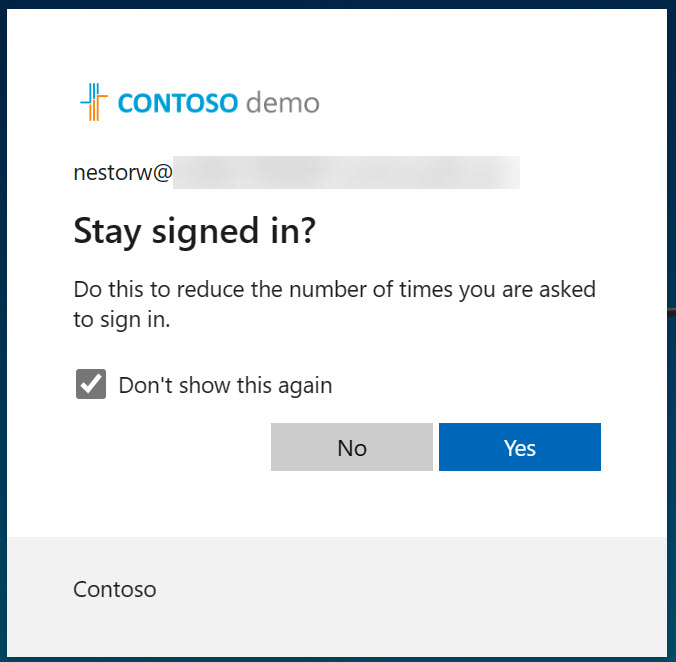

1. You'll now be logged onto Microsoft 365 with your user account.

    

## 1.3 Create developer environment

Developer environments are very helpful when you want to try out features, they are meant to be short living environments.

For this workshop, we are going to create one developer environment:

* ```[Username]'s  Developer Environment```: The environment where you'll build your custom copilot.

To create developer environments, you can create them in three ways:

* Via the [Power Apps Developer Plan Sign Up](https://www.microsoft.com/en-us/power-platform/products/power-apps/free) process
* Via the Power Platform Admin Center
* Via the Power Platform CLI

In this workshop, we will create the environments through the Power Platform Admin Center.

1. Browse to the [Power Platform Admin Center](https://aka.ms/ppac). If you see the _Welcome / Tour pop up_, exit by by clicking on the **X** in the top right corner of the pop up screen.

    

1. Select **Environments** in the left hand side menu and select **+ New**.

    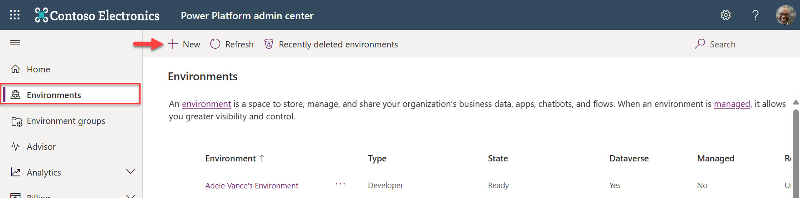

1. When the right-hand side dialog pops up - enter the following information:

    | Field | Value |
    | --- | --- |
    | Name | [Username]'s  DEV Environment - Example: `Nestor Wilke's DEV Environment`|
    | Region | United States - Default |
    | Type | Developer |
    | Purpose | Developer environment for Copilot Studio workshop |

    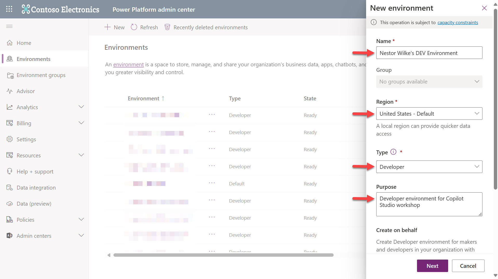

1. Scroll down and you'll see other options, leave them as-is, **do not upate**. Select **Next**.

    
    
1. The environment is now provisioning in the background with a State of _Preparing_. Wait for 5-10 minutes.

    

1. Select **Refresh** to refresh the environment list.

    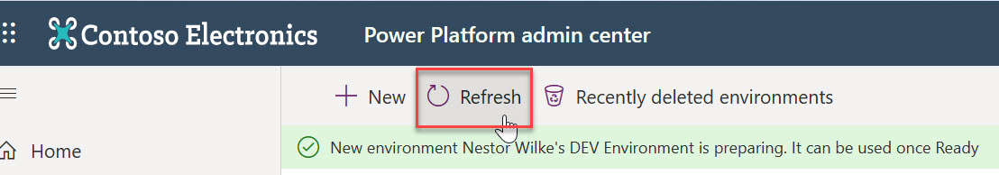

1. The new developer enivronment will be listed with a State of _Ready_.

    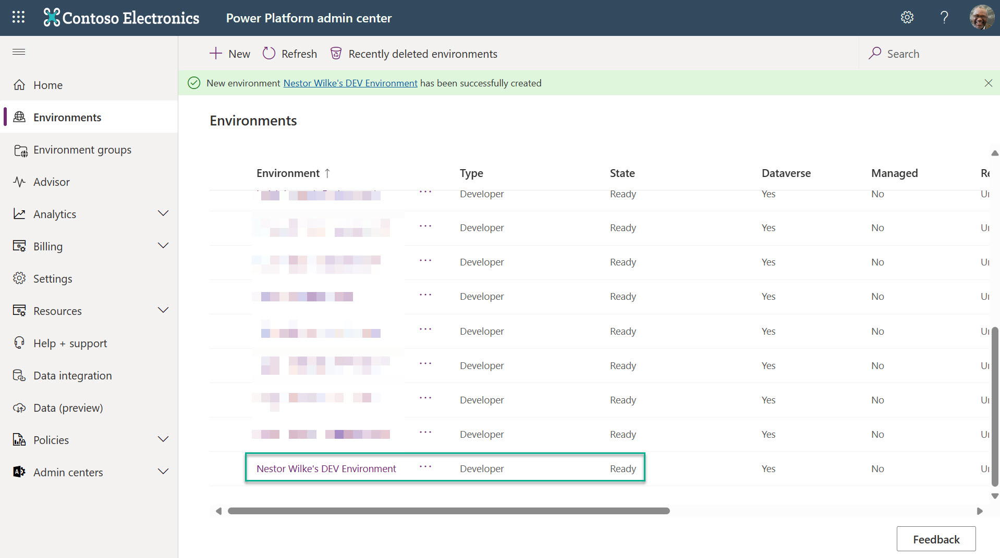

## 1.4 Sign into Microsoft Copilot Studio and select developer environment
For this workshop, the custom copilot will be built in the newly created developer environment for your user account.

1.	Navigate to [https://copilotstudio.microsoft.com/](https://copilotstudio.microsoft.com/) using the username and credential provided.

1.	Switch to the developer environment you created earlier for your account by selecting the cog wheel on the top right.

    

1. The developer environment will now be selected and this will be the environment you'll build your custom copilot in.

    

## 1.5 Create new SharePoint site and upload PDF file

A new SharePoint sites needs to be created  which will be used in [Lab 02 - 2.2 Adding an internal source using a SharePoint site](../lab-02/README.md/#22-adding-an-internal-source-using-a-sharepoint-site). A PDF file will also be uploaded into the Document Library of the site.

1. Select the waffle icon on the top left hand side of Microsoft Copilot Studio to view the menu.

    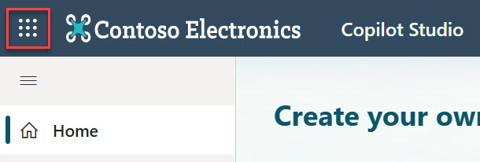

1. Select SharePoint from the menu.

    

1. SharePoint will load. Select **+ Create  site** to create a new SharePoint site.

    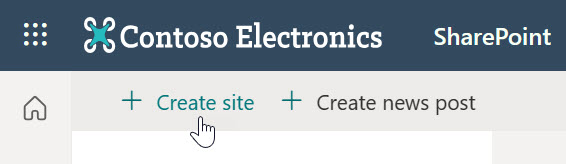

1. A dialog will appear to guide you in creating a new SharePoint site. Select **Communication site**.

    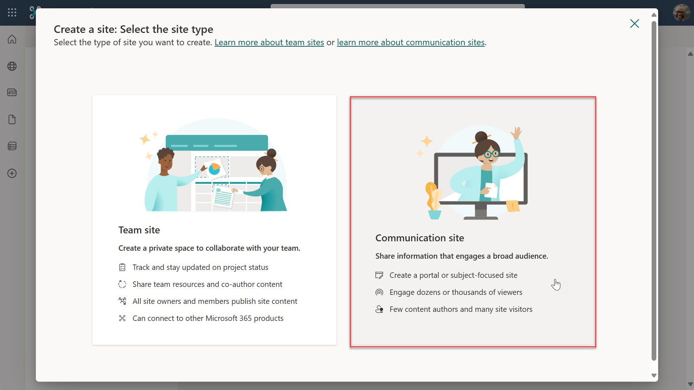

1. In the next step, a list of Microsoft templates will load by default.

    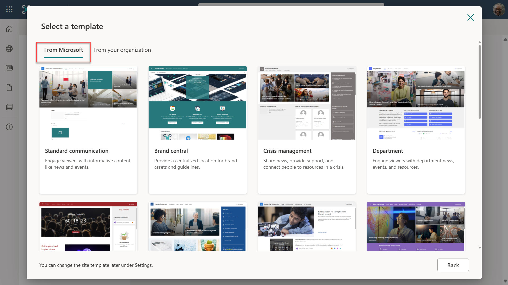

1. Scroll down and select the **Human Resources** template.

    

1. Select **Use template** to create a new SharePoint site using the Human Resources template.

    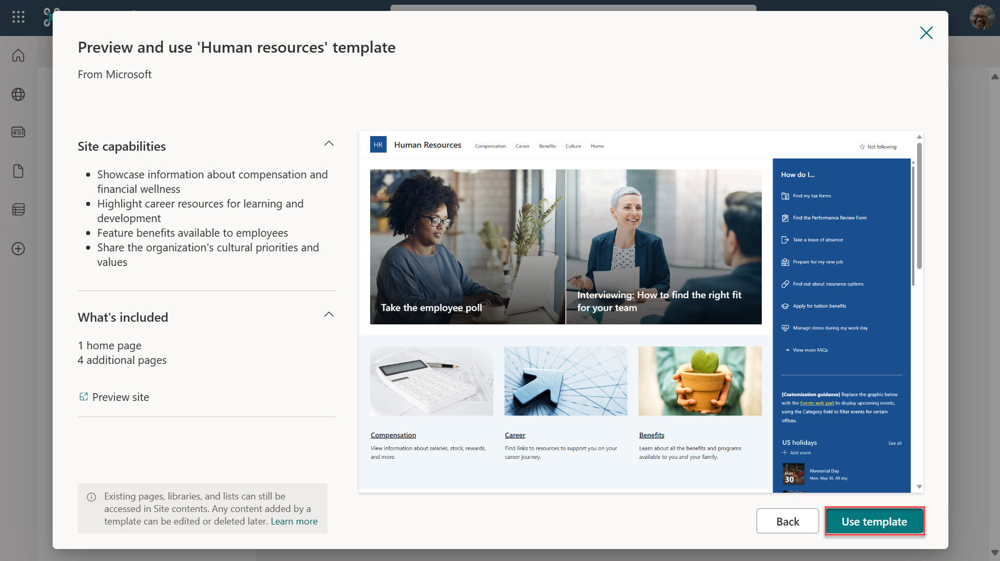

1. Enter information for your site. The following is an example:

    | Field | Value |
    | --- | --- |
    | Site name | Contoso Human Resources|
    | Site description | A site for Contoso employees regarding Human Resources.|
    | Site address | ContosoHumanResources |

    

1. In the final step, a language can be selected for the SharePoint site. By default it will be **English**. Leave the Language as **English** and select **Create site**,

    

1. The SharePoint site will provision for the next 1 to 5 minutes. When complete, the Home page of the Human Resources SharePoint site will load with suggestions of actions. Select **Upload a document**.

    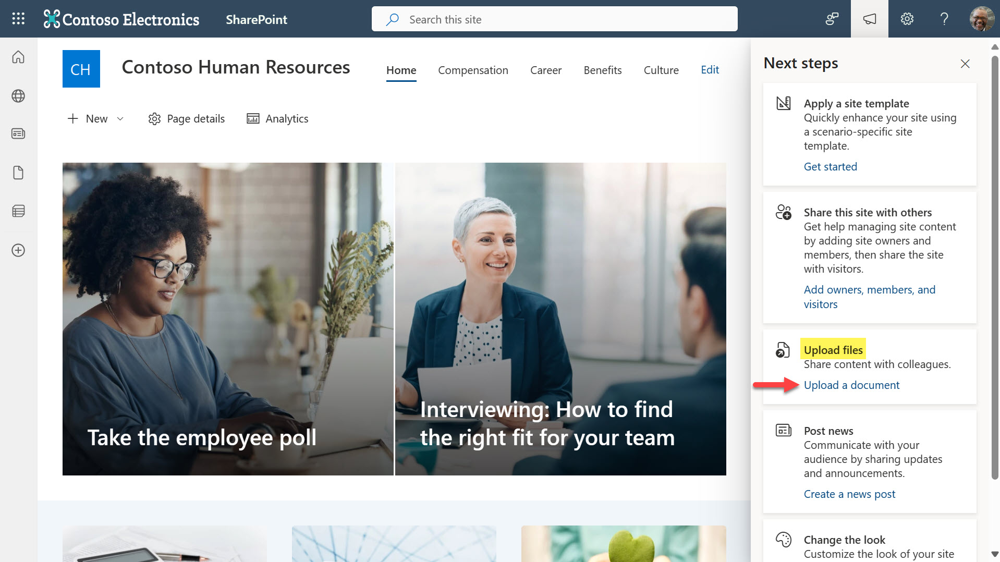

1. Download the [Contoso Employee Handbook PDF file](assets/Contoso%20Employee%20Handbook.pdf).

    

1. Then upload the Contoso Employee Handbook PDF file to the Documents library by selecting **Upload** and then select **Files**.

    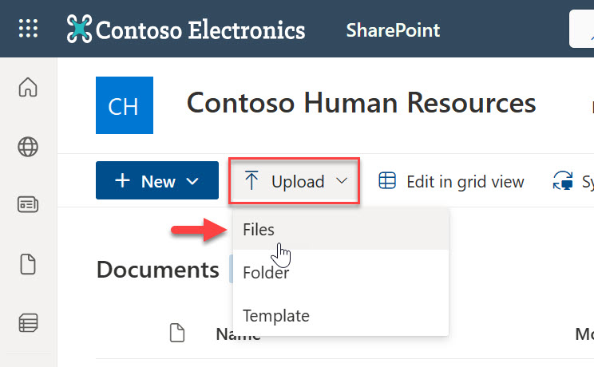

1. Windows file explorer will open, navigate to the path of the  **downloaded Contoso Employee Handbook PDF file** from step 11 and select **Open**. 

    

1. The file will be uploaded and the progress of the upload will be visible on the right hand side of the document library.

    

1. Confirmation of the uploaded file will be displayed.

    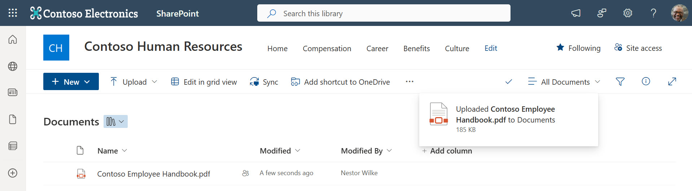

## 1.6 Copy SharePoint site URL
The SharePoint site URL will be referenced as an internal source in [Lab 02 - 2.2 Adding an internal source using a SharePoint site](../lab-02/README.md/#22-adding-an-internal-source-using-a-sharepoint-site)

1. Select the **CH icon** on the left hand side of the Documents library.

    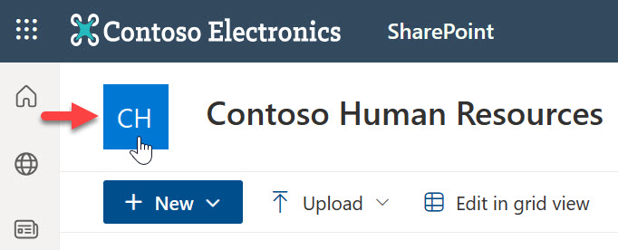

1. **Copy** the SharePoint site URL.

    

### Relaunch SharePoint Site

> [!NOTE]   
> You may have been redirected here from [Lab 02 - 2.2 Adding an internal source using a SharePoint site](../lab-02/README.md/#22-adding-an-internal-source-using-a-sharepoint-site) to copy the SharePoint URL.

1. If you happen to exit your Edge browser tab with the SharePoint site, select the **waffle icon** to view the menu and select **SharePoint**.

    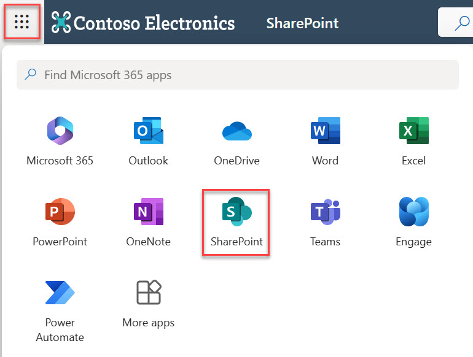

1. The SharePoint site will show under **Following** or **Recent** on the left hand side or **Frequent sites** in the middle.

    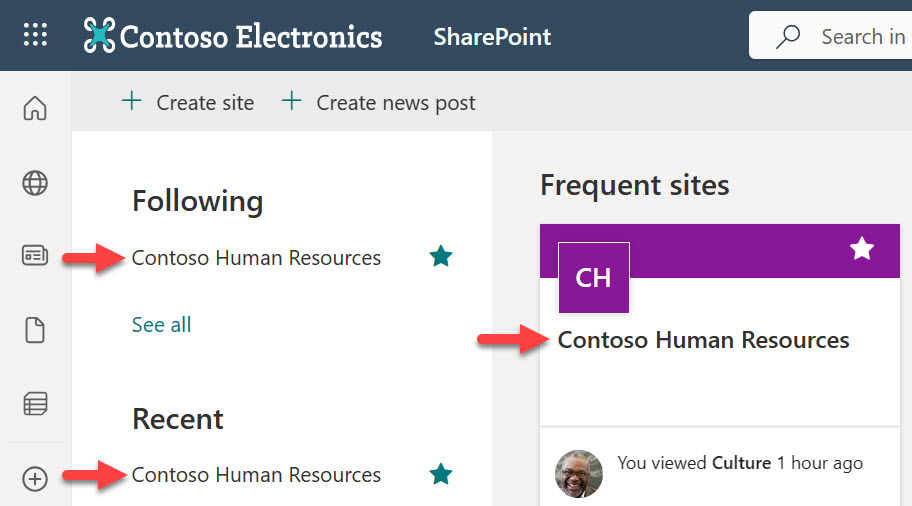

1. Select the SharePoint site and **copy the SharePoint URL**.

    

    [⏭️ Return to Lab 02 - 2.1 Create a custom copilot with an external source](../lab-02/README.md/#22-adding-an-internal-source-using-a-sharepoint-site)

## Next lab

Congratulations! 🎉 You've now created a developer environment to work in for building a custom copilot in Microsoft Copilot Studio and created a new SharePoint site that will be used as an internal source for generative answers in the next lab.

This is the end of Lab 01 - Tenant setup, select the link below to move to the next lab.

[⏭️ Move to Lab 02 - Build a custom copilot with Microsoft Copilot Studio and Generative Answers](../lab-02/README.md)