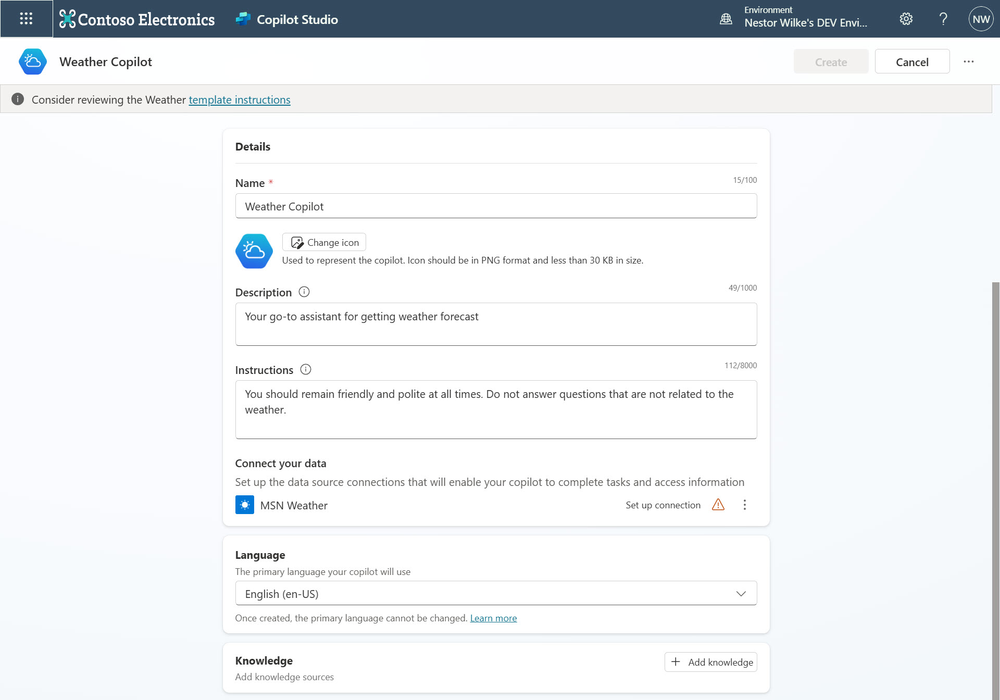
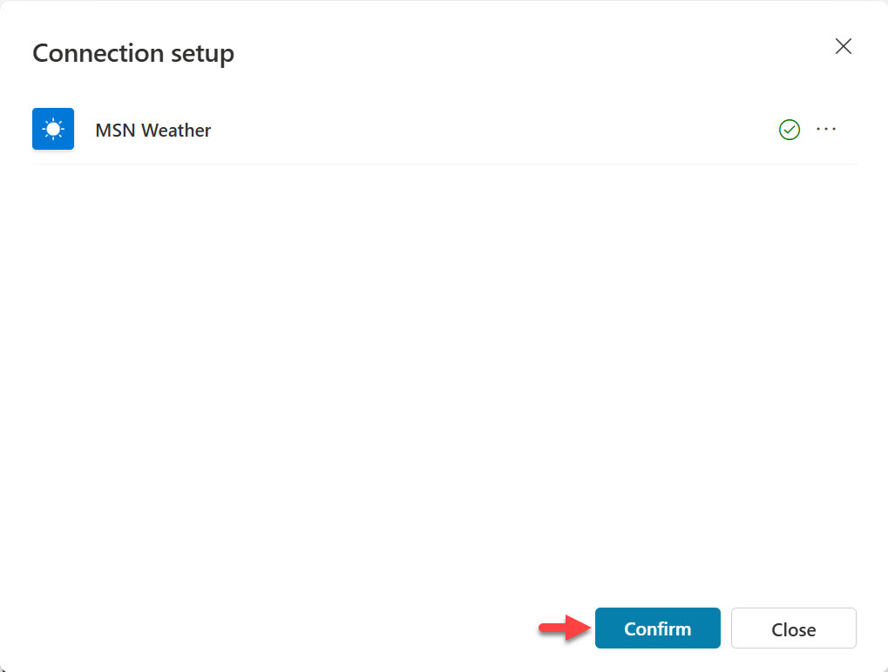
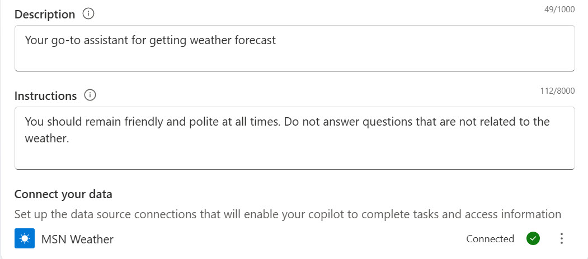
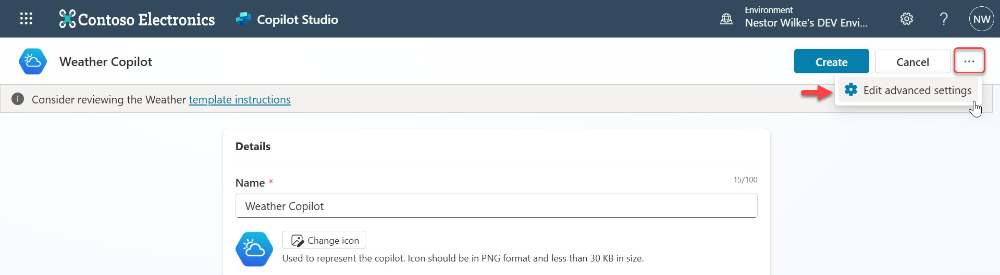
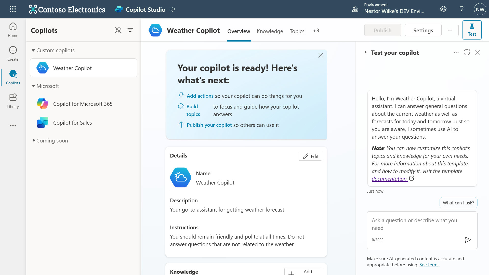
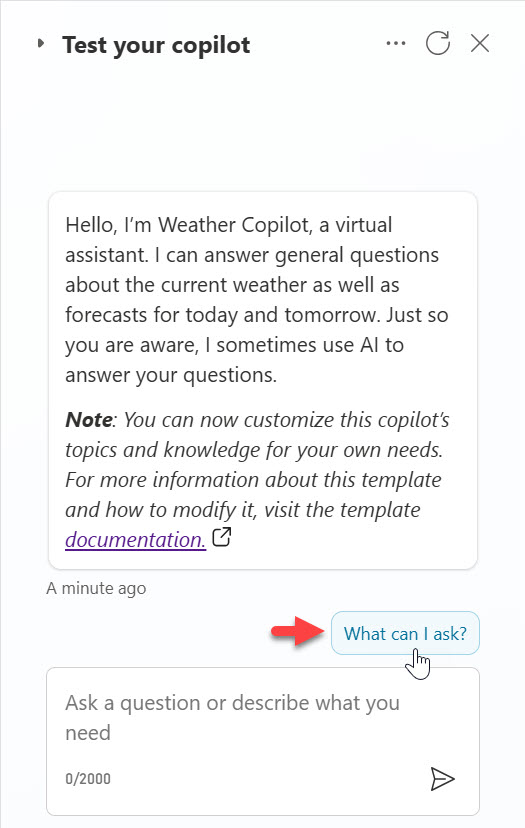
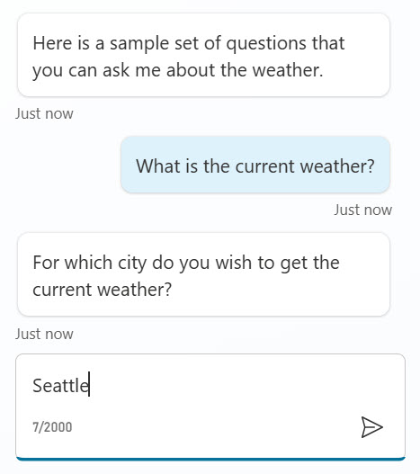
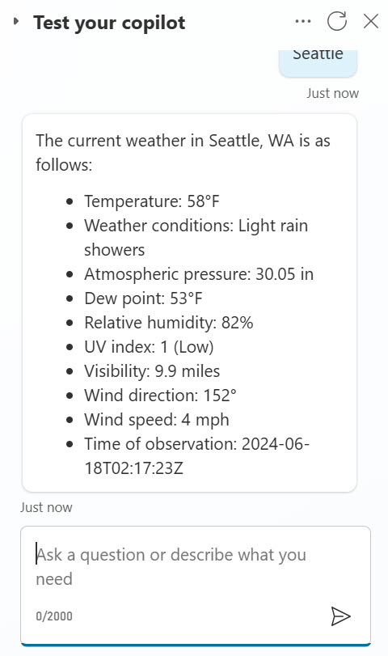
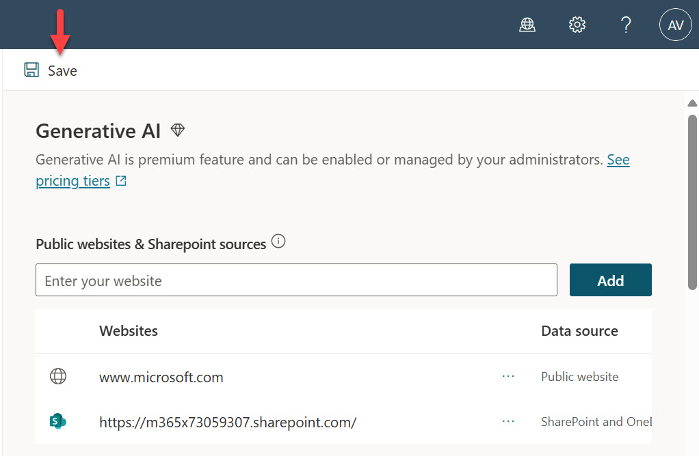
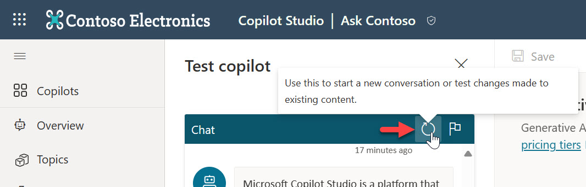

# Lab 02 - Build a custom copilot with Microsoft Copilot Studio and Generative Answers

Generative answers in Microsoft Copilot Studio allow your copilot to find and present information from multiple sources such as internal or external websites, and uploaded files, without created topics.

Generative answers can be used as primary information sources or as a fallback source when authored topics can't answer a user's query. Generative answers make your copilot valuable out-of-the-box and increase the number of topics your copilot is conversational in, without requiring any manual dialog tree authoring.

In this lab, you will learn how to do the following:
* [2.1 Available templates to create a custom copilot](#21-available-templates-to-create-a-custom-copilot)
* [2.2 Use natural language to create a custom copilot](#22-use-natural-language-to-create-a-custom-copilot)
* [2.3 Adding an internal source using a SharePoint site]


## 2.1 Available templates to create a custom Copilot

In this part of the lab, you will learn of the several templates available to quickly get started in creating your own custom copilot.
In the Home landing page of Microsoft Copilot Studio, you’ll see three areas
* Describe your copilot to create it – use natural language to build your copilot
* Templates – these are a preview feature and helps you get started in creating your copilot
* Learning resources – multiple resources for further learning

    

1. To start with a template, select the **Weather template**.

    
    
1.	You’ll see that the template already has some details filled in already

    - **Name** – the name of the copilot.
    - **Description** – describes the purpose of the Weather copilot and how it can help.
    - **Instructions** – the primary purpose of the Weather Copilot and how it should act.
    - **Connect your data** – authenticate to a Power Platform connector to enable Copilot to complete tasks and access information. In this template the MSN Weather connector is used.
    - **Language** – the primary language of the copilot.
    - **Knowledge** – add enterprise data from Power Platform, Dynamics 365 data, and external systems to enable Copilot to provide relevant information and insights for end users.
    
    

1.	Scroll down to **Connect your data**, select the ellipsis (. . .) and select **Edit**.

    

1.	The Connection setup window will appear and a green tick will appear to let you know that the MSN Weather connector is now authenticated using your credentials. Select **Confirm**.

    

1.	The status of the MSN Weather connector will now display as _Connected_ with a green tick.

    

1.	Next, take a look at the Advanced Settings of the Copilot by selecting the ellipsis **(. . .)** and select **Edit advanced settings**.

    

1.	This is where you can define the following settings,

    - **Solution** – select the solution to create your copilot in. This allows you to deploy the copilot to a target environment by exporting the solution. By default Common Data Services Default Solution will be selected.
    - **Schema Name** – by default this will be the name of your copilot. This is the unique name which can be used to embed or connect your copilot to other applications or services.
    - **Classic copilot** – there’s also an option to create a classic copilot which is not covered in this lab.
    
    

1.  Select Cancel to exit Advanced Settings.

1.  Select Create to create your Weather Copilot.

    

1.  Copilot Studio will be in the process of setting up the Weather Copilot and when complete, the Weather Copilot will be displayed in the center of Copilot Studio, followed by the testing pane on the right hand side.

    

1.  Scroll down and you’ll see that the Topics and Actions are already configured from the template, enabling you to quickly create a Weather Copilot.

    

1.  You can now test the Weather copilot using the right hand side pane. Select the _What can I ask?_ question to see a list of suggested questions to ask the Weather copilot.

    
    
1.  A list of questions will appear. Select _What is the current weather?_

    

1.  Enter a city for example,

    ```
    Seattle
    ```

    

1.  Copilot will respond with a summary of the current weather for the city entered.

    

OLD:

1.	You can now test your copilot by entering the following question,

    ```
    What is Copilot Studio?
    ```

1.	Copilot uses the external link, [www.microsoft.com](www.microsoft.com), to return an answer in plain natural language. Notice that there are references with a hyperlink to where the information is sourced from so that you can validate it. You can also provide feedback by selecting the thumbs down or thumbs up icons.

2.2_01_DescribeToCreate

Congratulations! 🎉 You’ve created a custom copilot using a template. Let’s next learn how to use natural language to build a custom copilot from scratch.

## 2.2 Use natural language to create a custom Copilot

You can now use a conversation first approach to create a custom Copilot where natural language is used to describe the custom Copilot that you’d like to create.

1.  Select Home on the left hand side menu and in the Describe your copilot to create it field, describe in natural language what your copilot should do. For example,

    ```
    I want you to be a question and answering copilot that can answer common questions from users using the content of a website and a SharePoint site
    ```

    

1. Microsoft Copilot Studio then proceeds to use AI to ask you several questions to define the Copilot you want to build. For example the first question may be based on how your copilot will assist users. You can either select _What should I say?_ which will provide guidance or you can enter and describe what you’d like your copilot to do. The following is an example,

    ```
    help answer common product and support questions using the content of a website, and help answer HR questions from a SharePoint site
    ```

    

1. The second question may be based on the tone of the Copilot. Again, a list of suggestions can be provided by selecting _What should I say?_

    

1.  A list of suggestions will appear for guidance. Enter a tone, for example,

    ```
    Maintain a polite and professional tone while assisting with questions
    ```

    

1.  Next question will be based on what external knowledge source the Copilot can refer to answer questions asked by users. A guide can be provided by selecting _Any tips?_

    

1.  Guidance will appear on adding websites for your Copilot. For example, enter the following,

    

//## 2.2 Adding an internal source using a SharePoint site

Next, you'll learn how to add an internal data source, SharePoint, for generative answers in your Copilot.

1. Navigate to **Update generative answers**.

    

1. Paste the SharePoint site URL from the SharePoint site you created earlier in the sources field and select **Add**.

    

> [!TIP]  
> To recopy the SharePoint site URL, head to the [⏪ previous lab](../lab-01/README.md/#relaunch-sharepoint-site) to copy the SharePoint site URL and return to this lab to proceed.

3. Select **Save**.

    

4.	Refresh the chat for the copilot.

    

5. We can now test copilot to confirm SharePoint is now a data source for generative answers. Select the refresh icon and enter the question, 

    ```
    What is the time off policy?
    ```

    This time Copilot uses the internal link [https://m365x73059307.sharepoint.com/](https://m365x73059307.sharepoint.com) to return the answer it found in a document in plain natural language. References are provided once again with a hyperlink to where the information is sourced from so that you can validate it.

    

6.	Try entering another question, 

    ```
    What holidays do Contoso employees have off?
    ```
    
    You’ll see another response from Copilot that uses the SharePoint data source to answer the question entered in plain natural language.

    

## Next lab

Congratulations! 👏🏻  You've created a copilot with external and internal data sources for Generative Answers. 

This is the end of Lab 02 - Build a custom copilot with Microsoft Copilot Studio and Generative Answers, select the link below to move to the next lab.

[⏭️ Move to Lab 03 - Create an AI Plugin using a Power Platform component for Generative Actions](../lab-03/README.md)