# Lab 02 - Build an agent with Microsoft Copilot Studio

Copilot Studio empowers teams to quickly and easily create powerful agents using a guided, no-code graphical experience without needing data scientists or developers.

There are several ways to create an agent
* Start with a template
* Describe your agent to create it using natural language

Each method allows you to connect your data and knowledge sources to enable your agent to access information and complete tasks.

In this lab, you will learn how to do the following:
* [2.1 Available templates to create an agent](#21-available-templates-to-create-an-agent)
* [2.2 Use natural language to create an agent](#22-use-natural-language-to-create-an-agent)
* [2.3 Adding an internal knowledge source using a SharePoint site](#23-adding-an-internal-source-using-a-sharepoint-site)

## 2.1 Available templates to create an agent

In this part of the lab, you will learn about how templates can help you quickly get started in creating your own agent.
In the **Home** landing page of Microsoft Copilot Studio, you’ll see three areas
* **Describe your copilot to create it** – use natural language to build your agent
* **Templates** – these are a preview feature and helps you get started in creating your agent
* **Learning resources** – multiple resources for further learning

    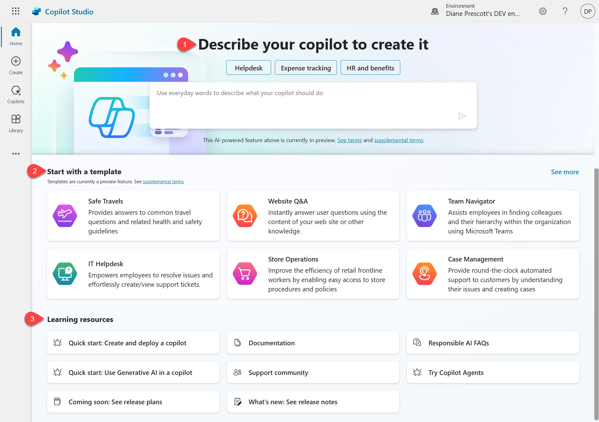

1. In the **Start with a template** section select **See more**.

    

1. Select the **Weather** template.

    
    
1.	You’ll see that the template already has some details filled in already

    - **Language** – the primary language of the agent.
    - **Name** – the name of the agent.
    - **Description** – describes the purpose of the Weather agent and how it can help.
    - **Instructions** – the primary purpose of the Weather agent and how it should act.
    - **Connect your data** – authenticate to a Power Platform connector to enable the agent to complete tasks and access information. In this template the MSN Weather connector is used.
    - **Knowledge** – add enterprise data from Power Platform, Dynamics 365 data, and external systems to enable the Weather agent to provide relevant information and insights for end users.
    
    

1.	Scroll down to **Connect your data**, select the ellipsis (**. . .**) and select **Edit**.

    

1.	The Connection setup window will appear and a green tick will appear to let you know that the MSN Weather connector is now authenticated using your credentials. Select **Confirm**.

    

1.	The status of the MSN Weather connector will now display as _Connected_ with a green tick.

    

1.	Next, take a look at the Advanced Settings of the agent by selecting the ellipsis **(. . .)** and select **Edit advanced settings**.

    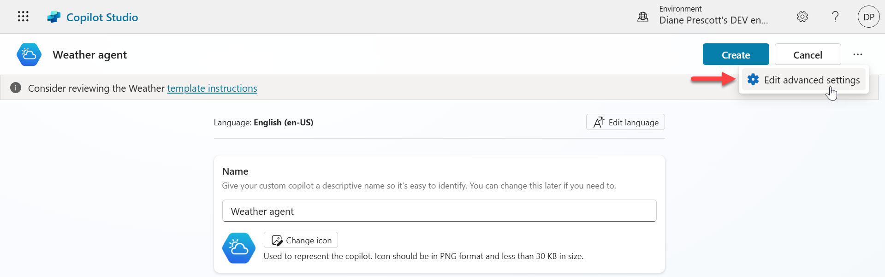

1.	This is where you can define the following settings,

    - **Solution** – select the solution to create your agent in. This allows you to deploy the agent to a target environment by exporting the solution. By default the _Common Data Services Default Solution_ will be selected.
    - **Schema Name** – by default this will be the name of your agent. This is the unique name which can be used to embed or connect your agent to other applications or services.
    - **Classic copilot** – there’s also an option to create a classic agent which is not covered in this lab.
    
    

1.  Select **Cancel** to exit Advanced Settings.

1.  Select **Create** to create your Weather agent.

    

1.  Copilot Studio will be in the process of setting up the Weather agent and when complete, the Weather agent will be displayed in the center of Copilot Studio, followed by the testing pane on the right hand side.

    

1.  Scroll down and you’ll see that the Topics and Actions are already configured from the template, enabling you to quickly create a Weather agent.

    

1.  You can now test the Weather agent using the right hand side pane. Select **What can I ask?** to see a list of suggested questions to ask the Weather agent.

    
    
1.  A list of questions will appear. Select **What is the current weather?**

    

1.  Enter a city for example,

    ```
    Seattle
    ```

    

1.  The Weather agent will respond with a summary of the current weather for the city entered.

    

🎓 You’ve created an agent using a template. Let’s next learn how to use natural language to build an agent from scratch.

## 2.2 Use natural language to create an agent

You can use a conversation first approach to create an agent where natural language is used to describe the agent that you’d like to create.

1.  Select **Home** on the left hand side menu and in the **Describe your copilot to create it** field, describe in natural language what your agent should do.

    For example,

    ```
    I want you to be a question and answering assistant that can answer common questions from users using the content of a website and a SharePoint site
    ```

    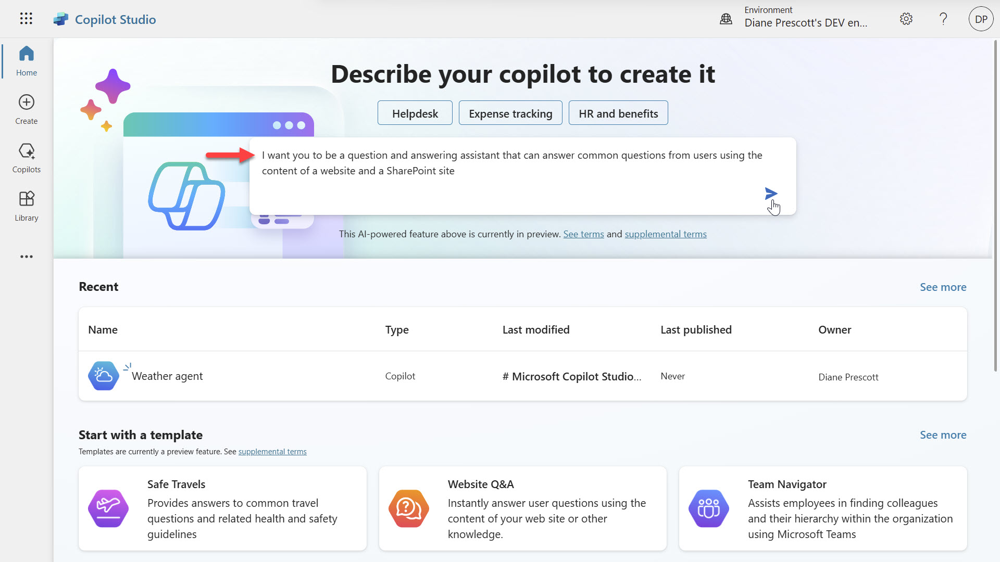

1. Microsoft Copilot Studio then proceeds to use AI to ask you several questions to define the agent you want to build. For example the first question may be based on how your agent will assist users.

    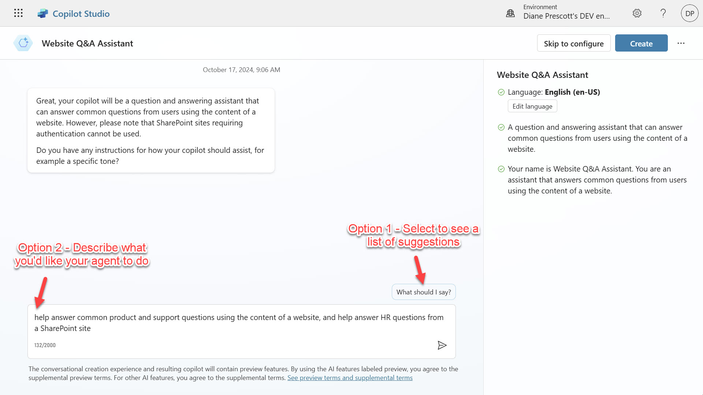

    You can either,
    
    - Option 1: select _What should I say?_ which will provide guidance, 
    - Option 2: or you can enter and describe what you’d like your agent to do. The following is an example,

    ```
    help answer common product and support questions using the content of a website, and help answer HR questions from a SharePoint site
    ```

1. The second question may be based on the tone of the agent. Again, a list of suggestions can be provided by selecting _What should I say?_

    

1.  A list of suggestions will appear for guidance. Enter a tone.

    For example,

    ```
    Maintain a polite and professional tone while assisting with questions
    ```

    

1.  Next question will be based on what external knowledge source your agent can refer to, to answer questions asked by users. A guide can be provided by selecting _Any tips?_

    

1.  A list of tips will appear on adding websites for your agent. Next enter a public facing website URL address. 

    For example, enter the following,

    ```
    www.microsoft.com
    ```

    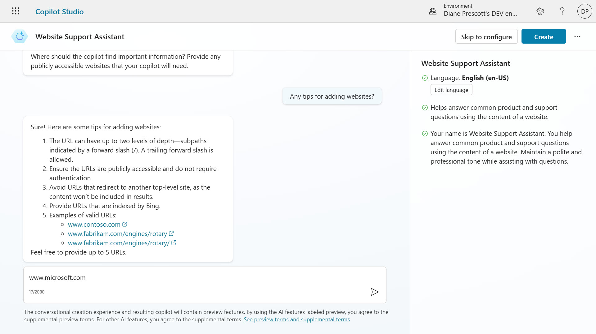

1. Next, you'll be asked whether you'd like to add more websites. Enter the following,

    ```
    No
    ```
    

1.  The final question will be based on what topics or tasks your agent should not help with. For example, enter the following,

    ```
    If asked religion or politics, politely decline to discuss and offer assistance with other inquiries.
    ```

    

1.  There are no further questions to answer but you can enter more details to make adjustments. 

    Notice how on the right hand side pane 
    - your agent has automatically been given a name
    - all your requirements for the agent you want to create are listed, this was based on the natural language entered to answer the questions asked by AI in creating an agent for you

    

1.  Before creating your agent, there’s also the options of

    - **Skip to configure** – where you exit from this conversation first approach and create an agent by not answering questions
    - Select the ellipsis for additional options  (**. . .**) 
        - **Restart copilot creation** – clears all answers in response to the question asked and starts at the beginning.
        - **Edit advanced settings** – update the solution and schema name as previously covered in [2.1 Available templates to create an agent](#21-available-templates-to-create-an-agent).
        - **Cancel copilot creation** – cancels creating the agent.

    

1.  Select **Create** to create your agent.

    

1. Copilot Studio will be in the process of setting up your agent.

    

1.  When the setup is completed, the agent will be displayed in the center of Copilot Studio, followed by the testing pane on the right hand side. You'll see the **Name**, **Description** and **Instructions** used for your agent.

    

1.  If you scroll down, you’ll see the knowledge source with the public website already configured. You can now test your agent by entering the following question,

    ```
    What is Copilot Studio?
    ```
    

1. The agent uses the external link previously provided, _www.microsoft.com_, to return an answer in plain natural language. Notice that there are references with a hyperlink to where the information is sourced from so that you can validate it. You can also provide feedback by selecting the thumbs up or thumbs down icons.

    Try asking another question,
    
    ```
    What is the latest Xbox model?
    ```

    

    The agent will respond again using information from the external link, _www.microsoft.com_
    
    

    This is useful because it allows you to build agents using existing information rather than creating specific topics to cater for user requests.
    
🎓 You've created an agent using natural language and can answer questions based on the website provided. Let's learn how to add an internal resource.

## 2.3 Adding an internal source using a SharePoint site

Knowledge in Microsoft Copilot Studio allows you to add enterprise data from Power Platform and external systems, to enable your agents in providing relevant information and insights to your end users. In addition, knowledge can be incorporated with [generative answers](https://learn.microsoft.com/en-us/microsoft-copilot-studio/knowledge-copilot-studio#add-and-manage-knowledge-for-generative-answers) in agents. Published agents that contain knowledge use the configured knowledge sources to ground the published agent.

Next, you'll learn how to add an internal data source, SharePoint, for generative answers.

1. In the **Overview** tab of your agent, scroll down to the **Knowledge** section and select **+Add Knowledge**.

    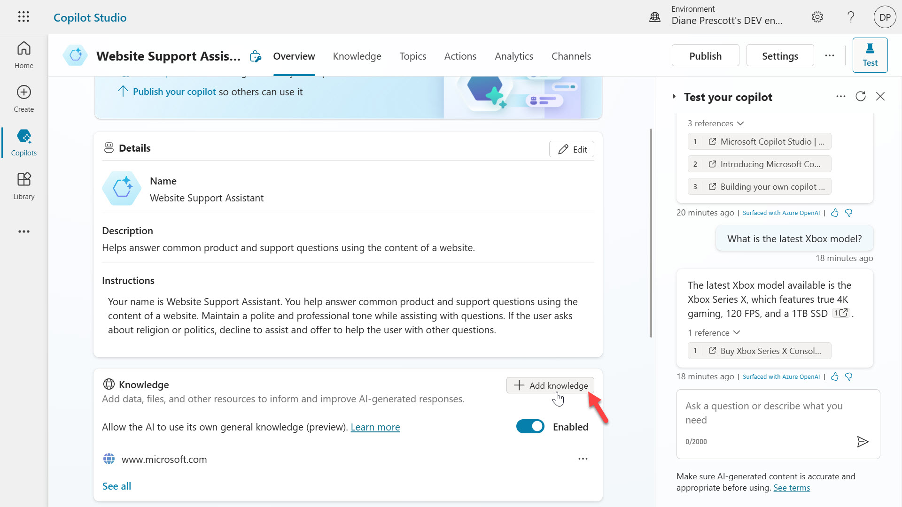

1. A list of knowledge sources will appear. Select **SharePoint**.

    

1.  Paste the SharePoint site URL from the SharePoint site you created earlier in the sources field and select **Add**.

    

> [!TIP]  
> To recopy the SharePoint site URL, head to the [⏪ previous lab](../lab-01/README.md/#relaunch-sharepoint-site) to copy the SharePoint site URL and return to this lab to proceed.

4.  The SharePoint site is added as a Knowledge Source. Please note that the SharePoint Site will only be available to authenticated end-users, [learn more](https://learn.microsoft.com/en-us/microsoft-copilot-studio/nlu-generative-answers-sharepoint-onedrive). Select **Add**.

    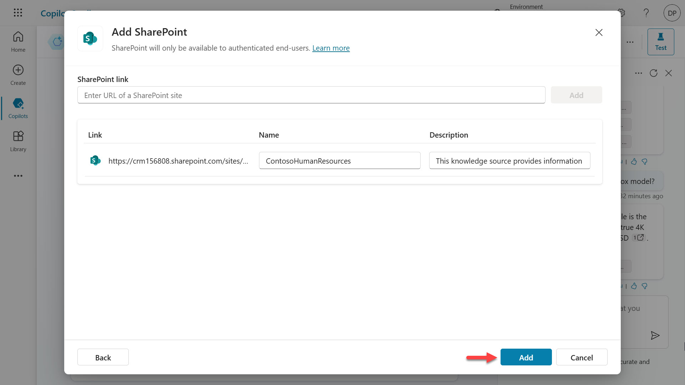

1.  The SharePoint site has now been added as a knowledge source for the agent.

    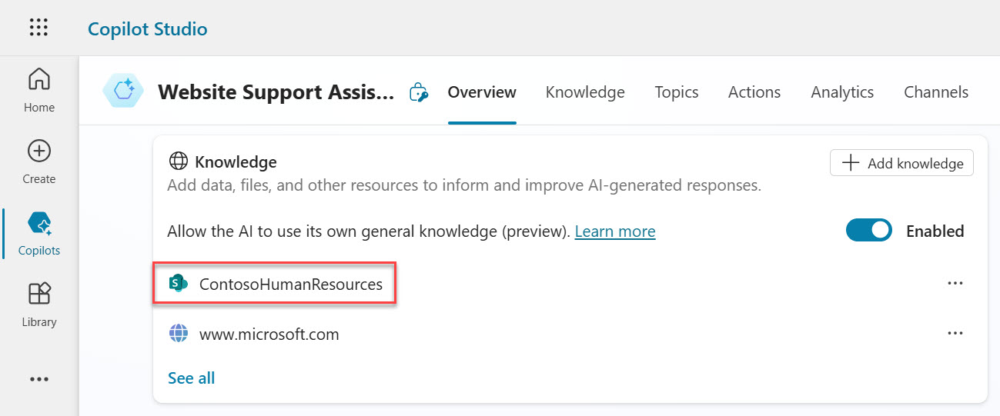

1.  We can now test the agent to confirm SharePoint is now a data source for generative answers. Select the **Refresh** icon in the **Test your agent** pane.

    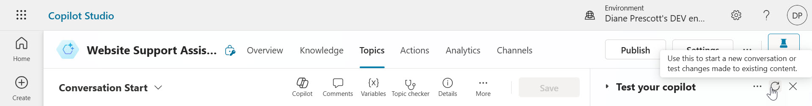

1. Next, select the **ellipsis** icon (**. . .**) and select the **Track between topics** to follow the agent conversation step by step. Notice how the _Conversation Start_ system topic is dipslayed as it was triggered.

    

1. Next, enter the following question to test the agent.

    ```
    What happens if I'm sick and cannot work?
    ```
    
    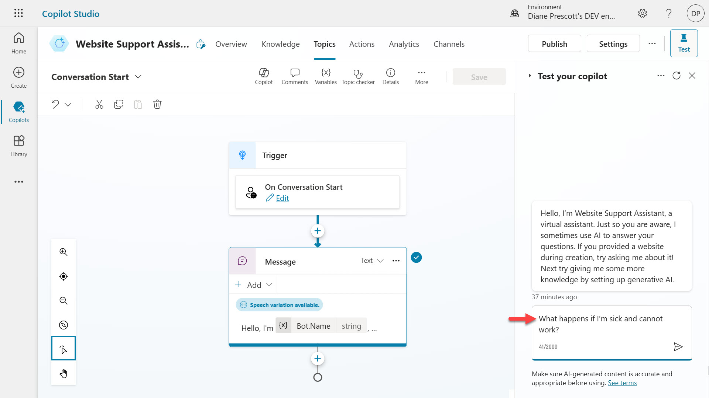

1.  A response is returned in natural language using the information retrieved from the uploaded document in the SharePoint site. 

    - References are provided again with a hyperlink to where the information is sourced from so that you can validate it. 
    - You can also see that the _Conversational boosting Topic_ was called and the generative answers node succeeded in using the provided knowledge sources to answer the question.

    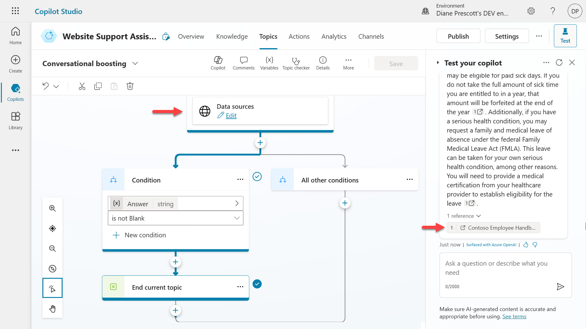

1.  Try entering another question, 

    ```
    What holidays do Contoso employees have off?
    ```

    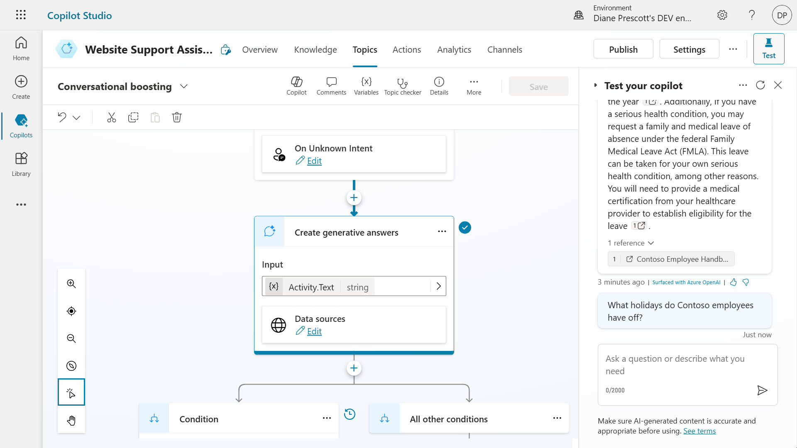

1.  You’ll see another response from your agent that uses the SharePoint data source to answer the question entered in plain natural language.

    

## Next lab

Congratulations! 👏🏻  You've configured your agent with external and internal data sources for [generative answers](https://learn.microsoft.com/en-us/microsoft-copilot-studio/knowledge-copilot-studio#add-and-manage-knowledge-for-generative-answers). 

This is the end of Lab 02 - Build an agent with Microsoft Copilot Studio, select the link below to move to the next lab.

[⏭️ Move to Lab 03 - Create a Prompt action for a Topic for generative answers](../lab-03/README.md)