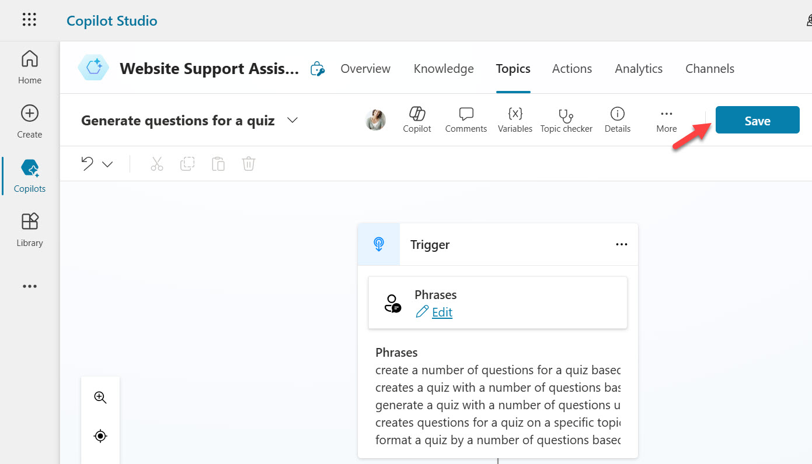
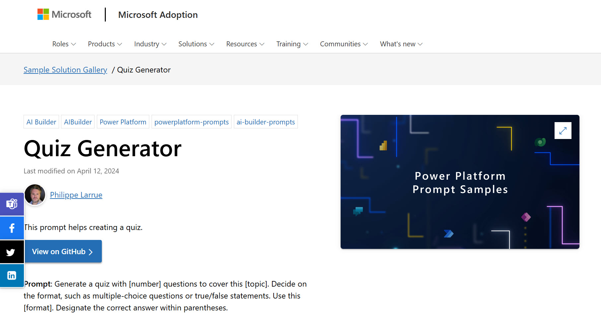
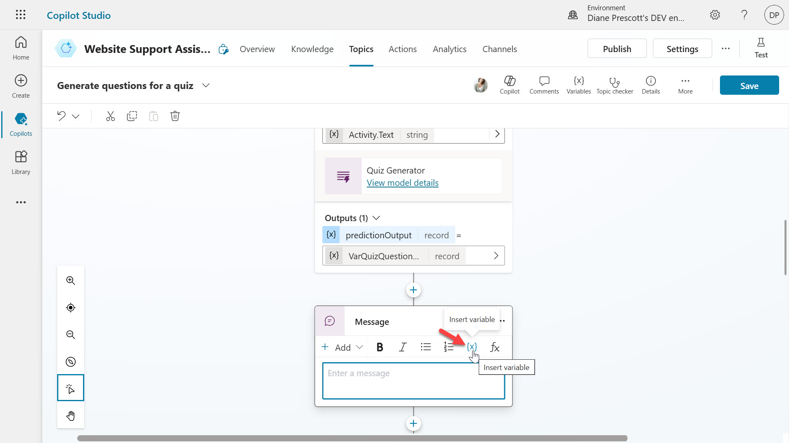

# Lab 03 - Create a Prompt action using a Power Platform connector for generative responses

Actions can be used to extend the capabilities of agents. You can add multiple types of actions to your agents in Microsoft Copilot Studio:
- **Prebuilt connector action**, which use Power Platform connectors to access data from other systems, such as popular enterprise products like Salesforce, Zendesk, MailChimp, and GitHub.
- **Custom connector action**, where a connector can be built to access data from public or private APIs.
- **Power Automate cloud flow**, which use Power Automate flows to perform actions, and retrieve and work with data.
- **AI Builder prompts**, which use AI Builder and natural language understanding to target the specific scenarios and workflows within your business.
- **•	Bot Framework skill**, which use the skill manifest that outlines the actions the skill can perform, including its input and output parameters, the skill's endpoints, and dispatch models for the skill.

In this lab, you will learn how to do the following:
* [3.1 Add a prompt to a topic node](#31-add-a-prompt-action-to-a-topic-node)

## 3.1 Add a prompt action to a topic node

In this part of the lab we’ll be creating a **prompt action** in a topic., which is the **Generate content or extract insights** action from the AI Builder connector.

Prompt actions in topics help guide the agent's response in a semi-scripted conversation by using the generative AI models from AI Builder and natural language understanding to address specific scnarios for your agents.

For this lab, we'll add a Topic that calls a prompt action to generate questions for a quiz.

1.	In your agent select the **Topics** tab, select **+ Add a topic** and select From blank.

    

1. Enter a **name** for the Topic such as `Generate questions for a quiz` and select the **Edit** hyperlink under Phrases in the trigger. A minimum of 5 trigger phrases needs to be entered and you can enter them in bulk by pasting in line-separated items and then select the **+** icon to add the phrases.

    The following is an example that can be copied and pasted.

    ```
    create a number of questions for a quiz based on a topic and format the quiz based on the instruction provided
    creates a quiz with a number of questions based on the topic provided and formats the quiz
    generate a quiz with a number of questions using the topic provide and format the questions
    creates questions for a quiz on a specific topic and format
    format a quiz by a number of questions based on the topic provided
    ```  

    

1. Select **Save** on the top right of the authoring canvas to save the Topic.

    

1. Under the trigger node, select the **+** icon and select the Call an action node, followed by selecting Create a prompt.

    

1.  The Prompt dialog will appear, and you may see a flyout appear that will guide you on how to create your prompt. Select **Next** to go through the guide.

    

1. Let's take a moment to familiarize ourselves with the Prompt dialg. You’ll see the following:
    - **Name** of the prompt on the top left
    - **Prompt settings** on the right hand side which contains
        - **Input** where the inputs parameters for the prompt can be added or deleted.
        - **Data used (preview**) where you can use your own data from Dataverse tables in a prompt.
        - **Output** where you define the response to be returned as text or JSON (preview).
        - **Settings** where you define the GPT model to be used for generating responses and the temperature slider allows you to select the temperature to control the randomness of the output generated by the AI model, [learn more](https://learn.microsoft.com/en-us/ai-builder/prompt-modelsettings).
    - **Prompt** on the top left hand side which is where you can enter your prompt. You can also start by using the suggested prompts, and test the prompt.
    - **Prompt response** on the bottom left hand side which displays the response generated based on the prompt.

    

1.	Enter a name for the prompt such as `Quiz Generator` 

    

1.	Instead of creating a custom prompt from scratch or using a template, a prompt from the [**Power Platform Prompt Samples**](https://aka.ms/power-prompts) library can be used. In a new browser tab, navigate to [https://aka.ms/power-prompts](https://aka.ms/power-prompts) and filter to _AI Builder_ by ticking the checkbox on the left hand side.

    

1.	Select the [Quiz Generator Prompt](https://adoption.microsoft.com/en-us/sample-solution-gallery/sample/pnp-powerplatform-prompts-quiz-generator/). This prompt will generate a quiz based on three input parameters, 
    - number which is the number of questions
    - topic which is the topic of the quiz
    - format which is the output format of the questions

    Copy the prompt.

    

1.	Go back to the action in Copilot Studio. Paste the copied prompt value in the Prompt box on the top left hand side.

    

1.	Expand the **Input** section and select **+ Add input**.

    

1.	Enter a name for the first input of `number` and enter sample data such as `5`

    

1.	Repeat the same for the second and third input of topic and format. Make sure you provide sample data.

    

1.	Next, the inputs needs to be inserted into the prompt. In the Prompt, highlight **[number]** and select **+ Insert** and select **number**. The input of number has now been added to the prompt as an input. Repeat the same steps for the remaining inputs.

    

1. Test the prompt before saving the custom prompt. Select **Test prompt** and a response to the prompt regarding the values provided in the sample data of the input is returned. You can also **maximize** the prompt response box to enlarge the prompt response dialog.

    

1. Since we're not covering Dataverse in this workshop, the **Data used (preview)** does not need to be updated in the **Prompt settings**. The **Output** can be left as the default which is Text, and the **Settings** can be left as the default.

    Let's now save the prompt by selecting **Save custom prompt**

    

1. The prompt action node will now appear in the authoring canvas of the Topic. Next, the values of the input parameter need to be defined in order for the agent to populate them. This value can be 
    - a literal value
    - an existing variable (custom, system or environment) 
    - a Power Fx formula that could also reference existing variables.

    Select the **>** icon

    

1. Select the **System** tab and select the **Acivity.Text** as the input value for the action to use the user’s entire response and identify the format value.

    

1. Repeat the same for the remaining input parameters of the prompt action.

    

1. Next, we need to define the output variable of the prompt action. This is so that the response can be referenced downstream in the topic. Select the **>** icon and in the **Custom** tab, select **Create new**

    

1. A new variable named `Var1` appears as the vairable output. Select the variable and the variable properties pane will appear. Enter a variable name such as `VarQuizQuestionsResponse`

    

1. Below the Prompt action, select the **+** icon to add a new node and select **Send a message**. Select the **{x}** variable icon.

    

1. Select the variable **VarQuizQuestionsResponse.text**. This will add the text property of the prompt action response to the send a message node.

    

1. Select **Save** to save your topic.

1. The Topic details needs to be updated next which will be used by your agent to associate the topic with the user's intent when [Generative mode](https://learn.microsoft.com/en-us/microsoft-copilot-studio/advanced-generative-actions#how-does-generative-mode-work) is enabled. Select **Details** and for the **Display name** enter the following

    ```
    generate questions for a quiz
    ```

    For the **Description** enter the following

    ```
    This topic creates questions for a quiz based on the number of questions, the topic and format provided by the user
    ```

    

1. Select **Save** to save your topic.

1. Lastly, the [Generative mode](https://learn.microsoft.com/en-us/microsoft-copilot-studio/advanced-generative-actions#how-does-generative-mode-work) setting needs to be enabled for the agent to call the topic with the prompt action. Select **Settings** for your agent.

    

1. Select the **Generative AI** setting and select **Generate (preview)** followed by selecting **Save**.

    

1. Great, we're now ready to test the agent. In the test pane, select the **refresh** icon. Then enter the following question,

    ```
    Create 5 questions for a quiz based on geography and format the quiz as multi choice
    ```

    

1. A response is returned where 5 questions have been provided with the answers on the topic of geography and is formatted as multi choice questions.

    

## Next lab

Congratulations! 🙌🏻 You’ve now learnt how to create a prompt action for a topic by creating a custom prompt with one of the Power Platform Prompt samples.

This is the end of Lab 03 - Create a Prompt action using a Power Platform connector for generative responses, select the link below to move to the next lab.

[⏭️ Move to Lab 04 - Create a custom topic with a prompt action for generative responses](../lab-04/README.md)

