# Lab 04 - Create a custom topic with a prompt action for generative responses

A prompt action can also be executed inside of a Topic to create a controlled user experience and add further logic and/or processing of the copilot. The prompt action can be added as an action inside the authoring canvas.

In this lab, you will learn how to do the following:
* [4.1	Adding the prompt action to a Topic](#41adding-the-prompt-action-to-a-topic)

## 4.1	Adding the prompt action to a Topic

In this part of the lab you’ll learn how to add the prompt action created earlier to a Topic.

1.	In your copilot select the **Topics** tab, select **+ Add a topic** and select **From blank**.

    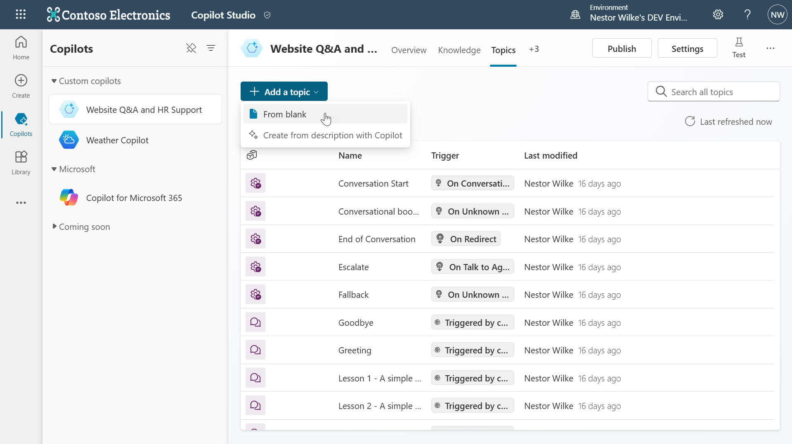

1.	Enter a name for the Topic such as Generate questions for a quiz and in the description of the Trigger, enter 5 trigger phrases. 

    Example: 

    ```
    Create a number of questions for a quiz based on a topic and format the quiz based on the instruction provided, creates a quiz with a number of questions based on the topic provided and formats the quiz, generate a quiz with a number of questions using the topic provide and format the questions, creates questions for a quiz on a specific topic and format, format a quiz by a number of questions based on the topic provided
    ```  
    

1.	Select **Save** on the top right of the authoring canvas to save the Topic.

    

1.	Select Details on the top right and in the Topic details tab enter the following information,

    | Field | Value |
    | --- | --- |
    | Name | Generate questions for a quiz |
    | Display Name | Generate questions for a quiz |
    | Description | Generate questions for a quiz based on the topic provided and the format requested |

    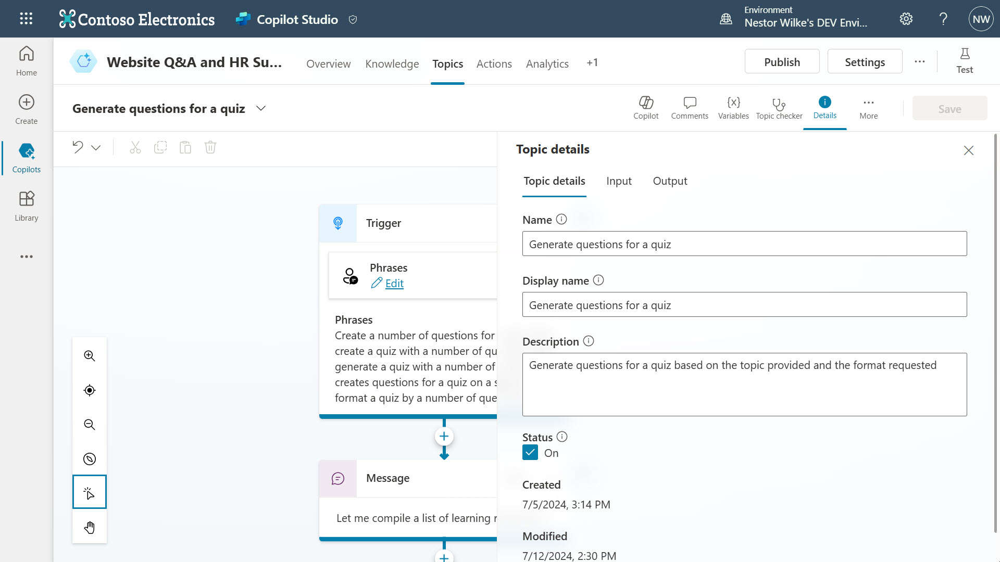

1.	Next, we’ll display a message to let the user know that copilot will go ahead and perform an action. Select the **+** icon in the authoring canvas to add a new node. Select **Send a message**.

    

1.	Enter a message such as,
    
    ```
    Let me compile a list of questions for you, one moment please.
    ```

    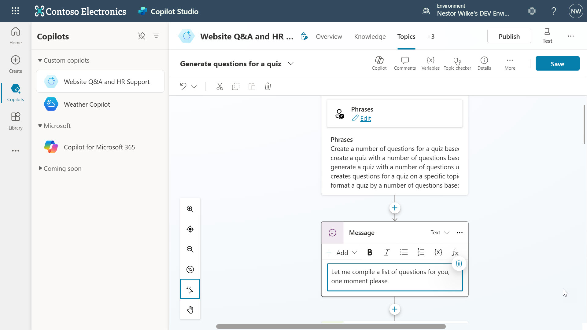

1.	Select the **+** icon in the authoring canvas to add a new node. This time select **Call an action** and select the **Plugin (preview)** tab. The prompt action created earlier will be displayed, select it.

    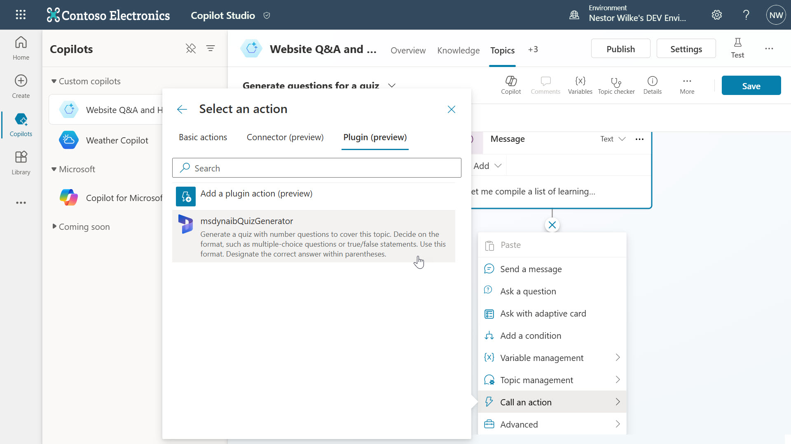

1. The plugin action will be added to the authoring canvas with the outputs already configured. The input will need to be added. Select **+ Set value** and select **format**.

    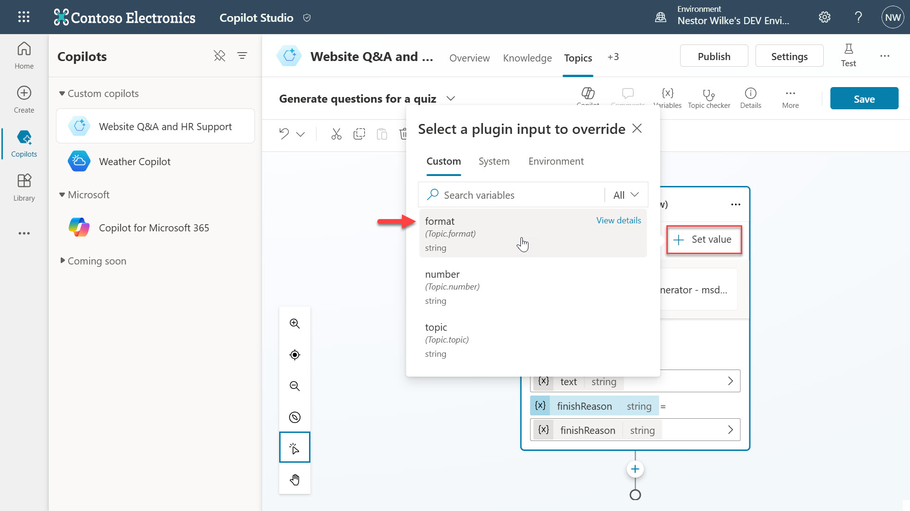

1.  Select the **>** icon and in the **System** tab select **Activity.Text** as the input value for the action to use the user’s entire response and identify the format value.

    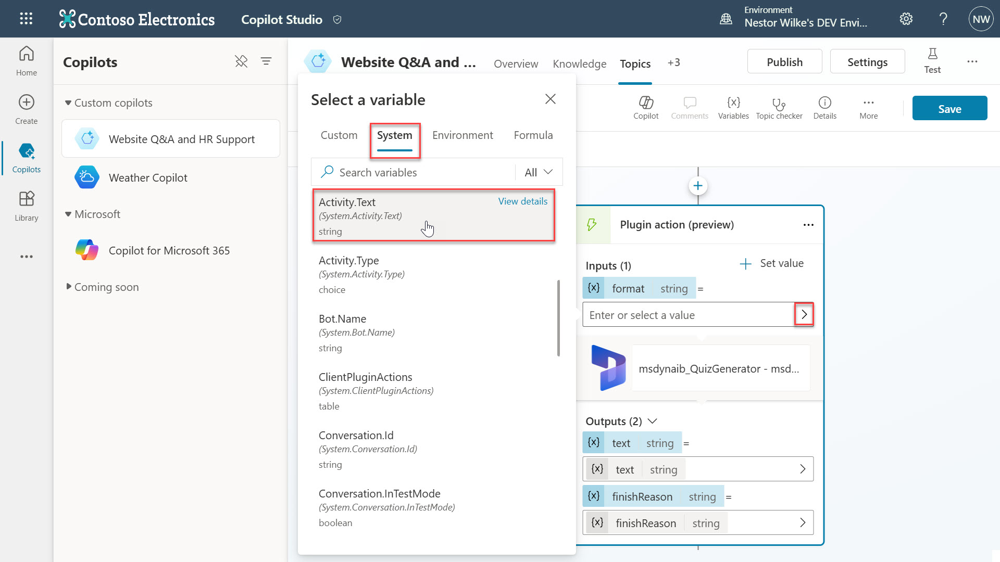

1.  Repeat the same steps for the other two inputs of **number** and **topic**.

    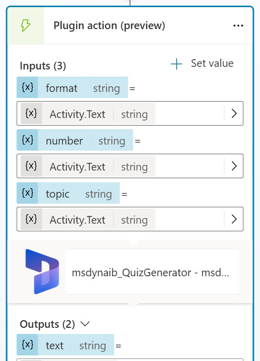

1.  Next the setting needs to be updated to Classic to trigger Topics and process the actions within topics. Select Settings on the top right.

    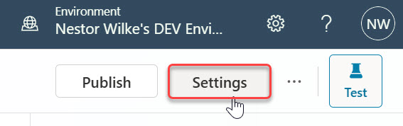

1.  In the Generative AI settings, select Classic and select Save.

    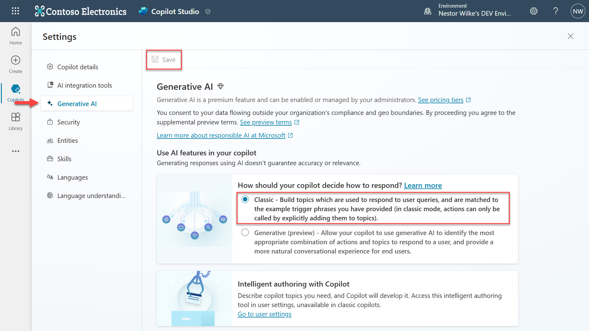

1.  Exit from Settings by selecting X icon on the top right and select the Test on the top right to load the testing pane. Enter the following prompt and submit the prompt,

    ```
    Create 5 questions for a quiz based on geography and format the quiz as multi choice
    ```

    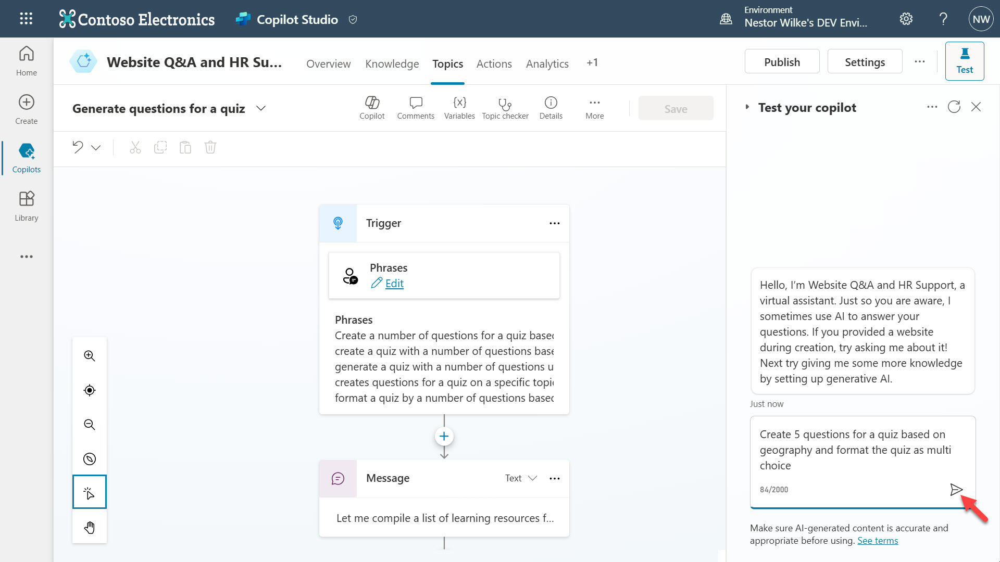

1.  The Topic will be triggered and the action will be called inside of the topic. A response is returned using the prompt action.

    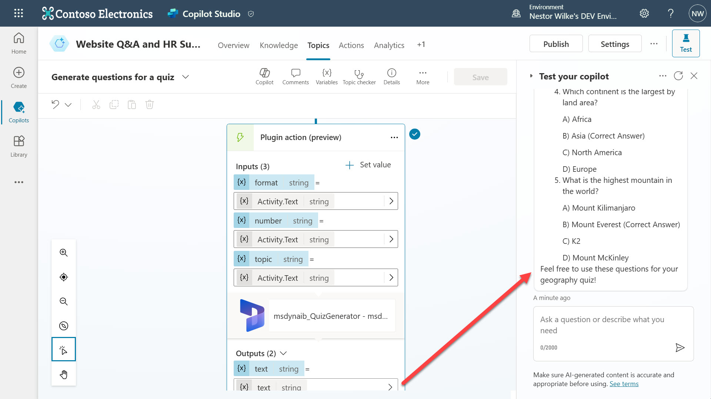

## Next lab

Congratulations! 🥳 You created a custom topic and added the prompt plugin created in [lab 02](../lab-02/README.md) as a plugin action.

This is the end of Lab 04 - Create a custom topic with a plugin action for Generative Action, select the link below to move to the next lab.

[⏭️ Move to Lab 05 - Automation in copilot with Power Automate cloud flows](../lab-05/README.md)
