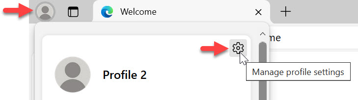
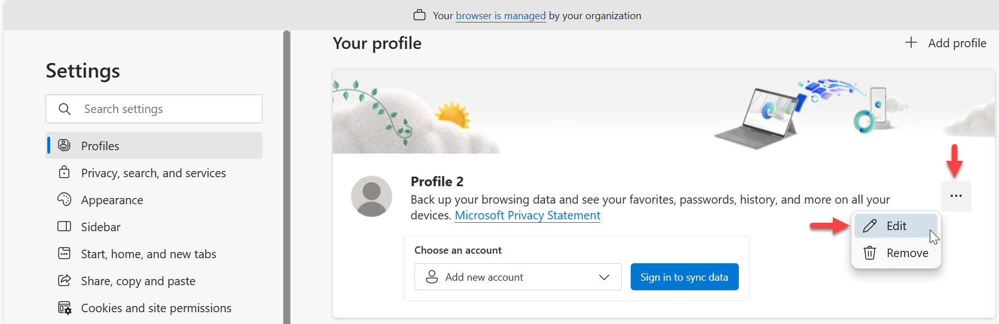
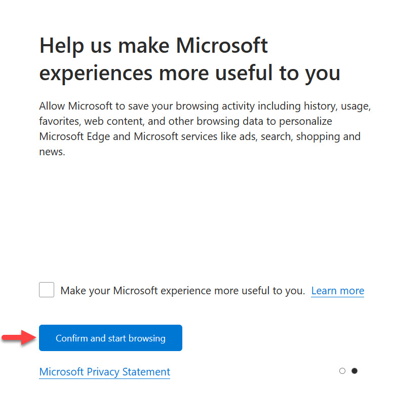
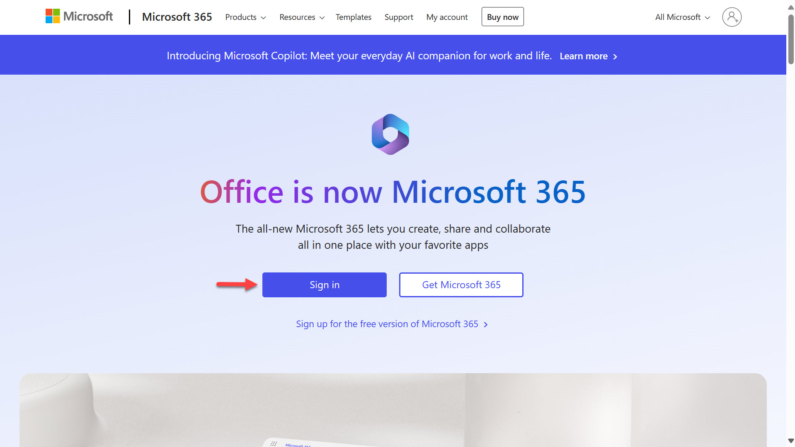
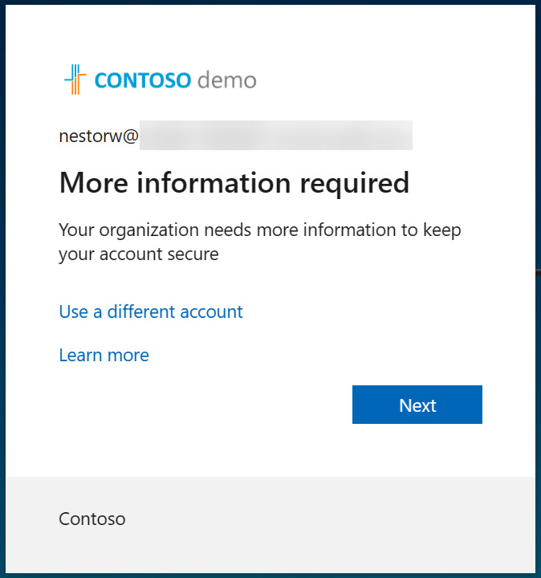
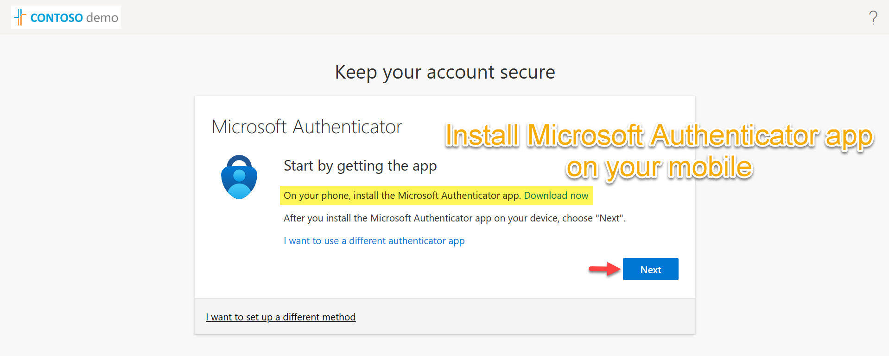
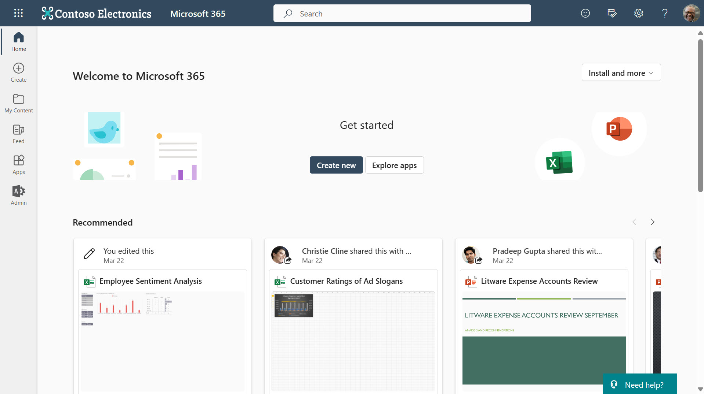

# Lab 01 - Tenant setup

In this lab, you will go through the following tasks:

* Creating a new browser profile
* Logging into the user account you are going to use during the workshop
* Creating a developer environment
* Select the developer enivronment to work in
* Create a SharePoint site and upload a file into a document library

## Task 1: Create a new browser profile (Microsoft Edge)

It's always good to have a separate browser profile for your work and for workshops like this. This way you can keep all of your credentials separate and not have to worry about logging out of your personal / work accounts.

1. Open Microsoft Edge.
1. Select the **profile icon** on the top left corner and select **+ Set up new personal profile**

    

1. This will launch a new browser window on your taskbar with a new tab that displays "Welcome to Microsoft Edge." Select the **profile icon** on the top left corner again, and this time select the cog wheel icon to update the Edge profile settings.

    

1. A new browser tab will load. In the **Profiles** settings, select **Edit**.

      

1. Enter a name for your new Edge profile - _Example: Nestor Wilke - CS workshop_, and select **Update**.

      

1. Close the tab and in the Edge Welcome tab, select **Start without your data**.

    

1. Next, select **Confirm and start browsing**.

    

1.   Next, you can configure your new browser theme. Keep it as the system default and select **Finish**.


## Task 2: Log on to your account

With the credentials that were provided to you, log into the account you are going to use during the workshop.

1. Browse to [https://www.office.com](https://www.office.com) and select **Sign in**.

    

1. On the sign-in screen, enter the email address that was provided to you and then click **Next**.

    

1. Enter the password and click **Sign in**.

    

1. A dialog will appear and this is where you'll need to set up your account as an authenticated account in the Microsoft Authenticator app on your mobile device. This is required to authenticate yourself in order to sign-in. Select **Next**.

    

1. Install the Microsoft Authenticator app on your mobile if you don't already have through the **Apple App store** for iOS devices or **Google Play** store for Android you're prompted to stay signed in, click **Yes**.

    

1. Open the Microsoft Authenticator app on your **mobile phone**, select the **+ icon** and select **Work or school account**.

1. On your Edge browser, select Next.

    

1. Scan the **QR code** on your Edge browser using the **Microsoft Authenticator app** on your mobile phone. 

    

1. A notification from the Microsoft Authenticator app will appear on you mobile phone, this is to approve the sign in request. Enter the number seen on your Edge browser.

    

1. Once approved, a dialog will appear asking you to remain signed in. **Tick** the checkbox and select **Yes**.

    

1. You'll now be logged onto Microsoft 365 with your user account.

    

## Task 3: Create developer environments

Developer environments are very helpful when you want to try out features, they are meant to be short living environments.

For this workshop, we are going to create one developer environment:

* ```[Username]'s  Developer Environment```: The environment where you'll build your custom copilot.

To create developer environments, you can create them in three ways:

* Via the [Power Apps Developer Plan Sign Up](https://www.microsoft.com/en-us/power-platform/products/power-apps/free) process
* Via the Power Platform Admin Center
* Via the Power Platform CLI

In this workshop, we will create the environments through the Power Platform Admin Center.

1. Browse to the [Power Platform Admin Center](https://aka.ms/ppac). If you see the _Welcome / Tour pop up_, exit by by clicking on the **X** in the top right corner of the pop up screen.

    

1. Select **Environments** in the left hand side menu and select **+ New**.

    

1. When the right-hand side dialog pops up - enter the following information:

    | Field | Value |
    | --- | --- |
    | Name | [Username]'s  DEV Environment - _Example: Nestor Wilke's DEV Environment_|
    | Region | United States - Default |
    | Type | Developer |
    | Purpose | Developer environment for Copilot Studio workshop |

    

1. Scroll down and you'll see other options, leave them as-is, **do not upate**.

     using the username and credential provided.

2.	Switch to the developer environment for your account by selecting the cog wheel on the top right.

    

## Next lab

This is the end of lab 01, select the link below to move to the next lab.

[⏭️ Move to lab 02](../lab-02/README.md)