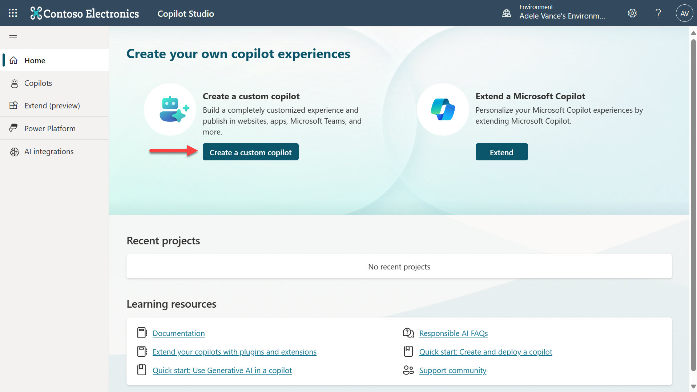
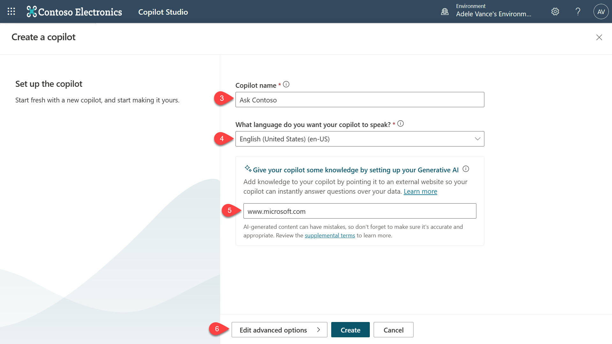
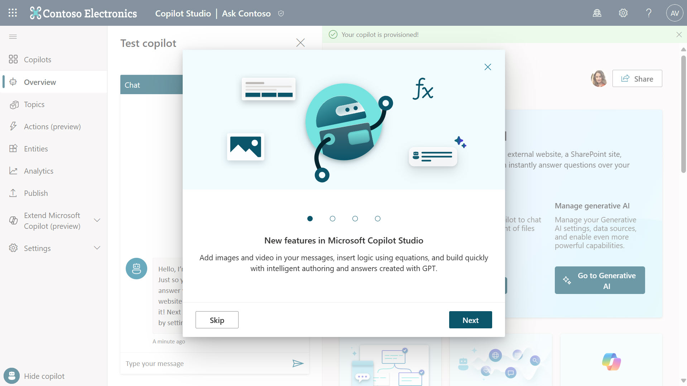
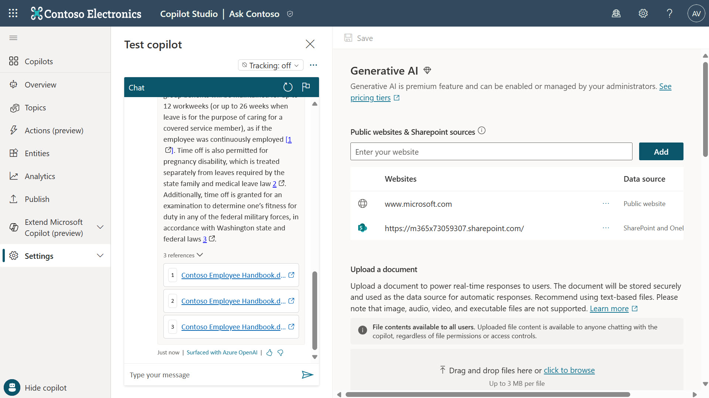
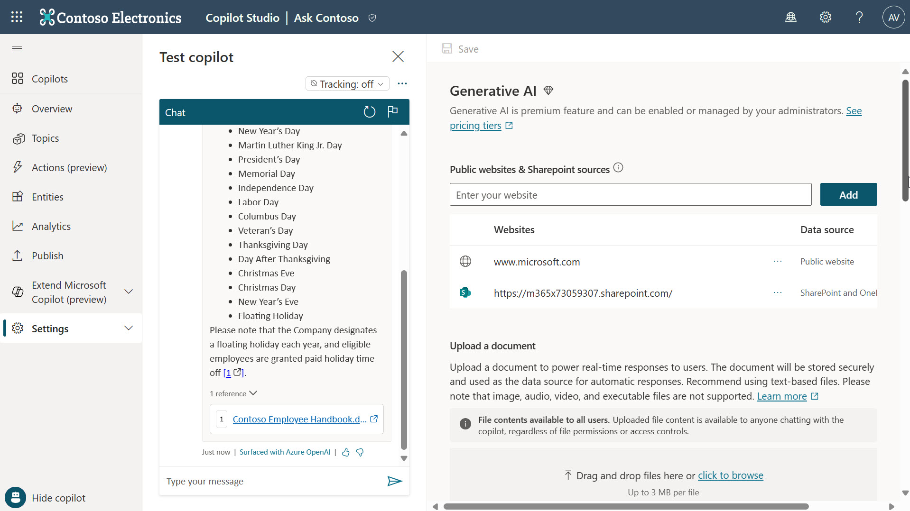

# Lab 02 - Build a custom copilot with Microsoft Copilot Studio and Generative Answers

Generative answers in Microsoft Copilot Studio allow your copilot to find and present information from multiple sources such as internal or external websites, and uploaded files, without created topics.

Generative answers can be used as primary information sources or as a fallback source when authored topics can't answer a user's query. Generative answers make your copilot valuable out-of-the-box and increase the number of topics your copilot is conversational in, without requiring any manual dialog tree authoring.

## 2.1 Create a custom copilot with an external source

In this part of the lab we’ll be creating a custom copilot and provide an external data source for the copilot to use in generating answers.

1. Select **Create a custom copilot**.

    
    
2.	You’ll next be presented with fields to populate to create your copilot.

    - In the **Copilot name** field, enter a name for your copilot.
    - In the **What language do you want your copilot to speak?** field, choose the language your copilot will use to communicate with your users. Once set, it can’t be changed. For this lab, **English (United States) (en-US)** will be selected by default.
    - In the **Website** field for Generative AI, enter [**www.microsoft.com**](www.microsoft.com)
        - Public sites and SharePoint sites are accepted. Don't include query strings, or use a website that ends in a file extension. The address you choose to add should be no more than two levels deep. You can recognize levels by the number of slashes (/) that come after the domain name.
    - Select Edit advanced options. 

    

7.	The options presented allow you to configure the following:
    - change the **icon** of your copilot
    - include **lesson topics** which give examples of how to create different kinds of content for you copilot
    - select the solution your copilot to be created. This allows you to deploy your copilot to a target environment by exporting the solution. By default Common Data Services Default Solution will be selected.
    - Enter a **schema name** which by default will be the name of your copilot. This is the unique name which can be used to embed or connect your copilot to other applications or services.
    - **Voice capabilities** is currently only supported with classic copilot and is not covered in this lab.

    

8.	Select **Back** and select **Create**.

9.	Your copilot is being setup and provisioned.

    

10.	 If you see the following, select **Next** to understand the capabilities of building and/or extending copilots in Microsoft Copilot Studio. Once you reach the end, select Done.

   

11.	Wait until you see a notification that confirms the copilot has been provisioned.
    
    

12.	You can now test your copilot by entering the following question, **What is Copilot Studio?**

13.	Copilot uses the external link, [www.microsoft.com](www.microsoft.com), to return an answer in plain natural language. Notice that there are references with a hyperlink to where the information is sourced from so that you can validate it. You can also provide feedback by selecting the thumbs down or thumbs up icons.

    

14.	Try asking another question, What is the latest Xbox model?

15.	Copilot will respond again using information from the external link, [www.microsoft.com](www.microsoft.com). This is useful because it allows you to build copilots using existing information rather than creating specific topics based on requests that might be made by users.

## 2.2 Adding an internal source

Next, you'll learn how to add an internal data source, SharePoint, for generative answers in your Copilot.

1. Navigate to **Update generative answers**.

    

2. Enter [https://m365x73059307.sharepoint.com/](https://m365x73059307.sharepoint.com/) in the sources field and select **Add**.

    

3.	Select **Save**.

    

4.	Refresh the chat for the copilot.

    

5. We can now test copilot to confirm SharePoint is now a data source for generative answers. Select the refresh icon and enter the question, **What is the time off policy?** 

    This time Copilot uses the internal link [https://m365x73059307.sharepoint.com/](https://m365x73059307.sharepoint.com) to return the answer it found in a document in plain natural language. References are provided once again with a hyperlink to where the information is sourced from so that you can validate it.

    

5.	Try entering another question, **What holidays do Contoso employees have off?**
    
    You’ll see another response from Copilot that uses the SharePoint data source to answer the question entered in plain natural language.

    

## Next lab

Congratulations, you create a copilot with external and internal data sources for Generative Answers. This is the end of lab 02, select the link below to move to the next lab.

[⏭️ Move to lab 03](../lab-03/README.md)