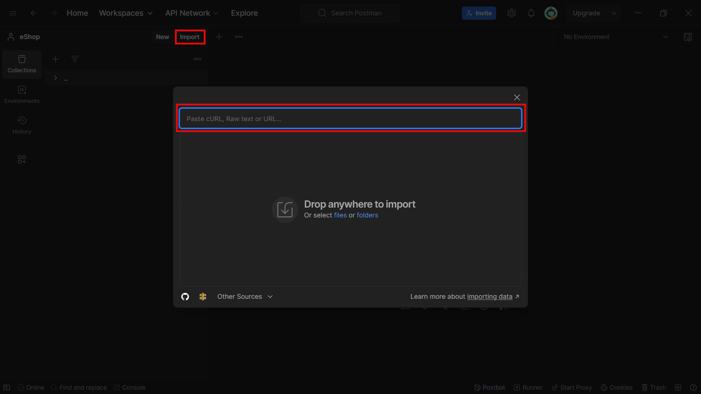
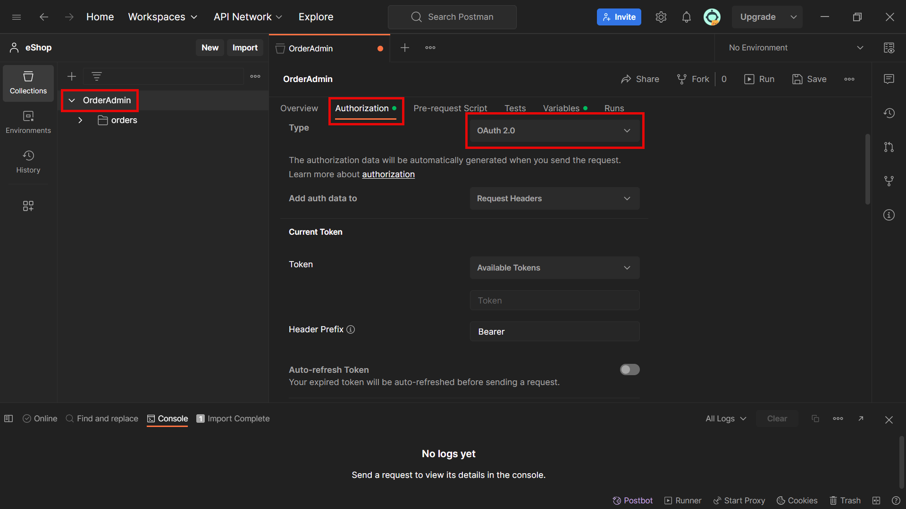
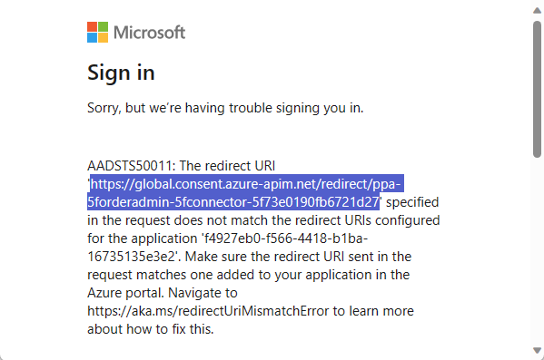
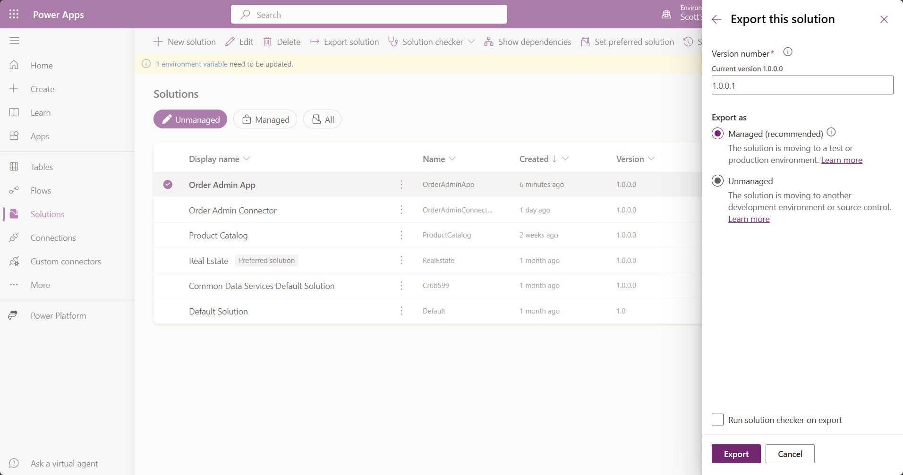

# Power Platform custom connector using Visual Studio Web API with Entra ID auth and solution deployment

In this lab, you will learn how to:

1. Create a **.NET minimal Web API** using Visual Studio with an in-memory repository of Orders for testing purposes.
1. Add **Entra ID authentication and authorization** to your Web API so that operations can be protected using **API App Roles**.
1. **Register a Entra ID application** that can access the Web API and store the generated secret in **Azure Key Vault**.
1. Create Power Platform **Environment Variables** connected to Azure Key Vault to access the secret.
1. Test the API using **Postman** after generating an OAuth bearer token.
1. **Deploy** the Web API to Power Platform as a **custom connector**.
1. **Test** the custom connector from inside Power Platform.
1. Manage the custom connector in a **Power Platform solution** to allow easy deployment to down stream environments.
1. Automatically build a **canvas app using the Power Platform CLI** using the custom connector definition.
1. Deploy the custom connector and associated canvas app using solutions.

## ✨Pre-requisites for this lab

Before you start this lab, ensure that you have done the following tasks:

1. Installed **Visual Studio 2022** - [Download Visual Studio Tools - Install Free for Windows, Mac, Linux (microsoft.com)](https://visualstudio.microsoft.com/downloads/)

1. Installed **VS Code** - [Download Visual Studio Code - Mac, Linux, Windows](https://code.visualstudio.com/download)

1. Installed **.NET 8 SDK** - [.NET SDKs downloads for Visual Studio (microsoft.com)](https://dotnet.microsoft.com/en-us/download/visual-studio-sdks?cid=getdotnetsdk)

1. Installed **Azure CLI** - [How to install the Azure CLI | Microsoft Learn](https://learn.microsoft.com/en-us/cli/azure/install-azure-cli)

1. Installed **Power Platform CLI Extension for VS Code** - [Microsoft Power Platform CLI - Power Platform | Microsoft Learn](https://learn.microsoft.com/en-us/power-platform/developer/cli/introduction#install-using-power-platform-tools-for-visual-studio-code)

1. Installed **Postman** - [Download Postman | Get Started for Free](https://www.postman.com/downloads/)

1. For this lab, you have to be able to create Entra ID application and service principle registrations. In most organizations, this is not possible for normal users. It is recommended that you use a development environment, your own Microsoft 365 Developer Tenant, and a trial of Azure:

   1. Sign up for the M365 Developer Program - [https://aka.ms/m365devprogram](https://aka.ms/m365devprogram)
   1. Start an Azure Trial - <https://aka.ms/azuretrial>
   1. Sign up for the Power Platform Developer Program - <https://aka.ms/powerappsdevplan>

   Refer to [this video](https://www.youtube.com/watch?v=KYym2M9YocQ) by April Dunnam for more information on setting up a M365 Developer tenant for use with Power Platform.

## ✅Create Minimal Web API project

Visual Studio makes it easy to create a Web API and deploy it to Azure using the built-in templates.

1. Inside **Visual Studio** ➡️ **Create a new project**
   

1. Search for `ASP.NET Core Web API` ➡️ Select **ASP.NET Core Web API** ➡️ Select **Next**.
   

1. Enter `OrderAdmin` as the **Project name** ➡️ Select the folder location of your project ➡️ Select **Next**.
   

1. Select **.NET 8.0** (Install SDK and latest version of Visual Studio 2022 if you do not see this option) ➡️Select **Microsoft identity platform** ➡️ **Create**.
   

1. Select **Next**.  
   

1. Select your **Azure Subscription** (You will need to login if you have not already done so) ➡️Select your **Tenant** ➡️Select **Create new**.
   

1. Enter `OrderAdmin` as the **Display name** ➡️Select **Register**.
   This will register a new application in Entra ID. If you do not have permissions to do this, then the step will fail, and you should refer to the pre-requisites of this lab.
   

1. Ensure that the **new application is selected** ➡️ Select **Next**.
   

1. You can add permissions to Microsoft Graph or another application if required, however in this lab you will not call any downstream APIs. Select **Next**.  
   

1. Select **Finish**.  
   

1. When the project configuration is finished, select **Close**.  
      

1. If you have GitHub Copilot installed, you can use the following prompt:

      ```text
      Add new a file named OrderRepository.cs, that has the following
      
      Order Entity class with GUID primary key, OrderTotal, OrderDate, and nullabale OrderStatus of nullable enum type OrderStatus
      
      OrderStatus enum with enum values Pending, Processing, Shipped, Delivered, Cancelled.
      
      IOrderRepository interface for CRUD operations on the Orders. It must have AddOrder, DeleteOrder, UpdateOrder, Get, GetOrders
      
      OrderRepository implementing IOrderRepository that stores the orders in a private List<Order>
      
      The AddOrder implementation should assign a new GUID to the Order ID. The Delete Order should not return anything - The UpdateOrder should return an error if the order is not found - The GetOrders should allow querying by an optional Date range
      
      Generate some sample orders in the constructor
      
      Decorate the enum OrderStatus with [JsonConverter(typeof(JsonStringEnumConverter))]
      
      Do not create unit tests
      ```

      This should create a class similar to:

      ```csharp
      using System;
      using System.Collections.Generic;
      using System.Linq;
      using System.Text.Json.Serialization;
      
      [JsonConverter(typeof(JsonStringEnumConverter))]
      public enum OrderStatus
      {
          Pending,
          Processing,
          Shipped,
          Delivered,
          Cancelled
      }
      
      public class Order
      {
          public Guid Id { get; set; }
          public decimal OrderTotal { get; set; }
          public DateTime OrderDate { get; set; }
          public OrderStatus? Status { get; set; }
      }
      
      public interface IOrderRepository
      {
          Order GetOrder(Guid id);
          void AddOrder(Order order);
          void UpdateOrder(Order order);
          void DeleteOrder(Guid id);
          IEnumerable<Order> GetOrders(DateTime? startDate, DateTime? endDate);
      }
      
      public class OrderRepository : IOrderRepository
      {
          private List<Order> _orders = new List<Order>();
          
          public OrderRepository()
          {
              _orders = new List<Order>
              {
                  new Order { Id = Guid.NewGuid(), OrderTotal = 100, OrderDate = DateTime.Now.AddDays(-10), Status = OrderStatus.Delivered },
                  new Order { Id = Guid.NewGuid(), OrderTotal = 200, OrderDate = DateTime.Now.AddDays(-5), Status = OrderStatus.Shipped },
                  new Order { Id = Guid.NewGuid(), OrderTotal = 300, OrderDate = DateTime.Now.AddDays(-2), Status = OrderStatus.Processing }
              };
          }
      
          
          public Order GetOrder(Guid id)
          {
              return _orders.FirstOrDefault(o => o.Id == id);
          }
      
          public void AddOrder(Order order)
          {
              order.Id = Guid.NewGuid();
              _orders.Add(order);
          }
      
          public void UpdateOrder(Order order)
          {
              var index = _orders.FindIndex(o => o.Id == order.Id);
              if (index != -1)
              {
                  _orders[index] = order;
              }
              else
              {
                  throw new Exception("Order not found");
              }
          }
      
          public void DeleteOrder(Guid id)
          {
              var order = GetOrder(id);
              if (order != null)
              {
                  _orders.Remove(order);
              }
          }
      
          public IEnumerable<Order> GetOrders(DateTime? startDate, DateTime? endDate)
          {
              return _orders.Where(o => (!startDate.HasValue || o.OrderDate >= startDate.Value) && (!endDate.HasValue || o.OrderDate <= endDate.Value));
          }
      }
      ```

1. Select **Create new file** underneath the GitHub Copilot chat and **save as** `C:\src\OrderAdmin\Controllers\OrderRepository.cs`
     Change `C:\src\` to match your own project root directory.
     

      If you do not have GitHub Copilot, you can simply copy the source above into this location.

1. If you have GitHub Copilot, use the following prompt:

      ```text
      Create a new WebAPI Controller named OrderAdminEndpoints.cs inheriting from Controller, named OrderAdminEndpoints, with the route 'orders', that accepts the IOrderRepository in the constructor.
      
      Implement CRUD operations including List with optional date filter, Get, Add, Update, Delete using the OrderRepository.
      
      Mark each operation using the SwaggerOperation attribute with the summary, description, operationdId and tags. Mark the order parameters as [FromBody].
      
      Do not add unit tests.
      ```

      This should create content similar to:

      ```csharp
      using System;
      using System.Collections.Generic;
      using Microsoft.AspNetCore.Mvc;
      using Swashbuckle.AspNetCore.Annotations;
      
      [Route("orders")]
      public class OrderAdminEndpoints : Controller
      {
          private readonly IOrderRepository _orderRepository;
      
          public OrderAdminEndpoints(IOrderRepository orderRepository)
          {
              _orderRepository = orderRepository;
          }
      
          [HttpGet]
          [SwaggerOperation(Summary = "List Orders", Description = "List all orders with optional date filter", OperationId = "Order.List", Tags = new[] { "OrderEndpoints" })]
          public IEnumerable<Order> List(DateTime? startDate, DateTime? endDate)
          {
              return _orderRepository.GetOrders(startDate, endDate);
          }
      
          [HttpGet("{id}")]
          [SwaggerOperation(Summary = "Get Order", Description = "Get a specific order", OperationId = "Order.Get", Tags = new[] { "OrderEndpoints" })]
          public Order Get(Guid id)
          {
              return _orderRepository.GetOrder(id);
          }
      
          [HttpPost]
          [SwaggerOperation(Summary = "Add Order", Description = "Add a new order", OperationId = "Order.Add", Tags = new[] { "OrderEndpoints" })]
          public void Add([FromBody] Order order)
          {
              _orderRepository.AddOrder(order);
          }
      
          [HttpPut]
          [SwaggerOperation(Summary = "Update Order", Description = "Update an existing order", OperationId = "Order.Update", Tags = new[] { "OrderEndpoints" })]
          public void Update([FromBody] Order order)
          {
              _orderRepository.UpdateOrder(order);
          }
      
          [HttpDelete("{id}")]
          [SwaggerOperation(Summary = "Delete Order", Description = "Delete an order", OperationId = "Order.Delete", Tags = new[] { "OrderEndpoints" })]
          public void Delete(Guid id)
          {
              _orderRepository.DeleteOrder(id);
          }
      }
      ```

1. Select **Create new file** and **save as** `C:\src\OrderAdmin\Controllers\OrderAdminEndpoint.cs`
      Change `C:\src\` to match your own project root directory.
      If you do not have GitHub copilot, you can simply copy the source above into this location.

1. The `SwaggerOperation` attribute will appear as unknown, this is because the `Swashbuckle.AspNetCore.Annotations` NuGet package must be installed. This can easily be done by selecting the **Quick actions** icon that appears when you hover over the `SwaggerOperation` attribute (You can also use `Alt+.`). Select **Install with package manager**.
      

1. Inside the NuGet window, select `Swashbuckle.AspNetcore.Annotations` ➡️ Select **Install** ➡️ Select **Apply**.
      

1. Next you must configure your project to use the version 2 swagger OpenAPI specification and provide an API title and version. Locate the following line in `Program.cs`:

      ```csharp
      builder.Services.AddSwaggerGen();
      ```

      Replace with:

      ```csharp
      builder.Services.AddSwaggerGen(c =>
      {
          c.SwaggerDoc("v1", new OpenApiInfo { Title = "OrderAdmin", Version = "v1" });
          c.EnableAnnotations();
      });
      ```

1. Still inside `Program.cs`, locate:

      ```csharp
      app.UseSwagger();
      ```

      Replace with:

      ```csharp
      app.UseSwagger(c =>
      {
          c.SerializeAsV2 = true;
      });
      ```

1. Next, you must register your `OrderRepository` in the Dependency Injection Services. Still inside `Program.cs`, below:

      ```csharp
      // Add services to the container.
      ```

      Add the line:

      ```csharp
      builder.Services.AddSingleton<IOrderRepository, OrderRepository>();
      ```

1. Delete the `WeatherForecast.cs` and `WeatherForecastController.cs` sample files.

1. Press `F5` to run the project. A new browser window will open and you will see the swagger UI showing the Open API definition for your API.
      

     > [!NOTE]
     > If this is the first time you have run an HTTPS Web API then you will be prompted `Would you like to trust the ASP.NET Core SSL Certificate`, and `Do you want to install this certificate`. Select **Yes** for both of these. If you get the error `Your connection isn't private` inside the Edge, then expand **Advanced** and select **Continue to localhost (unsafe)**

1. Expand **GET /orders** ➡️ Select **Try it out** ➡️ Select **Execute**.
      You should see the sample orders created in the constructor. This is all running inside your instance of Visual Studio so you can set breakpoints.
      

1. Stop the running project by closing the browser tab that was opened automatically.

1. To ensure that the Update and Delete endpoints can only be performed by a specific set of users, you must add an Authorization Policy.
      Inside `OrderAdminEndpoints.cs` above  `public class OrderAdminEndpoints : Controller`, add the following

      ```csharp
      [Authorize]
      [AuthorizeForScopes(ScopeKeySection = "AzureAd:Scopes")]
      ```

1. Above `public void Delete(Guid id)` add the following:

      ```csharp
       [Authorize(Roles = "CanDeleteOrders")]
      ```

1. Navigate to [make.powerapps.com](https://make.powerapps.com) and select your **Developer Environment**. If you do not have one, [Create a developer environment with the Power Apps Developer Plan](https://learn.microsoft.com/en-us/power-platform/developer/create-developer-environment).

1. Create a new **Solution** named `OrderAdminConnector` with a solution publisher of your choice.
      

1. Inside Visual Studio, Expand **Connected Services** ➡️ Select **Add** ➡️ Select **Microsoft Power Platform** ➡️ Select **Create**.
      

1. Choose your **Developer Environment**, select the `Order Admin Connector` solution:
      

1. Use + to add a new **Custom Connector** named `OrderAdmin_Connector`  
     

1. Use + to add a new public **dev tunnel** named `PowerPlatform`.  
      

1. Select **Finish**. Your custom connector will be created in the Power Platform environment you selected using the `OpenAPI` schema of your Web API. Select **Close**.  
      

      > [!NOTE]
      > You can repeat this process to update your connector by selecting an existing on rather than creating a new one.

1. Press `F5` in your project. If this is the first time you have accessed the dev tunnel in this session you will receive a confirmation dialog. Select **Continue**.  
      

1. Notice that the API is now access via public Dev Tunnel URL.
      

1. Now that authentication is configured on your API, if you repeat a test of the /order endpoint you will receive a **401 Unauthorized** response.
      

## ✅Creating Service Principal for custom connector

In order to test authentication, you must now create an application registration in Entra ID. This can be used to test authentication and permissions when being called from the custom connector and in Postman.

1. Create a new folder named `c:\src\OrderAdminConnector`.
     Change `C:\src\` to match your own project root directory.

1. Open the `c:\src\OrderAdminConnector` using **VSCode** and open a **PowerShell** terminal.
     You must have the **Azure CLI** and Power Platform VS Code extension installed. Refer to the pre-requisites.

1. Ensure you are authenticated with Azure using

     ```powershell
     az login
     az account list --output table
     az account set --subscription <Subscription Id you wish to use>
     ```

     

1. Run the following command at the terminal to create a Power Platform CLI auth profile if you do not yet have one.

     ```powershell
     pac auth create --deviceCode
     ```

1. Follow the instructions to open a new browser window and paste in the device code. You must login using the account that is linked to the same Power Platform environment that you used earlier.

1. Ensure that you are connected to the correct auth profile by using:

     ```powershell
     pac auth list
     ```

     If you do not see asterisk (*) next to the correct profile, you can change using:

     ```powershell
     pac auth select --index <Index>
     ```

     > [!NOTE]
     > You can also change the auth profile and create new ones using the Power Platform Extension on the VS Code Activity Bar

1. Ensure you are authenticated with the Power Platform and the **correct environment** is selected using `pac env who`. You can change the environment by using:

     ```powershell
     pac env select --environment "<Name of your environment>" 
     ```

     

     > [!NOTE]
     > You can also change the environment using the Power Platform Extension on the VS Code Activity Bar

1. Create a new **resource group** for our **Azure Key Vault** (you can alternatively use an existing resource group and skip this step)
     Find the possible locations using:

     ```powershell
     az account list-locations --output table
     ```

     Copy the `Name` of the resource group you want to use - e.g. `westus` and use

     ```powershell
     $location = "westus"
     $resourceGroup = "rg-OrderAdmin-dev"
     ```

     Create the resource group using the following:

     ```powershell
     az group create --name $resourceGroup --location $location 
     ```

     

1. You must be a member of the **User Access Administrator** and **Key Vault Administrator** on your subscription to manage the access control on a key vault.

     ```powershell
     # Set the subscription and user principal name
     $subscriptionId = az account show --query id --output tsv
     $currentUPN = az ad signed-in-user show --query userPrincipalName
     
     # Find the roles of the current user for the currently selected subscription
     az role assignment list --query "[?principalName=='$currentUPN' && scope=='/subscriptions/$subscriptionId'].roleDefinitionName" --output table
     ```

     

1. If you do not see the two roles `Key Vault Administrator` and `User Access Administrator`, then use the following:

     ```powershell
     # Assign the "Key Vault Administrator" and "User Access Administrator" role to the user
     az role assignment create --role "Key Vault Administrator" --assignee $currentUPN --scope /subscriptions/$subscriptionId
     az role assignment create --role "User Access Administrator" --assignee $currentUPN --scope /subscriptions/$subscriptionId
     ```

     

1. Create a key vault using the following. Since key vault names are globally unique, the script creates a random suffix.

     ```powershell
     $keyVaultName = "kv-OrderAdmin-dev-" + (-join ((48..57) + (97..122) | Get-Random -Count 5 | % {[char]$_}))
     az keyvault create --name $keyVaultName --resource-group $resourceGroup --location $location
     az keyvault update --name $keyVaultName --set properties.enableRbacAuthorization=true     
     ```

    > [!IMPORTANT]
    > If you change the prefix `kv-OrderAdmin-dev-` be sure not to exceed 18 characters since key vaults names can only be 24 characters in length.

     

     > [!NOTE]
     > Role based access control (RBAC) is enabled on the key vault since it is required for the Power Platform Environment Variable integration used later in this lab.

1. Assign the **Dataverse** permission to the Key Vault using the following:

     ```powershell
     # Assign the Dataverse application as "Key Vault Secrets User"
     az role assignment create --role "Key Vault Secrets User" --assignee "00000007-0000-0000-c000-000000000000" --scope /subscriptions/$subscriptionId/resourceGroups/$resourceGroup/providers/Microsoft.KeyVault/vaults/$keyVaultName
     
     # List the role assignments
     az role assignment list --scope /subscriptions/$subscriptionId/resourceGroups/$resourceGroup/providers/Microsoft.KeyVault/vaults/$keyVaultName --output table
     
     ```

     

     > [!NOTE]
     > The application ID 00000007-0000-0000-c000-000000000000 is the Dataverse registration that is given access.
     > See [Use environment variables for Azure Key Vault secrets - Power Apps | Microsoft Learn](https://learn.microsoft.com/en-us/power-apps/maker/data-platform/environmentvariables-azure-key-vault-secrets) for more information

1. Download [create-application-registration.psm1](scripts/create-application-registration.psm1) and save in your current folder `c:\src\OrderAdminConnector`.
     Change `C:\src\` to match your own project root directory.

1. Run the following PowerShell to import the command:

     ```powershell
     Set-ExecutionPolicy -ExecutionPolicy Unrestricted -Scope Process
     Import-Module ./create-application-registration.psm1
     ```

     This will register the functions that are used to create the application registration and environment variables. Review the content of this script.
     

1. Run the following - update the `solutionPrefix` to match your (the variables `$keyVaultName` is already defined above):

     ```powershell
     $appId = RegisterApplicationAndSecret `
         -newAppName:"OrderAdmin-Client" `
         -apiAppName:"OrderAdmin" `
         -apiUserAccessScope:"access_as_user" `
         -keyVaultName:$keyVaultName `
         -solutionPrefix:"ppa"
     ```

     Where:

     - `newAppName`: The name of the new application to registration that will be used to connect to the API with delegated user access.
     - `apiAppName`: The name of the Application & Service Principal that was created by Visual Studio when creating the minimal API project.
     - `apiUserAccessScope`: The Scope that is registered on the Application API that was created by Visual Studio. 'access_as_user' is the default name and can be found referenced inside the Entra ID application registration under **Expose an API**, and is referenced in the `appSettings.json` of your API Visual Studio project.
     - `keyValueName`: The key vault name that was automatically created by the script above.
     - `solutionPrefix`: The solution prefix defined in the solution publisher of the `OrderAdminConnector` solution you created earlier.

     If you open [portal.azure.com](https://portal.azure.com) and search for `OrderAdmin`, you can see the Application registration with the exposed API:
     

     Note down the output that will be similar to the following:
     

     > [!IMPORTANT]
     > Do not close this terminal because you will need the assigned variables below.

1. Ensure that the Visual Studio project is **running** and **copy the swagger URL** that will be exposed via dev tunnel.
     

## ✅Testing using Postman

Now that you have a service principal and the service running using a dev tunnel, you can test the authentication using Postman. Refer to the prerequisites if you do not yet have Postman installed.

1. Open **Postman** and select **Import** and paste the `swagger.json` URL into the Import dialog:
     

1. Select **Import**.
     

1. Select the imported **OrderAdmin Collection** ➡️ **Authorization** tab.
     Fill out the values in the Configure New Token section using the values returned from the script above.
     

     For example, you would fill in the details similar to:

     - **Type**: OAuth 2.0
     - **Header Prefix**: Bearer
     - **Grant type**: Authorization Code
     - **Authorize using browser**: Yes
     - **Auth URL**: <https://login.microsoftonline.com/.../oauth2/v2.0/authorize>
     - **Access Token URL**: <https://login.microsoftonline.com/..../oauth2/v2.0/token>
     - **Client ID**: `f492.....-.....-.....-.....-.....5135e3e2`
     - **Client Secret**: `0M.........84`
     - **Scope**: api://ef1901d2-7bef-4434-bb2e-ada742b1a291/access_as_user offline_access

     > [!NOTE]
     > If you want to use the Auto-refresh Token feature, you must append the scope offline_access to the Scope (separated by a space).

1. Select **Get New Access Token**. A new browser window will popup and you will be either automatically logged in, or prompted to log in.

1. Once complete, select **Use Token**:

    

1. Select the **Variables** tab ➡️ Update the **Current Value** of the **baseUrl** variable to match the base url of the dev tunnel that is created for your Web Api project ➡️ Select **Save**
    

    > [!NOTE]
    > The base URL will be the same as the base URL of your swagger file. E.g. <https://abcdefg123.usw2.devtunnels.ms>

1. Select the `List Orders` operation ➡️ Uncheck `startDate` and `endDate` ➡️Select **Send**.
    You should see a **Response Status** of **200 OK**, and the sample orders returned.
    

1. Select the `Delete` operation and select **Send**. You should see a **Response status** of `403 Forbidden`. This is because your user does not have the `CanDeleteOrders` role as specified by `[Authorize(Roles = "CanDeleteOrders")]` on the `Delete` endpoint.
    

1. To create the Application Role `CanDeleteOrders`, open VSCode again and use the following:

    ```powershell
    $apiAppName = "OrderAdmin"
    $apiAppId = az ad app list --query "[?displayName=='$apiAppName']" | ConvertFrom-Json
    $CanDeleteRoleId = New-Guid
    $canDeleteRoleDefinition = [PSCustomObject]@{
         allowedMemberTypes = @('User')
         id = $CanDeleteRoleId
         description = 'Can Delete Orders'
         displayName = 'CanDeleteOrders'
         value = 'CanDeleteOrders'
    }
    $rolesJson =($canDeleteRoleDefinition | ConvertTo-Json -Compress) -replace '"', "'"
    az ad app update --id $apiAppId.appId --app-roles "[$rolesJson]"
    ```

1. You must also assign a user to the enterprise application app role ([Manage users and groups assignment to an application | Microsoft Learn](https://learn.microsoft.com/en-us/entra/identity/enterprise-apps/assign-user-or-group-access-portal?pivots=portal))

    Navigate to Enterprise Applications in the **Azure Portal**, and select your Enterprise Application named `OrderAdmin`, or alterative perform a search for the `OrderAdmin` Service Principal ➡️ Select **Users and groups** ➡️ Select **Add user/group** ➡️ Select **None selected**, and search for your user ➡️ Select **Assign**.
    

1. Return to **Postman**, select the **Authorization** tab on the `OrderAdmin` collection and repeat **Get New Access Token**. Re-send the **Delete** request. You should now see a status of `200 OK.`

## ✅Configuring and Testing the Custom Connector

Since the API is deployed as a custom connector, you can now test using Power Platform. The previously run script will have created environment variables that you can use to configure the auth settings using so that they are not hard coded and can be updated easily when deploying to different environments.

1. Right click on the **Microsoft Power Platform Connected Service** and select **Open Power Apps**:
   

1. Select the Edit Icon:
   

1. You should see the **base URL** of your dev tunnel in the **Host** property.
   

1. Select the **Security** tab/dropdown item ➡️ Select **Edit** ➡️ Select the **Authentication Type** of **OAuth 2.0** ➡️ Select **Azure Active Directory** as the **Identity Provider**.
   Enter the values from the `RegisterApplicationAndSecret` script that are listed under the connector auth section. These environment variables should be deployed to your environment as part of that script. The secret will be pointing to the supplied Azure Key Value.  
   

   These values will be similar to:

   - **Client ID:** `@environmentVariables("ppa_OrderAdmin_AppId")`
   - **Client Secret:** `@environmentVariables("ppa_OrderAdmin_Secret")`
   - **Authorization URL:** `https://login.microsoftonline.com`
   - **Tenant ID:** `@environmentVariables("ppa_OrderAdmin_TenantId")`
   - **Resource URL:** `@environmentVariables("ppa_OrderAdmin_ResourceUrl")`
   - **Scope:** `@environmentVariables("ppa_OrderAdmin_Scope")`

1. Select **Update connector**

1. Select the **Test** Tab/Dropdown, and select **+ New connection**
   

1. On the dialog, select **Create**.  
   

1. You will see an error dialog similar to the following dialog.  
   

   > [!NOTE]
   > This is because the redirect URL has not been configured in the Application Registration. Since the authentication is being configured using Environment Variables, at this time the redirect URL is not provided until you see this error. This may change in the future.

1. Copy the URL from the error dialog. Switch back to your PowerShell terminal and use the following command to add the Redirect URL to the application registration.

   ```powershell
   AddRedirectUrlToApp $appId "<Copied URL>"
   ```

   Substitute the URL copied from the error dialog for `<Copied URL>`.

1. Close the error dialog and select Fix connection next to the connection that was just created.
   

1. The connection should now show **Connected**.

1. Return to the custom connector by using the **browser back** and **edit the connection** using the edit icon again.

1. Select the **Test** tab/dropdown. The new connection should show in the **Selected connection** dropdown.

1. Ensure your Visual Studio Web API is still running with the dev tunnel and select **Test operation**.
    The response status should now show as 200 which indicates success.
    

1. Select the `Order.Add` operation, set the values and use Test operation.
   

1. Return to the `Order.List` and use Test operation again. You should see the order listed.
   

1. Since you are running the API via a Visual Studio dev tunnel, you can place a breakpoint and debug the code when making calls from Power Platform.

1. You can also test the `Order.Delete` endpoint passing the GUID of the newly created order. Provided your user has the `CanDeleteOrders` role this will return `200` and delete the order.

## ✅ Deploy Web API to App Service in Azure

Now that your Web API has been tested you need to deploy it to an Azure App Service.

1. Inside the Web API Visual Studio Project, right click on the **eShopOrderAdmin** **Web API** project ➡️Select **Publish**
   
1. Select **Azure**.  
   
1. Select **Azure App Service (Linux)** ➡️ Select **Next**.
   
1. Select **+ Create new.** (Or select an existing app service).
   
1. Give the App Service a **unique name** ➡️ Select the **resource group** that you created the Azure Key Vault inside (e.g. `rg-OrderAdmin-dev`)  ➡️ Create a new **hosting plan** (or use an existing) ➡️ Select **Create.**
   
1. Select **Next**, and on the API Management section, select Skip this step, then **Finish**.
   
1. Select Close, then **Publish**. Wait for the project to deploy.
   
1. Once deployed, the new app service will open in a new browser. Copy the base URL(e.g. `orderadmin20231215.azurewebsites.net`)

## ✅ Solution Management and ALM

A very important aspect of all Power Platform development is that components are deployed using managed solutions and easily configurable in each environment using environment variables. No that you have created the connector, you must add it to a solution along with the environment variables, so that it can be deployed.

1. Open [make.powerapps.com](https://make.powerapps.com) and navigate to Solution. Select the **Order Admin Connector** solution you created earlier, and use **Add existing** ➡️ **More** ➡️ **Environment variable**.
   

1. Search for `OrderAdmin` ➡️ Select **all Environment variables** ➡️ **Next**.
   

1. Uncheck **Include current value** for each Environment Variable ➡️ Select **Add**.
   

   > [!IMPORTANT]
   > It is important to not include the current values since each down stream environment will have a unique set of values since it is best practice to not share the same Application Registrations between Development and Outer Loop environments.

   At this time, environment variable values are added into the solution even if the Include current value checkbox is unchecked. To remove, select each **environment variable** at a time ➡️ Select the ellipsis next to the **Current Value** ➡️ Select **Remove from this solution**.
   

1. Since the values of the environment variables are not included in the solution so that they are not deployed, to edit them you must open the **Default Solution**.
   

1. Search for `OrderAdmin` ➡️ Select the `OrderAdmin Host` environment variable ➡️ Select the **ellipsis** ➡️ Select **Edit**.

1. Enter the host into the **Current Value** without the leading `https://` or the trailing `/` (e.g. `orderadmin20231215.azurewebsites.net`) ➡️ **Save**.
   

   > [!IMPORTANT]
   > Since you are doing this in the default solution, the variable will not be deployed as part of the Order Admin Connector solution.

1. Repeat the edit process for the `OrderAdmin Secret` environment variable. Note how it is referencing your **Azure Key Vault** rather than storing the secret in the solution.
   

## ✅Adding Solution to Source Control

Having the ability to version control your solution and track changes between different deployments is vital to a healthy application lifecycle. In this task you will add the solution to a git repo.

1. Return back to your **VS Code** command prompt. Next you must download the solution into a new folder so that you can add it to source control by running the following command:

   ```powershell
   cd <Your Order Admin Connector Root Folder>
   pac solution clone --name OrderAdminConnector --async --outputDirectory OrderAdminConnector
   pac solution create-settings --solution-folder OrderAdminConnector
   ```

   

2. Open the file at `OrderAdminConnector\src\Connectors\new_orderadmin-5Fconnector_openapidefinition.json`

3. Use `Shift-Alt-F` to format the JSON (you will need to install a JSON formatter in VS Code if you don't already have one)

4. Locate the `host` property and replace the dev tunnel host with the **environment variable**.

   ```json
   "host": "@environmentVariables(\"ppa_OrderAdmin_Host\")",
   ```

   

5. **Save** the file.

6. Currently, when deploying Custom Connector via Visual Studio Connected Services, the connector prefix does not match the prefix of the solution. You can fix this by renaming all the references to `new_` to be our own solution publisher prefix (e.g. `ppa_`).
   Run the following PowerShell at your terminal (replace the prefix with your own).

   ```powershell
   # Rename the files to use the new publisher prefix
   $publishPrefix = "ppa"
   $connectorName = "OrderAdminConnector"
   $files = Get-ChildItem -Path "$(Get-Location)\$connectorName\" -Filter "new_*" -Recurse
   
   foreach ($file in $files) {
       # Get the new name for the file
       $newName = $file.Name -replace "new_", "$($publishPrefix)_"
   
       # Rename the file
       Rename-Item -Path $file.FullName -NewName $newName
   }
   ```

   You also must fix the reference in the xml files by running the following.

   ```powershell
   # Find all XML files in the current directory and its subdirectories
   $publishPrefix = "ppa"
   $connectorName = "OrderAdminConnector"
   $xmlFiles = Get-ChildItem -Path "$(Get-Location)\$connectorName" -Filter "*.xml" -Recurse
   
   # Loop through each file
   foreach ($file in $xmlFiles) {
       # Read the contents of the file
       $content = Get-Content -Path $file.FullName
   
       # Replace 'new_' with 'cda_' in the content
       $newContent = $content -replace "new_", "$($publishPrefix)_"
   
       # Write the new content back to the file
       $newContent | Set-Content -Path $file.FullName
   }
   ```

   The files should all reference the `ppa` prefix rather than `new`.
   

7. Before you import the updated connector, you must delete the connection associated with it. You an do this by navigating the Connections in [make.powerapps.com](https://make.powerapps.com) ➡️Selecting the connection ➡️Expand the ellipsis menu ➡️Select **Delete**.
   

   This can also be done using the Power Apps PowerShell modules. Open a PowerShell terminal as a local Administrator of your machine, and then run the following.

   ````powershell
   # Replace these with the values from your environment
   $environmentID = "750120dc-071f-ebd0-953d-d08ec4ca5508"
   $connectorSearch = "*orderadmin-5fconnector*"
   
   # Delete all connections for a specific connector so that it can too be deleted
   Get-AdminPowerAppConnection -EnvironmentName $environmentID |
   Where-Object { $_.ConnectorName -like $connectorSearch } |
   ForEach-Object { 
       Remove-AdminPowerAppConnection -EnvironmentName $environmentID -ConnectorName $_.ConnectorName -ConnectionName $_.ConnectionName
   }
   ````

   You can find the Environment ID by selecting the cog settings icon on the top right of [make.powerapps.com](https://make.powerapps.com)  ➡️  Select **Developer Resources**.  
   

   Learn more about the PowerShell commands: [Microsoft.PowerApps.Administration.PowerShell Module | Microsoft Learn](https://learn.microsoft.com/en-us/powershell/module/microsoft.powerapps.administration.powershell/?view=pa-ps-latest)

8. Now you can delete the connector by navigating to **Custom connectors** ➡️ Select the **ellipsis** more menu ➡️ Select **Delete**.
   

   > [!IMPORTANT]
   > You cannot use the PowerShell command `Remove-AdminPowerAppConnector` because the connector is in a solution.

9. To deploy the updated connector, return to VS Code and using the following:

   ```powershell
   pac solution pack --folder OrderAdminConnector\src --packagetype Unmanaged --zipfile OrderAdminConnector.zip
   pac solution import --async --publish-changes --path OrderAdminConnector.zip 
   ```

   > [!NOTE]
   > You can also create the solution zip by using `dotnet build` on the `OrderAdminConnector.cdsproj` file

   

10. If you open your **Order Admin Connector** solution you will now see the updated connector that has the correct publisher prefix.

11. Note, when testing the connector, you will get an error creating the connection since the URL will have changed. As before use:

    ```powershell
    AddRedirectUrlToApp $appId "<Copied URL>"
    ```

    Updating the URL to be the one you see in the connection error. Again select **Fix the connection** as before.

12. Now to update the solution to reflect any changes, use the following command:

    ```powershell
    pac solution sync --solution-folder "OrderAdminConnector/OrderAdminConnector/src" --async
    ```

13. The solution folder can now be checked in to source control.

## ✅ Build a Power App with the connector

Now you have built and deployed the custom connector, tested and setup for healthy deployment management using solutions and environment variables, you can create an app that uses it.

1. Back inside **VS Code**, use the following to find the connector Id and create a canvas app using it:

   ```powershell
   $connectors = pac connector list --json | ConvertFrom-Json
   $targetConnector = $connectors | Where-Object { $_.DisplayName -eq 'eShopAdmin_Connector' }
   pac canvas create --connector-id $targetConnector.ConnectorId --msapp eShopAdminApp1122.msapp     
   ```

   

1. Open **make.powerapps.com** ➡️ Select **+ Create** in the left navigation pane➡️ **More data sources**
   

1. Select **Open** ➡️ **Browser** ➡️ Select the **msapp** that was created in the folder you ran the above script from.

   

1. Select **Data** from the left toolbar, then **+ Add data**. Search for the **OrderAdmin** connector and select it to add it to your app.
   

1. Select **Connect** and follow the login.

1. Since this is a new connector deployed with a different prefix you will receive the sign in error with direct URI missing. **Copy** the URL has before:  
   

1. Back inside VS Code, run the same command as before with the new URL:

   ```powershell
   AddRedirectUrlToApp $appId "<Copied URL>"
   ```

1. Once the Redirect URL is added, re-run the adding connector as above. This time, select Allow access,  the login will work and the connector added as a data source.  
   

1. Press `F5` to run the app ➡️ Select `Order.Add`, and enter some values, then select **POST**
   

1. Notice how this gives an error. The reason is that the `Order.Add` does not need the `id` parameter. You can remove this by editing the `Post` button `OnSelect` to be (with the id parameter removed):

   ```javascript
   IfError(
       eShopOrderAdmin_Connector.OrderAdd({orderTotal: 'Order.Add_Body_orderTotal_TextInput'.Text,orderDate: 'Order.Add_Body_orderDate_TextInput'.Text,status: 'Order.Add_Body_status_Dropdown'.Selected.Value}),
       Notify(
           FirstError.Message,
           NotificationType.Error,
           5000
       );
    
       false,
       Notify(
           "Success",
           NotificationType.Success,
           5000
       );
   );
   ```

   You can also delete the `id` `TextBox` from this page.

1. Press `F5` and select **POST** again and the response should be **OK**

1. Navigate back to the menu, and select `Orders.List`

1. Select **GET**, and you should see the order that you added returned.
     

1. Cloud flows or apps that use custom connectors cannot be imported in the same solution as the custom connector (at this time), so you must create a new Solution for your Order Admin app, and add the App to this solution using Add Existing.

1. Save the Power App as **Order Admin App**
    

1. Navigate back to [make.powerapps.com](https://make.powerapps.com) and select **Solutions** ➡️ Select **New solution** ➡️ Set the name as **Order Admin App** with the same solution publisher as the connector ➡️ Select **Create**:
     

1. Select **Add existing** ➡️ Select **App** ➡️ Select **Canvas App** ➡️ Select the **Outside Dataverse** tab ➡️ Select the **Order Admin App**
     

     > [!NOTE]
     > Since the app was created by importing the msapp file, it is Outside of Dataverse until added into this solution

1. Navigate back to the list of solutions and select the **Order Admin App** solution ➡️ Select **Export Solution** ➡️ Select **Next** ➡️ Select **Export**
     

1. Repeat this process for the **Order Admin Connector** solution.
     

1. Download each solution and save to your `OrderAdminConnector` folder.
     You can also perform this operation using the following command at your PowerShell terminal:

     ```powershell
     pac solution export --name OrderAdminConnector --managed --async
     pac solution export --name OrderAdminApp --managed --async
     ```

## ✅ Debugging the connector when used in Power Apps

If at any point the connector is throwing an error and you need to debug using Visual Studio, you can easily swap the host back to the dev tunnel host address. To do this you will edit the Host environment variable and then update the connector to pick up the new value.

1. Ensure your Visual Studio project is running and copy the dev tunnel URL (e.g. `988bw41v-7031.usw2.devtunnels.ms` without the leading `https://` and trailing `/`).
1. Open the **Default solution** in your environment (remember that the environment variable values are not stored in your Order Admin Connector solution because they should not be deployed downstream. The Environment Variables Values can always be accessed in the default solution.
1. Search for **OrderAdmin Host** ➡️ Edit the Environment Variable as before.
1. Update the value to be the same as your dev tunnel ➡️ Select **Save**.
1. To update the connector to use the new value, navigate back to your **Order Admin Connector solution** ➡️ **Edit the connector** ➡️ Select **Update Connector**.
1. Add a breakpoint in the `List` method of the `OrderAdminEndpoints` class.
1. Select Test ➡️ Select `Order.List` ➡️ Test operation. You will now see the breakpoint hit.
   
1. To stop debugging, repeat this process however set the Host URL to be the Azure app service URL from before e.g. `orderadmin20231215.azurewebsites.net`

## ✅Making changes to the connector schema once deployed

If you need to change the schema of your connector, this can be easily done using the Power Platform connected service

1. Open Visual Studio and `OrderRepository.cs`

1. Add the following property to the `Order` class

   ```csharp
   public string? CreatedBy { get; set; }
   ```

1. Open `OrderAdminEndpoints.cs`, add the private member:

   ```csharp
   private readonly IHttpContextAccessor _httpContextAccessor;
   ```

   Set this in the constructor:

   ```csharp
   public OrderAdminEndpoints(IOrderRepository orderRepository, IHttpContextAccessor httpContextAccessor) {
       _orderRepository = orderRepository;
       _httpContextAccessor = httpContextAccessor;
   }
   ```

1. Update the Add method to be:

   ```csharp
   public void Add([FromBody] Order order)
   {
       var displayName = _httpContextAccessor.HttpContext.User.FindFirst("name")?.Value;
       var userName = _httpContextAccessor.HttpContext.User.FindFirst("preferred_username")?.Value;
       order.CreatedBy = $@"{displayName} ({userName})";
       _orderRepository.AddOrder(order);
   }
   ```

1. Right click on **Connected Services**➡️ **Microsoft Power Platform** ➡️Select **Edit**

1. Ensure the correct **Environment**, **Solution** and **Connector** are selected ➡️ Select **Finish**
   

1. Once deployed, the connector will be updated with the new schema, however the security and host environment variables will be overwritten.

1. Right click on **Connected Services** ➡️ Select **Microsoft Power Platform** ➡️ Select **Open Power Apps**

1. Edit the connector and select the security settings and update as before:

   These values will be similar to:

   - **Client ID:** `@environmentVariables("ppa_OrderAdmin_AppId")`
   - **Client Secret:** `@environmentVariables("ppa_OrderAdmin_Secret")`
   - **Authorization URL:** `https://login.microsoftonline.com`
   - **Tenant ID:** `@environmentVariables("ppa_OrderAdmin_TenantId")`
   - **Resource URL:** `@environmentVariables("ppa_OrderAdmin_ResourceUrl")`
   - **Scope:** `@environmentVariables("ppa_OrderAdmin_Scope")`

1. Select **Update connector**

1. In Visual Studio, press `F5` to start the project.

1. Select the **Test** tab/dropdown, you can now test using the new schema and set breakpoints in Visual Studio via the dev tunnel.

1. Once finished, select the **General** tab, and change host to use the environment variable to be:

    ```text
    @environmentVariables("ppa_OrderAdmin_Host")
    ```

1. Select **Update connector**
    

1. Deploy your updated project to Azure using **Right Click on the Project** -> **Publish** -> **Publish**

1. To update the schema in your canvas app, open the **Order Admin App** from the Order Admin App solution first remove the connector connection.  
    

1. Add the connector back in as before.  
     

1. You can use the new schema by replacing the columns on the table in Power Apps:
     

1. Finally, the Solution must be synced to match the deployed schema of the connector. In VS Code, from the PowerShell terminal at your project root, use:

     ```powershell
     pac solution sync --solution-folder "OrderAdminConnector/OrderAdminConnector/src" --async
     ```

     If you have checked in your source code, you will see the change on the openapi definition similar to:

     

## ✅ Preparing for deployment

Deploying solutions downstream is performed using a managed solution and a `deploymentSettings.json` file that contains the values of the environment variables. The import can be performed using GitHub actions or ADO Pipelines.

Learn more about ALM with Power Platform [Application lifecycle management (ALM) with Microsoft Power Platform - Power Platform | Microsoft Learn](https://learn.microsoft.com/en-us/power-platform/alm/)

The following best practices are generally accepted:

1. Solutions deployed to non-development environments is done using a managed solution
1. Separate Azure resources and associated Entra ID registrations are created for each environment to ensure that the **principle of least privilege** can be used. See below for a script that can create the Application Registration for use with the deployed API (that was previously created automatically using Visual Studio in this lab).
1. Solutions are built and packed from their source code to create the solution that is used to create the deployment solution.
1. Each environment has its own `deploymentSettings.json` (that was created during this lab) that can be provided when deploying using Power Platform CLI or the deployment pipeline.

The following script can be used to create an application registration for the Order Admin service in a downstream environment. The `appsettings.json` would be overridden using the App Service configuration in Azure, specifying the `ClientID`.

```powershell
# The name of the API Registration Application
$deploymentApiAppName = "OrderAdmin_PROD"

# Create the Application and return the new ID
$deploymentApiApp = az ad app create --display-name $deploymentApiAppName --sign-in-audience "AzureADMyOrg" --enable-id-token-issuance --query appId -o tsv

$deploymentAppRoleId = New-Guid
$appRole = ((                                                                 
    @{
        allowedMemberTypes = @("User")
        id = "$deploymentAppRoleId"
        displayName = "CanDeleteOrder"
        description = "Can Delete Orders"
        value = "CanDeleteOrder"
 }
) | ConvertTo-Json -d 100 -Compress).Replace('"', '""')

# Add the App Role
az ad app update --id $deploymentApiApp --identifier-uris "api://$deploymentApiApp" --app-roles "[$appRole]" 

# Define the app scope
$apiScopeId = [guid]::NewGuid().Guid
$apiScopeJson = (@{
 
    oauth2PermissionScopes      = @(
        @{
            adminConsentDescription = ("Allows the app to access the web API on behalf of the signed-in user")
            adminConsentDisplayName = ("Access the API on behalf of a user")
            id                      = $apiScopeId
            isEnabled               = $true
            type                    = "User"
            userConsentDescription  = ("Allows this app to access the web API on your behalf")
            userConsentDisplayName  = ("Access the API on your behalf")
            value                   = "access_as_user"
        }
    )

} | ConvertTo-Json -d 100 -Compress).Replace('"', '""')
# Add the API Scope
az ad app update --id $deploymentApiApp --set api=$apiScopeJson

```

The following `deploymentSettings.json` file can be used to import the connector solution in a downstream environment. You can use the same script as before to generate these value.

```json
{
  "EnvironmentVariables": [
    {
      "SchemaName": "ppa_OrderAdmin_AppId",
      "Value": "<YOUR_APP_ID>"
    },
    {
      "SchemaName": "ppa_OrderAdmin_Host",
      "Value": "<YOUR_AZURE_APP_URL>"
    },
    {
      "SchemaName": "ppa_OrderAdmin_ResourceUrl",
      "Value": "api://<YOUR_API_ID>"
    },
    {
      "SchemaName": "ppa_OrderAdmin_Scope",
      "Value": "api://<YOUR_API_ID>/access_as_user"
    },
    {
      "SchemaName": "ppa_OrderAdmin_Secret",
      "Value": "/subscriptions/<YOUR_SUBSCRIPTION_ID>/resourceGroups/<YOUR_RESOURCE_GROUP>/providers/Microsoft.KeyVault/vaults/<KEY_VAULT_NAME>/secrets/<YOUR_SECRET_KEY_NAME>"
    },
    {
      "SchemaName": "ppa_OrderAdmin_TenantId",
      "Value": "<YOUR_TENANT_ID>"
    }
  ],
  "ConnectionReferences": []
}
```

You can then use the following to import the solutions to a target environment.

```powershell
pac env select --index <INDEX_OF_TARGET_ENV>
pac solution import --path OrderAdminConnector_managed.zip --settings-file deploymentsettings_PROD.json --async
pac solution import --path OrderAdminApp_managed.zip --async
```

After deployment when a user first uses the app they will be presented with a dialog to create a connection.


Selecting **View permissions** gives information on what you are allowing. These are the application consent settings defined on the api scope as defined by the script above.


As before, you will receive a redirect error and need to use.

```powershell
AddRedirectUrlToApp "<Connector_APP_ID>" "<Redirect_URL>""
```

Selecting **Sign in** again will give the following dialog.


Select **Allow**

## ✨Congratulations

You will now be able to use the deployed power app along with the deployed custom connector in the target environment.
