# Lab: Use service principal auth for custom connectors

> [!IMPORTANT]
> For this lab, you have to be able to create an app registration. In most organizations, this is not possible for end users. Make sure to have a dev environment and your own Microsoft 365 Developer Tenant, because it's highly likely you will not be able to finish this lab otherwise. If you don't know how to do this, watch [this video](https://www.youtube.com/watch?v=KYym2M9YocQ) by April Dunnam

In this lab, you will learn how to use service principal auth for custom connectors. The Microsoft Graph API and in particularly the Invitation Manager is used for this lab. During this lab you will learn how to create a connector that contains only one action. This lab is focused on creating service principal support for custom connectors, so it's not about having a big connector with lots of actions.

## Tasks in this lab

- Learn about the API
- Create the connector
- Create the app registration
- Finish the connector
- Test the connector
- Test the connector in one of the products
- Download the connector to your own machine

## Learn about the API

> [!IMPORTANT]
> Learning about the API is one of the most important steps when you are building a connector. Knowing what the API does will benefit you in the rest of the process of building a connector massively.

When building a connector, the first thing that you need to do is read the docs. In this case, we are going to build a connector for the [Microsoft Graph API](https://aka.ms/graph). To be more specific, we are going to build a connector for the Invitation Manager. The Invitation Manager is an operation in the Microsoft Graph API that helps organizations manage their guest users. In the Microsoft ecosystem, it is possible to invite guest users to your organization and share certain assets with them. This could be a SharePoint site, OneDrive for Business documents or folders, but we can also share Power Apps or even give them the ability to make within the Power Platform.

To learn more about the Invitation Manager, go to the [API reference](https://aka.ms/invitationmanager) on the Microsoft Graph learn website. On this page, you can read more about what the operation does, what the methods, properties and relationships are. In most cases, there also is a JSON representation of the resource (like in this case, the invitation resource).

## Create the connector

In this lab, we will start creating a connector from blank. This is something you can do in the maker portal.

1. Go to the Power Automate maker portal via [https:/make.powerautomate.com](https:/make.powerautomate.com)

    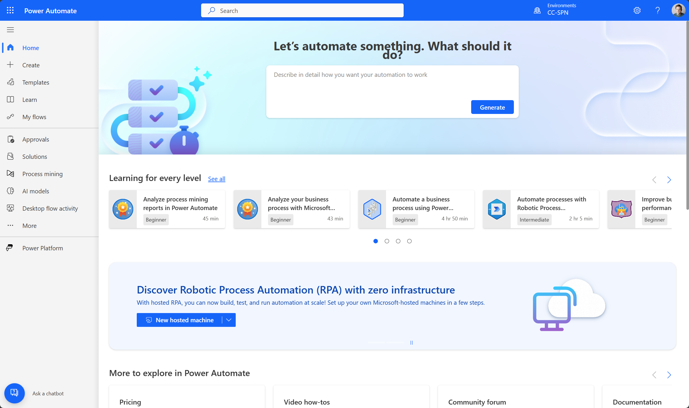

1. Select **More** in the left navigation
1. Select **Discover all** in the pop out

    

1. Scroll down the page, and in the **Data** section, make sure to click the **pin** next to **Custom connectors**. This will pin the **Custom connectors** section to the left navigation and this will be useful in this lab

    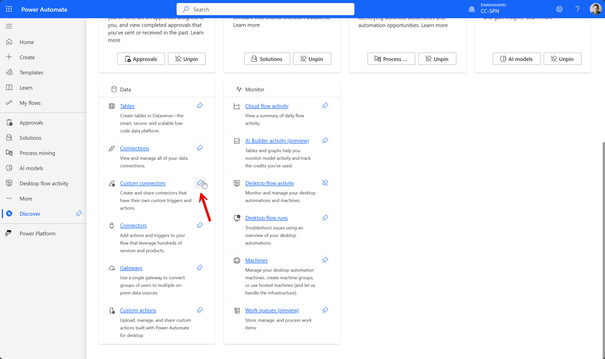

1. Select **Custom connectors** in the left navigation
1. In the custom connectors section, select **New custom connector** in the top-right and select **Create from blank**
1. Enter **Invitation Manager** as the name and select the blue **Continue** button
1. This will open the custom connector UI. Here we will do most of our work. Add the following description:

    ```text
    Use this connector to invite guests to your organization. When the invited guest accepts the invitation, they will get added as a guest/member to the organization.
    ```

1. Next, make sure to add `graph.microsoft.com` as the host
1. Add `/v1.0/` as the Base URL
1. Select **Security** at the bottom to move to the security section

    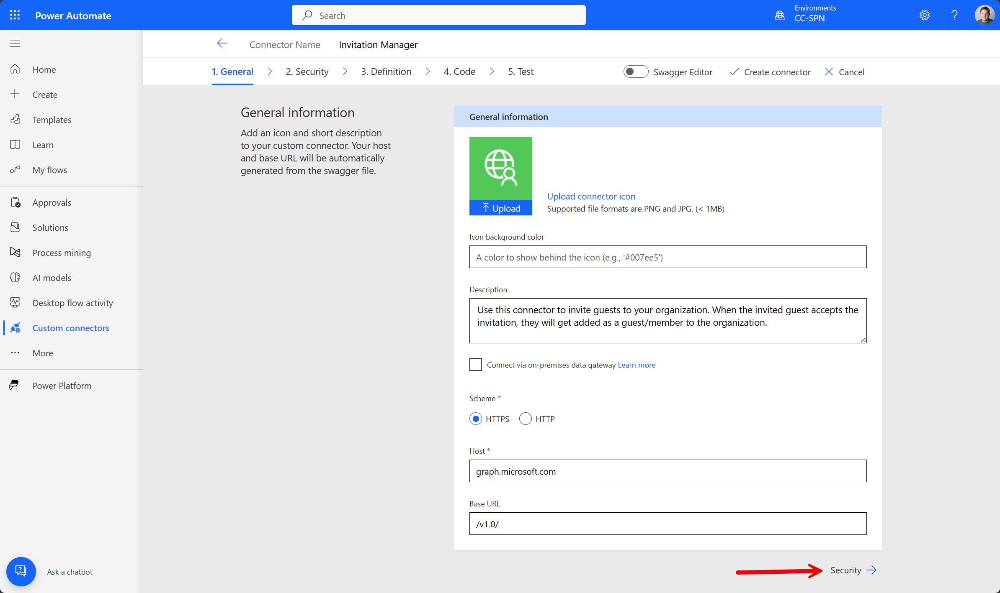

1. Change the authentication type from **No authentication** to **OAuth 2.0**
1. Change the identity provider from **Generic Oauth 2** to **Azure Active Directory**

> [!NOTE]
> Now you will see a bunch of fields appear, like *Enable Service Principal Support*, *Client ID*, *Client Secret* etc.
>
> To fill in these fields, we need to have an app registration. This app registration needs to be created in Entra ID. Let's do that first, because we need that before we can continue.

## Create an app registration

> [!IMPORTANT]
> For this section, you have to be able to create an app registration. In most organizations, this is not possible for end users. Make sure to have a dev environment and your own Microsoft 365 Developer Tenant, because it's highly likely you will not be able to finish this lab otherwise. If you don't know how to do this, watch [this video](https://www.youtube.com/watch?v=KYym2M9YocQ) by April Dunnam

Creating an app registration is fairly simple if you know how it works. This part of the lab is going to guide you through the whole process.

1. Go to the Azure Portal by adding a new tab in your browser. Enter [https://portal.azure.com](https://portal.azure.com) to go to the Azure Portal
1. If you're not logged in yet, make sure to log in with your developer account
1. Go to **Microsoft Entra ID** (This was previously named Azure Active Directory) by either searching for it or selecting it through the services part on the portal home page
1. Select **App registrations** in the left navigation
1. You might already see a couple of applications here. Select the **New registration** button at the top

    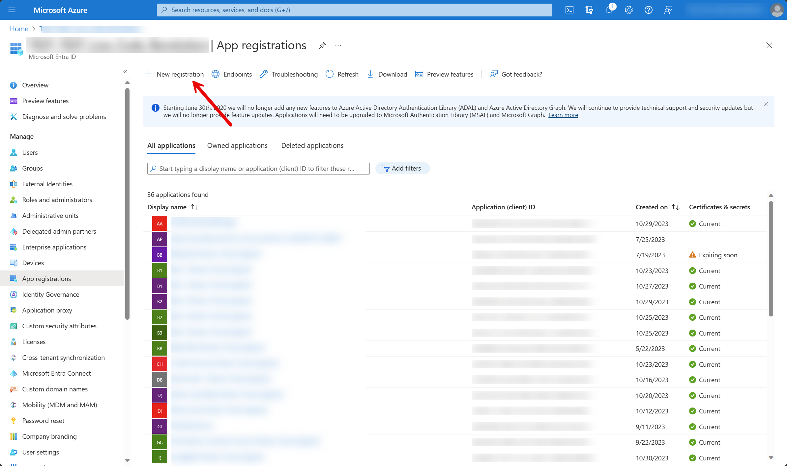

1. Enter `Invitation Manager - Custom Connector` as the name of the application
1. Select the blue **Register** button at the bottom
1. Next, you will see the overview page of your app registration, here you can find a bunch of helpful resources, like the *Application (client) ID*, the *Directory (tenant) ID* and more.
1. Open notepad (or another tool with the same functionality and copy the **Application (client) ID** and the **Directory (tenant) ID** to that and make sure to save it to a local file, so that you can find it back later
1. Go back to the overview page of your app registration and select the **Add a Redirect URI** on that page
1. Select the **Add a platform** link at the top
1. In the side panel, select **Web**
1. Copy and paste the following URI into the Redirect URIs input box:

    ```Text
    https://global.consent.azure-apim.net/redirect
    ```

1. Select the blue **Configure** button at the bottom of the side panel
1. Select **API permissions** in the left navigation
1. We need API permissions for our app registrations, but how do we know which API permissions are needed for the Invitation Manager operation? Open the [Microsoft Graph API Docs](https://aka.ms/invitationmanager) in a new browser tab
1. In the *permissions* part of that page, we can see that in the *Least privileged permissions* column for both the *delegated* and the *application* permission types, `User.Invite.All` is needed. Close the tab after checking the permissions

    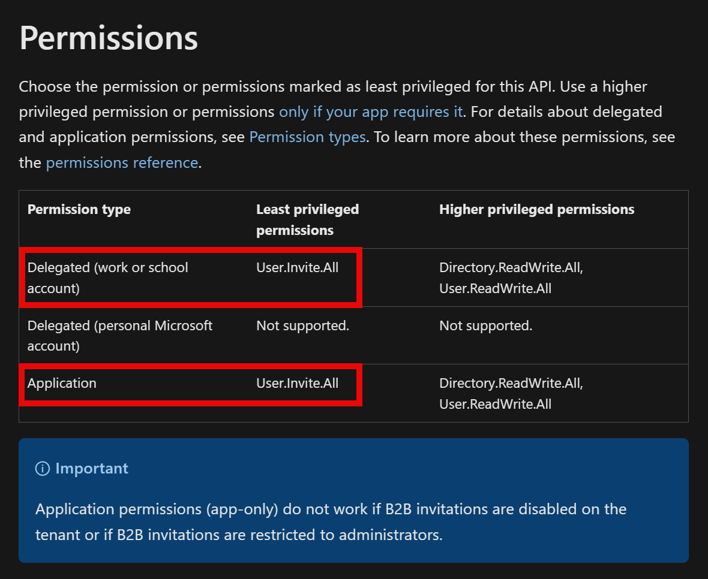

1. Let's add them in the API permissions section in the app registration. Select the **Add a permission** button in the API permissions section

    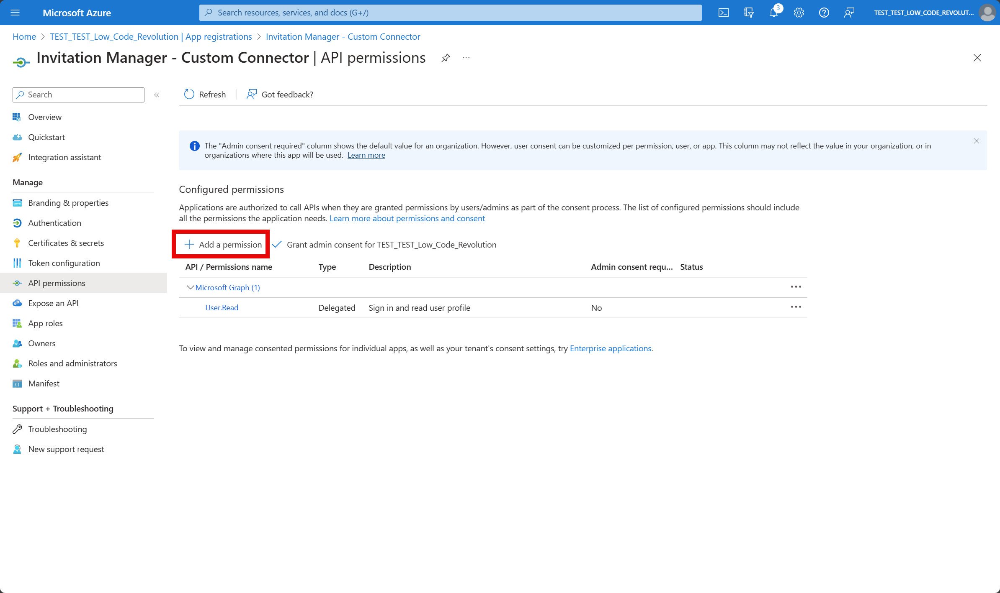

1. In the side panel, select Microsoft Graph
1. Select Delegated permissions
1. In the search box, type `User.Invite`, (1) expand the `User` part, (2) select the checkbox in front of `User.Invite.All` and (3) select the blue **Add permissions** button

    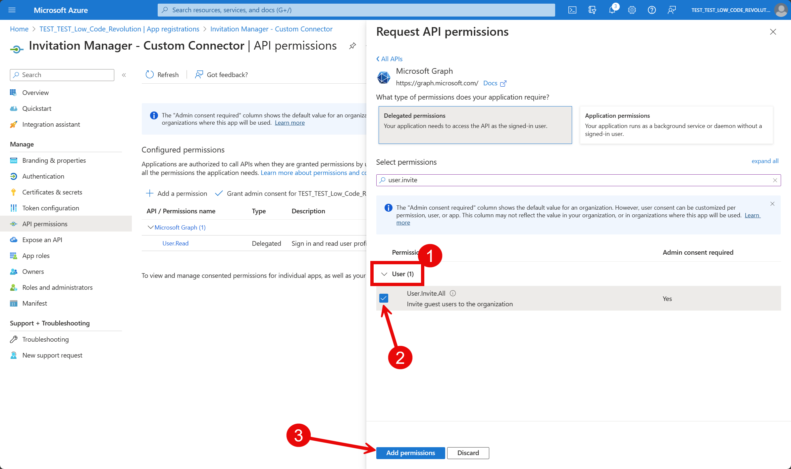

1. After adding the permission, you will see that the delegated permission `User.Invite.All` is added to the `Configured permissions` section, but it's not yet granted. This means we will have to grant admin consent, but we will not do this yet, since we also have to add the application permission for the same permission
1. Select the **Add a permission** button again
1. In the side panel, select Microsoft Graph
1. Select Application permissions
1. In the search box, type `User.Invite`, (1) expand the `User` part, (2) select the checkbox in front of `User.Invite.All` and (3) select the blue **Add permissions** button

    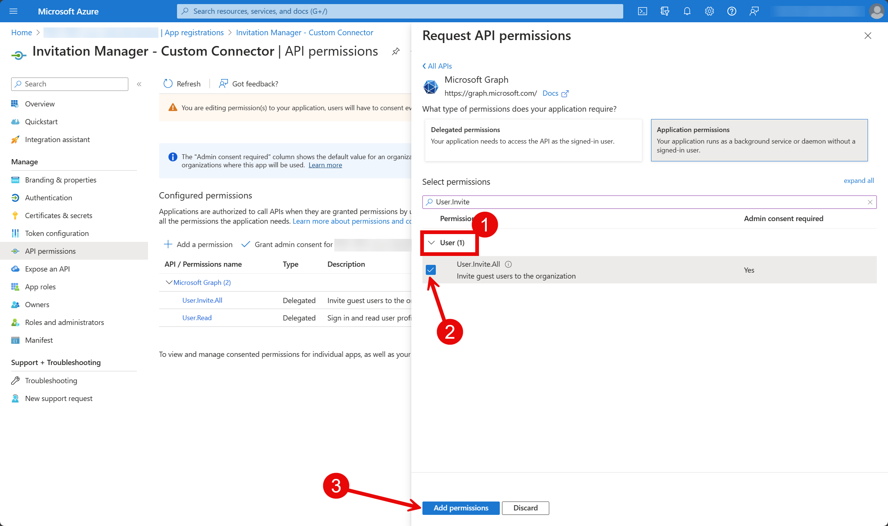

1. Take a look at the status of the permissions, it should show that the permissions we just added are not granted yet

    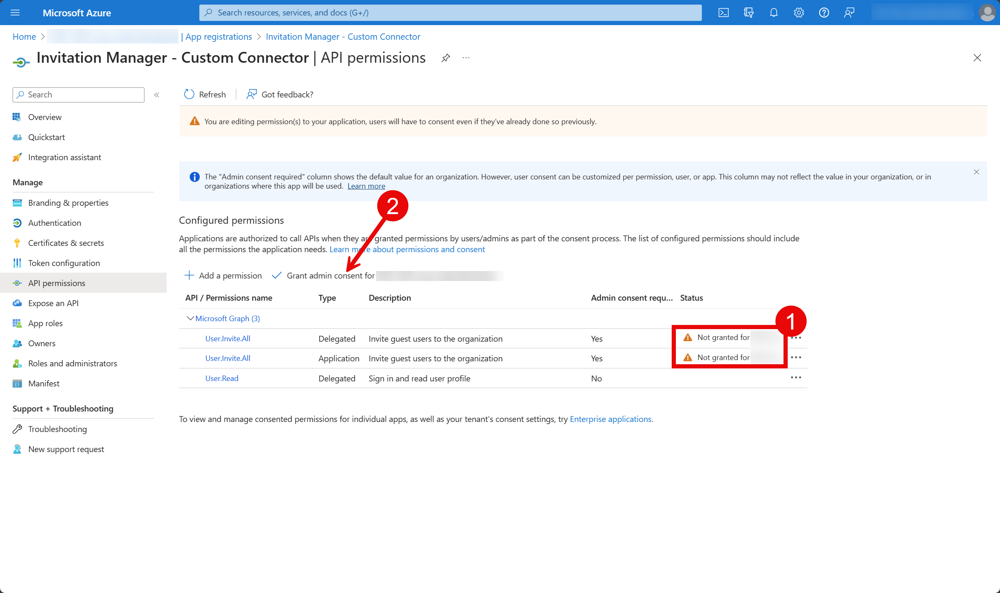

1. Select the **Grant admin consent** button
1. In the confirmation pop up, select the blue **Yes** button
1. Now, the status should be changed to `Granted`

    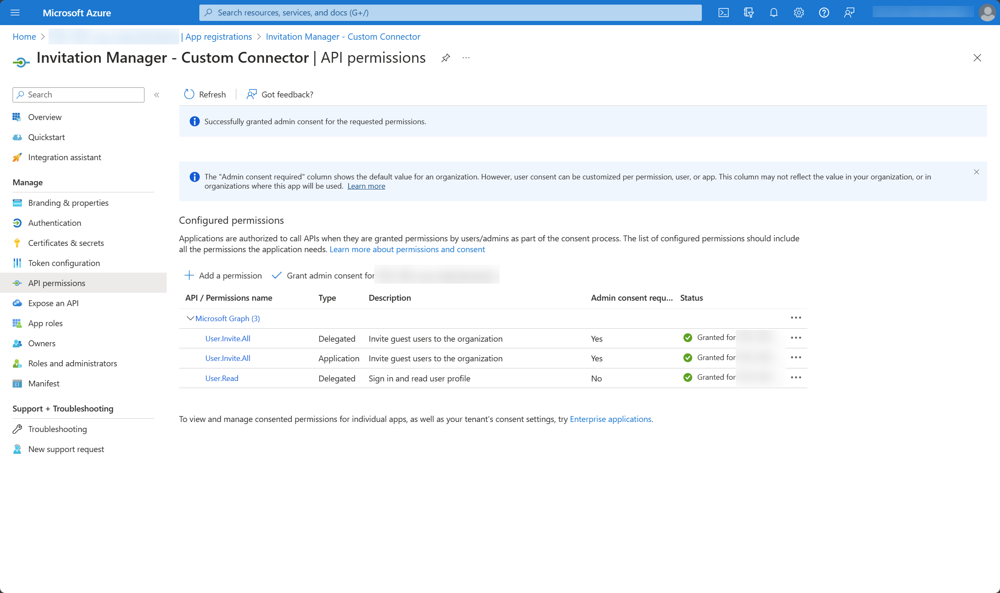

1. Select **Certificates & secrets** in the left navigation
1. In the `Clients secrets` tab, create a new client secret by selecting the **New client secret** button

    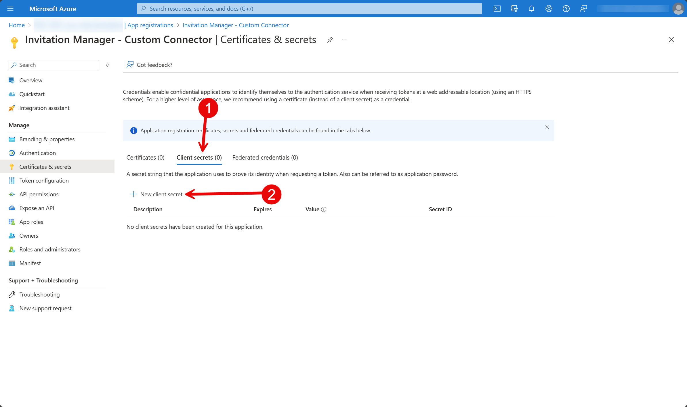

1. Enter `LabSecret` as the **Description**
1. Leave **Expires** on the recommended (default) value
1. Select the blue **Add** button at the bottom
1. Copy the value of the client secret we just created and save it in a safe place

    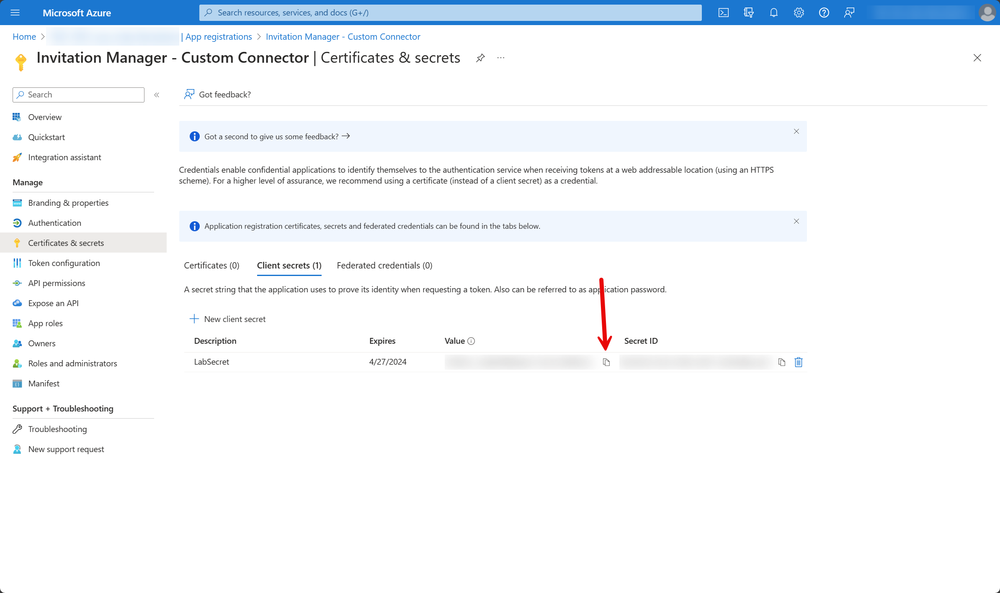

## Finish the connector

### Security section

Now we have finished setting up the app registration, we can set our focus on the custom connector again! Let's go back to the browser tab where we left of and continue setting up the custom connector!

1. Select the checkbox in front of **Enable Service Principal support**
1. In the **Client ID** text box, paste the client ID we copied to notepad
1. In the **Client Secret** text box, paste the client secret we saved in a safe place at the end of our last task
1. In the **Resource URL** text box, enter the following URL:

    ```https://graph.microsoft.com```

1. In the **Scope** text box, enter the following permission:

    ```User.Invite.All```

    Move to the next section (Definition), by selecting **Definition** at the bottom right.

    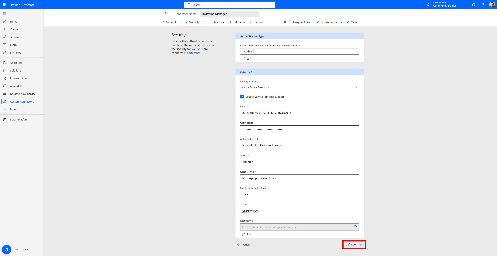

### Definition section

In the definition section, you have to add the actions and triggers you want in your connector. In this case, we only want to add the **Create an invitation** action.

1. Select the **New action** button in the `Actions` section on the left
1. In the **Summary** text box, enter `Create an invitation`
1. In the **Description** text box, enter `Use this action to create a new invitation. An invitation adds an external user to the organization.`
1. In the **Operation ID** text box, enter `CreateInvitation`
1. In the `Request` section, select the **Import from sample** button

    > [!NOTE]
    > This will open a side panel where you can import a sample request

1. In the **Verb** part of the side panel, select **Post**
1. For URL, enter the following URL:

      ```/invitations```

1. In the **Headers** text box, enter the following header:

    ```Content-Type application/json```

1. For the **Body**, copy the following request body and paste it in the text box. This is a sample JSON body, I got from the learn page for the create an invitation operation in the Microsoft Graph API

    ```json
    {
      "invitedUserDisplayName": "string",
      "invitedUserEmailAddress": "string",
      "invitedUserMessageInfo": {
        "ccRecipients": [
          {
            "emailAddress": {
              "address": "string",
              "name": "string"
            }
          }
        ],
        "customizedMessageBody": "string",
        "messageLanguage": "string"
      },
      "sendInvitationMessage": true,
      "inviteRedirectUrl": "string",
      "inviteRedeemUrl": "string",
      "resetRedemption": false,
      "invitedUserType": "string"
    }
    ```

1. Next, select the **Import** button. This will import the sample request and import this into our connector

    > [!IMPORTANT]
    >
    > The request section should look like this now:

    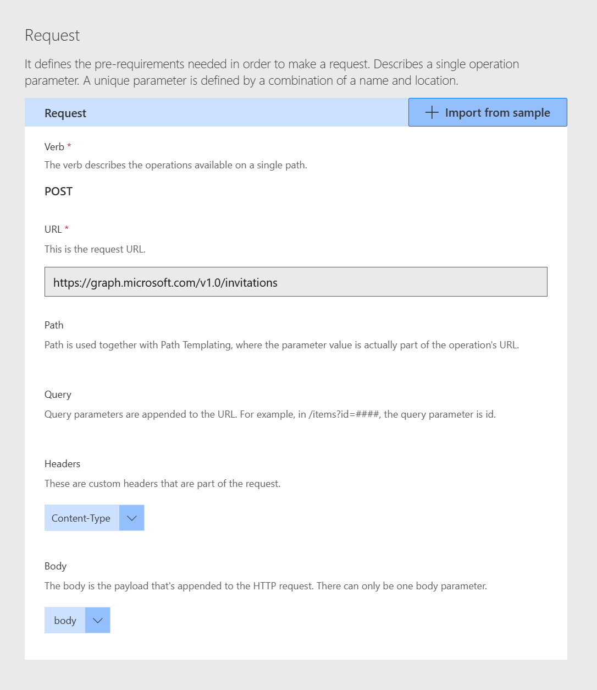

## Test the connector

TODO

## Test the connector in one of the products

TODO

## Download the connector to your own machine

TODO
