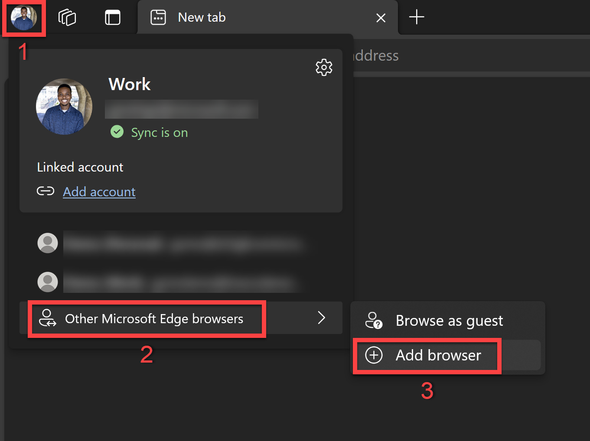
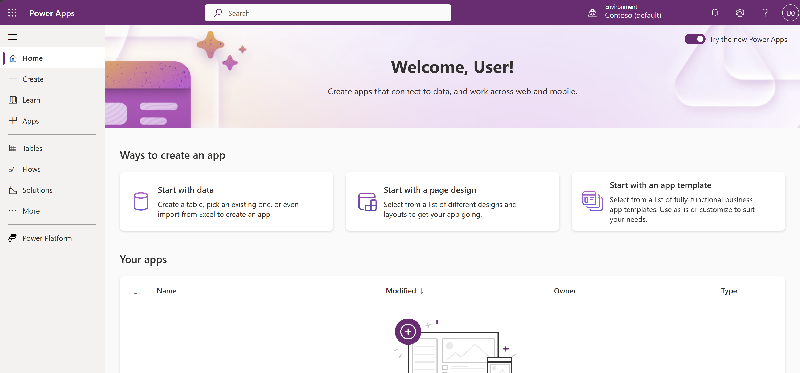
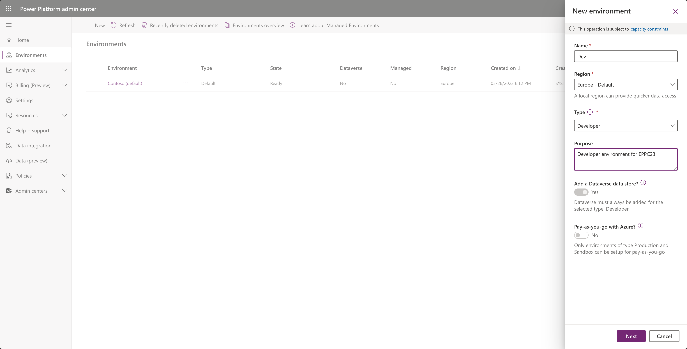
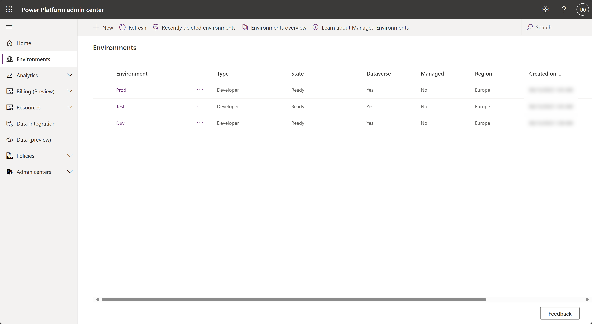
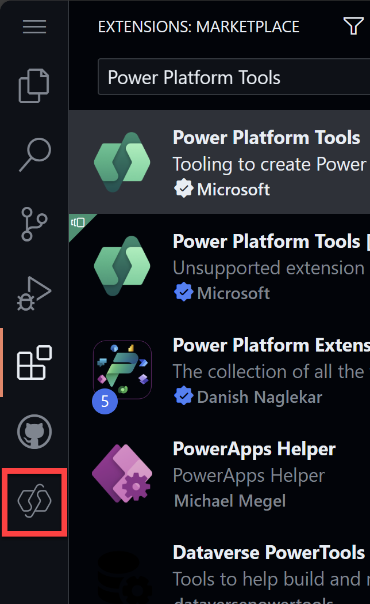
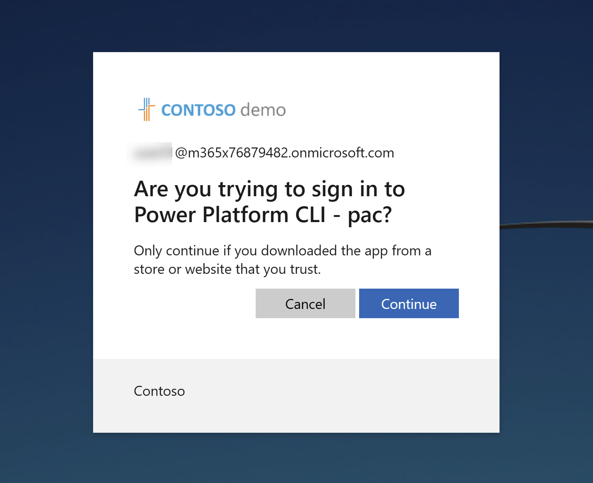
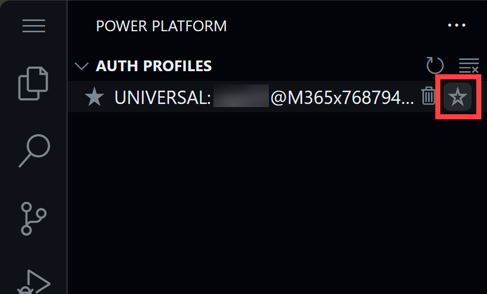

# Lab 01 - Tenant setup

In this lab, you will go through the following tasks:

* Creating a new browser profile
* Log into the account you are going to use during the workshop
* Create developer environments
* Create a GitHub account
* Create a codespace
* Install the Power Platform Tools extension
* Connect to the Power Platform environment

## Task 1: Create a new browser profile (Microsoft Edge)

1. Open Microsoft Edge
2. Click on the profile icon on the top left corner
3. Hover over "Other Microsoft Edge Browsers" and then select **Add Browser**



4. Click **Add**

This will then open up a new browser window on your taskbar.

5. Pin that browser window to your taskbar
6. In the new browser window, select **Start without your data**
7. Then select **Confirm and start browsing**.

It may prompt you to configure your new browser theme. If this happens, just select **Next** and then **Finish**.
## Task 2: Log on to your account

With the credentials that were provided to you, let's log into the account you are going to use during the workshop.

1. Go to [make.powerapps.com](https://make.powerapps.com)
2. On the sign-in screen, enter the email address that was provided to you and then click **Next**
3. Then enter the password and click **Sign in**

You should now be on the Power Apps Home Page.



## Task 3: Create developer environments

Developer environments are very helpful when you want to try out features, they are meant to be short living environments.

For this workshop, we are going to create three different developer environments:

* Dev | The environment where we are going to import our solution later on.
* Test | The environment where we are going to deploy our solution to in lab four.
* Prod | The environment where we are going to deploy our solution to in lab four.

To create developer environments, you can create them in two ways:

1. Via the Power Platform Admin Center
1. Via the Power Platform CLI

In this workshop, we will create the environments through the Power Platform Admin Center.

1. Go to the [Power Platform Admin Center](https://aka.ms/ppac)
2. Exit the Welcome / Tour pop up. You can do this by clicking on the **X** in the top right corner of the pop up screen
3. Click on **Environments** in the left navigation
4. Click on **New** in the top navigation
5. Enter the following information:

    | Field | Value |
    | --- | --- |
    | Name | Dev |
    | Region | Europe - Default |
    | Type | Developer |
    | Purpose | Developer environment for EPPC23 |



6. Click **Next**
7. Then finally click **Save**
8. Now do the same for the Test and Prod environments with the following information:

    | Field | Value |
    | --- | --- |
    | Name | Test |
    | Region | Europe - Default |
    | Type | Developer |
    | Purpose | Developer environment for EPPC23 |
        
    | Field | Value |
    | --- | --- |
    | Name | Prod |
    | Region | Europe - Default |
    | Type | Developer |
    | Purpose | Developer environment for EPPC23 |

9. Once you have created all three environments, you should see them in the list of environments. Click the **Refresh** button on the top navigation if you don't see them yet.



## Task 4: Create a GitHub account

For this workshop, we are going to be using GitHub. If you already have a GitHub account, you can skip this task.

1. Go to the [GitHub](https://github.com) website
2. Click on **Sign up** on the top right corner
3. Enter your email address (Use your personal email address) and then click **Continue**
4. Create a password and then click **Continue**
5. Enter a username and then click **Continue**
6. Select whether you want to receive product updates or not and then click **Continue**
7. Solve the puzzle to verify your account and then click **Create account**
8. Enter the code that was sent to your email address and then when you've navigated to the welcome screen, click **Skip personalization**

You now have a GitHub account. Welcome to the community!

## Task 5: Create a fork of the repository for this workshop

Now that you have a GitHub account, we are going to create a fork of the repository for this workshop. A fork is a copy of an existing repository. Forking a repository allows you to freely experiment with changes without affecting the original project.

1. Go to the [EPPC23-ALM](https://aka.ms/EPPC23-ALM) GitHub repository
2. Click on the **Fork** button on the top right corner

TODO: Add image of fork button + Create new fork page

3. Once the "Create a new fork" page opens, review the information and then click **Create Fork**

Once your have created the fork, you will be redirected to your forked repository. You can see that you are in your forked repository by looking at the top left corner of the page. It should say **your-username/EPPC23-ALM**.

## Task 6: Create a codespace

A codespace is a cloud-hosted development environment you can access from anywhere. It has everything you need, including a text editor, terminal, and debugger. Codespaces are powered by Visual Studio Code and run in a containerized environment. For this workshop, we are going to use codespaces to do our development.

1. Make sure that you are in your forked repository (_your-username/EPPC23-ALM_) and then find and click on the **<> Code** button

TODO: Add image of code button

2. On the **Code** pop up, select the **Codespaces** tab
3. Click **Create codespace on main**

A codespace will now be created for you in a new tab. This will take a few seconds. But once it's done, you will have a fully functional Visual Studio Code environment in your browser. You can now start developing!

## Task 7: Install the Power Platform Tools extension

The Power Platform Tools extension is a Visual Studio Code extension that allows you to interact with the Power Platform from within Visual Studio Code. It is a very important component of the ALM story for the Power Platform and for this workshop.

1. In your codespace, click on the **Extensions** icon in the left navigation

TODO: Screenshot of extensions icon with correct repository folders next to it

2. Search for **Power Platform Tools** and then click **Install** on the **Power Platform Tools** extension

TODO: Screenshot of search for Power Platform Tools

With the Power Platform Tools extension installed, you can now interact with the Power Platform from within Visual Studio Code. But before we can do that, we need to connect to a Power Platform environment.

## Task 8: Connect to the Power Platform environment
    
1. In your codespace, click on the **Power Platform** icon in the left navigation



You'll more than likely see that there is "No auth profiles found on this computer". Let's create one.

TODO: Screenshot of no auth profiles found

2. If you don't see it open already, let's open the Terminal. Click on the Burger menu icon in the top left corner and then hover over **Terminal** and then click **New Terminal**

3. Type the following command in the terminal and then press **Enter**:

    ```bash
    pac auth create
    ```

4. You will be prompted to use a web browser to authenticate. ctrl + click on the link that is provided in the terminal and then enter the code provided.

5. Select your account to sign in. 

You will then see a page asking if you're trying to sign in to Power Platform CLI - pac. 



6. CLick **Continue**

You'll then see a prompt confirming that you have successfully signed in to Power Platform CLI - pac. Close the browser tab and return to your codespace.

You should now see at least one auth profile. If you have more than one, you can select the one you want to use by clicking on the **Select Auth Profile** button next to the auth profile.



TODO: Connect to dev env???


[⏭️ Move to lab 02](../lab-02/readme.md)
                    
