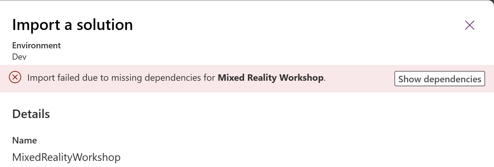
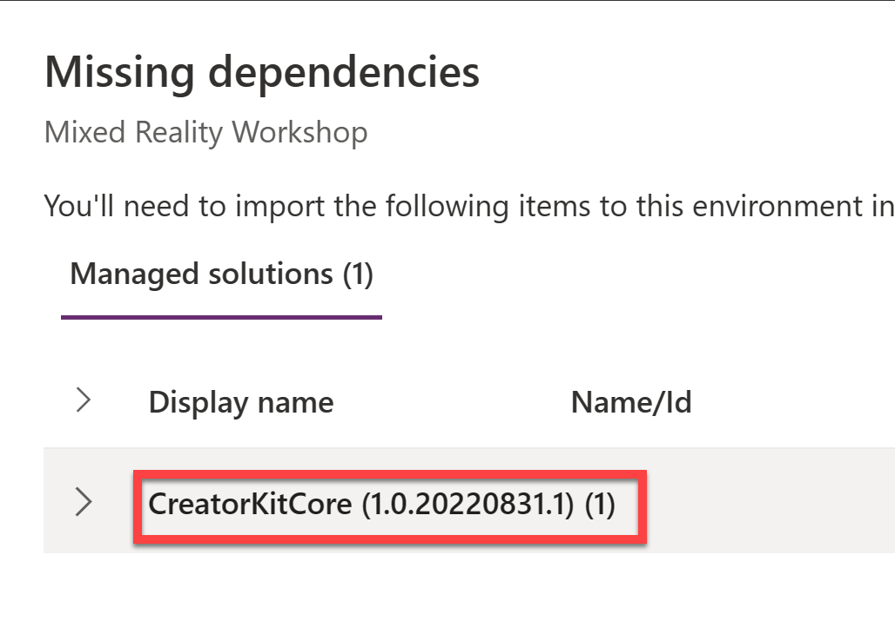

# Lab 02 - Work with solutions

In this lab you will learn the following:

* Uploading assets to OneDrive
* Import a solution zip file
* Export a solution from an environment
* Unpack a solution
* Inspect the solution folders
* Clone a solution

## Task 1: Uploading assets to OneDrive

In this task, you will be uploading a couple of assets to your OneDrive. The solution we will be working with later uses **OneDrive for Business** as a connector to retrieve files and images and their respective information directly from OneDrive to be used in a Canvas App.

1. In the browser, navigate to [OneDrive](https://portal.office.com/onedrive) and sign in with your credentials for this workshop

Since this is most probably your first time signing into OneDrive with these credentials, you will see a welcome screen.

2. Click **Your OneDrive is ready**

3. Once inside OneDrive, select **My files** on the left navigation bar.

Now you will be downloading the assets needed to upload to your OneDrive.

4. In a new browser tab, navigate to the [Coral Collection.zip](../assets/OneDrive%20folder/Coral%20Collection.zip) folder in this repository

5. Download the zip file to your computer

TODO: Add screenshot of download and update download instructions when repo has been moved to official workshop repo

6. Navigate to the folder where you downloaded the zip file and extract the contents. You should now have a folder called **Coral Collection**.

7. Go back to your OneDrive tab and click **Upload** and select **Folder**. 

8. Navigate to the **Coral Collection** folder and select it.

9. Click **Upload** to upload the folder to your OneDrive.

This may take a few minutes depending on your internet connection. Once the upload is complete, you will see the **Coral Collection** folder in your OneDrive. Open the folder to find 2 additional folders; _Models_ and _Photos_, as well as a CoralCollection.xlsx file.

## Task 2: Import a solution zip file

In this task you will import a solution zip file into your Developer Environment. The solution that you will be working with throughout this workshop is from our [Mixed Reality Workshop](https://github.com/microsoft/PowerPlatformAdvocates/blob/main/Workshops/MR/README.md). 

1. In the browser, go to [make.powerapps.com](https://make.powerapps.com) and sign in with your credentials for this workshop

2. Make sure you are Dev environment. You can check this by looking at the top right corner of the screen. If you are not in the Dev environment, click on the environment name and select **Dev**.

3. In a new browser tab, navigate to the [MR_Solution.zip](../assets/solution/MR_Solution.zip) folder in this repository

4. Download the zip file to your computer

5. Go back to your Power Apps tab and click on **Solutions** on the left navigation bar

6. Click on **Import Solution** on the top navigation bar

7. Select **Browse** and navigate to the **MR_Solution.zip** file that you downloaded in step 4. Click **Open**

8. Click **Next**

The import will fail at this point due to missing dependencies. We will fix this in the next few steps. 

9. Click **Show dependencies**

You'll notice that the missing dependency is the Creator Kit which is used in the original Mixed Reality solution. Let's go ahead and add that in.

10. Click **Close** to close the dependency window and then click **Cancel** to cancel the import

11. Open a new tab and go to the [Power Platform Admin Center](https://aka.ms/ppac) and sign in with your credentials for this workshop

12. Click on **Environments** on the left navigation bar and then select **Dev** from the list of environments

13. Select **Resources** from the top navigation bar and then select **Dynamics 365 apps**. 

14. Click on the **Install app** button

15. Select the **Creator Kit** and then click **Next**

16. Select the **I agree to the terms of service** checkbox and then click **Install**

17. 