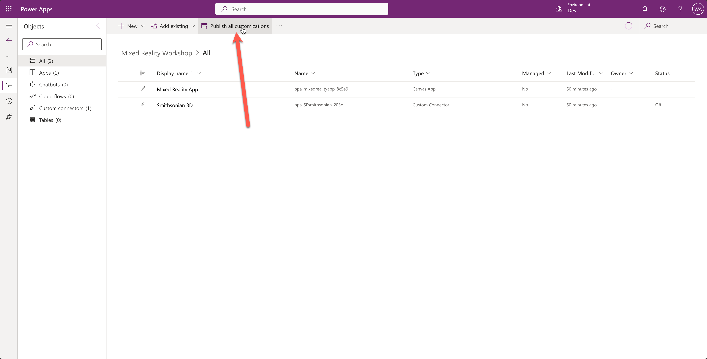

# Lab 03 - Work with solutions with a team

In Lab 02 you learned how to work with solutions. Now we are going to focus on building solutions when you're in a team. 

In this lab, you will have to imagine you're someone else. You will pretend you are your colleague in the following tasks:

* Add a screen to the MR app
* Create a new branch
* Sync the updated solution to the new branch
* Run the solution checker
* Commit the changes to the new branch
* Create a pull request (PR)

## Task 01: Add a screen to the MR app

In this task, you will act like you're a colleague who wants to change the Mixed Reality solution you imported in lab 02. 

1. Go to the [maker portal](https://make.powerapps.com)
1. Check if you are in the `Dev` environment and if not, switch to that environment
        
1. Go to Solutions via the left menu
1. Select the `Mixed Reality Workshop` solution by selecting the display name
        
1. Select the `elipsis` and select `Edit`
        
1. Select `New screen`, select `Templates`, and select the `Tutorial` screen
        
1. In the tree view on the left scroll down until you see `Screen1`, select the `elipsis` next to it, and select `Rename`
        
1. Select the `Overview Screen`, right-click on the `Smithsonian 3D Search` button and select `Copy`
        
1. Right-click on the screen and select `Paste` to paste a copy of the button
        
1. Position the button below the others, add the following formula (yes, this is an incorrect formula, but you will learn why later in this lab) for the `OnSelect` property in the formula bar:  
    `Navigate('Tutorial Screen', ScreenTransition.Fade`  
    Change the `text` property on the right to:  
    `Tutorial Screen`
        
1. Select the `elipsis` next to `btn3DSearch_1`, select `Rename`, and rename the button to `btnTutorial`
        
1. Save the app and publish it
        
1. Select the purple `Publish this version` button
        
1. Select back to go back to the solution
        
1. Confirm that you want to leave the app
        
1. In the solution explorer, select the `Publish all customizations` button in the command bar at the top
        

These were all the changes you had to do for the MR app. Let's move onto the next task.

## Task 02: Create a new branch

In this task, you will learn how to create a new branch in GitHub. 

1. Go back to your forked environment
1. Open up your Codespace by selecting `Code` and selecting your Codespace
        
1. Select the name of the branch (`main`) and select `Create new branch...` at the top
        
1. Enter a name for the branch (`add tutorial screen`), see how it will convert a space to a dash and hit enter to create it
        
1. Select the button next to the name of your branch to publish your branch to GitHub. This will make it available for others that have access to the GitHub repo
        

Now that the branch is available to everyone who has access to the GitHub repo, you can also view it in the browser by going to your fork, and then selecting `main`. This will show a list of branches, and your branch that just got published should be there too.

## Task 03: Sync the updated solution to the new branch

In task 03, you will learn how to sync the latest changes back to your Codespace. 

1. Go back to your Codespace
1. Change your directory to the directory where you cloned the solution to by using the following command:  
    `cd assets/export/MixedRealityWorkshop/`
    
1. Now we are in the right directory to sync the latest changes. Use the following command to get the latest changes:  
    `pac solution sync --processCanvasApps`  
    Notice that you don't have to add the solution name now. The Power Platform CLI is smart enough to get that from the current directory

## Task 04: Run the solution checker

TODO

## Task 05: Commit the changes to the new branch

TODO

## Task 06: Create a pull request (PR)

TODO

## Next lab

[⏭️ Move to lab 04](../lab-04/README.md)
