# Lab 03 - Work with solutions with a team

In Lab 02 you learned how to work with solutions. Now we are going to focus on building solutions when you're in a team. 

In this lab, you will have to imagine you're someone else. You will pretend you are your colleague in the following tasks:

* Add a screen to the MR app
* Create a new branch
* Sync the updated solution to the new branch
* Run the solution checker
* Commit the changes to the new branch
* Create a pull request (PR)

## Task 01: Add a screen to the MR app

In this task, you will act like you're a colleague who wants to change the Mixed Reality solution you imported in lab 02. 

1. Go to the [maker portal](https://make.powerapps.com)
  
1. Check if you are in the **Dev** environment and if not, switch to that environment
  
    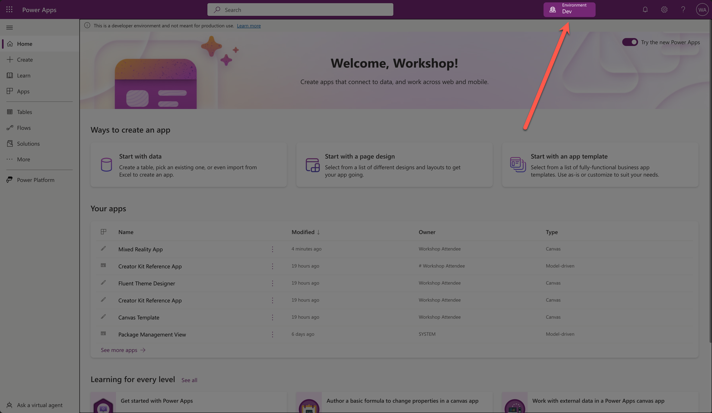
  
1. Go to Solutions via the left menu
  
1. Select the **Mixed Reality Workshop** solution by selecting the display name
  
    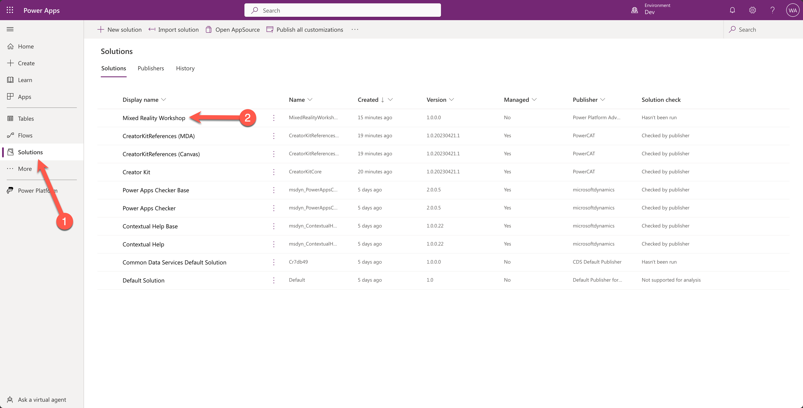
  
1. Select the **elipsis** and select **Edit**
  
    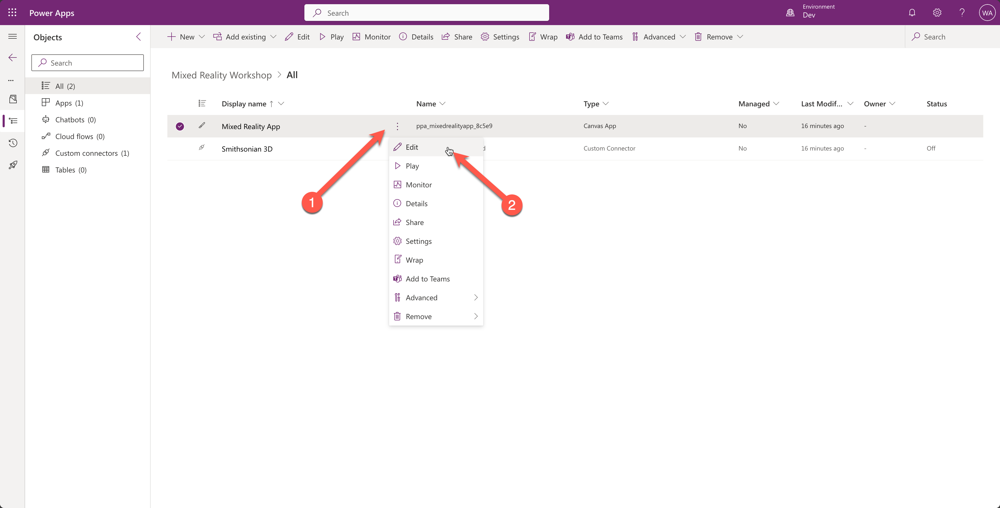
          
1. Select **New screen**, select **Templates**, and select the **Tutorial** screen
          
    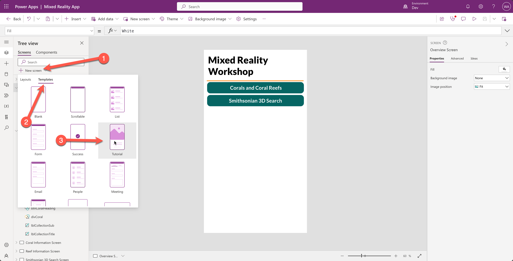
          
1. In the tree view on the left scroll down until you see **Screen1**, select the **elipsis** next to it, select **Rename**, and rename it to `Tutorial Screen`
  
    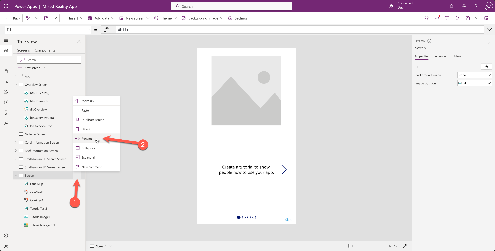
  
1. Select the **Overview Screen**, right-click on the **Smithsonian 3D Search** button and select **Copy**
  
    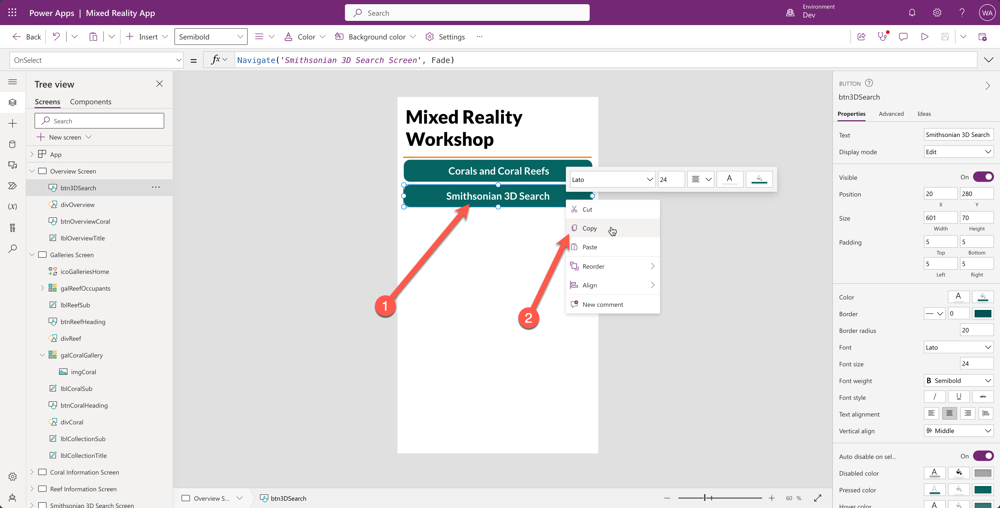
  
1. Right-click on the screen and select `Paste` to paste a copy of the button
  
    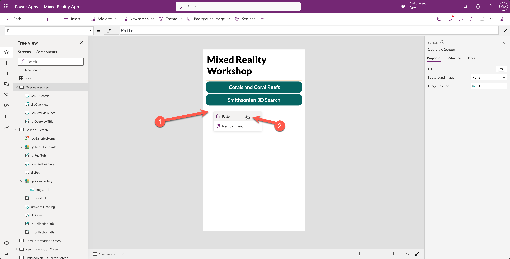
  
1. Position the button below the others, add the following formula (yes, this is an incorrect formula, but you will learn why later in this lab) for the **OnSelect** property in the formula bar:  

    ```Navigate('Tutorial Screen', ScreenTransition.Fade```  
    
    Change the **text** property on the right to:  
    
    ```Tutorial Screen```
      
    
          
1. Select the **elipsis** next to `btn3DSearch_1`, select **Rename**, and rename the button to `btnTutorial`
  
    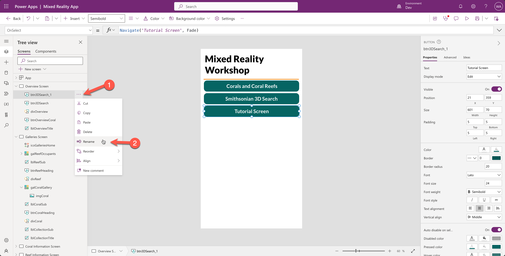
  
1. Save the app and publish it
  
    
  
1. Select the purple `Publish this version` button
  
    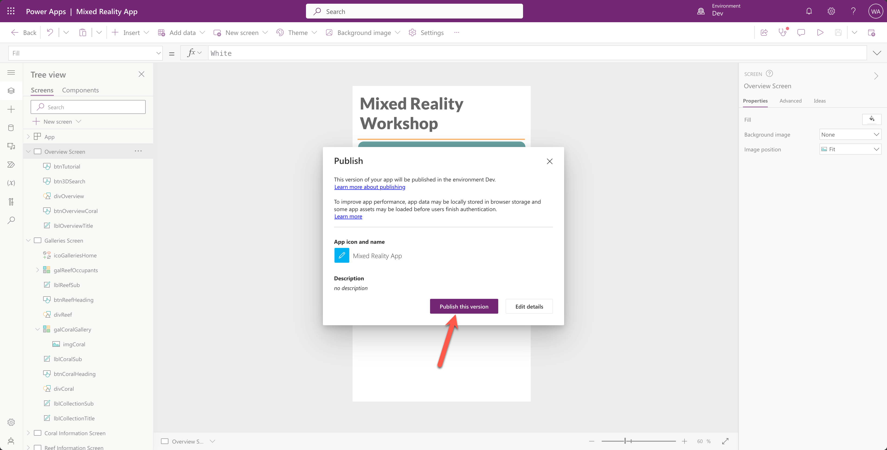
  
1. Select back to go back to the solution
  
    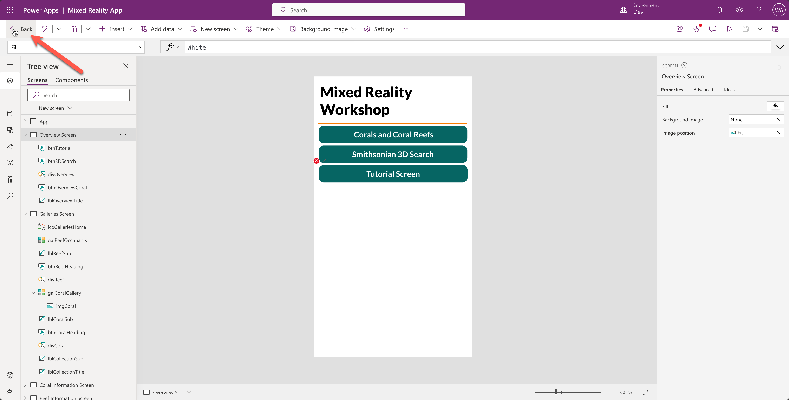
  
1. Confirm that you want to leave the app
  
    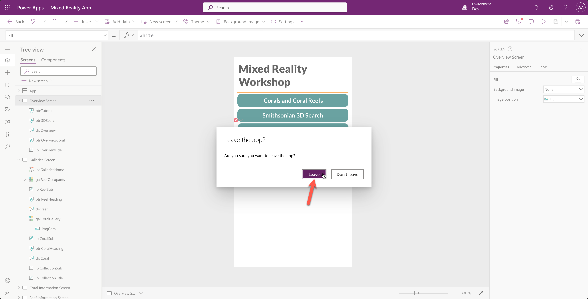
  
These were all the changes you had to do for the MR app. Let's move onto the next task.

## Task 02: Create a new branch

In this task, you will learn how to create a new branch in GitHub. 

1. Go back to your forked environment
  
1. Open up your Codespace by selecting **Code** and selecting your Codespace
  
    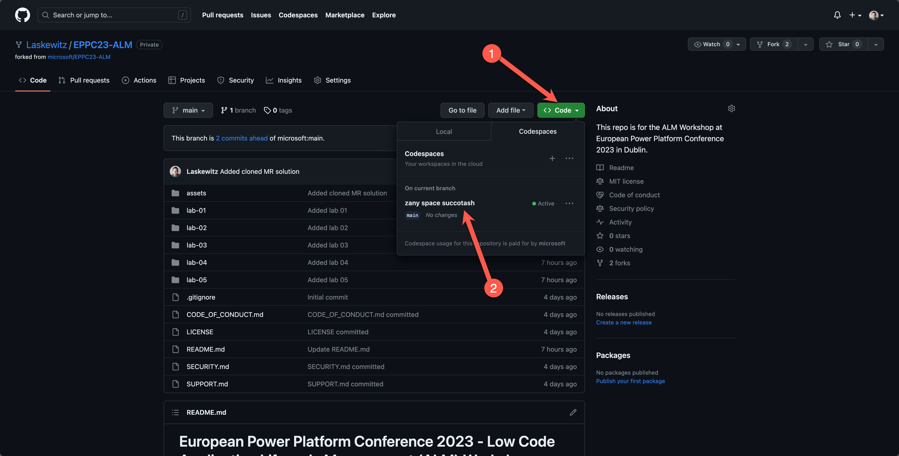
  
1. Select the name of the branch (**main**) and select **Create new branch...** at the top
  
    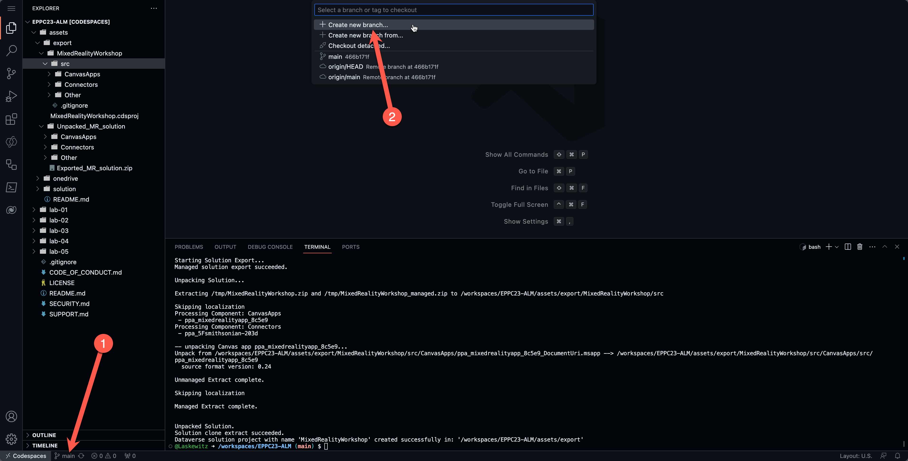
  
1. Enter a name for the branch (`add tutorial screen`), see how it will convert a space to a dash and hit enter to create it
  
    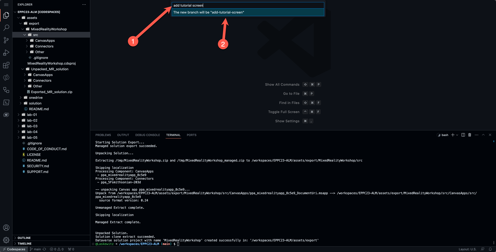
  
1. Select the button next to the name of your branch to publish your branch to GitHub. This will make it available for others that have access to the GitHub repo

    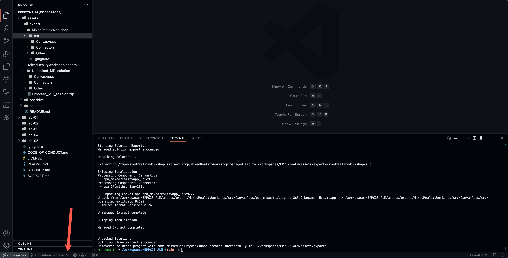

Now that the branch is available to everyone who has access to the GitHub repo, you can also view it in the browser by going to your fork, and then selecting **main**. This will show a list of branches, and your branch that just got published should be there too.

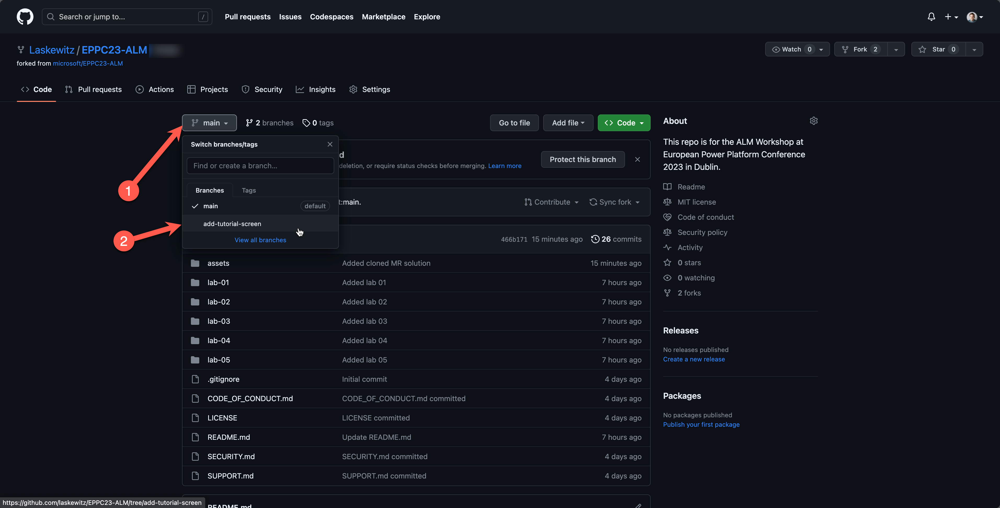

## Task 03: Sync the updated solution to the new branch

In task 03, you will learn how to sync the latest changes back to your Codespace. 

1. Go back to your Codespace
  
1. Change your directory to the directory where you cloned the solution to by running the following command in your terminal:  
  
    `cd assets/export/MixedRealityWorkshop/`  
      
    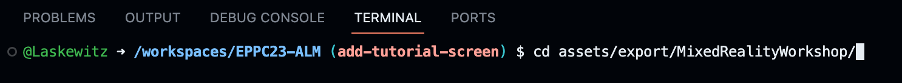
1. Now, we are in the right directory to sync the latest changes. Run the following command in your terminal to get the latest changes:  
  
    `pac solution sync --processCanvasApps`  
    
    > **Command Explanation:** 
    >
    > ```pac solution sync``` is the command that we are using to sync the latest version (that we just published in the maker portal) of the solution that we cloned in an earlier stage.
    >
    > ```--processCanvasApps``` is the parameter that we use to unpack the canvas apps in the solution.
    > 
    > Notice that you don't have to add the solution name now. The Power Platform CLI is smart enough to get that from the current directory
  
1. Next, you will see a lot of changes in the source control section again, select the `source control` icon in the left menu, select the `Overview screen.fx.yaml` file and you will be able to see all the changes that we made to that screen. Feel free to check out the other files that changed  
  
    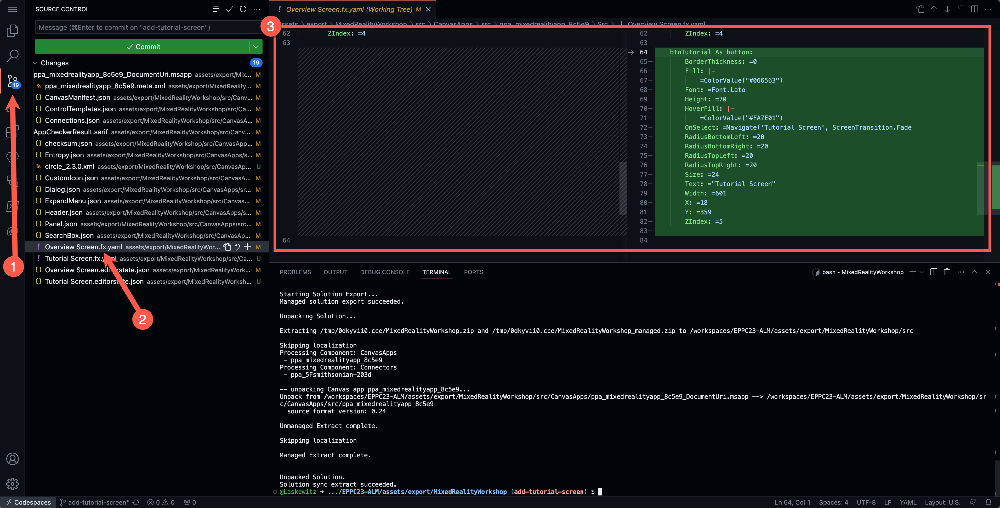

1. It's time to pack your synced solution. Run the following command in your terminal to pack your solution to a managed solution:
  
    `pac solution pack --folder ./src/ --zipfile ../Packed_MR_Solution.zip --packagetype Managed --processCanvasApps`  
      
    > **Command Explanation:** 
    >
    > ```pac solution pack``` is the command that we are using to pack the solution we just synced.
    >
    > ```--folder ./src/``` is to point at the src folder that contains the solution.
    > 
    > ```--zipfile ../Packed_MR_Solution.zip``` is the path and the filename of the zip-file we want to generate of the solution.
    >
    > ```--packagetype Managed``` is to make sure we are packing a managed solution.
    > 
    > ```--processCanvasApps``` is the parameter that we use to indicate that we also want to pack the unpacked canvas apps in the unpacked solution folder.
  
This file was needed as a prerequisite for task 04. Let's move on to the next task.

## Task 04: Run the solution checker

Before you commit the changes, you of course want to make sure there are no critical errors in your solution. This is why the Power Platform CLI offers the possibility to run the solution checker.

1. Go back to your Codespace
  
1. Run the following command in the terminal:
  
    `pac solution check --path ../Packed_MR_Solution.zip --outputDirectory ../checker-reports --geo Europe`
    
    > **Command Explanation:** 
    >
    > ```pac solution check``` is the command that we are using to check the solution for errors.
    >
    > ```--path ../Packed_MR_Solution.zip``` is to point at the path of the solution we just packed.
    > 
    > ```--outputDirectory ../checker-reports``` is to make sure the outputs get saved to the `checker-reports` directory one level higher of the current directory.
    >
    > ```--geo Europe``` is to select the geography of the solution checker API. Europe is closest in this case.
  
1. The results will show up in the terminal after a while
  
    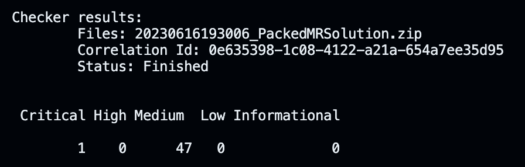

1. Open up the **checker-reports** directory, right-click on the zip-file that was generated by the checker and select **Download...**
  
    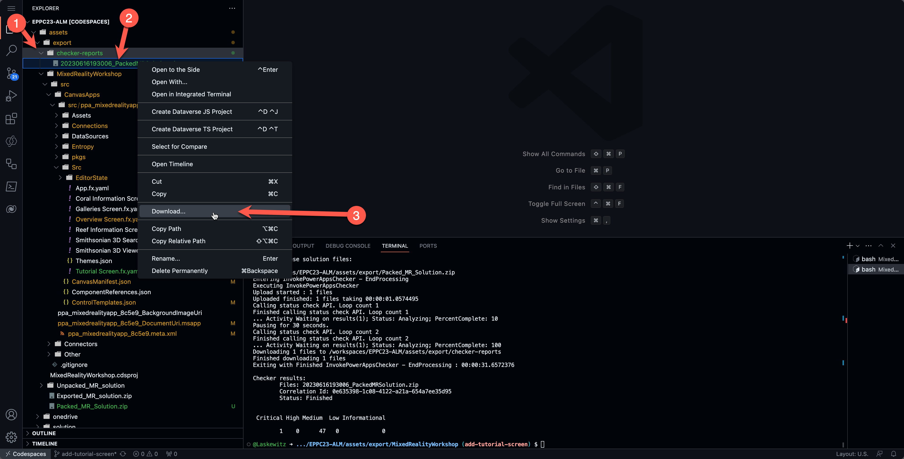
  
    This will download the zip-file locally

1. Unzip the file locally. This will show a SARIF-file as output
  
1. This SARIF-file is a JSON-file, with a lot of info, so it's not a good idea to look through it in notepad for instance. Luckily, Microsoft has a web reader for SARIF-files. Go to the online [SARIF-viewer](https://microsoft.github.io/sarif-web-component/)
  
1. Select the **Open...** button on the top-right corner and select the file you unpacked

    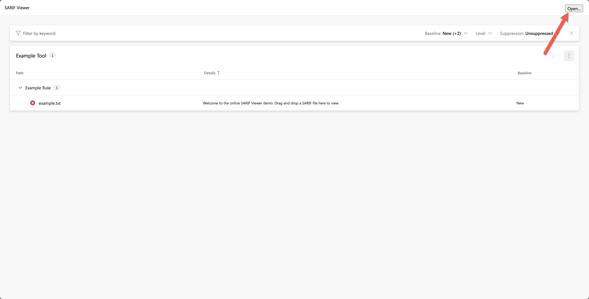

1. The SARIF-viewer will show all the findings of the solution checker

    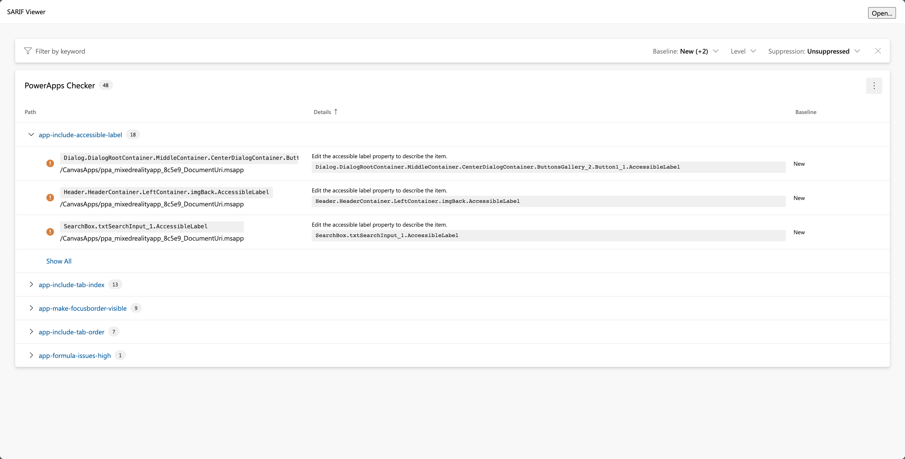

1. Select the **Level** filter and select the checkbox in front of **Error**
  
    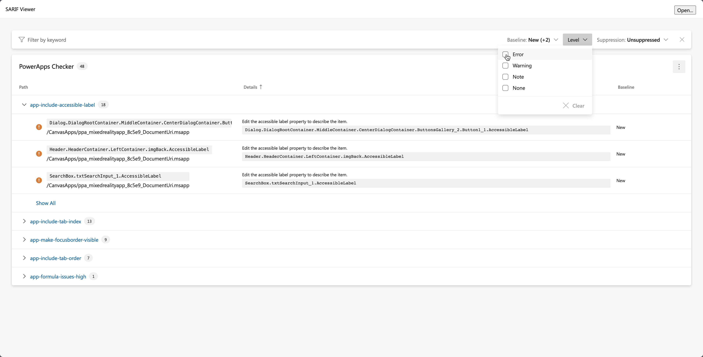

1. Now, only the errors will show. And we can see there are issues with the formulas in our canvas app
  
    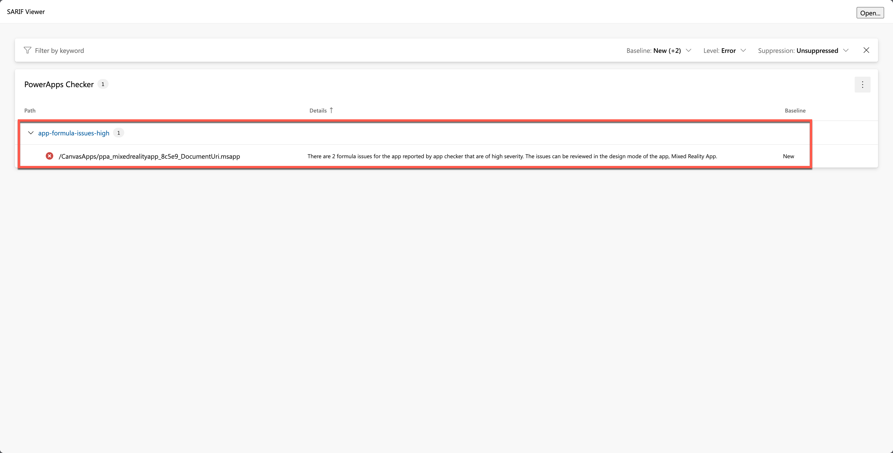

The SARIF-viewer tells us that we can review the issues in design mode of the app. We won't do that now, but these issues can be found by selecting the **App checker** icon, and selecting the **chevron ＞** next to Formulas.

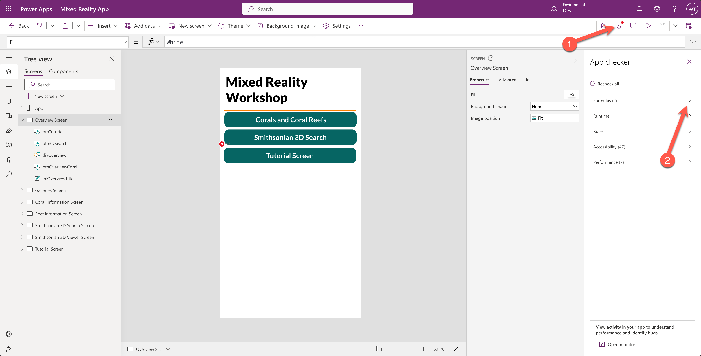

Next you will see the explanation of the errors in the sidebar.

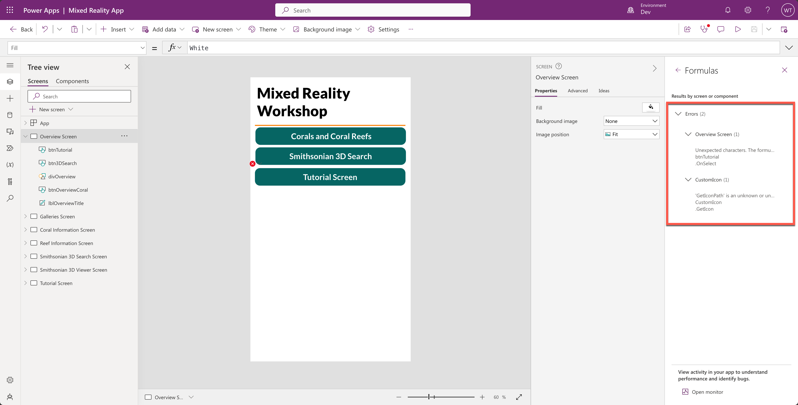

This task ends here, you won't have to fix all the errors. You know how this can be done and how you can read the SARIF-file.

## Task 05: Commit the changes to the new branch

In this lab, you will commit the changes that were done to the new branch, so that you can create a pull request (PR) later on.

1. Go back to your Codespace

1. Select the **Source Code** icon in the left menu, add a commit message (for instance `Added tutorial screen + button on overview screen`), and select **✔️ Commit**

    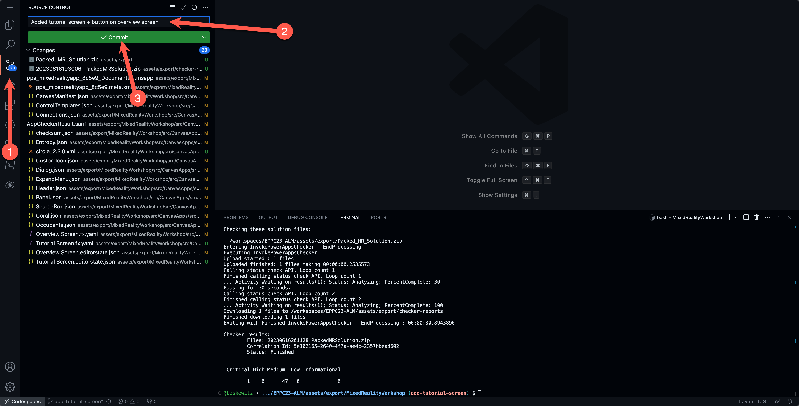

5. A popup dialog may appear alerting you of the fact that there are no staged changes. It may also ask you to stage all changes and commit them directly. Select **Yes**

    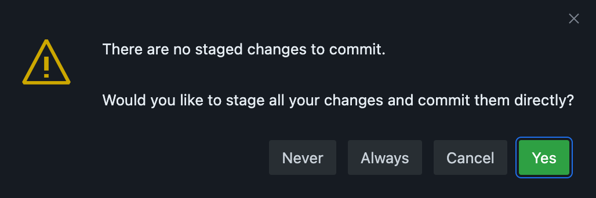

    Now because we're using a codespace, the commit will save the changes inside of this codespace. We need to sync changes to our forked repository as well.

6. Click **Sync Changes** in the Source Control panel

    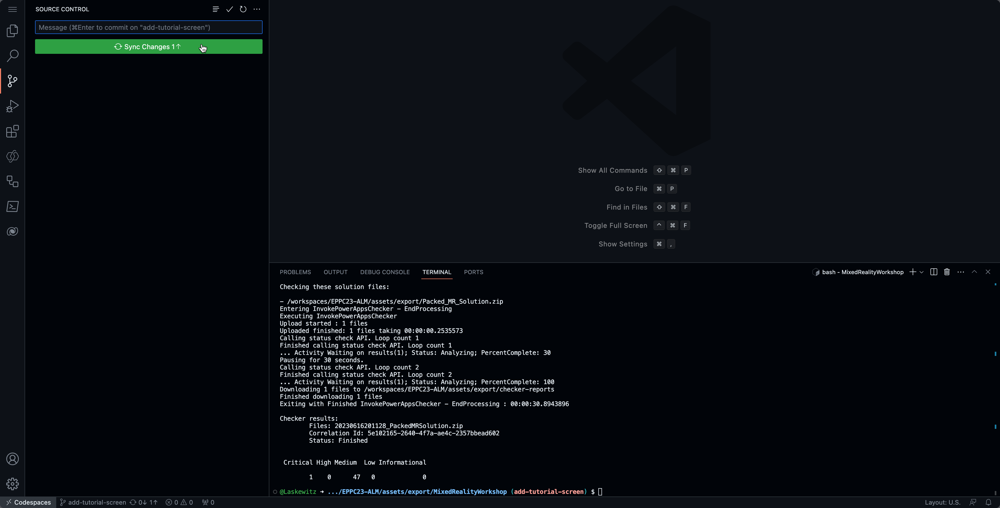

    This will push the changes to your forked repository.

7. And then on the popup dialog, click **Ok** to confirm that this action will pull and push commits from and to "origin/main"

    Now our codespace is synced with our forked repository.
  
That is correct, because the formula that was used for navigation didn't work correctly. This is a good example of how you can catch errors before you deploy a solution to others.

## Task 06: Create a pull request (PR)

In this lab, you will learn how you can create a pull request, which is basically a way to propose changes to a GitHub repo.

1. Go back to your forked environment on GitHub

1. Select the **Compare & pull request** button 
  
    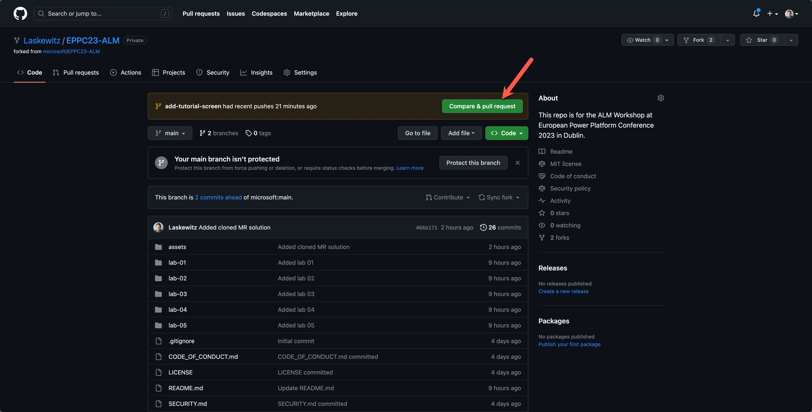
  
1. Select the **base repository** dropdown and select your own fork from the list
  
    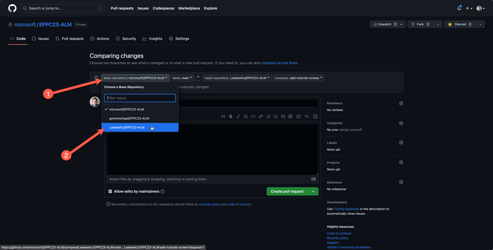
  
1. Review the **title** and the **description** of your pull request and select the green **Create pull request** button
  
    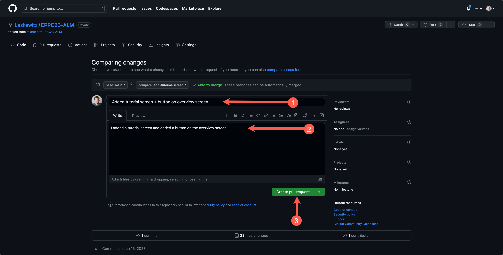

You have now created a pull request. Now the reviewer of the pull request can for instance look at the proposed changes by selecting the files changed tab in the pull request.

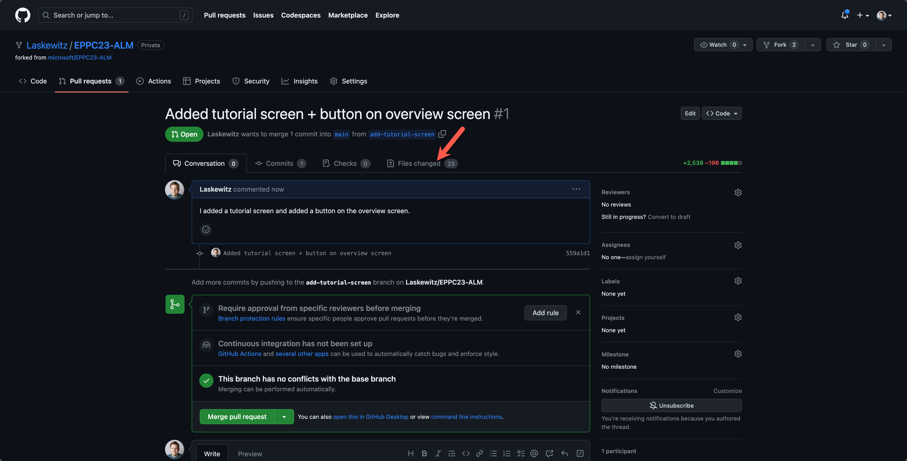

Here it's possible for the reviewer to for instance see all the changes you saw in Codespaces before you committed the changes.

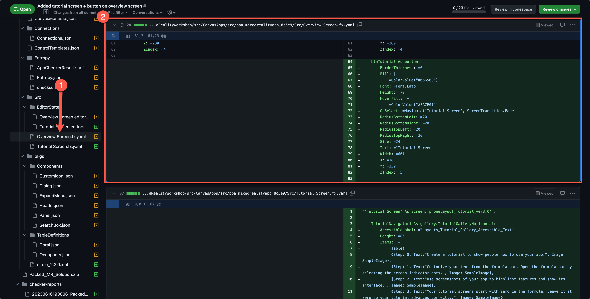

This is the end of this lab, in the next lab you will learn how to deploy this solution, using pipelines for Power Platform.
  
## Next lab

[⏭️ Move to lab 04](../lab-04/README.md)
