# Lab 04 - Deploy the solution to test and production environments

In this lab, you will work on the outer loop. You will perform the following tasks:

* Deploy the pipelines solution to your dev environment
* Setup your first pipeline
* Create a first deployment of the imported solution from lab 02

## Task 1: Deploy the pipelines solution to your dev environment

In this task, you will learn how to install the pipelines for Power Platform solution in your dev environment. This solution is needed to configure pipelines. Normally you would install this on a seperate environment, but in this case, you will install it on the dev environment.

1. Go to the [Power Platform Admin Center](https://aka.ms/ppac)
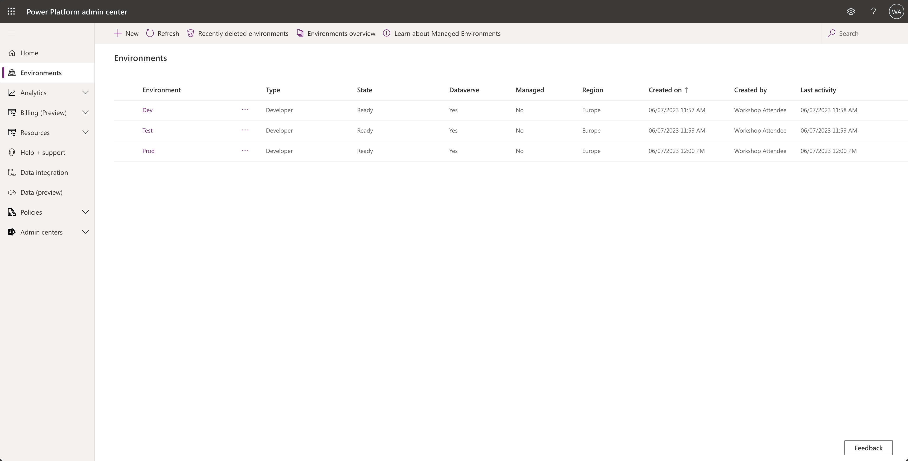
1. Select the `Dev` environment you created before
1. In the command bar at the top, select `Resources` and `Dynamics 365 apps` 
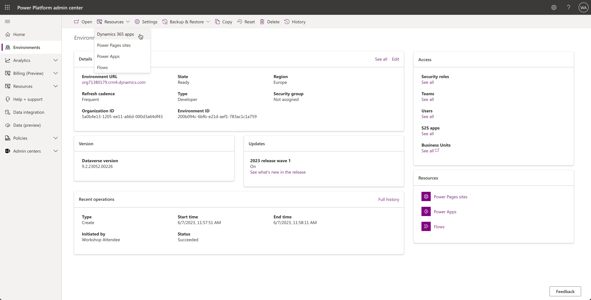
1. Here you can find the apps that are installed on your `Dev` environment by default. Select the `Install App` button in the command bar at the top

1. In the sidebar that opens, scroll all the way down select the `Power Platform Pipelines` app and select the `Next` button at the bottom of the sidebar
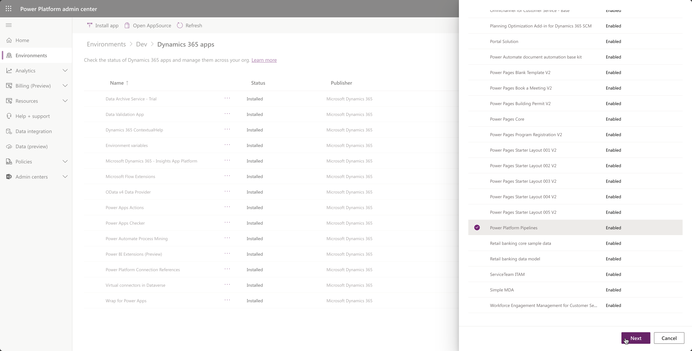
1. Next, make sure to agree to the terms and select the `Install` button at the bottom of the sidebar
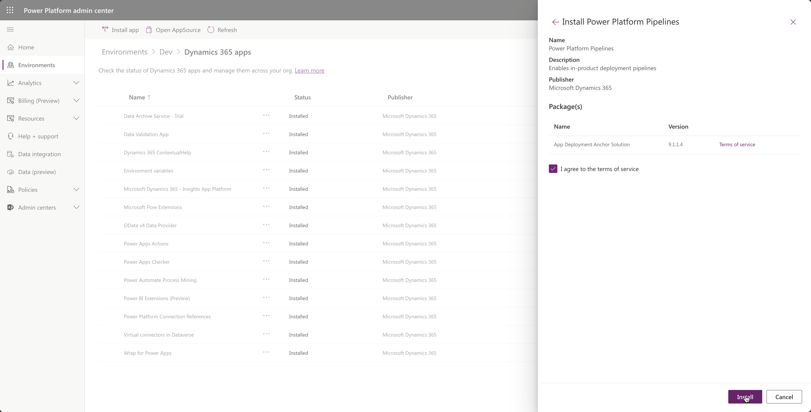

This process will take a couple of minutes, you can refresh the page by selecting the `Refresh` button in the command bar at the top.

When finished, you can go to the [maker portal](https://make.powerapps.com) and select the right environment (`Dev`). If all went well, you should be able to see the `Deployment Pipeline Configuration` app in the Apps section in the maker portal.

## Task 02: Setup your first pipeline

In this task, you will create your first pipeline. The `Deployment Pipeline Configuration` app will be used for that. 

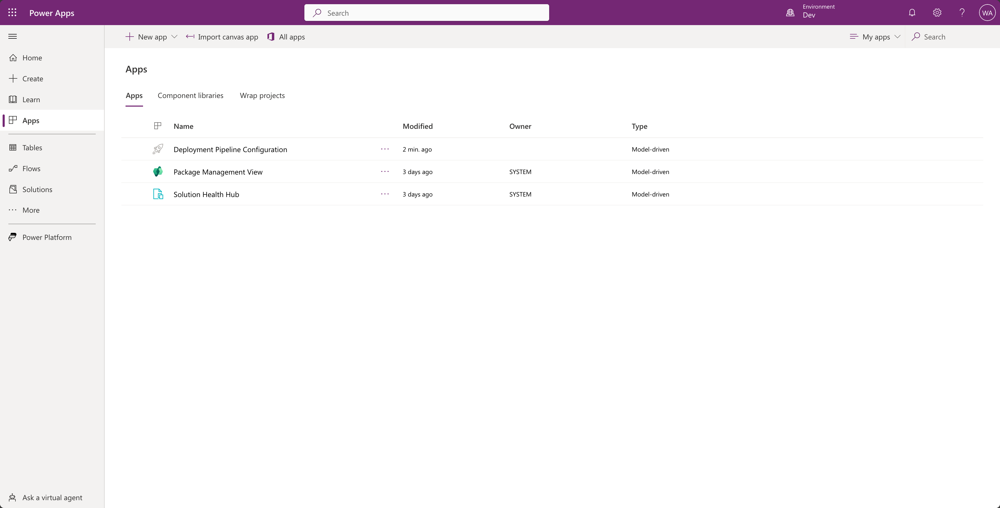

Make sure to select that app in the [maker portal](https://make.powerapps.com) and make sure to play the app.

This will open the app in a new tab:

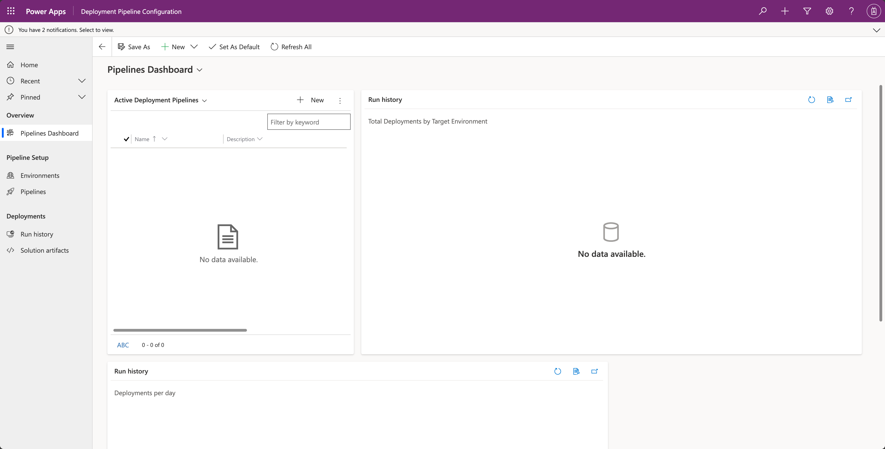

Make yourself familiar with the app, by looking around which menu items there are: 

First, there is an `Overview` section, where you land when you open the app. This is the `Pipelines Dashboard`, which will show you the latest info about runs and pipelines that are active. When you open this for the first time, it's supposed to be empty, so don't worry! 

There is also a `Pipeline Setup` section where you can view your environments and pipelines. 

Last but not least, there is a `Deployments` section which enables you to view the run history and find solution artifacts.

### Create a new pipeline

Let's create a new pipeline, by selecting the new button on the `Pipelines Dashboard`.

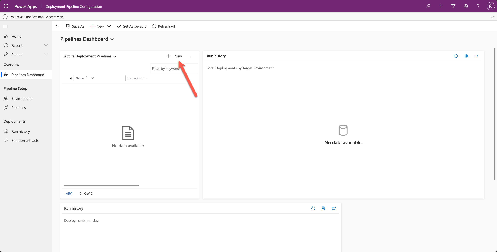

This will lead you to a form where you can enter details about your pipeline:

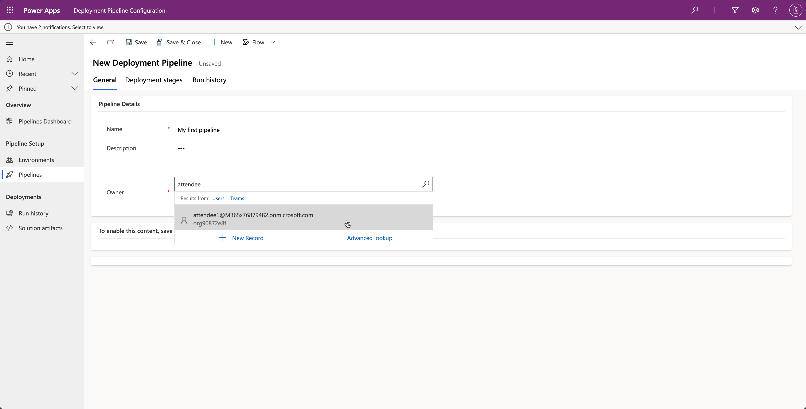

1. Use `My first pipeline` as the name
1. In the owner field, make sure to look for the email address of your account and select your user
1. Save the pipeline

Some components of the form only appear after the first save, so that's why we save the pipeline. After saving, scroll down and you will see the following content below the owner field: 

As you can see there are two sections: **Linked Development Environments** & **Deployment Stages**.

**Linked Development Environments**

A pipeline can be available for multiple development environments. This is very convenient when you want to use multiple development environments and use shared test and shared production environments.

In this lab, we will only add one development environment to the Linked Development Environments, but when you use this at your company later on, remember that it can be more than one environment here.

**Deployment Stages**

The Deployment Stages section will give you the option to add stages after your development environment. So for instance, in our lab today, we are going to add a stage called `Deploy to Test` and another stage called `Deploy to Prod`. The cool thing is that we can set previous stages for these stages. This gives us the ability to make sure `Deploy to Test` goes first, and `Deploy to Prod` comes second.

### Create a development environment

Let's continue our lab and start by adding a new development environment by selecting the New Development Environment button in the Linked Development Environments section.

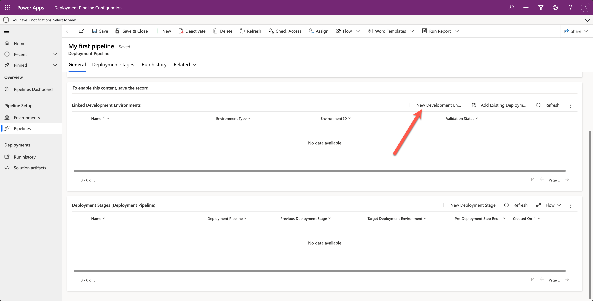

A sidebar will be opened, where you can enter the details of the `Dev` environment you created in lab 01. 

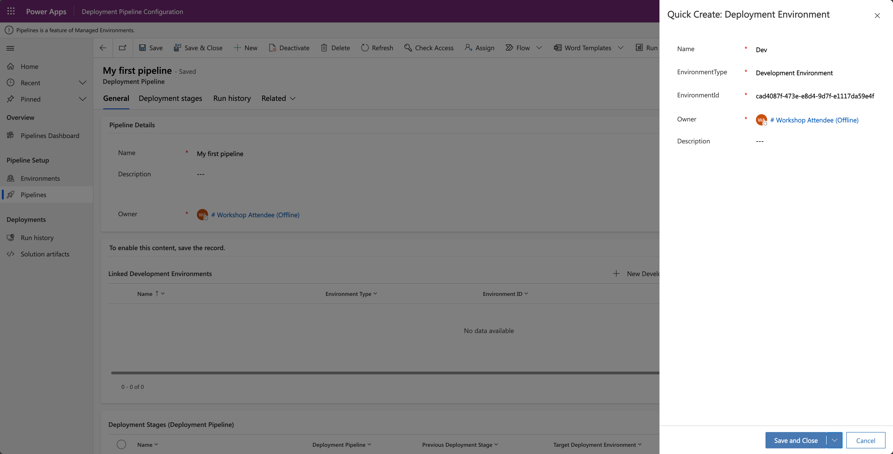

1. Add `Dev` as the Name
1. Set the Environment Type to `Development Environment`
1. For the next step, make sure to grab the `Environment Id` from the Power Platform Admin Center

    * Go to the [Power Platform Admin Center](https://aka.ms/ppac)
    * Select Environments in the menu on the left
    * Select the environment named `Dev`

      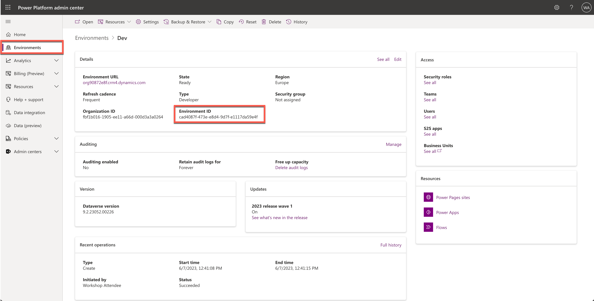
    
    * Copy the environment ID from there and paste it in the `Deployment Pipeline Configuration` app.

1. Select yourself as the owner by focusing on the owner field and adding the email address of your account.
1. Select the `Save and Close` button on the bottom of your sidebar

If all went well, you'll see the following screen:

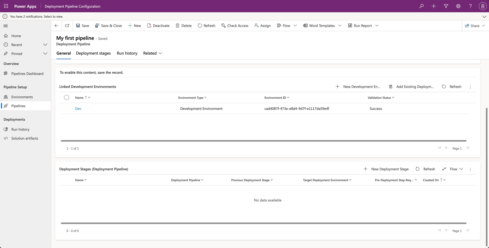

Make sure to select the `New Deployment Stage` button now to add the first deployment stage.

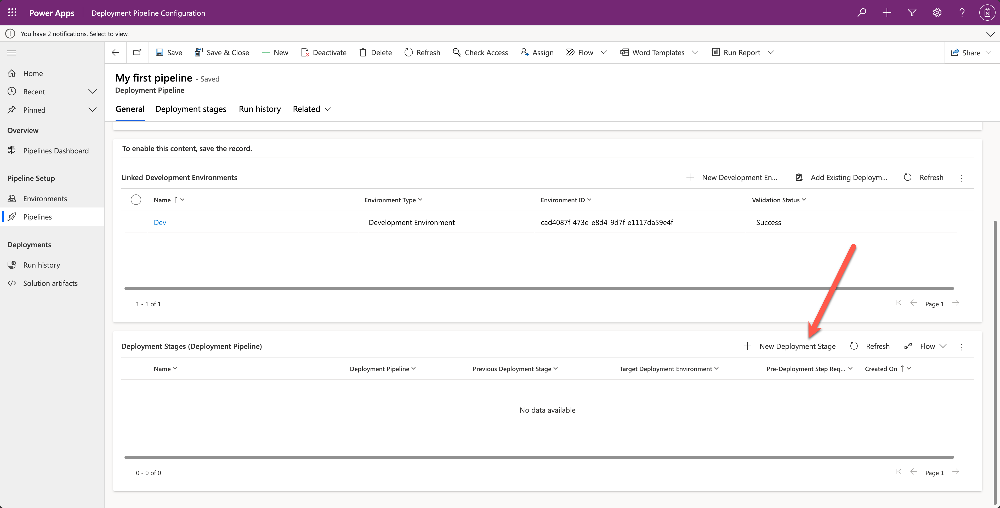

### Add the first deployment stage

This will open a new sidebar, where you can enter details about your first deployment stage.

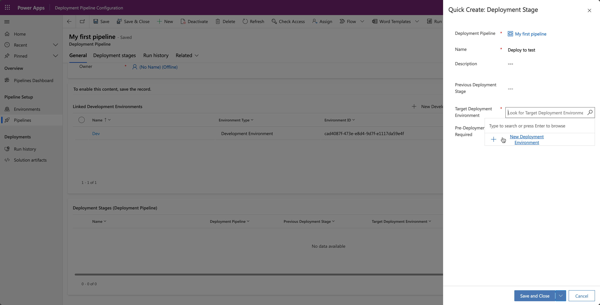

1. Add `Deploy to test` as the Name
1. We're leaving the Description and Previous Deployment stage empty, because we don't have a previous deployment stage, since this is our first stage
1. Set focus to the input box next to target deployment environment. This will open up a small popup which enables you to add a new development environment
1. Select `New Development Environment`

This will open another sidebar where you can add details about your test environment.

#### Add the test environment

In the sidebar, make sure to add the following details:

1. Add `Test` as the `Name`
1. Add `Target Environment` as the `Environment Type`
1. Add the environment ID of the test environment

    * Go to the [Power Platform Admin Center](https://aka.ms/ppac)
    * Select Environments in the menu on the left
    * Select the environment named `Test`

      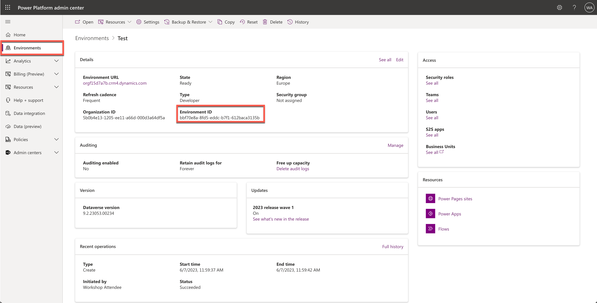
    
    * Copy the environment ID from there and paste it in the `Deployment Pipeline Configuration` app.

1. Select yourself as the owner by focusing on the owner field and adding the email address of your account.
1. Select the `Save and Close` button on the bottom of your sidebar
1. Select `Save` again to save the deployment stage as well

Make sure to select the `New Deployment Stage` button again to add a second deployment stage: `Deploy to prod`.

### Add the `Deploy to prod` deployment stage

1. Add `Deploy to prod` as the `Name`
1. Leave the `Description` empty
1. Focus on the `Previous Deployment Stage` and search for the `Deploy to test` stage. After you have found that stage, select it
1. Set focus to the input box next to target deployment environment. This will open up a small popup which enables you to add a new development environment
1. Select `New Development Environment`

> **Note:**  
> There is a setting field called `Pre Deployment Step Required`. We're not using that in this case, but think about what could that be used for. During the workshop, the trainers will show an example of it.

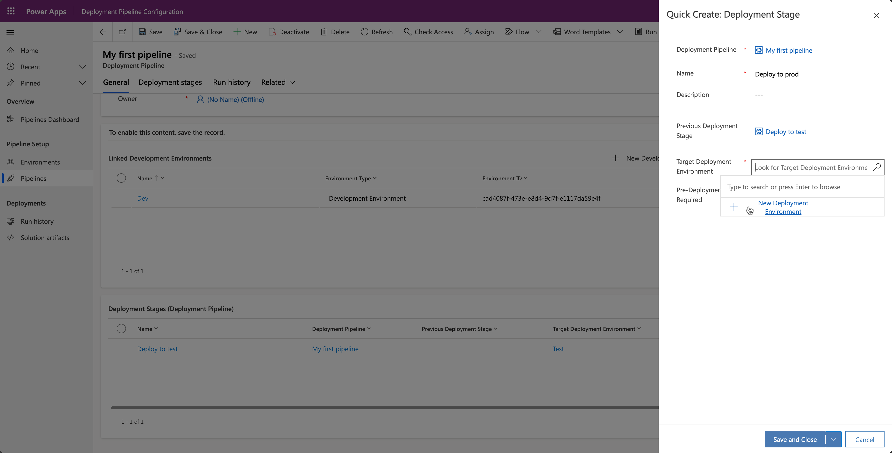

#### Add the Prod environment

1. Add `Prod` as the Name
1. Set the Environment Type to `Target Environment`
1. For the next step, make sure to grab the `Environment Id` from the Power Platform Admin Center

    * Go to the [Power Platform Admin Center](https://aka.ms/ppac)
    * Select Environments in the menu on the left
    * Select the environment named `Prod`

      
    
    * Copy the environment ID from there and paste it in the `Deployment Pipeline Configuration` app.

1. Select yourself as the owner by focusing on the owner field and adding the email address of your account.
1. Select the `Save and Close` button on the bottom of your sidebar

    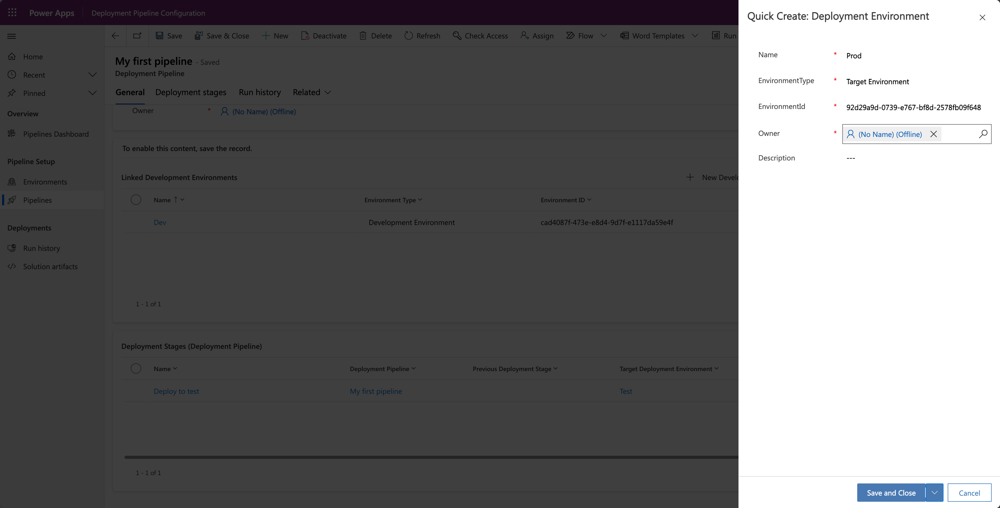

1. Select `Save` again to save the deployment stage as well

## Task 03: Create a first deployment of the imported solution from lab 02

In this task, you will deploy the solution we imported in lab 02 to the test and production environments. Let's start by our first deployment to test:

### First deployment to test

In this lab, you have installed the pipelines for Power Platform solution and you have configured a pipeline and the stages that belong to it. But how does a maker deploy a solution from the `Dev` environment to the `Test` and `Prod` environments?

1. Go to the [maker portal](https://make.powerapps.com)
1. Make sure to select the `Dev` environment
