# Lab 05 - Add an approval before deploying to production

This lab will consist of the following tasks:

* Extending the pipeline in the Deployment Pipeline Configuration App
* Create a cloud flow that handles the approval

## Task 1: Extending the pipeline in the Deployment Pipeline Configuration App

In this task, you will learn how to extend the pipeline and add an approval before deploying to production.

1. Go to the [maker portal](https://make.powerapps.com)
1. Check if you are in the `Prod` environment and if not, switch to that environment
    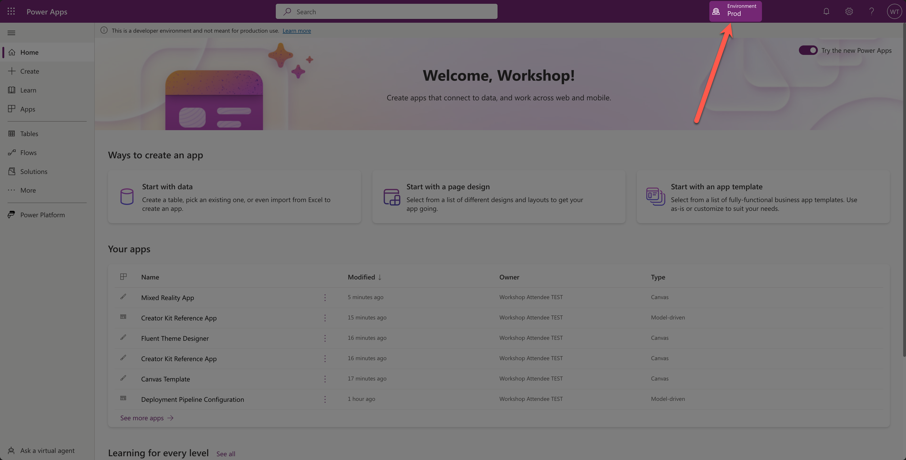
1. Look for the `Deployment Pipeline Configuration` app, hover on it and select the play button
    
1. This will open the `Deployment Pipeline Configuration` app and will enable you to modify your pipeline. Select the `My first pipeline` pipeline
    
1. On the next screen, scroll down to the deployment stages and select the `Deploy to prod` deployment stage by selecting the name
    
1. Enable the check box in the `Pre-Deployment Step Required` field and select the `Save & Close` button in the command bar at the top
    
1. Check in the Deployment Stages subgrid if the `Pre-Deployment Step Required` field is changed to yes. If that's correct, you are done with this task, if not, go back to step 5 and try again 
    

## Task 2: Create a cloud flow that handles the approval

In this task, you will learn how to create an approval flow that will handle the approval before deploying to production.

1. Go to the [maker portal](https://make.powerapps.com)
1. Check if you are in the `Prod` environment and if not, switch to that environment
    
1. Select `Flows` in the left navigation, select `New flow` in the command bar at the top and select `Automated cloud flow` 
    
1. This will open a pop up where you can name your flow and configure a trigger. Name your flow `My first pipeline production approval`, search for `action`, select the Microsoft Dataverse trigger called `When an action is performed` and select the blue `Create` button.  
    
1. Configure the trigger inputs by making it look like the screenshot below
    
1. Select the ellipsis at the top-right corner of the trigger and select settings to open up the trigger settings
    
1. Select the `Add` button below trigger conditions to add a trigger condition in the trigger settings
    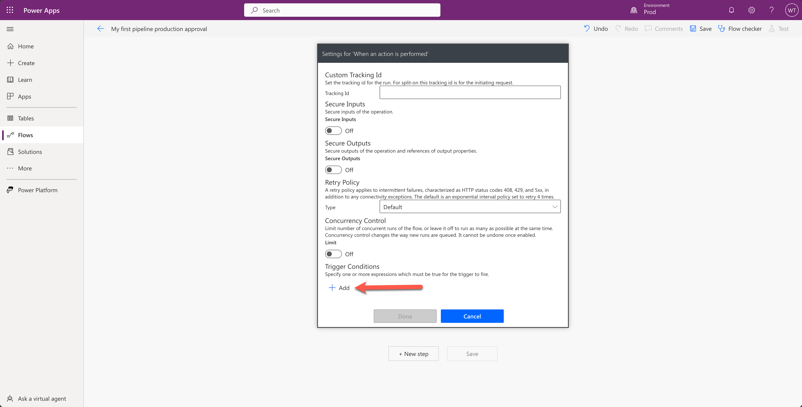
1. Add the following trigger condition to make sure the cloud flow only triggers when the pipeline name is equal to `My first pipeline`
    `@equals(triggerOutputs()?['body/OutputParameters/DeploymentPipelineName'], 'My first pipeline')`
1. Select the `Add` button below the trigger condition above to add another trigger condition
    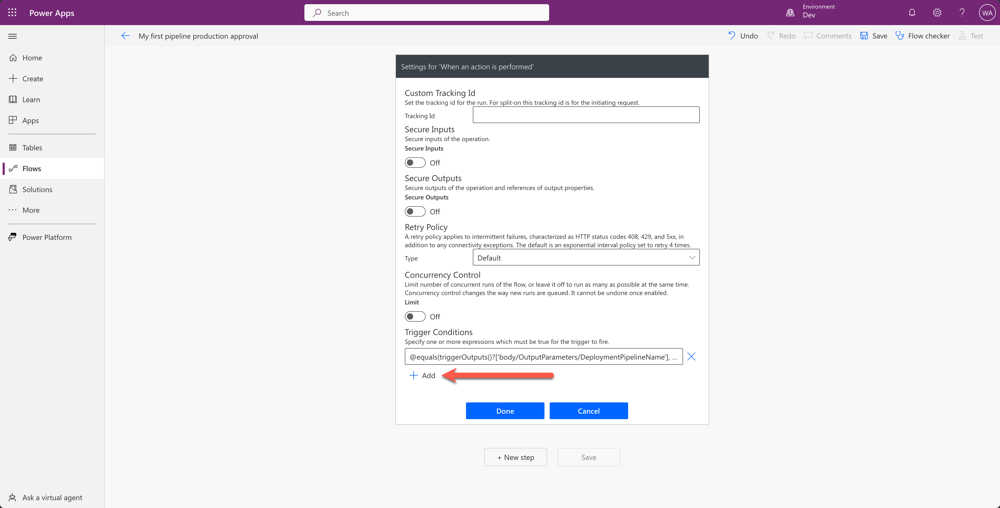
1. Add the following trigger condition to make sure the cloud flow only triggers when the pipeline name is equal to `Deploy to prod`
    `@equals(triggerOutputs()?['body/OutputParameters/DeploymentStageName'], 'Deploy to prod')`
1. Select the `Done` button at the bottom of the trigger card to save the trigger conditions
    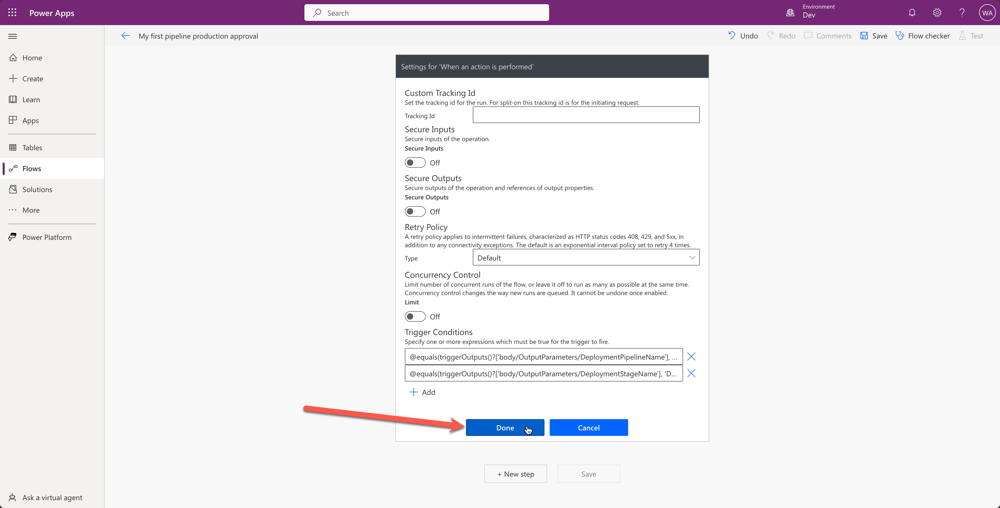
1. Select the `New step` button to add an action to start and wait for an approval
    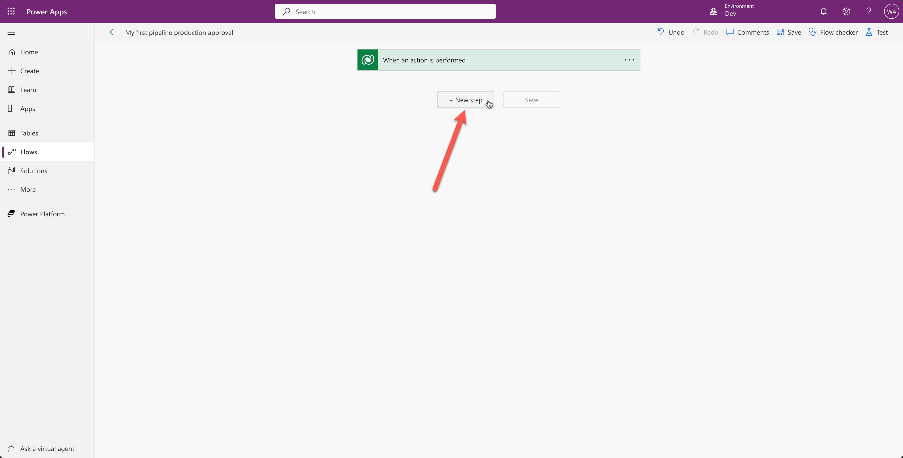
1. Search for approval and select the `Start and wait for an approval` action
    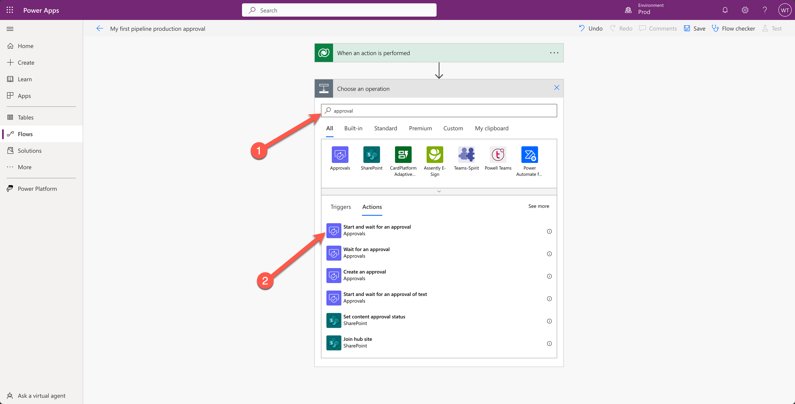
1. Configure the approval action like the screenshot below:  
      
    For approval type, select `Approve/Reject - First to respond`  
    For title, add `Approval requested for `, select `ActionOutputs DeploymentPipelineName` from the dynamic content fields on the right, add ` - `, and select another dynamic content field from the right called `ActionOutputs DeploymentStageName`.  
    For assigned to, add the email address of your user. In production scenarios, this would be an admin that would approve deployments.  
    For details, add `# Deployment notes`, add a hard return, and select the `ActionOutputs DeploymentNotes` field from the dynamic content fields on the right.  
    For item link, select the `ActionOutputs StageRunDetailsLink` field from the dynamic content fields on the right.  
    For item link description, add `Stage Run Details`.  
      
    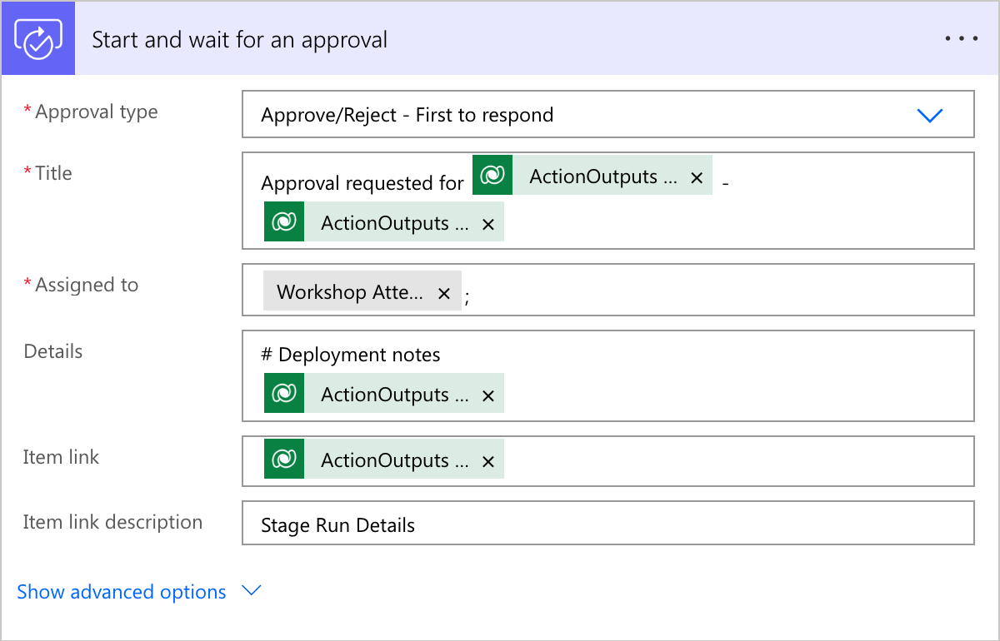
1. Select the `New step` button to add a condition below the `Start and wait for an approval` action
    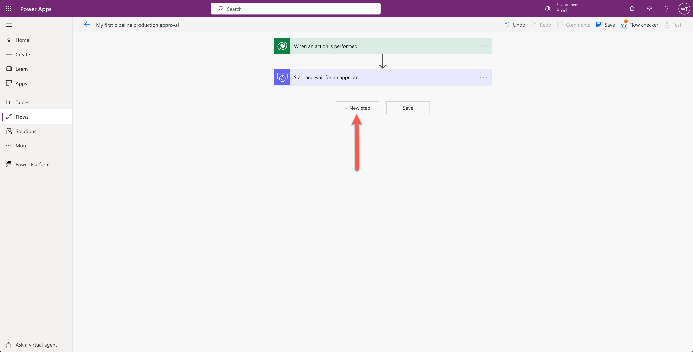
1. Add the `Condition` action
    
1. Add the `Outcome` dynamic content field from the `Start and wait for an approval` action in the first input field of the condition
1. Add the text `Approve` to the other input field of the condition
1. Select the `New step` button in the `If yes` part of the condition and add the `Perform an unbound action` action from the Microsoft Dataverse connector
    Select `UpdatePreDeploymentStepStatus` as Action Name.  
    Add `20` as the PreDeploymentStepStatus (20 is the status ID for approved).  
    Add the `Response summary` dynamic content field from the `Start and wait for an approval` action as Comments.  
    Add the following expression via the expression panel to the Comments field: `first(outputs('Start_and_wait_for_an_approval')?['body/responses'])?['comments']`  
    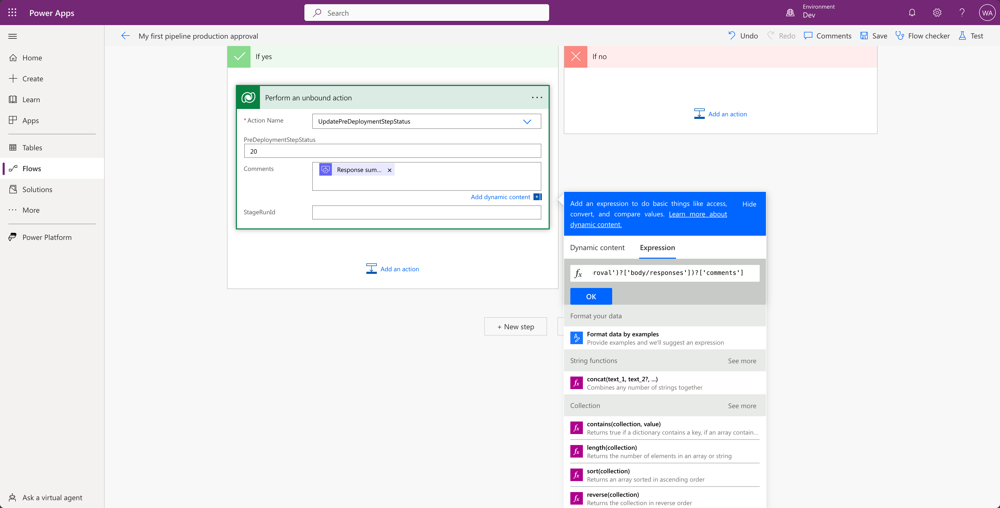      
    Add the `ActionInputs StageRunId` dynamic content field from the `When an action is performed` trigger as StageRunId.  
1. Select the `New step` button in the `If no` part of the condition and add the `Perform an unbound action` action from the Microsoft Dataverse connector
    Select `UpdatePreDeploymentStepStatus` as Action Name.  
    Add `30` as the PreDeploymentStepStatus (30 is the status ID for rejected).  
    Add the `Response summary` dynamic content field from the `Start and wait for an approval` action as Comments.  
    Add the following expression via the expression panel to the Comments field: `first(outputs('Start_and_wait_for_an_approval')?['body/responses'])?['comments']`  
    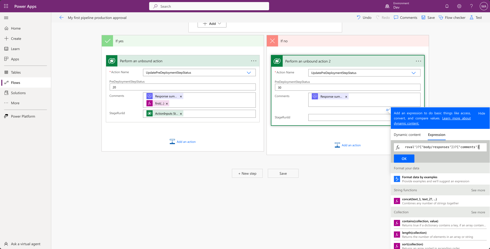  
    Add the `ActionInputs StageRunId` dynamic content field from the `When an action is performed` trigger as StageRunId.  
      
    
1. Save the flow

## Task 3: Test out the approval

In this task, you are going to find out if the approval you configured in the last task actually works!

### Deploy to test (without approval)

1. Go to the [maker portal](https://make.powerapps.com)
1. Check if you are in the `Dev` environment and if not, switch to that environment
    
1. Go to Solutions via the left menu
1. Select the `Mixed Reality Workshop` solution by selecting the display name
        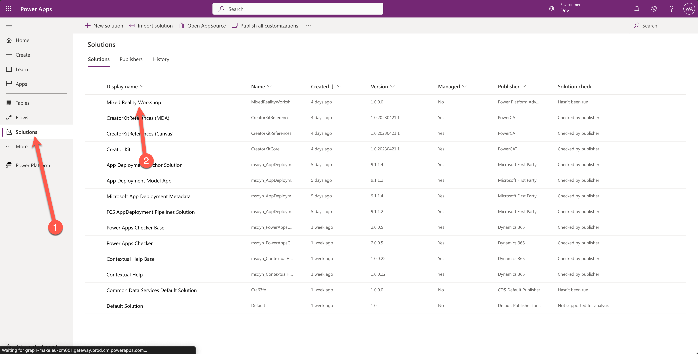
1. Select the rocket icon on the left
        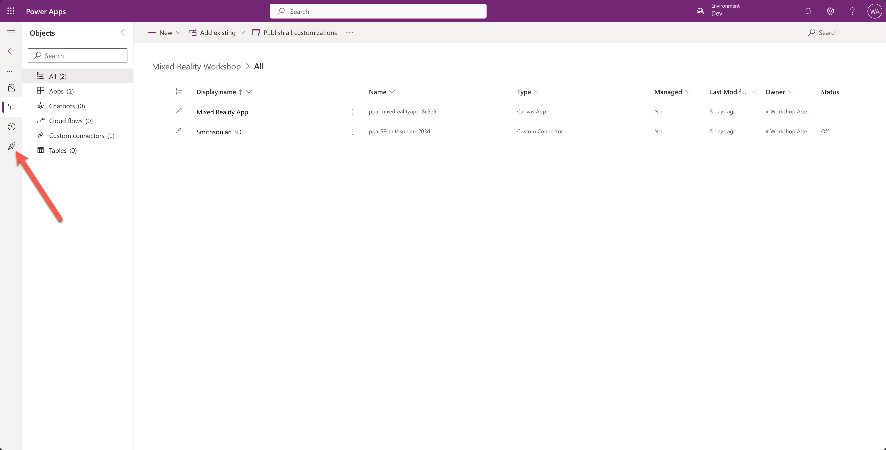
1. Select the purple `Deploy here` button.
        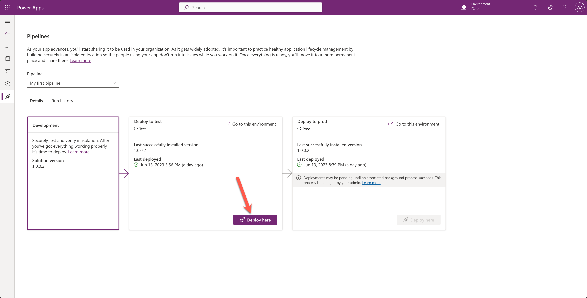  
1. This will open a new sidebar which will give you the option to start your deployment now or plan your deployment for later. Select the purple `Next` button to go to the next screen
        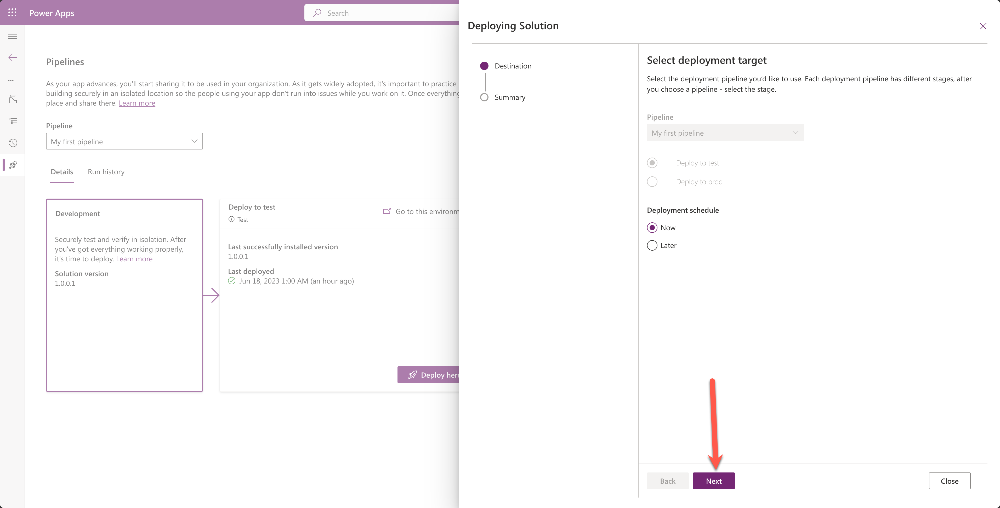  
1. The next screen will be a bit different from our last try, it will now show a summary of the deployment. Fill in some deployment notes, like for instance: `First deployment of the Mixed Reality solution` and select the purple `Deploy` button
    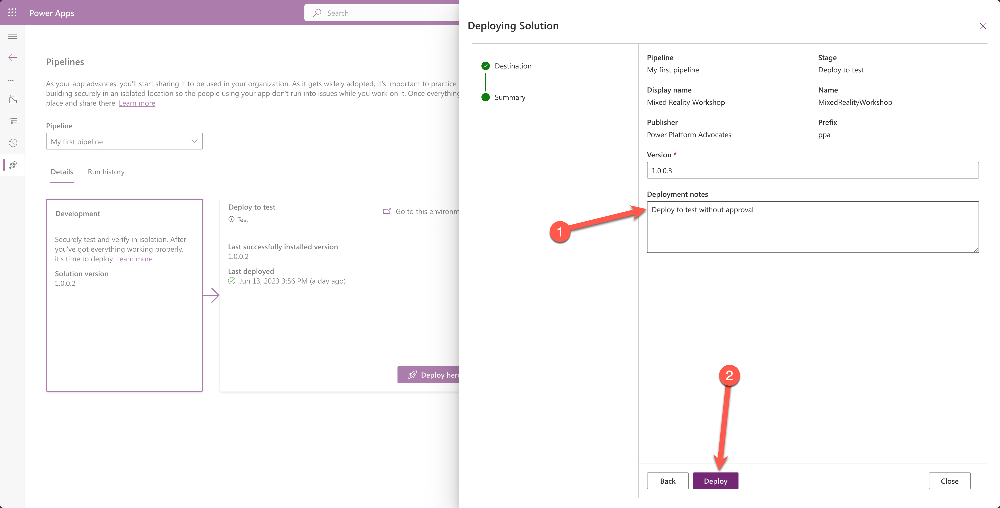
1. This will trigger the `Deploy to test` stage
        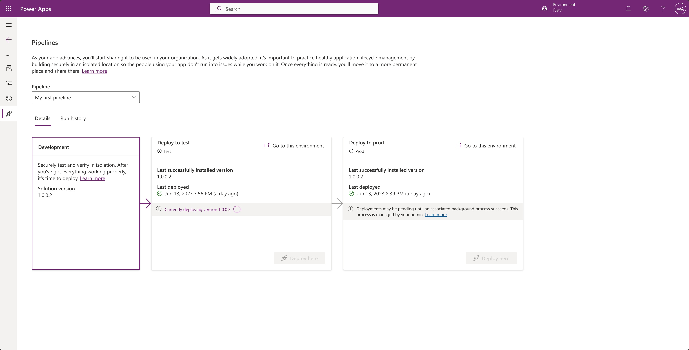
1. When it's done, you will see that the deployment has been finished
        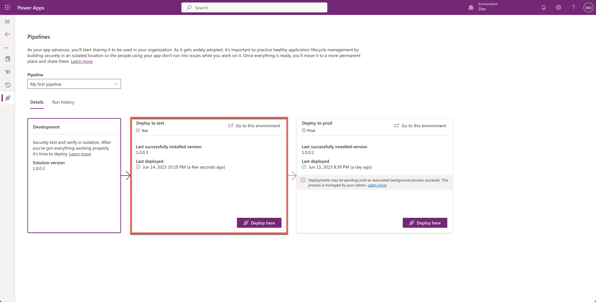

### Deploy to prod (with approval)

1. Earlier in this lab, you have made a Pre-Deployment Step required. That means that now, there is an info box on the deploy to prod stage
    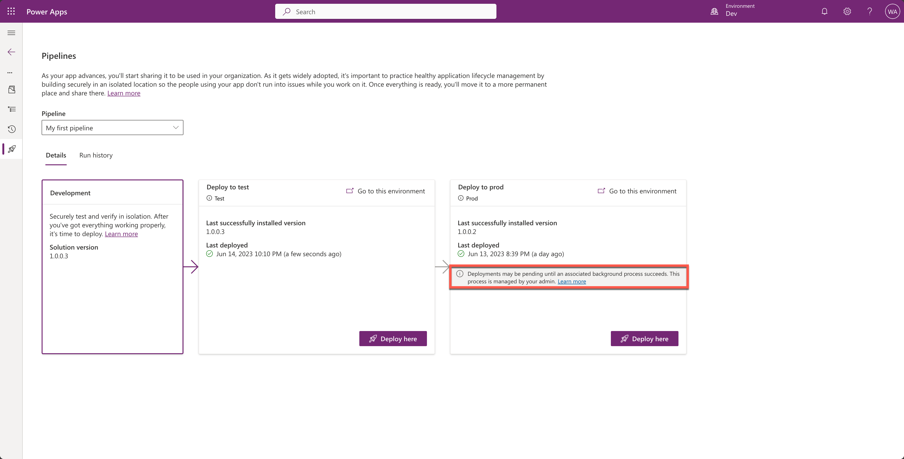
1. Select the purple `Deploy here` button.
    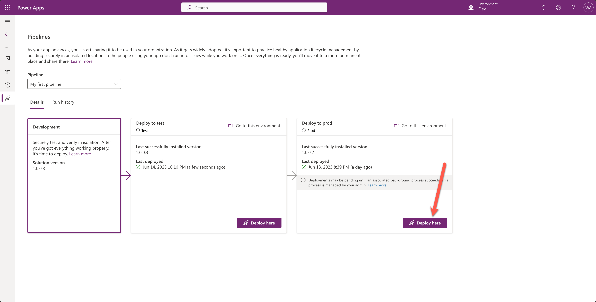  
1. This will trigger the Power Automate cloud flow, and because we are working on a fresh environment, it can take a while before the approval solution is deployed. Best is to take a biological break now, since it can take 5-10 minutes before your next step
1. Open a new browser tab and go to [Outlook web](https://outlook.office.com) and wait for the approval email. After 5-10 minutes (only the first time!) it should arrive
1. In the approval mail you will see a couple of familiar parts:
    You will see the title of the approval (1)
    You will see the deployment notes (2)
    You will see approve / reject buttons (3)
    You will be able to add comments (4)
    You will be able to submit the approval / rejection (5)
1. Make sure to approve the approval, add `Approved!` as comments and select the `Submit` button
    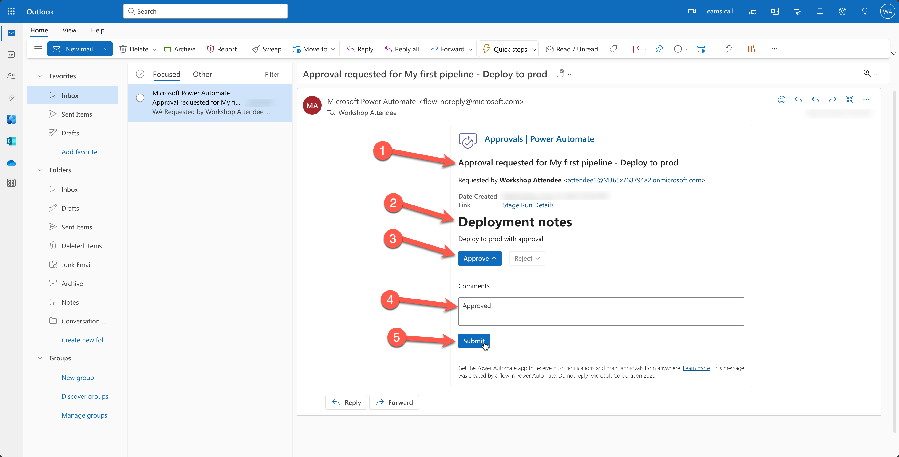  
1. Close the Outlook browser tab, and you will see (sometimes you have to refresh) that the deployment to production is in progress
    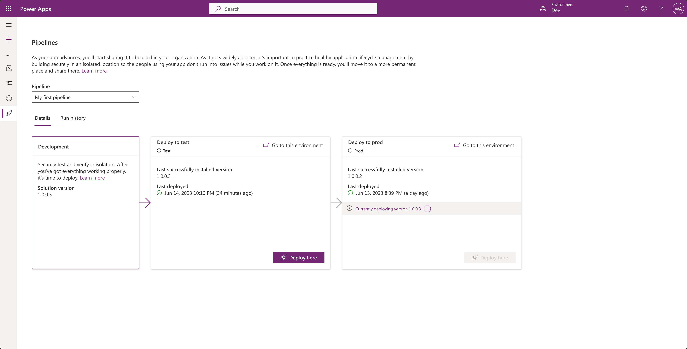
1. After the deployment is finished, you will see that the deployment is finished
    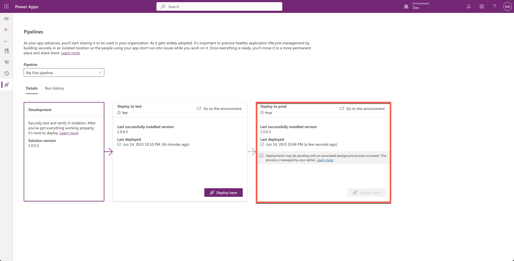

And that's how the deployment with approvals works!

## Next lab

This is the end of lab 05, select the link below to move back to the lab overview.

[⏭️ Move back to the lab overview](../README.md)
