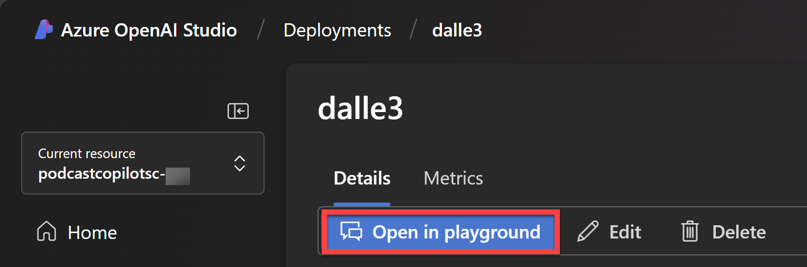

# Lab 1 - Laying the Foundation: Azure OpenAI Service

## Background

Dive into the world of Azure OpenAI Service. We introduce the service, describe the models, and guide you through creating deployments. Setting the stage for seamless AI integration.

## Definitions

### What is Azure OpenAI Service?

Azure OpenAI Service provides REST API access to OpenAI's powerful language models including the GPT-4, GPT-4 Turbo with Vision, GPT-3.5-Turbo, and Embeddings model series. In addition, the new GPT-4 and GPT-3.5-Turbo model series have now reached general availability. These models can be easily adapted to your specific task including but not limited to content generation, summarization, image understanding, semantic search, and natural language to code translation. Users can access the service through REST APIs, Python SDK, or our web-based interface in the Azure OpenAI Studio.

Learn More: [What is Azure OpenAI Service? [Microsoft Learn]](https://aka.ms/PowerPodcast/AOAI)

## Prerequisites

For this lab, make sure you have the following ready:

- An active [Azure Subscription](https://azure.microsoft.com/en-us/free/)

### Video Overview of Lab:

> 📹 Click the image below to watch a video walkthrough of this lab.

## Instructions

### Create an Azure OpenAI Service Resource

1. Go to [portal.azure.com](https://aka.ms/PowerPodcast/AzurePortal) and login with your Azure account.

1. Search for and select **Resource Groups**.

1. Click on **+ Create**.

    

1. Name it `PodcastCopilot` and click on **Review + Create**. Then click on **Create**.

1. Create a new **Azure OpenAI Service** resource by clicking [here](https://ms.portal.azure.com/#create/Microsoft.CognitiveServicesOpenAI) and set the following parameters:

    - **Subscription**: Select your Azure subscription
    - **Resource Group**: Select the **PodcastCopilot** resource group you created in the previous step
    - **Region**: `Sweden Central`
    - **Name**: `podcastcopilotsc-{your initials}` (e.g. `podcastcopilotwe-jd` to make it unique)
    - **Pricing Tier**: Select the `Standard S0` pricing tier

    

    > NOTE:
    >
    > The **Sweden Central** region is selected as it is (at the time of writing) the only region that supports GPT-4, Whisper, and Dall.E 3 models all together.
    >
    > If you are interested in which models are supported in which regions, you can check out the [Azure OpenAI Service standard deployment model availability](https://learn.microsoft.com/en-us/azure/ai-services/openai/concepts/models#standard-deployment-model-availability) page.

1. Click on **Next** until you get to the **Review + Submit** page and then click on **Create** to create the resource.

### Create a Bing Search Resource in Azure

1. Next we will create a **Bing Search** resource in Azure. Click this [link](https://ms.portal.azure.com/#create/Microsoft.BingSearch) and set the following parameters:

    - **Subscription**: Select your Azure subscription
    - **Resource Group**: Select the **PodcastCopilot** resource group you created in a previous step
    - **Name**: `podcastcopilotbing-{your initials}` (e.g. `podcastcopilotbing-jd` to make it unique)    
    - **Region**: `Global`
    - **Pricing Tier**: Select the `F1` pricing tier

1. Read the **Terms** and **Notices** and select the checkbox to agree to them.

    

1. Click on **Review + Create** and then **Create** to create the resource.

1. Open up your `PodcastCopilot` resource group in the Azure portal.

1. Select the `podcastcopilotbing-{your initials}` resource.

1. Expand the **Resource Management** tab on the left-hand side, select **Keys and Endpoint** and note down the **Key 1** value somewhere safe.

    

### Create model deployments in Azure OpenAI Studio

1. Open up your **PodcastCopilot** resource group in the Azure portal.

1. Select the **podcastcopilotsc-{your initials}** resource.

1. On the top menu, click on **Go to Azure OpenAI Studio**.

    

    > NOTE:
    >
    > In Azure OpenAI Studio, you may see the following banners alerting you to the studio's new look. Select **Explore the new experience** to continue in the updated studio.
    >
    > 
    >
    > 
    >
    > If you don't see these banners, then you're likely already in the updated studio.

1. In the Azure OpenAI Studio, click on **Deployments** on the left menu.

1. Select **+ Deploy model** > **Deploy base model**.

1. In the **Select a model** window, search for and select `gpt-4o-mini`.

    Select **Confirm**.

    

1. In the **Deploy model gpt-4o-mini** window, set the following parameters:

    - **Deployment name**: `gpt4omini`
    - **Model version**: `Auto-update to default`
    - **Deployment type**: `Global Standard`

    > NOTE:
    >
    > Learn more about Azure OpenAI deployment types [here](https://learn.microsoft.com/en-us/azure/ai-services/openai/how-to/deployment-types)

    Select **Deploy** to create the **gpt-4o-mini** deployment.

1. Now you're going to create a deployment for **Whisper**.

    * Select **Deployments** on the left menu.
    * Select **+ Deploy model** > **Deploy base model**.
    * Search for and select `whisper` and then click **Confirm**.
    * Set the following parameters:
        - **Deployment name**: `whisper`
        - **Model version**: `Auto-update to default`
        - **Deployment type**: `Standard`
    * Select **Deploy** to create the **whisper** deployment.

1. Now you're going to create a deployment for **DaLL-E**.

    * Select **Deployments** on the left menu.
    * Select **+ Deploy model** > **Deploy base model**.
    * Search for and select `dall-e-3` and then click **Confirm**.
    * Set the following parameters:
        - **Deployment name**: `dalle3`
        - **Model version**: `Auto-update to default`
        - **Deployment type**: `Standard`
    * Select **Deploy** to create the **dall-e-3** deployment.

1. On the **dalle3** deployment details page, select **Open in Playground**.

    

1. In the playground, click on **View Code** and copy the **Endpoint** value and note it down somewhere safe.

    

    This endpoint will be used in the next lab to connect to all your model deployments.

### Uploading Podcast Snippet to Azure Blob Storage

We'll be using Azure Blob Storage to store the podcast snippet audio file. This will allow us to easily test our API and application with a real-world audio file.

1. Navigate to the [PodcastSnippet.mp3 file](../PodcastSnippet.mp3) within this repository and download it to your local machine.

    

1. Go to [portal.azure.com](portal.azure.com) and login with your Azure account.

1. Navigate to [Create a storage account](https://ms.portal.azure.com/#create/Microsoft.StorageAccount-ARM) and set the following parameters:

    - **Subscription**: Select your Azure subscription
    - **Resource Group**: Select the **PodcastCopilot** resource group
    - **Storage account name**: `podcaststorage{your initials}` (e.g. `podcaststoragejd` to make it unique)
    - **Region**: `East US`
    - **Primary service**: `Azure Blob Storage or Azure Data Lake Storage Gen 2`
    - **Primary workload**: `Other`
    - **Performance**: `Standard`
    - **Redundancy**: `Geo-redundant storage (GRS)`
    - Ensure that **Make read access to data available in the event of regional unavailability** is selected`

    Click on **Review + Create** and then **Create** to create the storage account.

1. Once the storage account is created, click on **Go to resource**.

    

1. On the left-hand side panel, scroll down and expand the **Settings** section and click on **Configuration**.

1. Then look for the **Allow Blob anonymous access** setting and set it to `Enabled`.

    

1. Click **Save** at the top of the page to save the changes.

1. Once saved - on the left-hand side, scroll up to the **Data Storage** section and click on **Containers** and then click on **+ Container**.

    - **Name**: `audio`
    - **Anonymous access level**: `Blob (anonymous read access for blobs only)`

    Click on **Create** to create the container.

1. Once the container is created, click on the **audio** container and then click on **Upload**.

1. Upload the `PodcastSnippet.mp3` file you downloaded earlier and then click on **Upload**.

    

1. Once uploaded, click on the `PodcastSnippet.mp3` file and then copy the **URL** value.

    Note down this URL somewhere safe.

...and that's it! You've now created all the Azure OpenAI resources you need to get started.

### ➡️ [Lab 2 - Bridging the Gap: .NET APIs, Azure and Custom Connectors](../Lab2/README.md)