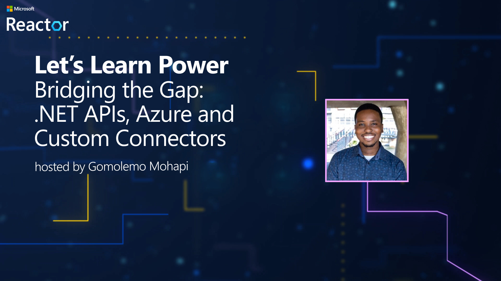

# Lab 2: Bridging the Gap: .NET APIs, Azure and Custom Connectors

## Background

We take a step further from Lab 1 by creating a .NET API using the .NET Azure OpenAI SDK, creating Azure Resources with the Azure Developer CLI, deploying the API to Azure App Service and Azure API Management and Creating a Custom Connector from API Management.

## Definitions

### What is .NET?

.NET is a free, cross-platform, open source developer platform for building many different types of applications. With .NET, you can use multiple languages, editors, and libraries to build for web, mobile, desktop, games, IoT, and of course, AI.

Learn More: [Introduction to .NET [Microsoft Learn]](https://learn.microsoft.com/en-us/dotnet/core/introduction)

### What is the .NET Azure OpenAI SDK?

The Azure OpenAI client library for .NET is an adaptation of OpenAI's REST APIs that provides an idiomatic interface and rich integration with the rest of the Azure SDK ecosystem. It can connect to Azure OpenAI resources or to the non-Azure OpenAI inference endpoint, making it a great choice for even non-Azure OpenAI development.

Learn More: [Azure OpenAI client library for .NET [Microsoft Learn]](https://learn.microsoft.com/en-us/dotnet/api/overview/azure/ai.openai-readme?view=azure-dotnet-preview)

### What is Azure App Service?

Azure App Service is an HTTP-based service for hosting web applications, REST APIs, and mobile back ends. You can develop in your favorite language, be it .NET, .NET Core, Java, Node.js, PHP, and Python. Applications run and scale with ease on both Windows and Linux-based environments.

Learn More: [Azure App Service Overview [Microsoft Learn]](https://learn.microsoft.com/en-us/azure/app-service/overview)

### What is Azure API Management?

Azure API Management is a hybrid, multicloud management platform for APIs across all environments. As a platform-as-a-service, API Management supports the complete API lifecycle.

Learn More: [What is Azure API Management? [Microsoft Learn]](https://learn.microsoft.com/en-us/azure/api-management/api-management-key-concepts)

### What is the Power Platform?

The Power Platform provides organizations with the opportunity to empower their team members to build their own solutions through an intuitive low-code or no-code set of services. These services help simplify the process of building solutions. With Power Platform, solutions can be built in days or weeks, as opposed to months or years. Microsoft Power Platform is composed of five key products: Power Apps, Power Automate, Power BI, Power Virtual Agents, and Power Pages.

Learn More: [Power Platform](https://www.microsoft.com/en-us/power-platform)

### What is a Custom Connector?

While Azure Logic Apps, Microsoft Power Automate, and Microsoft Power Apps offer over 1,000 connectors to connect to Microsoft and verified services, you may want to communicate with services that aren't available as prebuilt connectors. Custom connectors address this scenario by allowing you to create (and even share) a connector with its own triggers and actions.

Learn More: [Custom connectors [Microsoft Learn]](https://learn.microsoft.com/en-us/connectors/custom-connectors/)

## Prerequisites

For this lab, make sure you have the following ready:

- Downloaded and installed [Visual Studio Community Edition](https://visualstudio.microsoft.com/downloads/)
- Downloaded and installed the [latest version of .NET](https://dotnet.microsoft.com/download)
- Added and configured a [Power Apps Developer Plan](https://powerapps.microsoft.com/developerplan) (Make sure it's set to the same email address as your Azure account)

### Video Overview of Lab:



Date of Livestream: {TBD}

## Instructions

### Setting the environment variables

1. Open up a command prompt and run the following commands one command at a time:

    ```bash
    setx AZURE_OPENAI_KEY_WE "REPLACE_WITH_YOUR_KEY_VALUE_HERE"
    setx AZURE_OPENAI_ENDPOINT_WE "https://podcastcopilotwe-{your initials}.openai.azure.com/"
    ```

    The above would be for the West Europe resource key and endpoint.

    ```bash
    etx AZURE_OPENAI_KEY_SC "REPLACE_WITH_YOUR_KEY_VALUE_HERE" 
    setx AZURE_OPENAI_ENDPOINT_SC "https://podcastcopilotsc-{your initials}.openai.azure.com/"    
    ```

    The above would be for the Sweden Central resource key and endpoint.

    ```bash
    setx BING_SEARCH_KEY "REPLACE_WITH_YOUR_KEY_VALUE_HERE"
    ```

    The above would be for the Bing Search resource key.

1. Once you've set the environment variables, close the command prompt.

### Creating a new .NET Web API Project

1. Open up Visual Studio and click on **Create a new project**.

1. Search for "Web API" and select **ASP.NET Core Web API**. Make sure you've selected the C# project template.

1. Click **Next**.

1. Name your project ``PodcastAppAPI`` and click **Next**.

1. Make sure that the Framework is set to **.NET 8**, Authentication type is set to **None** and that it's configured for **HTTPS**. Click **Create**.

1. Once the project has been created, open the **Solution Explorer** and right-click on the **PodcastAppAPI** project and select **Open in Terminal**.

1. In the terminal window, run the following command to install the prerelease version of the Azure OpenAI SDK:

    ```bash
    dotnet add package Azure.AI.OpenAI --version 1.0.0-beta.12
    ```

1. Then run the following command to install the Newtonsoft.Json package:

    ```bash
    dotnet add package Newtonsoft.Json --version 13.0.3
    ```

### Creating the PodcastCopilot Class

1. Once the command has completed, add a new class to the project by right-clicking on the **PodcastAppAPI** project and selecting **Add > Class**. Name the class ``PodcastCopilot``.

1. Add the following two using statements to the top of the ``PodcastCopilot`` class:

    ```csharp
    using System.Web;
    using Azure.AI.OpenAI;
    using Azure;    
    using Newtonsoft.Json.Linq;
    ```

1. Inside the **PodcastCopilot** class, add the following code:

    ```csharp
    //Initializing the Endpoints and Keys
    static string endpointWE = Environment.GetEnvironmentVariable("AZURE_OPENAI_ENDPOINT_WE");
    static string keyWE = Environment.GetEnvironmentVariable("AZURE_OPENAI_KEY_WE");

    static string endpointSC = Environment.GetEnvironmentVariable("AZURE_OPENAI_ENDPOINT_SC");
    static string keySC = Environment.GetEnvironmentVariable("AZURE_OPENAI_KEY_SC");

    static string bingSearchUrl = "https://api.bing.microsoft.com/v7.0/search";
    static string bingSearchKey = Environment.GetEnvironmentVariable("BING_SEARCH_KEY");

    //Instantiate OpenAI Client for Whisper and GPT-3
    static OpenAIClient clientWE = new OpenAIClient(
        new Uri(endpointWE), 
        new AzureKeyCredential(keyWE));

    //Instantiate OpenAI Client for Dall.E 3
    static OpenAIClient clientSC = new OpenAIClient(
        new Uri(endpointSC), 
        new AzureKeyCredential(keySC));
    ```

1. Then below the above code, add the following code to perform the first step of the PodcastCopilot process; **Audio Transcription**:

    ```csharp
    //Step 1: Get Audio Transcription
    public static async Task<AudioTranscription> GetTranscription(string blobUrl)
    {
        var decodededUrl = HttpUtility.UrlDecode(blobUrl);

        HttpClient httpClient = new HttpClient();
        Stream audioStreamFromBlob = await httpClient.GetStreamAsync(decodededUrl);

        var transcriptionOptions = new AudioTranscriptionOptions()
        {
            DeploymentName = "whisper",
            AudioData = BinaryData.FromStream(audioStreamFromBlob),
            ResponseFormat = AudioTranscriptionFormat.Verbose
        };

        Response<AudioTranscription> transcriptionResponse = await clientWE.GetAudioTranscriptionAsync(
            transcriptionOptions);
        AudioTranscription transcription = transcriptionResponse.Value;

        return transcription;
    }
    ```

1. Then add the following code to perform the second step of the PodcastCopilot process; **Guest Name Extraction**:

    ```csharp
    //Step 2: Extract Guest Name
    public static async Task<ChatCompletions> GetGuestName(string transcription)
    {
        var completionOptions = new ChatCompletionsOptions()
        {
            DeploymentName = "gpt35turbo",
            Messages =
            {
                new ChatRequestSystemMessage(@"Extract the guest's name from a Podcast Transcript. 
                        Provide only the guest's full name. Gomolemo Mohapi will never be the guest."),
                new ChatRequestUserMessage(transcription)
            },
            Temperature = (float)0.7
        };

        Response<ChatCompletions> completionsResponse = await clientWE.GetChatCompletionsAsync(
            completionOptions);
        ChatCompletions completion = completionsResponse.Value;

        return completion;
    }
    ```

1. Add the following class to the project:

    ```csharp
    public class BingSnippet
    {
        public string bio { get; set; }
    }
    ```

1. Then add the following code to the PodcastCopilot class to perform the third step of the PodcastCopilot process; **Getting the guest bio**:

    ```csharp
    //Step 3: Get Guest Bio
    public static async Task<BingSnippet> GetGuestBio(string guestName)
    {
        var client = new HttpClient();

        client.DefaultRequestHeaders.Add("Ocp-Apim-Subscription-Key", bingSearchKey);

        HttpResponseMessage response = await client.GetAsync($"{bingSearchUrl}?q={guestName}");

        string responseBody = await response.Content.ReadAsStringAsync();

        // Parse responseBody as JSON and extract the bio.
        JObject searchResults = JObject.Parse(responseBody);
        var bio = searchResults["webPages"]["value"][0]["snippet"].ToString();

        var newBingSnippet = new BingSnippet()
        {
            bio = bio
        };

        return newBingSnippet;
    }

1. Then add the following code to perform the next step of the PodcastCopilot process; **Creating a Social Media Blurb**:

    ```csharp
    //Step 4: Create Social Media Blurb
    public static async Task<ChatCompletions> GetSocialMediaBlurb(string transcription, string bio)
    {
        var completionOptions = new ChatCompletionsOptions()
        {
            DeploymentName = "gpt35turbo",
            Messages =
            {
                new ChatRequestSystemMessage(
                    @"You are a helpful large language model that can create a 
                    LinkedIn promo blurb for episodes of the podcast 
                    Behind the Tech, when given transcripts of the podcasts.
                    The Behind the Tech podcast is hosted by Kevin Scott.\n"
                ),
                new ChatRequestUserMessage(
                    @"Create a short summary of this podcast episode 
                    that would be appropriate to post on LinkedIn to    
                    promote the podcast episode. The post should be 
                    from the first-person perspective of Kevin Scott, 
                    who hosts the podcast.\n" +
                    $"Here is the transcript of the podcast episode: {transcription} \n" +
                    $"Here is the bio of the guest: {bio} \n"
                )
            },
            Temperature = (float)0.7
        };

        Response<ChatCompletions> completionsResponse = await clientWE.GetChatCompletionsAsync(
            completionOptions);
        ChatCompletions completion = completionsResponse.Value;

        return completion;
    }
    ```

1. Then add the following code to perform the next step of the PodcastCopilot process; **Creating Dall.E prompt**:

    ```csharp
    //Step 5: Generate a Dall-E prompt
    public static async Task<ChatCompletions> GetDallEPrompt(string socialBlurb)
    {
        var completionOptions = new ChatCompletionsOptions()
        {
            DeploymentName = "GPTModel",
            Messages =
        {
            new ChatRequestSystemMessage(
                @"You are a helpful large language model that generates 
                DALL-E prompts, that when given to the DALL-E model can 
                generate beautiful high-quality images to use in social 
                media posts about a podcast on technology. Good DALL-E 
                prompts will contain mention of related objects, and 
                will not contain people or words. Good DALL-E prompts 
                should include a reference to podcasting along with 
                items from the domain of the podcast guest.\n"
            ),
            new ChatRequestUserMessage(
                $@"Create a DALL-E prompt to create an image to post along 
                with this social media text: {socialBlurb}"
            )
        },
            Temperature = (float)0.7
        };

        Response<ChatCompletions> completionsResponse = await clientWE.GetChatCompletionsAsync(
        completionOptions);

        ChatCompletions completion = completionsResponse.Value;

        return completion;
    }
    ```

1. Then add the following code to perform the next step of the PodcastCopilot process; **Generating the Dall.E image**:

    ```csharp
    //Step 6: Generate a Dall-E image
    public static async Task<ImageGenerationData> GetImage(string prompt)
    {
        var generationOptions = new ImageGenerationOptions()
        {
            Prompt = prompt + ", high-quality digital art",
            ImageCount = 1,
            Size = ImageSize.Size1024x1024,
            Style = ImageGenerationStyle.Vivid,
            Quality = ImageGenerationQuality.Hd,
            DeploymentName = "dalle3",
            User = "1",
        };

        Response<ImageGenerations> imageGenerations =
            await clientSC.GetImageGenerationsAsync(generationOptions);

        return imageGenerations.Value.Data[0];
    }
    ```

### Updating the Program.cs file with the Minimal API implementation

1. Open the **Program.cs** file and replace all the code in this file with: 

    ```csharp
    var builder = WebApplication.CreateBuilder(args);

    // Add services to the container.
    // Learn more about configuring Swagger/OpenAPI at https://aka.ms/aspnetcore/swashbuckle
    builder.Services.AddEndpointsApiExplorer();
    builder.Services.AddSwaggerGen();

    var app = builder.Build();

    // Configure the HTTP request pipeline.
    if (app.Environment.IsDevelopment())
    {
        app.UseSwagger();
        app.UseSwaggerUI();
    }

    app.UseHttpsRedirection();

    //Implement Minimal APIs

    app.Run();
    ```

1. Then replace the ```//Implement Minimal APIs``` comment with the following code:

    ```csharp
    app.MapGet("/GetTranscription/{blobUrl}", (string blobUrl) =>
    {
        return PodcastAppAPI.PodcastCopilot.GetTranscription(blobUrl);
    })
        .WithName("GetTranscription")
        .WithOpenApi();

    app.MapGet("/GetGuestName/{transcription}", (string transcription) =>
    {
        return PodcastAppAPI.PodcastCopilot.GetGuestName(transcription);
    })
        .WithName("GetGuestName")
        .WithOpenApi();

    app.MapGet("/GetGuestBio/{guestName}", (string guestName) =>
    {
        return PodcastAppAPI.PodcastCopilot.GetGuestBio(guestName);
    })
        .WithName("GetGuestBio")
        .WithOpenApi();

    app.MapGet("/GetSocialMediaBlurb/{transcription}/{bio}", (string transcription, string bio) =>
    {
        return PodcastAppAPI.PodcastCopilot.GetSocialMediaBlurb(transcription, bio);
    })
        .WithName("GetSocialMediaBlurb")
        .WithOpenApi();

    app.MapGet("/GetDallEPrompt/{socialBlurb}", (string socialBlurb) =>
    {
        return PodcastAppAPI.PodcastCopilot.GetDallEPrompt(socialBlurb);
    })
        .WithName("GetDallEPrompt")
        .WithOpenApi();

    app.MapGet("/GetImage/{prompt}", (string prompt) =>
    {
        return PodcastAppAPI.PodcastCopilot.GetImage(prompt);
    })
        .WithName("GetImage")
        .WithOpenApi();
    ```

### Creating a Custom Connector from Visual Studio

1. In the solution explorer, right-click on the **Connected Services** node and select **Add** > **Microsoft Power Platform**.

1. Ensure you're signed in with the same account as your Power Apps Developer Plan, and configure the following settings:

    - **Environment**: Select an environment of your choosing
    - **Solution**: Select a solution of your choosing
    - **Custom Connector**: Create a new custom connector and call it ``PodcastCopilot_Connector``
    - **OpenAPI specification**: Select the ``Auto-generate the OpenAPI V2 Specification`` option
    - **Dev Tunnel**: Create a new dev tunnel and call it ``PodcastCopilot_Tunnel``

    Click **Next** and then **Finish**.

1. Once the Dependency configuration process has completed, close the pop-up window.

1. Run the application, and in the browser window; click **Continue** to connect to your Developer Tunnel.

...and that's it! You've now created a .NET API using the .NET Azure OpenAI SDK and created a Custom Connector from Visual Studio where you'll be able to use the API within the Power Platform.

---> Lab 3: [The Final Touch: Power Apps and Power Virtual Agents Integration](../Lab3/LAB3.md)


