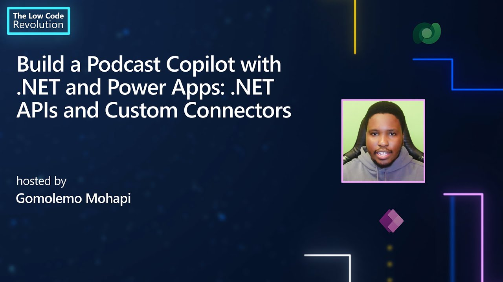
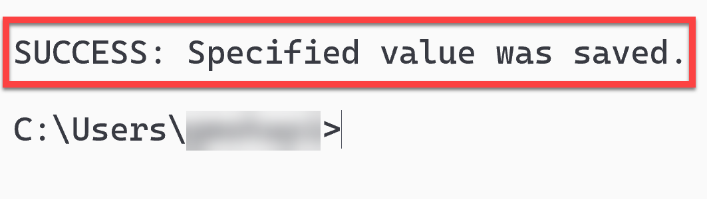
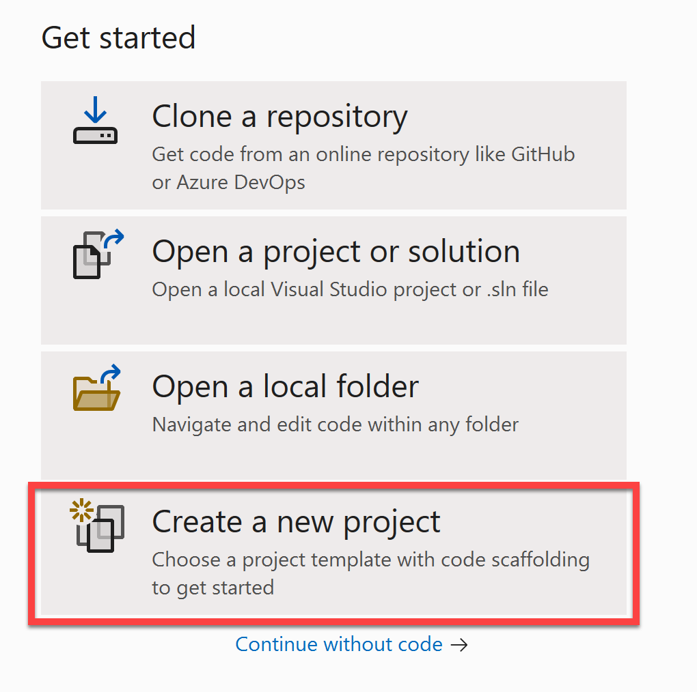
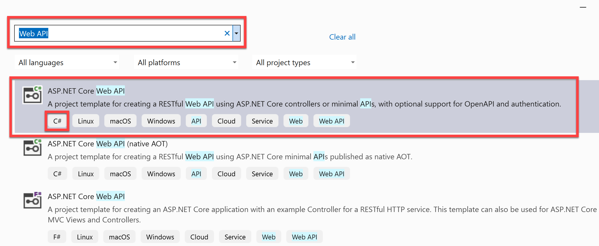
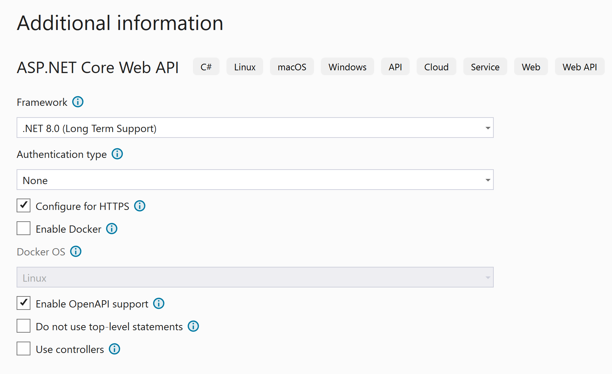
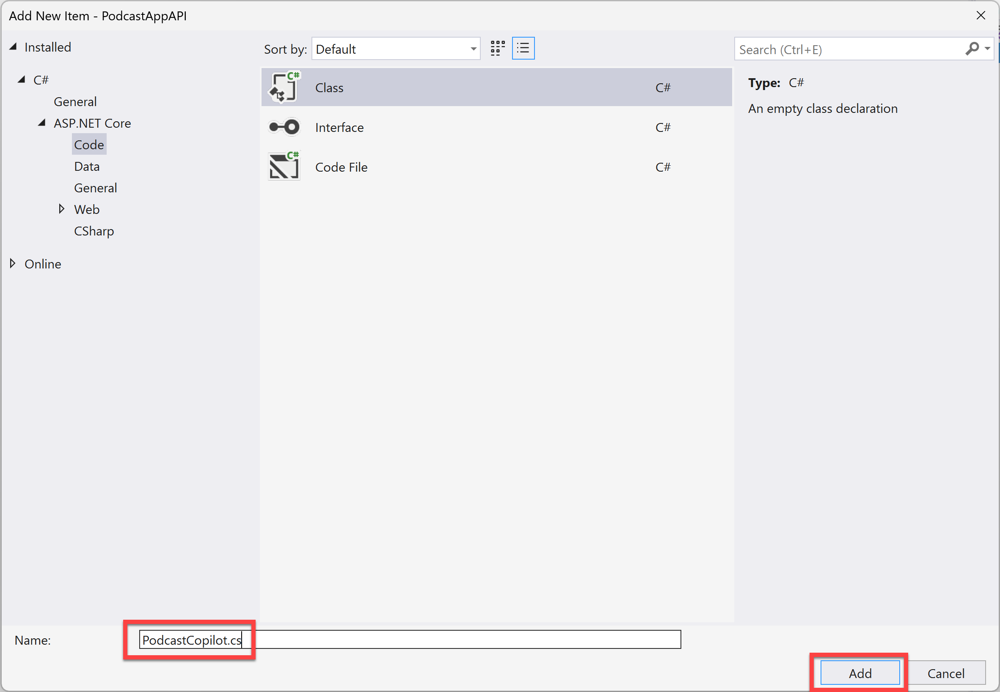
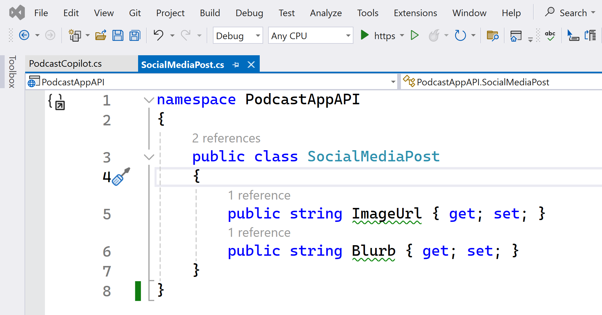
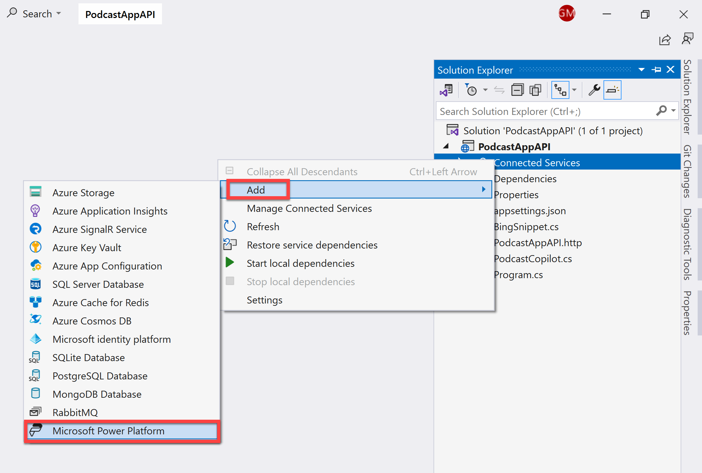
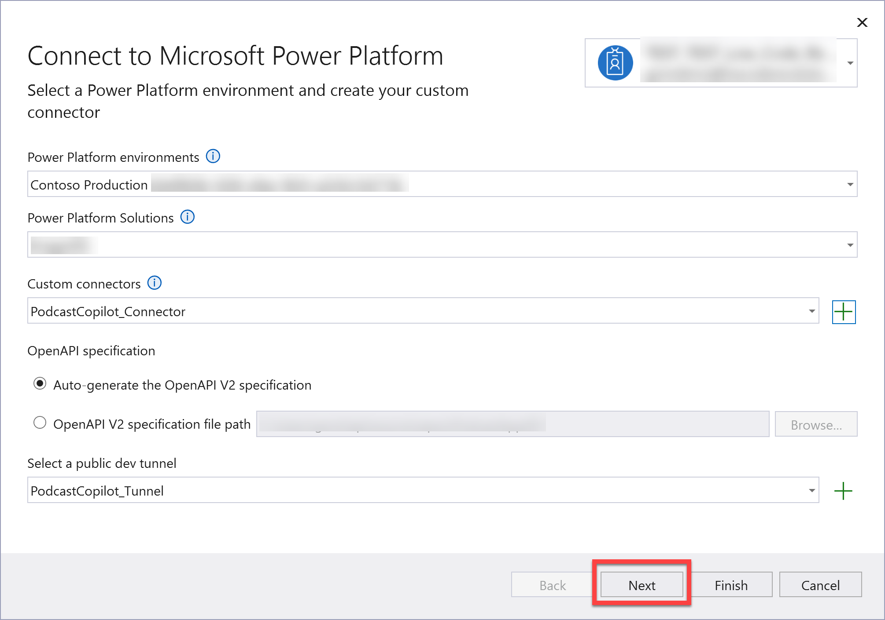
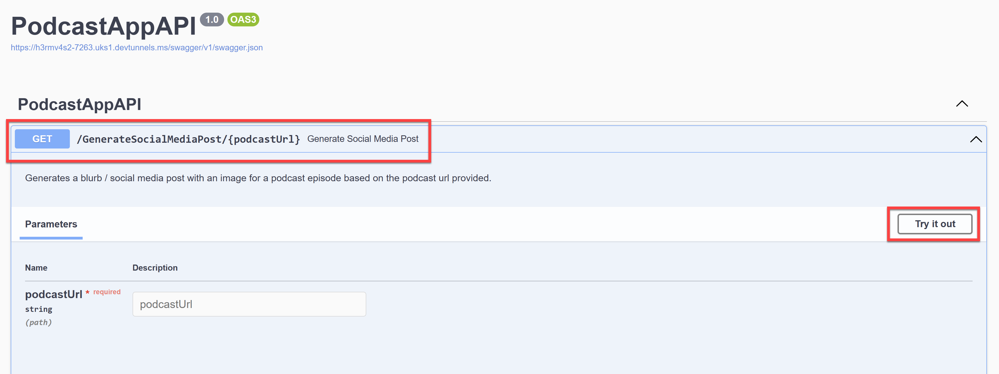

# Lab 2 - Bridging the Gap: .NET APIs, Azure and Custom Connectors

## Background

We take a step further from Lab 1 by creating a .NET API using the .NET Azure OpenAI SDK and creating a Custom Connector from Visual Studio.

## Definitions

### What is .NET?

.NET is a free, cross-platform, open source developer platform for building many different types of applications. With .NET, you can use multiple languages, editors, and libraries to build for web, mobile, desktop, games, IoT, and of course, AI.

Learn More: [Introduction to .NET [Microsoft Learn]](https://learn.microsoft.com/en-us/dotnet/core/introduction)

### What is the .NET Azure OpenAI SDK?

The Azure OpenAI client library for .NET is an adaptation of OpenAI's REST APIs that provides an idiomatic interface and rich integration with the rest of the Azure SDK ecosystem. It can connect to Azure OpenAI resources or to the non-Azure OpenAI inference endpoint, making it a great choice for even non-Azure OpenAI development.

Learn More: [Azure OpenAI client library for .NET [Microsoft Learn]](https://learn.microsoft.com/en-us/dotnet/api/overview/azure/ai.openai-readme?view=azure-dotnet-preview)

### What is the Power Platform?

The Power Platform provides organizations with the opportunity to empower their team members to build their own solutions through an intuitive low-code or no-code set of services. These services help simplify the process of building solutions. With Power Platform, solutions can be built in days or weeks, as opposed to months or years. Microsoft Power Platform is composed of five key products: Power Apps, Power Automate, Power BI, Power Virtual Agents, and Power Pages.

Learn More: [Power Platform](https://aka.ms/PowerPodcast/PowerPlatformOverview)

### What is a Custom Connector?

While Azure Logic Apps, Microsoft Power Automate, and Microsoft Power Apps offer over 1,000 connectors to connect to Microsoft and verified services, you may want to communicate with services that aren't available as prebuilt connectors. Custom connectors address this scenario by allowing you to create (and even share) a connector with its own triggers and actions.

Learn More: [Custom connectors [Microsoft Learn]](https://aka.ms/PowerPodcast/CustomConnectorsOverview)

## Prerequisites

For this lab, make sure you have the following ready:

- Downloaded and installed [Visual Studio Community Edition](https://visualstudio.microsoft.com/downloads/)
- Downloaded and installed the [latest version of .NET](https://dotnet.microsoft.com/download)
- Added and configured a [Power Apps Developer Plan](https://powerapps.microsoft.com/developerplan) (Make sure it's set with the same email address as your Azure account)

### Video Overview of Lab:

> 📹 Click the image below to watch a video walkthrough of this lab.

[](https://aka.ms/PowerPodcast/Episode2)

## Instructions

### Set an environment variable for Bing Search

1. Open up a command prompt on your local machine.

1. Paste the following command into the command prompt:

    ```bash
    setx BING_SEARCH_KEY "REPLACE_WITH_YOUR_BING_KEY_VALUE_HERE"
    ```

    This saves the Bing Search key as an environment variable on your local machine. Replace **REPLACE_WITH_YOUR_BING_KEY_VALUE_HERE** with your Bing Search key.

    Press **Enter**.

    You should then see the following message:

    

1. Let's do the same to set the Azure OpenAI resource key as an environment variable. Paste the following command into the command prompt:

    ```bash
    setx AZURE_OPENAI_KEY_SC "REPLACE_WITH_YOUR_AZURE_OPENAI_KEY_HERE"
    ```

    Press **Enter**.

### Create a new .NET Web API Project

1. Open up Visual Studio and click on **Create a new project**.

    

1. Search for "Web API" and select **ASP.NET Core Web API**. Make sure you've selected the C# project template.

    

1. Click **Next**.

1. Name your project ``PodcastAppAPI`` and click **Next**.

1. Make sure that the Framework is set to **.NET 8**, Authentication type is set to **None** and that it's configured for **HTTPS**. Click **Create**.

    

1. Once the project has been created, open the **Solution Explorer** and right-click on the **PodcastAppAPI** project and select **Open in Terminal**.

1. In the terminal window, run the following command to install the prerelease version of the Azure OpenAI SDK:

    ```bash
    dotnet add package Azure.AI.OpenAI --version 2.0.0
    ```

1. Then run the following command to install the Newtonsoft.Json package:

    ```bash
    dotnet add package Newtonsoft.Json
    ```

### Creating the PodcastCopilot Class

1. Once the command has completed, add a new class to the project by right-clicking on the **PodcastAppAPI** project and selecting **Add > Class**. Name the class ``PodcastCopilot``.

    

1. Add the following using statements to the top of the ``PodcastCopilot`` class:

    ```csharp
    using System.Web;
    using Azure.AI.OpenAI;
    using Azure;
    using Newtonsoft.Json.Linq;
    using OpenAI.Chat;
    using OpenAI.Audio;
    using OpenAI.Images;
    ```

1. Inside the **PodcastCopilot** class, add the following code. Replace `{YOUR-ENDPOINT}` with the endpoint you copied from the model deployment in Lab 1:

    ```csharp
    //Initialize Endpoints and Key
    static string endpointSC = "{YOUR-ENDPOINT}";
    static string keySC = Environment.GetEnvironmentVariable("AZURE_OPENAI_KEY_SC");

    static string bingSearchUrl = "https://api.bing.microsoft.com/v7.0/search";
    static string bingSearchKey = Environment.GetEnvironmentVariable("BING_SEARCH_KEY");

    //Instantiate OpenAI Client
    static AzureOpenAIClient azureOpenAIClient = new AzureOpenAIClient(
        new Uri(endpointSC),
        new ApiKeyCredential(keySC));
    ```

1. Then below the above code, add the following code to perform **Audio Transcription**:

    ```csharp
    //Get Audio Transcription
    public static async Task<string> GetTranscription(string podcastUrl)
    {
        var decodedUrl = HttpUtility.UrlDecode(podcastUrl);

        HttpClient httpClient = new HttpClient();
        Stream audioStreamFromBlob = await httpClient.GetStreamAsync(decodededUrl);

        AudioClient client = azureOpenAIClient.GetAudioClient("whisper");
        AudioTranscription audioTranscription = await client.TranscribeAudioAsync(audioStreamFromBlob, "file.mp3");

        return audioTranscription.Text;
    }
    ```

1. Then add the following code to perform **Guest Name Extraction**:

    ```csharp
    //Extract Guest Name from transcription
    public static async Task<string> GetGuestName(string transcription)
    {
        ChatClient client = azureOpenAIClient.GetChatClient("gpt4");

        ChatCompletion chatCompletion = await client.CompleteChatAsync(
        [
                new SystemChatMessage("Extract only the guest name on the Beyond the Tech podcast from the following transcript. Beyond the Tech is hosted by Kevin Scott, so Kevin Scott will never be the guest."),
                new UserChatMessage(transcription)
        ]);

        return chatCompletion.Content.First().Text;
    }
    ```

1. Then add the following code to the PodcastCopilot class to perform **Guest bio extraction from Bing**:

    ```csharp
    //Get Guest Bio from Bing
    public static async Task<string> GetGuestBio(string guestName)
    {
        var client = new HttpClient();

        client.DefaultRequestHeaders.Add("Ocp-Apim-Subscription-Key", bingSearchKey);

        HttpResponseMessage response = await client.GetAsync($"{bingSearchUrl}?q={guestName}");

        string responseBody = await response.Content.ReadAsStringAsync();

        // Parse responseBody as JSON and extract the bio.
        JObject searchResults = JObject.Parse(responseBody);
        var bio = searchResults["webPages"]["value"][0]["snippet"].ToString();

        return bio;
    }
    ```

1. Then add the following code to perform the next step of the PodcastCopilot process; **Creating a Social Media Blurb**:

    ```csharp
   //Create Social Media Blurb
    public static async Task<string> GetSocialMediaBlurb(string transcription, string bio)
    {
        ChatClient client = azureOpenAIClient.GetChatClient("gpt4");

        ChatCompletion chatCompletion = await client.CompleteChatAsync(
        [
            new SystemChatMessage("You are a helpful large language model that can create a LinkedIn promo blurb for episodes of the podcast Behind the Tech, when given transcripts of the podcasts. The Behind the Tech podcast is hosted by Kevin Scott."),
            new UserChatMessage("Create a short summary of this podcast episode that would be appropriate to post on LinkedIn to promote the podcast episode. The post should be from the first-person perspective of Kevin Scott, who hosts the podcast. \n" +
                $"Here is the transcript of the podcast episode: {transcription} \n" +
                $"Here is the bio of the guest: {bio}")
        ]);

        return chatCompletion.Content.First().Text;
    }
    ```

1. Then add the following code to perform the next step of the PodcastCopilot process; **Creating a Dall.E prompt**:

    ```csharp
    //Generate a Dall-E prompt
    public static async Task<string> GetDallEPrompt(string socialBlurb)
    {
        ChatClient client = azureOpenAIClient.GetChatClient("gpt4");

        ChatCompletion chatCompletion = await client.CompleteChatAsync(
        [
            new SystemChatMessage("You are a helpful large language model that generates DALL-E prompts, that when given to the DALL-E model can generate beautiful high-quality images to use in social media posts about a podcast on technology. Good DALL-E prompts will contain mention of related objects, and will not contain people, faces, or words. Good DALL-E prompts should include a reference to podcasting along with items from the domain of the podcast guest."),
            new UserChatMessage($"Create a DALL-E prompt to create an image to post along with this social media text: {socialBlurb}")

        ]);

        return chatCompletion.Content.First().Text;
    }
    ```

1. Then add the following code to perform the final step of the PodcastCopilot process; **Generating the social media image from DallE**:

    ```csharp
    //Create social media image with a Dall-E
    public static async Task<string> GetImage(string prompt)
    {
        ImageClient client = azureOpenAIClient.GetImageClient("dalle3");

        ImageGenerationOptions options = new()
        {
            Quality = GeneratedImageQuality.High,
            Size = GeneratedImageSize.W1024xH1024,
            Style = GeneratedImageStyle.Vivid,
            ResponseFormat = GeneratedImageFormat.Uri,
        };

        GeneratedImage image = await client.GenerateImageAsync(prompt + ", high-quality digital art", options);

        return image.ImageUri.ToString();
    }
    ```

Now that we've created the PodcastCopilot class which contains the methods to perform the process which takes a podcast URL and returns a social media post and image for that podcast, we can move on to creating the SocialMediaPost class.

### Creating the SocialMediaPost Class

1. Right click on the **PodcastAppAPI** project and select **Add > Class**. Name the class ``SocialMediaPost``. Add the following code to the class:

    ```csharp
    public class SocialMediaPost
    {
        public string ImageUrl { get; set; }
        public string Blurb { get; set; }
    }
    ```

    The class should look like this:

    

With the SocialMediaPost class created, we can now add one more more method to the PodcastCopilot class to return a SocialMediaPost object.

### Updating the PodcastCopilot Class

1. Open the **PodcastCopilot** class and add the following method to the class:

    ```csharp
    public static async Task<SocialMediaPost> GenerateSocialMediaPost(string podcastUrl)
    {
        var transcription = await GetTranscription(podcastUrl);
        var guestName = await GetGuestName(transcription);
        var guestBio = await GetGuestBio(guestName);
        var generatedBlurb = await GetSocialMediaBlurb(transcription, guestBio);
        var dallePrompt = await GetDallEPrompt(generatedBlurb);
        var generatedImage = await GetImage(dallePrompt);

        var socialMediaPost = new SocialMediaPost()
        {
            ImageUrl = generatedImage,
            Blurb = generatedBlurb
        };

        return socialMediaPost;
    }
    ```

And with that, we can move on updating the Program.cs file to implement the Minimal API.

### Updating the Program.cs file with the Minimal API implementation

1. Open the **Program.cs** file and replace all the code in this file with:

    ```csharp
    var builder = WebApplication.CreateBuilder(args);

    // Add services to the container.
    // Learn more about configuring Swagger/OpenAPI at https://aka.ms/aspnetcore/swashbuckle
    builder.Services.AddEndpointsApiExplorer();
    builder.Services.AddSwaggerGen();

    var app = builder.Build();

    // Configure the HTTP request pipeline.
    if (app.Environment.IsDevelopment())
    {
        app.UseSwagger();
        app.UseSwaggerUI();
    }

    app.UseHttpsRedirection();

    //Implement Minimal APIs

    app.Run();
    ```

1. Then replace the ```//Implement Minimal APIs``` comment with the following code:

    ```csharp
    app.MapGet("/GenerateSocialMediaPost/{podcastUrl}", (string podcastUrl) =>
    {
        return PodcastAppAPI.PodcastCopilot.GenerateSocialMediaPost(podcastUrl);
    })
        .WithName("GetSocialMediaPost")
        .WithSummary("Generate Social Media Post")
        .WithDescription("Generates a blurb / social media post with an image for a podcast episode based on the podcast url provided.")
        .WithOpenApi();
    ```

Now we will be turning our API into a Custom Connector so that it can be used within the Power Platform.

### Creating a Custom Connector from Visual Studio

1. In the solution explorer, right-click on the **Connected Services** node and select **Add** > **Microsoft Power Platform**.

    

1. Ensure you're signed in with the same account as your Power Apps Developer Plan, and configure the following settings:

    - **Power Platform environments**: Select an environment of your choosing
    - **Solution**: Select a solution of your choosing
    - **Custom Connector**: Create a new custom connector and call it ``PodcastCopilot_Connector``
    - **OpenAPI specification**: Select the ``Auto-generate the OpenAPI V2 Specification`` option
    - **Dev Tunnel**: Create a new dev tunnel and call it ``PodcastCopilot_Tunnel``

    Click **Next** and then **Finish**.

    

1. Once the Dependency configuration process has completed, close the pop-up window.

1. Run the application, and in the browser window; click **Continue** to connect to your Developer Tunnel.

    

    Once the Developer Tunnel has connected, you'll see a single API operation which you can test to see if it's working correctly.

1. Click on the **GenerateSocialMediaPost** operation to expand it and then click on the **Try it out** button.

    

1. Enter the url of the podcast episode you uploaded to Azure Blob Storage in Lab 1 and click **Execute**.

1. And then after a couple of seconds, you should see the response from the API operation showing an image URL and a social media blurb all generated from the podcast audio with Azure OpenAI.

    

...and that's it! You've now created a .NET API using the .NET Azure OpenAI SDK and created a Custom Connector from Visual Studio where you'll be able to use the API within the Power Platform.

### ➡️ [Lab 3 - The Final Touch: Power Apps and Microsoft Copilot Studio](../Lab3/README.md)
