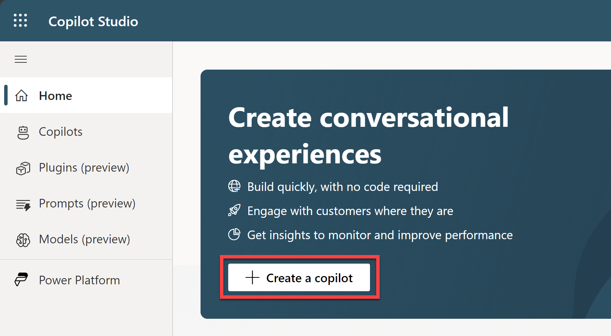
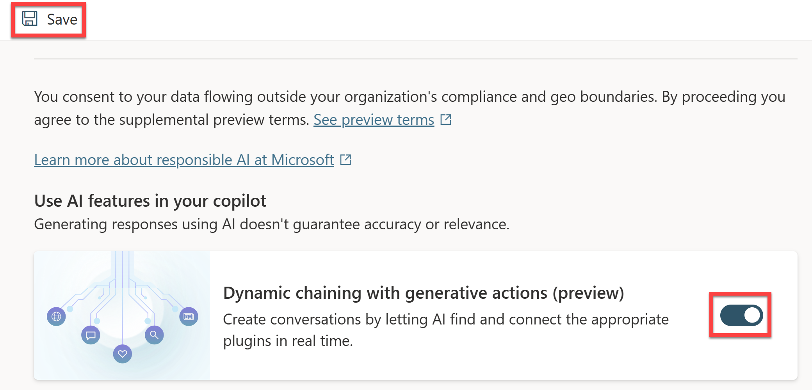
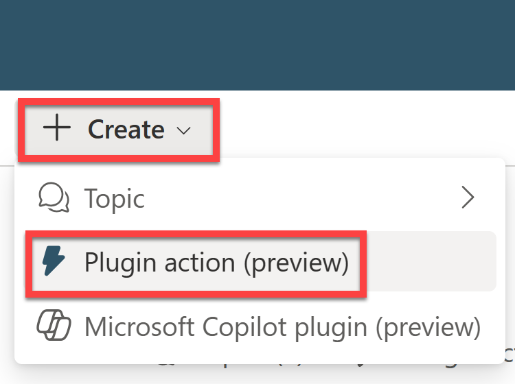
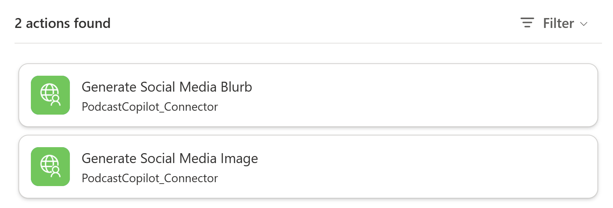
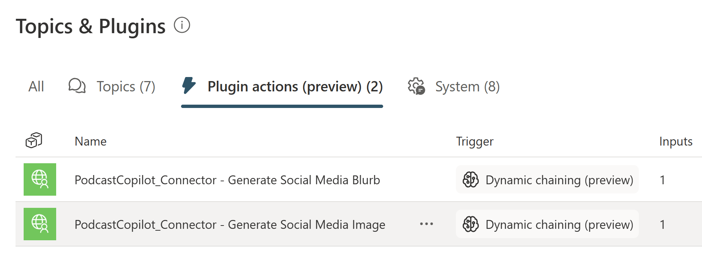
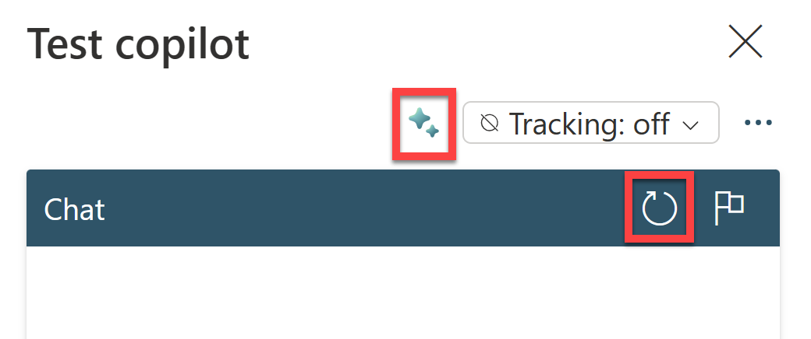

# Lab 3 - The Final Touch: Power Apps and Microsoft Copilot Studio Integration

## Background

The final lab brings it all together. We will build the Power App UI, connect to the Custom Connector, and publish the social media post to LinkedIn. As a bonus, we will also see how to implement this workflow with a Power Virtual Agents chatbot.

## Definitions

### What is Power Apps?

Power Apps is a suite of apps, services, and connectors, as well as a data platform, that provides a rapid development environment to build custom apps for your business needs. Using Power Apps, you can quickly build custom business apps that connect to your data stored either in the underlying data platform (Microsoft Dataverse) or in various online and on-premises data sources (such as SharePoint, Microsoft 365, Dynamics 365, SQL Server, and so on).

Learn More: [What is Power Apps? [Microsoft Learn]](https://learn.microsoft.com/en-us/power-apps/powerapps-overview)

### What is Power Fx?

Power Fx is the low-code language that will be used across Microsoft Power Platform. It's a general-purpose, strong-typed, declarative, and functional programming language.

Learn More: [Microsoft Power Fx overview [Microsoft Learn]](https://learn.microsoft.com/en-us/power-platform/power-fx/overview)

## Prerequisites

For this lab, just make sure you've completed the previous three labs.

### Video Overview of Lab:


Date of Livestream: {TBD}

## Instructions

### Creating the Power App

1. Log into [Power Apps](https://make.powerapps.com/) and sign in with your Power Apps Developer account.

1. Click **+ Create** on the left-hand navigation pane and select **Blank app**.

1. Under **Blank canvas app**, select **Create**.

    

1. Name the app ``Podcast Copilot``, select the **Tablet** format, and click **Create**.

    

1. Once the app has been created, on the left navigation pane, select **Data** and click **+ Add data**.

    

1. Search for ``PodcastCopilot_Connector`` and select the connector.

1. Then click **Connect**.

    

1. Once the connector has been added to the app, add the following controls to the screen:

    - 1 x **Text Input** control
    - 1 x **Button** control
    - 2 x **Label** control
    - 1 x **Image** control

    Arrange the controls as shown below:

    

    The first **Label** control will be used for the app title. The **Text Input** control will be used to enter the link to the Podcast URL. The **Button** control with the text ``Generate Post`` will fire up the Custom Connector to generate the social media post and image. The second **Label** control will display the generated post. The **Image** control will display the generated image.

1. Name the controls as follows:

    - **Label**: ``lblTitle``
    - **Text Input**: ``txtPodcastURL``
    - **Button**: ``btnGeneratePost``
    - **Image**: ``imgSocialImage``
    - **Label**: ``lblSocialPost``

1. Now select the **Button** control and add the following formula to the **OnSelect** property:

    ```
    //Generate a social media blurb / post
    Set(
        socialMediaBlurb,
        First(PodcastCopilot_Connector.GetSocialMediaBlurb(txtPodcastURL.Text).choices).message.content
    );

    //Generate a social media image
    Set(
        socialImage,
        PodcastCopilot_Connector.GetSocialMediaImage(txtPodcastURL.Text).url
    );
    ```

    This formula will call the two API operations in the Custom Connector that 1) Generates a social media post / blurb and 2) Generates a social media image. The resulting social media blurb will be stored in a variable called ``socialMediaBlurb``. The resulting image will be stored in a variable called ``socialImage``.

1. Now select the **lblSocialPost** control and add the following formula to the **Text** property:

    ```
    socialMediaBlurb
    ```

    This will display the social media blurb in the label.

1. Finally select the **imgSocialImage** control and add the following formula to the **Image** property:

    ```
    socialImage
    ```

    This will display the image in the image control.

1. Use the **Preview** button to test the app. Enter the link to the podcast episode (the blob url we copied in Lab 1) in the **Text Input** control and click the **Generate Post** button. The social media blurb and image (both unique to you) should be displayed.

    

Because the main functionality of the app is encapsulated in the Custom Connector, you can easily reuse this connector in other Power Apps or other parts of the Power Platform including Microsoft Copilot Studio.

### Using the connector in Microsoft Copilot Studio

1. Log into [Microsoft Copilot Studio](https://copilotstudio.microsoft.com/) and sign in with your Microsoft account. The same account you've been using for this workshop.

1. On the home page, click **+ Create a copilot**.

    

1. Name the copilot ``Podcast Copilot`` and click **Create**.

1. Once the copilot has been created, click and expand **Settings** on the left-hand navigation pane.

1. Select **Generative AI**.

1. On the main panel, scroll down until you see the **Dynamic chaining with generative actions** option. Enable it and then click **Save** in the top left corner.

    

1. Once saved, click **Topics & Plugins** on the left-hand navigation pane.

1. On the top navigation pane, click **+ Create** > **Plugin action (preview)**.

    

1. In the **Add an action** dialog box, enter `podcastcopilot` in the search field and click **Search**.

    Two actions representing the API operations should be displayed:

    

1. Select **Generate Social Media Blurb** to begin setting this up. 

1. Then click **Next** to confirm the **PodcastCopilot_Connector** connector and to make a connection.

1. Review the action details and click **Finish**.

1. Do the same steps for the **Generate Social Media Image** action.

    Once complete, you should have two actions in the **Topics & Plugins** section.

    

1. Make sure you're running the PodcastCopilotAPI in Visual Studio before testing the copilot in Copilot Studio. Click on **Test your copilot** on the bottom left corner of the screen.

1. In the copilot test panel, click the Refresh icon to refresh the copilot and test the new actions. Then click the sparkle icon to turn on the dynamic tracing mode.

    

    Now you are able to test the copilot and see in real-time how the dynamic chaining works and how the copilot is making the plugin calls.

1. Test the copilot by asking it to generate a social media post for a podcast episode and a social media image. You can use the same podcast episode link you used in the Power App.

...and that's it! You've successfully built a Power App and Copilot that uses the Custom Connector to generate a social media post and image from a Podcast URL using AI!