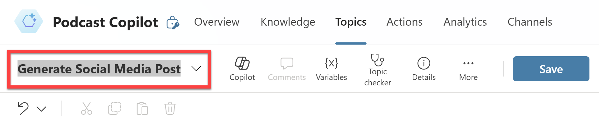
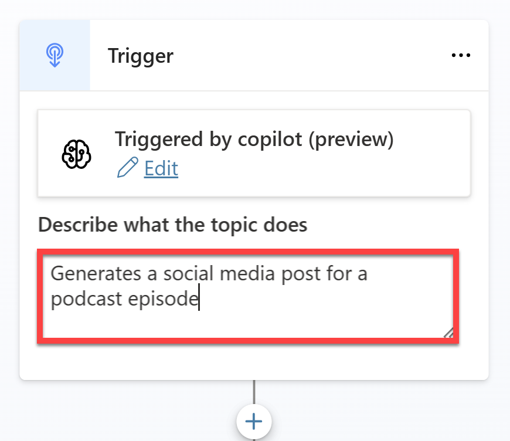
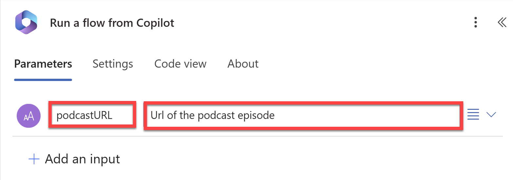
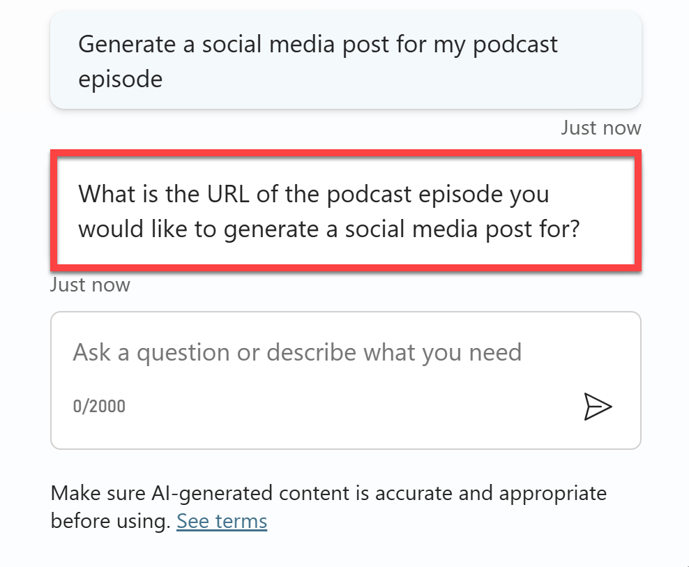

# Lab 3 - The Final Touch: Power Apps and Microsoft Copilot Studio Integration

## Background

The final lab brings it all together. We will build the Power App UI, connect to the Custom Connector, and create the AI generated social media post. As a bonus, we will also see how to implement this workflow with Microsoft Copilot Studio as well.

## Definitions

### What is Power Apps?

Power Apps is a suite of apps, services, and connectors, as well as a data platform, that provides a rapid development environment to build custom apps for your business needs. Using Power Apps, you can quickly build custom business apps that connect to your data stored either in the underlying data platform (Microsoft Dataverse) or in various online and on-premises data sources (such as SharePoint, Microsoft 365, Dynamics 365, SQL Server, and so on).

Learn More: [What is Power Apps? [Microsoft Learn]](https://aka.ms/PowerPodcast/PowerAppsOverview)

### What is Microsoft Copilot Studio

Microsoft Copilot Studio lets you create powerful AI-powered copilots for a range of requests—from providing simple answers to common questions to resolving issues requiring complex conversations. Engage with customers and employees in multiple languages across websites, mobile apps, Facebook, Microsoft Teams, or any channel supported by the Azure Bot Framework.

Learn More: [Microsoft Copilot Studio overview [Microsoft Learn]](https://aka.ms/PowerPodcast/CopilotStudioOverview)

### What is Power Fx?

Power Fx is the low-code language that will be used across Microsoft Power Platform. It's a general-purpose, strong-typed, declarative, and functional programming language.

Learn More: [Microsoft Power Fx overview [Microsoft Learn]](https://aka.ms/PowerPodcast/PowerFxOverview)

## Prerequisites

For this lab, just make sure you've completed the previous three labs.

### Video Overview of Lab:

> 📹 Click the image below to watch a video walkthrough of this lab.

[](https://aka.ms/PowerPodcast/Episode3)

## Instructions

### Creating the Power App

1. Log into [Power Apps](https://make.powerapps.com/) and sign in with your Power Apps Developer account. Make sure you're in the same environment you selected for the Custom Connector you created in Lab 2.

1. Click **+ Create** on the left-hand navigation pane and select **Blank app**.

1. Under **Blank canvas app**, select **Create**.

    

1. Name the app ``Podcast Copilot``, select the **Tablet** format, and click **Create**.

    

1. Once the app has been created, on the left navigation pane, select **Data** and click **+ Add data**.

    

1. Search for ``PodcastCopilot_Connector`` and select the connector.

1. Then click **Connect**.

    

1. Once the connector has been added to the app, add the following controls to the screen:

    - 1 x **Text Input** control
    - 1 x **Button** control
    - 2 x **Label** control
    - 1 x **Image** control

    Arrange the controls as shown below:

    

    The first **Label** control will be used for the app title. The **Text Input** control will be used to enter the link to the Podcast URL. The **Button** control with the text ``Generate Post`` will fire up the Custom Connector to generate the social media post and image. The second **Label** control will display the generated post. The **Image** control will display the generated image.

1. Name the controls as follows:

    - **Label**: ``lblTitle``
    - **Text Input**: ``txtPodcastURL``
    - **Button**: ``btnGeneratePost``
    - **Image**: ``imgSocialImage``
    - **Label**: ``lblSocialPost``

1. Now select the **Button** control and add the following formula to the **OnSelect** property:

    ```
    //Generate a social media blurb / post
    Set(
        socialMediaBlurb,
        PodcastCopilot_Connector.GetSocialMediaPost(txtPodcastURL.Text).blurb
    );

    //Generate a social media image
    Set(
        socialImage,
        PodcastCopilot_Connector.GetSocialMediaPost(txtPodcastURL.Text).imageUrl
    );
    ```

    This formula will call the single API operation in the Custom Connector and it will return a Social Media Post record with a 1) blurb and 2) imageUrl. The resulting social media blurb will be stored in a variable called ``socialMediaBlurb``. The resulting image will be stored in a variable called ``socialImage``.

1. Now select the **lblSocialPost** control and add the following formula to the **Text** property:

    ```
    socialMediaBlurb
    ```

    This will display the social media blurb in the label.

1. Finally select the **imgSocialImage** control and add the following formula to the **Image** property:

    ```
    socialImage
    ```

    This will display the image in the image control.

1. Use the **Preview** button to test the app. Make sure that the API is running in Visual Studio before you run this Power App. Enter the link to the podcast episode (the blob url we copied in Lab 1) in the **Text Input** control and click the **Generate Post** button. The social media blurb and image (both unique to you) should be displayed:

    

Because the main functionality of the app is encapsulated in the Custom Connector, you can easily reuse this connector in other Power Apps or other parts of the Power Platform including Microsoft Copilot Studio.

### Using the connector in Microsoft Copilot Studio

1. Log into [Microsoft Copilot Studio](https://copilotstudio.microsoft.com/) and sign in with your Microsoft account. The same account you've been using for this workshop. Make sure you're in the same environment you selected for the Custom Connector you created in Lab 2.

1. On the left navigation pane, select **Create**.

1. Then select **New copilot**.

    

1. On the top right corner, select **Skip to Configure**.

1. Name the copilot ``Podcast Copilot`` and select **Create**.

1. Once the copilot has been created, select **Settings** on the top right corner. Then select **Generative AI**.

1. Under **How should your copilot interact with people?**, select the **Generative** option.

    Then select **Save**.

    

    Once saved, exit the settings by clicking the **x** on the top right corner.

1. On the top navigation pane, select **Topics**.

1. Then select **+ Add a topic** > **From blank**.

1. Rename the topic to ``Generate Social Media Post``.

    

1. In the **Trigger** description, enter ``Generates a social media post for a podcast episode``.

    

1. Add a new node and select **Ask a question** and set the following:

    * **Message**: ``What is the URL of the podcast episode you would like to generate a social media post for?``
    * **Identify**: Select **User's entire response**
    * **Save user response as**: ``podcastURL``

    

1. Add another node but this time select **Call an action** and in the **Select an action** pop up, select **Create a flow** which will then launch Power Automate.

    

1. Select the **Run a flow from Copilot** trigger and in the pop up, under **Parameters**, click **+ Add an input** and select **Text**.

1. Replace **Input** with ``podcastURL`` and replace **Please enter your input** with ``Url of the podcast episode``.

    

1. Close the pop up and add an action into the flow between the trigger and the end node. In the **Add an action** dialog, search for ``podcastcopilot`` and select **Generate Social Media Post**.

    

1. Create a connection to the **PodcastCopilot_Connector** by clicking on **Create New**.

    

1. Once the connection has been created, click into the **PodcastUrl** field and then select the **Dynamic Content** icon.

    

1. Select **podcastURL** from the list of dynamic content.

1. Close the dialog. Then select the **Respond to Copilot** node. In the dialog, click **+ Add an output** and select **Text**. Add another output and select **Text**. Configure the outputs as follows:

    * **Output**: ``blurb``
    * **Value**: Select **body/blurb** from the Dynamic Content list
    * **Description**: `A social media blurb promoting the podcast episode`

    <br>

    * **Output**: ``imageUrl``
    * **Value**: Select **body/imageUrl** from the Dynamic Content list
    * **Description**: `The URL of the social media image which accompanies the social media blurb promoting the podcast episode`

    

1. Close the dialog, rename the flow to **Generate Social Media Post**, and click **Publish**.

    Once published, you can close Power Automate and return to Microsoft Copilot Studio.

1. Once you're back in Copilot Studio, click **Done** on the *Save and Refresh* dialog to update the new flow in the flow list.

    

1. Once again, add a node and select **Call an action** but this time in the **Select an action** pop up, select the **Generate Social Media Post** Power Automate flow you just created.

1. Once added, set the input to the **podcastURL** variable.

    

1. Add another node and select **Send a message**. In the message node, select **+ Add** and select **Adaptive Card**.

1. Click on the Adaptive Card and under the **Adaptive Card properties**, expand the card content and change **Edit JSON** to **Edit Formula**. 

    

1. Copy the following formula and paste it into the **Adaptive Card**:

    ```json
    {
    '$schema': "http://adaptivecards.io/schemas/adaptive-card.json",
    type: "AdaptiveCard",
    version: "1.3",
    body: [
        {
        type: "TextBlock",
        text: "Generated Post",
        size: "Large",
        weight: "Bolder",
        horizontalAlignment: "Center",
        spacing: "Medium"
        },
        {
        type: "Image",
        size: "large",
        url: Topic.imageUrl,
        horizontalAlignment: "Center"
        },
        {
        type: "RichTextBlock",
        inlines: [
            {
            type: "TextRun",
            size: "medium",
            text: Topic.blurb
            }
        ]
        }
    ]
    }
    ```

    This formula will display the generated social media blurb and image formatted neatly in an adaptive card.

1. Close the adaptive card and click **Save** to save the topic.

### Testing the Copilot

1. Once saved, open the **PodcastAppAPI** project in Visual Studio and run the project.

1. While the API is running, go back to Microsoft Copilot Studio and click **Test** on the top right corner. This will open the copilot test panel.

1. Click on the **Refresh** icon on the test panel to refresh the copilot and test the new topic.

1. Ask the following question: ``Generate a social media post for my podcast episode``

    The copilot should then respond with:

    

1. Respond with the url of the podcast audio snippet you uploaded to Azure blob storage in Lab 1.

    After a couple of seconds, the copilot should then respond with the social media blurb and image generated from the podcast episode formatted in an adaptive card.

    

...and that's it! You've successfully built a Power App and Copilot that uses the Custom Connector to generate a social media post and image from a Podcast URL using AI!
