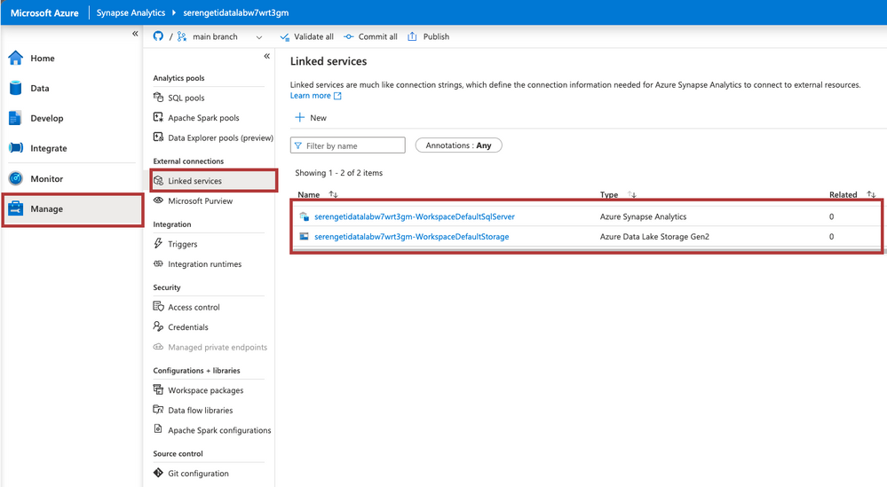
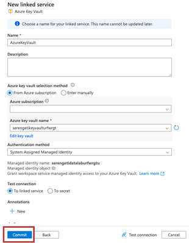
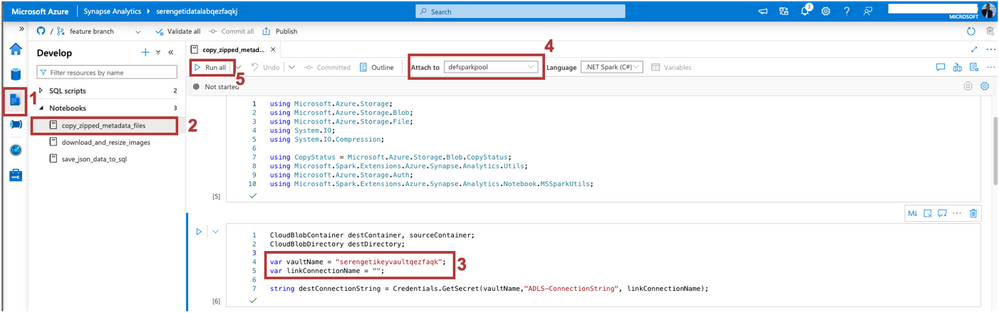
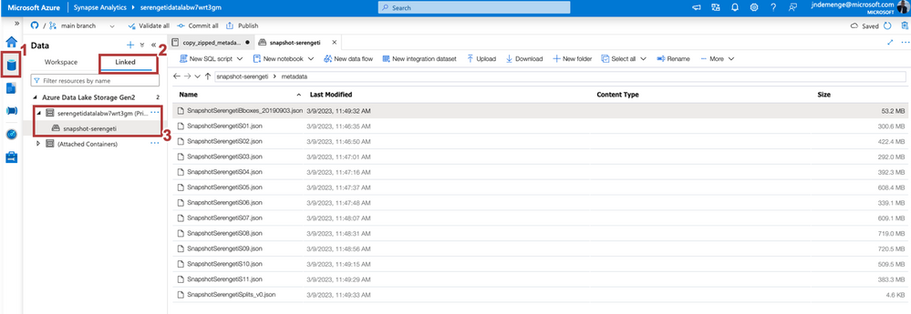
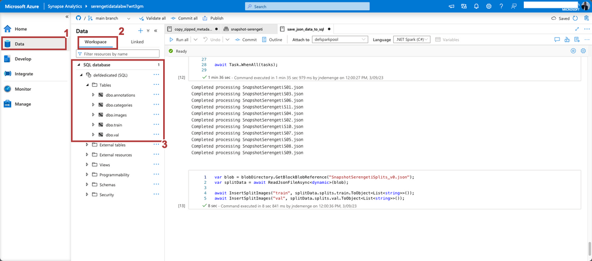
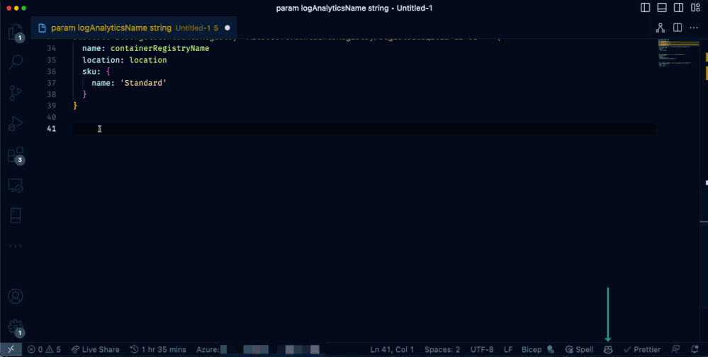

# Create a Data Solution on Azure Synapse Analytics with Snapshot Serengeti

This will be the first article in a two-part series on building an end-to-end data analytics solution on Azure Synapse Analytics.

The dataset used in this solution is the Snapshot Serengeti dataset, which consists of a large-scale collection of camera trap images. To learn more about this dataset, please visit the following link: https://lila.science/datasets/snapshot-serengeti.

By the end of this series, you will have learned how to transform and analyze the data, and use it to train a classification machine learning model capable of classifying camera trap images into one of the 48 species in the dataset.

 
This article describes a solution that combines a range of Azure services to ingest, store, transform, and serve data and insights from different sources:

1. Semi-structured data - these are Json files that contain the split of the dataset into train, test, and validation sets.
2. Unstructured data - these are the images in the dataset and the zipped files that contain the metadata of the images.

 

There are different ways to building this data solution, but we'll go with one that allows you to interact with most of the services on Azure synapse.

Before proceeding check the set-up instructions as explained in this GitHub repository: https://github.com/Jcardif/serengetidatalab on how to deploy the resources needed for this solution to azure.

 

Now that you have successfully deployed the resources needed for this solution, the remainder of this article will look at how we load the data into the storage account, transform the data and finally load it into the SQL Data warehouse.

## Synapse Analytics Workspace

From the deployed resource group open the Synapse Workspace resource then click on Open Synapse Studio. This will open the Synapse Studio in a new tab. Synapse studio allows you to execute all data tasks with a simple UI and unified environment.

Synapse studio is divided into Activity Hubs, which organize the tasks needed for building analytics solutions. These hubs are:

1. Data Hub - Explore data inside the workspace and in linked storage accounts.
2. Develop Hub - Develop and run notebooks, data flows and SQL scripts.
3. Integrate Hub - Create and manage data pipelines.
4. Monitor Hub - Monitor the health of the workspace and the pipelines.
5. Manage Hub - Manage the workspace, configurations, and linked services.

 

## Managing workspace configurations & linked services
Navigate to the **Manage hub**. This hub allows you to manage SQL Pools, Apache Spark Pools and Linked Services as well as manage workspace configurations and access.

SQL Pools are fully managed SQL Server instances that can be used to run SQL scripts and queries. Apache Spark Pools on the other hand provide big data compute capabilities in the workspace. Both are key components of a big data solution where the SQL Pools provide the data warehousing component, and the Spark Pools provide the compute capabilities.

Navigate to the **External connections** section and click on **Linked services**. This opens a list of the linked Services in the workspace. Linked services in Synapse are used to connect to external resources.

By default, you there are two linked services to the he Dedicated SQL Data warehouse and the Azure Data Lake Storage Gen which provides the storage component for your data solution on Azure.

Let's set up a new Linked Service that will link Azure Key Vault to the Synapse workspace. This will enable us to access and retrieve stored credentials from the key vault easily.

Click on **New** and search for **Key Vault**. Select the **Key Vault** option and click on **Continue**. In the dialog that appears, provide a name for the linked service, select your subscription and the key vault name then commit.

After successfully creating the linked service, publish the changes to the workspace by clicking on the **Publish** button at the top of the workspace.

 

Now that we have successfully linked to Azure Key Vault we can begin data ingestion, leveraging the Notebooks in synapse to load the data into the storage account.

# Ingesting the data - Synapse Notebooks, Spark, and Azure Data Lake Storage Gen2
Synapse Notebooks are a great way to interact with data in the workspace. They allow you to write code in different languages to interact with data in the workspace. In this case we'll be using C# notebooks to load the data into the storage account.

To begin, navigate to the **Develop** hub and expand the **Notebooks** and you'll find three notebooks, i.e.:

1. copy_zipped_metadata_files - this notebook downloads and extracts the metadata files from the Snapshot Serengeti dataset into the storage account.
2. save_json_data_to_sql - this notebook loads the Json files into the SQL data warehouse.
3. download_and_resize_images - this notebook performs image transformation before using the image data for training the ML model.
 
To begin, open the **copy_zipped_metadata_files** notebook and in the third cell replace the values of the vaultName and linkConnectionName variables with the name of the key vault and the linked service name to the key vault respectively.

Next attach the notebook to a spark pool by clicking on the **Attach** to button at the top of the notebook. Select the **defsparkpool**, next click on the **Run all** button to execute the notebook.

 

 Navigate to the **Data hub** and clicked the **Linked** tab, expand the **Azure Data Lake Storage Gen2** and the Azure Data Lake storage account and you'll see a newly created container called **snapshot-serengeti**. Open the container and inside the metadata folder you'll find the extracted metadata files.

  

 ## Loading & transforming the data - Synapse Notebooks, Spark, and SQL Data Warehouse

 Open the save_json_data_to_sql notebook and in the fourth cell replace the values of the vaultName and linkConnectionName variables with the name of the key vault and the linked service name to the key vault respectively.

 

Attach the notebook to the defsparkpool and run the notebook. This will load the data from Json files into the SQL data warehouse.

After successful execution, navigate to the Data Hub and in the Workspace, tab expand the SQL databases and the defdedicated database and inside the Tables folder you'll find the tables created from the Json files.

 

Right click on the defdedicated database and select New SQL script to open the SQL script editor. In the editor, run the following query

SELECT c.name AS category_name, COUNT(*) AS image_count

FROM images i

JOIN annotations a ON i.id = a.image_id

JOIN categories c ON a.category_id = c.id

WHERE c.id NOT IN (0, 1)

GROUP BY c.name

This query gets the number of animals in each category excluding the empty and human categories.

 

## Conclusion
In this article, we delved into how you can effectively use Azure Synapse Analytics for your big data solutions. We have highlighted some of the key components of this powerful tool and demonstrated how you can seamlessly link to external resources to enhance your data analytics capabilities.

In the next article we'll explore how we connect to Power BI for data visualization and how we can link to Azure Machine Learning for training and deploying machine learning models. 

## Resources
For additional resources to get an in-depth understanding of the services discussed in this article take a look at this handy collection of resources:

    Azure Synapse Analytics Blog - https://aka.ms/SynapseBlog/
    Documentation - http://aka.ms/SynapseDocs
    Learning paths and modules - https://aka.ms/synapsemodules
    Azure Synapse YouTube videos - https://aka.ms/SynapseYouTube
    Microsoft Power bi Community - http://aka.ms/pbicom
 
## Deploying your own infrastructure?
To follow along in this demo, you deployed the infrastructure using the ARM template provided in the GitHub repository. Learn how you can use Bicep to build and deploy your infrastructure as code.

New to this? GitHub Copilot can assist you.
 
