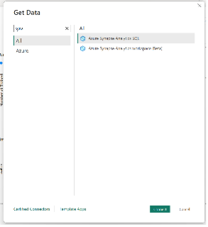
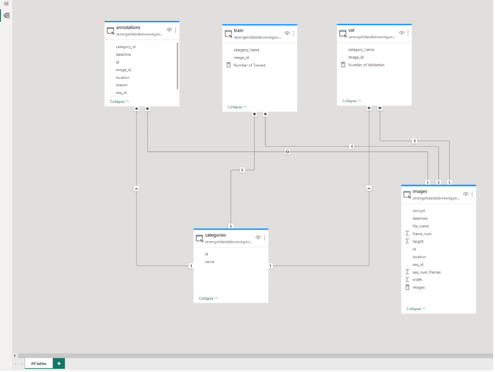
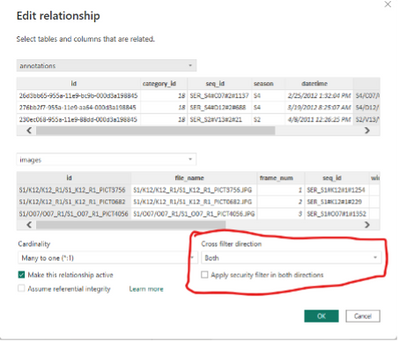
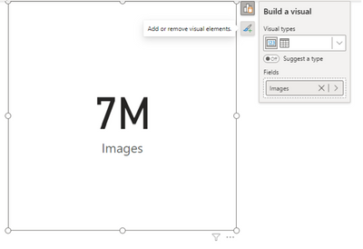
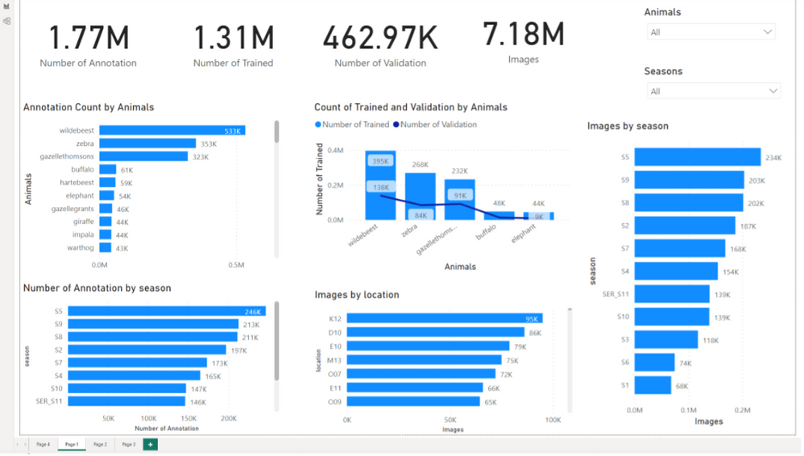
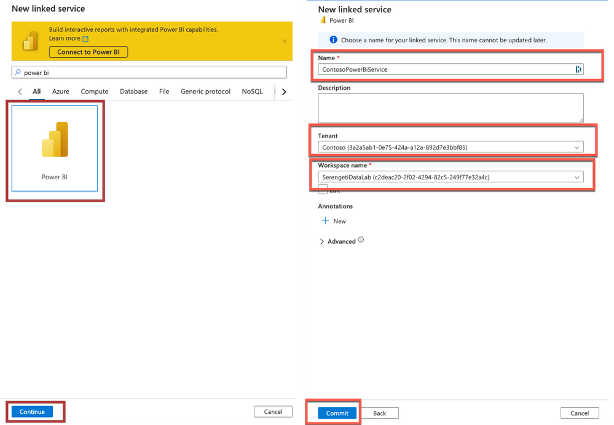

# Building End to End data solution with Power BI

In the first lab, we covered how to create the Synapse workspace and use notebooks to load data into Azure Data Lake Gen2 and the SQL Data Warehouse. In this blog, we will explore how to integrate with Power BI and how to build report.

 

To get started, let’s connect the SQL data warehouse to Power BI and create a few reports!

To connect to Azure Synapse Analytics using Power BI Desktop, first open the application and click on the **Get Data** button. Then, select **More** to see a wider range of data source options. In the search bar, type in “Synapse” to filter the options and select **Azure Synapse Analytics (SQL)** from the list.

 

Next you will be prompted to enter your server name. Type in the name of your server and then click on the**Direct Query** option.

*Note that Direct Query is a connection mode that allows you to query data directly from the data source in real-time, without the need to import it into Power BI.*
*On the other hand the Import mode, data is first loaded into Power BI’s internal data model before it can be queried and visualized. Check out [DirectQuery](https://learn.microsoft.com/en-us/power-bi/connect-data/desktop-directquery-about?WT.mc_id=data-93739-davidabu) in Power BI to learn more*

Click **Ok** and the open Power Query Editor to see the data

Click on the **Annotations** table, next on the dropdown next to Category Id uncheck 0 and 1. This is to remove the empty and human categories from the dataset.

Repeat this for the **categories** table, the click **Close and Apply** to navigate to the Power BI homepage.
 
## Modeling data in Power BI
Our objective is to link the different tables within the model view to create a model link similar to the one below.

To model the data, follow these steps:

1. Click **Categories [id]** and drag to connect to **annotations[category_id]**
2. Click **Categories [name]** and drag to connect to **train[category_name]** and **Val[category_name]**
3. Click **images[id]** and drag to connect to a**nnotations[image_id]** and in properties, make the cross-filer direction to be **BOTH**.

4. Click images[id] and drag to connect to train[image_id] and Val[image_id]

Now we have completed the modelling of this data and we want to start analyzing the data. Click the top left report view icon to go back to the blank white canvas.

*Note: As of March 2023, the Power BI interface as changed, and you might notice during the exercise. Kindly update your Power BI desktop*

 
## DAX measures
We will create a simple report and we will use some DAX measures to count the rows in the annotation, images, train and Val tables. To achieve this we’ll leverage the New Quick Measures AI functionality within Power BI

1. Click on **Quick Measure** at the top.
2. Click on **Suggestions**
3. Type **count how many rows in the images table** and click **Generate**

4. Click **Add**
5. At the top bar, you can change the function name **measure** to **Number of images**.
6. Create the DAX measurement for other tables using the quick measure AI tool.
    - Annotation
    - Train
    - Val
7. Change the measures to appropriate names accordingly.

## Creating charts
Next, we’ll create visualizations to explore the variations in animal images from Snapshot Serengeti across different seasons, locations and species.

To learn more about on-object visual, check out [Use on-object interaction with visuals in your report (preview)](https://learn.microsoft.com/en-us/power-bi/create-reports/power-bi-on-object-interaction?WT.mc_id=data-93739-davidabu).

1. Click a **card** visual, click the measure called **Images** to the visual

    - To access the editing mode, press the + icon next to the card visual.
    - Select more options from the menu.
    - You can now edit and interact with the visual.

2. Add 3 card visuals to display the measures created above:
    - Number of Trained
    - Number of Validation
    - Number of Annotation

3. Add 2 slicer visuals:

    The first card for **categories[name]** and rename it to **Animals** -The second card for **Annotation[season]** and rename it to **Season**

4. To show the Annotation count by Animals, use a clustered bar chart.
    - Select the **clustered bar chart** option.
    - On the right data pane, choose **Categories[name]** and **Number of Annotation**

    

5. To show the Annotation count by Season, use a clustered bar chart.

    - Select the **clustered bar chart** option.
    - On the right data pane, choose A**nnotation[season]** and **Number of Annotation**
 

6. To show the images count by location, use a clustered bar chart.

    - Select the clustered bar chart option.
    - On the right data pane, choose **images[location]** and DAX measure: **Images.**
 

7. To show the images count by season, use a clustered bar chart.

    - Select the **clustered bar chart** option.
    - On the right data pane, choose **Annotation[season]** and DAX measure: **Images**.
 

8. To compare the Train and Val tables, use a Line and Clustered Column chart.

   -  Select the Line and Clustered Column chart option.
    - X-axis: name
    - Column Y-axis: number of train
    - Line Y axis: Number of Val
    - Filter it to Top 5 by using the filter pane. See the picture below.

    

Finally, this results in:

Now that we have created the Power Bi reports, publish them to the Power BI service.

Power BI linked services in Azure Synapse Analytics
Navigate back to the synapse workspace and click on the “Linked Services” option under the “Manage” section.

Now you can access your Power BI reports directly in Azure Synapse Analytics. Check out Quickstart: Linking a Power BI workspace to a Synapse workspace to learn more.

 
## Conclusion
In this article, we've covered how to link Power BI to Azure Synapse Analytics to create a data pipeline, as well as how to create a Power BI report and publish it to the Power BI service. 

## Resources
For additional resources to get an in-depth understanding of the services discussed in this article take a look at this handy collection of resources:

    Azure Synapse Analytics Blog - https://aka.ms/SynapseBlog/
    Documentation - http://aka.ms/SynapseDocs
    Learning paths and modules - https://aka.ms/synapsemodules
    Azure Synapse YouTube videos - https://aka.ms/SynapseYouTube
    Microsoft Power bi Community - http://aka.ms/pbicom