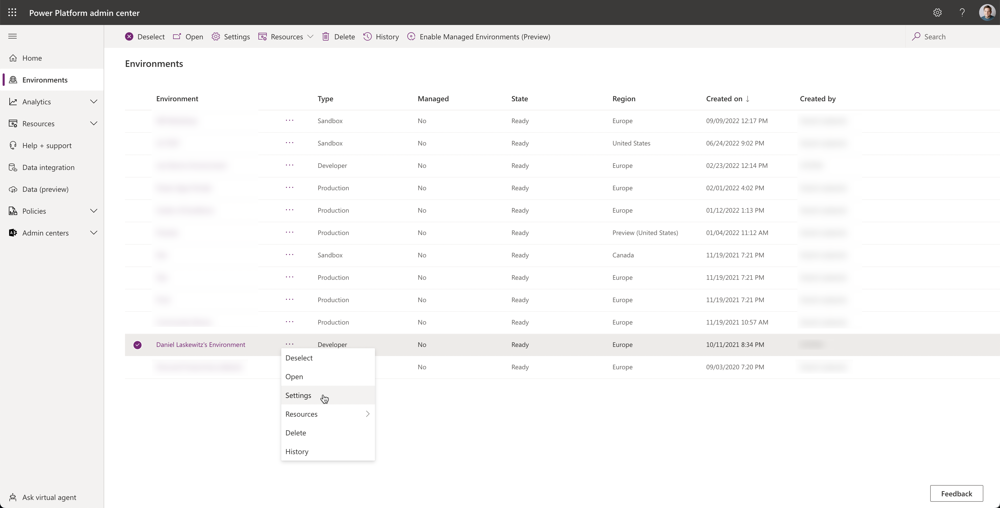
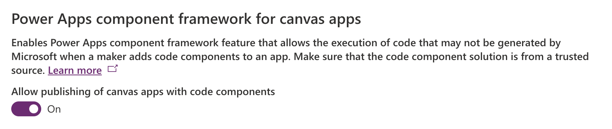

# Lab 02 - Use the Creator Kit for Canvas Apps development

In this lab, we are going to use the Creator Kit to speed up the development of Canvas Apps. The Creator Kit is a set of components based on Fluent UI which you can use in Canvas Apps. Check out the links in the following note to learn more about the Creator Kit.

> **NOTE:**
>
> For more information about the Creator Kit, make sure to check out the following links:
>
> - [Overview of the Creator Kit components](https://docs.microsoft.com/power-platform/guidance/creator-kit/components)
> - [Use the Creator Kit](https://docs.microsoft.com/power-platform/guidance/creator-kit/creator-kit-explained)
> - [Theming](https://docs.microsoft.com/power-platform/guidance/creator-kit/theme)
> - [Creator Kit Release Notes](https://aka.ms/creatorkitlatestrelease)

## Installing the Creator Kit

The Creator Kit is not available out of the box, so we need to import the Creator Kit solution first. But, before the import can happen, we need to enable a setting so that we can use the Creator Kit code components in Canvas Apps.

### Enable code components in Canvas Apps

To enable code components in Canvas Apps, you need to go to the [Power Platform Admin Center](https://aka.ms/ppac). In the Power Platform Admin Center, select **Environments** in the left navigation. Click on the **...** next to the environment you're going to use (it probably has the name **{Your name}'s environment**) and select **Settings**.

Select the **˅** next to ⚙ Product and select **Features**. Turn on the setting **Allow publishing of canvas apps with code components**.

### Import the solution

With this setting enabled, we can now import the Creator Kit solution. Download the solution via [this link](https://aka.ms/creatorkitdownload) and go to [make.powerapps.com](https://make.powerapps.com). Make sure you are in the correct environment (the one where we just enabled the code components feature) and select **Solutions** in the left navigation.

At the top of the solution screen, select the **← Import Solution** button, click on the **Browse** button and select the Creator Kit solution we just downloaded. When the solution is selected, you can click on the **Next** button on the bottom of the screen and after that, select **Import**. Now the solution will be imported. Usually that will take a minute or two. When the importing is finished, you will see a green bar with a import successful message.

## Creating the Canvas App
